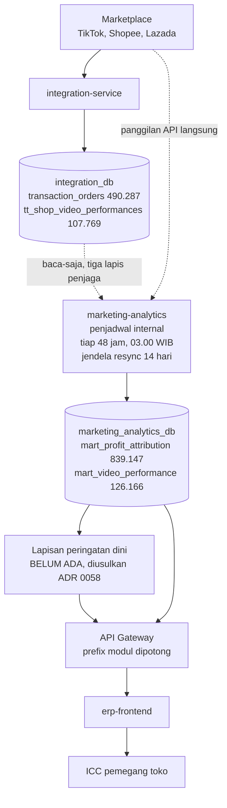

## Deskripsi

*Peta seluruh kapabilitas AI di ERP Bharata dalam satu tempat, beserta gerbang yang menentukan kapan pekerjaan AI baru boleh dimulai, dan rancangan kapabilitas prediktif pertama. Dibuat karena AI sudah berjalan di empat tempat yang tidak saling menaut, sehingga tidak ada yang dapat menjawab apa yang kita punya dan mana yang benar-benar hidup.*

- **Status**: ⚠️ **Sebagian Implemented** — dua kapabilitas generatif hidup di produksi, satu WIP, tiga masih konsep tanpa kode. Kapabilitas prediktif belum berkode sama sekali.
- **Keputusan yang mengikat**: [[ADR - 0058 Kapabilitas AI Digerbang Kelayakan Data, Bukan Kelayakan Teknologi]]
- **Implementasi prediktif (rencana)**: [[Microservices - Marketing Analytics Service]]

## Latar Belakang

AI di ERP Bharata tumbuh dari kesempatan, bukan dari rencana. Video iklan lewat Veo muncul karena kebutuhan konten, analisis sentimen muncul karena kebutuhan riset produk, dan OCR muncul sebagai gagasan lintas modul. Tiga-tiganya berdiri sendiri, di tiga folder berbeda, dan tidak satu pun menaut ke yang lain.

Selama pertanyaannya "bagaimana fitur ini bekerja", keadaan itu tidak menyusahkan. Ia mulai menyusahkan begitu pertanyaannya berubah menjadi "AI apa yang kita punya" dan "boleh tidak kita bangun yang ini", karena tidak ada satu pun tempat yang menjawabnya. Dokumen ini tempat itu.

## Peta Kapabilitas

Dua sifat yang sangat berbeda hidup berdampingan di sini, dan membedakannya penting: kapabilitas **generatif** membuat sesuatu yang baru (video, ringkasan, jawaban), sedangkan kapabilitas **prediktif** menaksir sesuatu yang belum terjadi dari data yang sudah ada. Gerbang kelayakan data pada ADR 0058 mengikat keras yang prediktif, karena hanya yang prediktif menuntut label historis.

| Kapabilitas | Sifat | Engine | Status | Dokumen |
|---|---|---|---|---|
| Video iklan dari foto produk | Generatif | Veo 3.1 / Gemini | ✅ matang | [[APP - Ideamills]] · [[Sales - Veo (Gemini) Implementation]] |
| Otomasi tren ke video siap kirim | Generatif | LangGraph, human-in-the-loop | ⚠️ WIP | [[Sales - Veo (Gemini) Automation Layer]] |
| Analisis sentimen komentar TikTok | Generatif | Claude | ✅ jalan tiap awal pekan | [[APP - Tiktok Insight Analyzer]] · [[Sales - TikTok Sentiment Pipeline]] |
| OCR dan document intelligence | Generatif | rencana OCR + RAG lokal | 🟡 konsep, **0 kode** | [[CORE - OCR Document Service]] |
| Asisten tanya-jawab angka bisnis | Generatif | rencana Claude + Tool Runner | 🟡 konsep, **0 kode** | [[Microservices - Assistant Service]] |
| Peringatan dini belanja iklan | **Prediktif** | belum ditentukan | 🟡 konsep, **0 kode** | dokumen ini |

Akses Claude ke vault lewat [[Microservices - Vault MCP Service]] sengaja **tidak** dimasukkan sebagai kapabilitas AI produk. Ia jalur baca dokumentasi untuk manusia, bukan fitur yang dipakai pengguna ERP.

⚠️ [[Microservices - Assistant Service]] adalah kapabilitas pertama yang **membaca data ERP atas nama seorang pemakai**, sehingga ia satu-satunya yang memunculkan pertanyaan hak akses per-orang. Empat kapabilitas sebelumnya tidak menyentuh data ERP sama sekali. Ia generatif, jadi gerbang label historis tidak mengikatnya, tetapi syarat ketiga ADR 0058 tetap mengikat penuh.

Klaim "0 kode" pada dua baris di atas diverifikasi dengan `git grep` berbatas kata memakai kontrol positif dan negatif, bukan dengan pencarian teks biasa. Rincian dan alasannya di [[ADR - 0058 Kapabilitas AI Digerbang Kelayakan Data, Bukan Kelayakan Teknologi]].

## Ruang Lingkup / Cakupan (business view)

- **Menjadi satu-satunya tempat** yang menjawab AI apa saja yang ada, mana yang hidup, dan apa sifatnya.
- **Menjaga gerbang kelayakan data** tetap dapat dibaca oleh siapa pun yang mengusulkan pekerjaan AI baru.
- **Menyimpan rancangan kapabilitas prediktif**, karena belum ada dok domain yang memilikinya.
- **Di luar lingkup**: cara kerja rinci tiap kapabilitas generatif. Itu tetap milik dokumennya masing-masing, dan menyalinnya ke sini akan melahirkan sumber kebenaran kedua yang menyimpang diam-diam.

## Alur Sistem

Alur di bawah adalah yang **sudah berjalan hari ini**, kecuali satu kotak yang ditandai belum ada. Kapabilitas prediktif pertama menyisip di situ, bukan menggantikan apa pun.

### Enam job yang membangun mart

| Job | Menghasilkan | Baris di produksi 2026-08-28 |
|---|---|---|
| `sync-profit-attribution` | `mart_profit_attribution` | 839.147 |
| `sync-video-performance` | `mart_video_performance` | 126.166 |
| `sync-ad-creative-link` | `mart_ad_creative_link` | 7.823 |
| `sync-live-sessions` | `mart_live_sessions` | 5.321 |
| `sync-ad-group` | `mart_ad_group` | 1.335 |
| `sync-shop-performance` | `tt_shop_performance_daily` | 1.198 |

Sumbernya campuran: sebagian membaca `integration_db`, sebagian memanggil API TikTok langsung. Seluruhnya dapat dipicu manual lewat `POST /jobs/:name/trigger` di samping jadwal otomatis.

### Empat sifat alur ini yang menentukan rancangan di atasnya

**Penjadwalnya di dalam service, bukan cron server.** Sebelum ada penjadwal, sync hanya berjalan bila seseorang ingat memicunya, sehingga halaman menampilkan angka dari terakhir kali ada yang ingat lalu makin usang tanpa satu pun tanda. Konsekuensi yang masih hidup: **kunci per-job hanya berlaku dalam satu proses, jadi replika service ini wajib tetap 1.** Menaikkannya membuat tiap replika punya penjadwalnya sendiri dan semuanya menembak TikTok bersamaan.

**Pembacaan `integration_db` dijaga tiga lapis**, dan itu bukan kehati-hatian berlebih. Menulis ke database milik service lain **berhasil secara teknis**, sehingga pelanggarannya tidak akan pernah tampak sebagai test merah biasa; kerusakannya baru terlihat sebagai data korup di repo yang berbeda. Lapisnya: tipe yang tidak mengekspos satu pun metode penulisan, test yang memindai AST seluruh package, dan read preference `secondaryPreferred`.

**Batas hari memakai WIB, bukan UTC,** dan bedanya tujuh jam penuh. Ini pernah nyata dan mahal: terukur di produksi 2026-08-07, sejak 10 Juni sebanyak Rp 2,48 miliar omzet (20.328 order-item) tercatat di hari yang salah, dan 5,54% omzet Juli meleset per sel hari-toko. Penyebabnya satu nama fungsi yang dipakai untuk dua makna berbeda. Karena itu definisi "video-hari" pada fitur baru wajib dipatok eksplisit, bukan diwariskan diam-diam.

**Gateway memotong prefix modul** sebelum meneruskan, sehingga rute akar modul didaftarkan di `/`, bukan di `/marketing-analytics`. Unit test tetap hijau bila keliru, karena ia memanggil path lokal langsung ke Fiber.

## Kapabilitas Prediktif Pertama: Peringatan Dini Belanja Iklan Video

### Masalah yang dipecahkan

Belanja iklan setara 61% laba kotor, sementara siklus koreksinya bulanan karena pagu belanja disimpan per bulan. Salah alokasi karena itu baru terlihat setelah bulannya lewat, dan belanjanya tidak dapat ditarik kembali. Pada tingkat video, Rp 1,15 miliar dari Rp 5,42 miliar belanja yang dapat ditelusuri jatuh pada video-hari yang pendapatannya nol.

Yang dibutuhkan bukan ramalan yang lebih tepat, melainkan **jarak yang lebih pendek antara uang keluar dan orang yang berwenang menghentikannya**.

### Batas kesegaran, dan ini mengikat janji fiturnya

⛔ **Mart ini disegarkan tiap 48 jam, bukan harian.** `intervalPenjadwalBawaan = 48 * time.Hour` adalah konstanta di `penjadwal.go` dan **tidak dapat diubah lewat env**; env hanya mengatur aktif atau tidak, jam WIB, dan lebar jendela resync. Terkonfirmasi di produksi 2026-08-28, cursor penjadwalnya berbunyi "run berikutnya 2026-08-29 03:00 WIB, tiap 48h0m0s, jendela 14 hari".

Konsekuensinya wajib dinyatakan terus terang ke siapa pun yang membaca fitur ini: peringatan tidak dapat datang dalam hitungan jam, dan tidak dapat harian. Yang dapat dijanjikan adalah **dari bulanan menjadi paling cepat dua harian**, ditambah jeda pelaporan marketplace itu sendiri. Mempercepatnya berarti mengubah interval penjadwal, dan itu keputusan tersendiri dengan ongkos kuota API yang belum dinilai.

### Sumber yang basi harus terlihat, bukan terlewat diam-diam

Pada 2026-08-28, dua job sync sedang gagal berhari-hari: `sync-shop-performance` terakhir sukses **2026-08-20** dan `sync-live-sessions` **2026-08-19**, keduanya karena sebagian toko dinonaktifkan dan sebagian kredensialnya kedaluwarsa (11 dan 13 toko).

Fitur peringatan yang dibangun di atas pipeline seperti itu akan mewarisi kebutaannya tanpa satu pun tanda: daftar peringatannya tetap terisi, tampak wajar, dan diam-diam tidak mencakup toko yang datanya tidak masuk. Karena itu keadaan sumber basi wajib punya tampilannya sendiri di layar peringatan, bukan disembunyikan di balik daftar yang terlihat normal.

### Bentuk keluarannya

Daftar berurutan berisi video yang belanjanya berjalan tanpa penjualan, ditujukan ke penanggung jawab tokonya, dengan tautan langsung ke tempat tindakannya diambil. **Bukan** pemotongan anggaran otomatis, sesuai ADR 0058 §5.

### Urutan kerja yang mengikat

Aturan sederhana diukur lebih dulu sebagai pembanding: dari video yang pada hari pertama belanjanya di atas ambang tertentu dan konversinya nol, berapa persen yang tetap nol sampai hari ketujuh. Bila angkanya tinggi, aturan sederhana sudah memberi sebagian besar manfaatnya dan model hanya menajamkan. Model dibangun hanya bila terbukti mengalahkan pembanding itu pada data yang sama.

### Aturan pemakaian kolom, dan ini bagian yang paling mudah salah

Kolom di bawah pernah, atau berpotensi, dijumlahkan secara keliru sehingga menghasilkan angka yang salah namun masuk akal. Kegagalannya bukan galat dan tidak ada test yang menangkapnya. Aturan ini sebelumnya hanya hidup sebagai komentar Go, sehingga siapa pun yang merancang layar dari dokumentasi tidak punya cara mengetahuinya.

| Kolom | Sifat | Aturan |
|---|---|---|
| `ads_cost` | Komponen sejajar | **Sudah** dikurangkan seluruhnya dari `gross_profit`. Jangan dikurangkan lagi. |
| `iklan_sia_sia` | **Himpunan bagian** dari `ads_cost` | Porsi belanja yang sudah terbayar dan ternyata sia-sia, **bukan** uang baru yang hilang. Jangan dijumlahkan ke laba, jangan dijumlahkan dengan beban packing (itu uang fisik tambahan, ini bukan), dan **jangan di-rename** menjadi kerugian iklan. Namanya adalah pengamannya. |
| `revenue` tingkat video | Bukan hasil atribusi sendiri | Berasal dari laporan marketplace, karena nol dari 433.641 pesanan menyimpan penanda campaign, ad, maupun video. **Pendapatan nol tidak sama dengan pemborosan terbukti**; bisa berarti penjualannya tercatat di tempat lain, atau datanya memang tidak ada (lihat di bawah). |
| `retur` | Komponen sejajar | `ads_cost` tidak pernah dialokasikan ulang saat retur terjadi, jadi ia sudah menanggung retur sejak awal. |
| `gross_profit` | Hasil | Sudah bersih dari HPP, fee marketplace, dan seluruh `ads_cost`. |
| `spend_vsa` dan `spend_gmv_max` | Dua basis atribusi berbeda | **Jangan dijumlahkan begitu saja dalam satu kolom.** Yang pertama aktual per iklan, yang kedua estimasi prorata per campaign. Lihat di bawah. |

Konsekuensi langsungnya untuk kapabilitas ini: angka Rp 1,15 miliar adalah **ukuran ruang keputusan**, bukan kerugian yang sudah pasti, dan wajib dikonfirmasi ke pemilik jalur atribusi sebelum dipakai memindahkan anggaran.

⛔ **Sebagian pendapatan nol itu memang tidak ada datanya, dan pipeline-nya mencatat sendiri.** Pada 2026-08-28 job `sync-video-performance` menuliskan catatan: *"14487 video ber-spend tanpa baris organik (metrik nol = tak ada data)"*. Artinya metrik nol pada baris-baris itu berarti **ketiadaan data**, bukan penjualan nol, dan keduanya tidak dapat dibedakan dari kolomnya saja. Setiap perhitungan yang memperlakukan nol sebagai "iklan gagal menjual" akan melebihkan angkanya sebesar porsi ini. Memisahkan keduanya adalah prasyarat, bukan penyempurnaan.

### Belanja per video punya tiga sumber, dan kekuatan buktinya berbeda

`video_source.go` menetapkan empat nilai untuk kolom `sumber`, dan komentarnya menyatakan terus terang bahwa basis atribusinya berbeda sehingga angkanya tidak boleh dijumlahkan begitu saja dalam satu kolom:

| Nilai `sumber` | Basis | Sifat |
|---|---|---|
| `organik` | tidak ada spend | - |
| `vsa` | per `ad_id` | **aktual** |
| `gmv_max` | per campaign, diprorata ke video | **estimasi** |
| `campuran` | punya keduanya | 1.103 video, 23,1% dari VSA |

⛔ **Ini mengikat langsung rancangan peringatan.** Menandai sebuah video sebagai boros ketika belanjanya berasal dari `gmv_max` berarti menuduh video tertentu atas angka yang sebenarnya taksiran di tingkat campaign. Bukti pada `vsa` jauh lebih kuat daripada pada `gmv_max`, dan peringatan yang memperlakukan keduanya sama akan salah sasaran pada sebagian kasus.

Kegagalannya berbentuk yang paling sulit disadari: orang menutup iklan yang sebenarnya bekerja, lalu tidak pernah tahu karena yang hilang adalah penjualan yang tak jadi terjadi. Karena itu `sumber` wajib ikut ditampilkan di daftar peringatan, dan urutan prioritasnya tidak boleh mencampur kedua basis itu tanpa membedakannya.

### Apa yang tidak dijanjikan

Tidak ada ramalan lintas musim. Riwayat pesanan yang efektif hanya Januari sampai Agustus 2026 dan baru padat sejak Mei, sehingga tidak ada satu pun siklus tahunan yang pernah terlihat data ini.

## Persona / Pengguna

| Persona | Peran & Divisi | Akses / RBAC | Device |
|---|---|---|---|
| ICC pemegang toko | Tim ICC, Marketing | Digerbang penanggung jawab toko; kunci RBAC persisnya **TBD**, belum diverifikasi ke kode | Web ERP |
| Atasan marketing | Supervisor Marketing | Lingkup divisi atau tim | Web ERP |

- **Tujuan**: menghentikan belanja yang tidak menghasilkan selagi belanjanya masih berjalan.
- **Pain point**: salah alokasi baru terlihat setelah bulannya lewat, dan uangnya tidak dapat ditarik kembali.
- **Aksi utama**: membuka daftar peringatan, memeriksa videonya, lalu menurunkan atau menghentikan anggarannya sendiri.

Kepemilikan toko dibaca dari pemetaan ICC yang sudah ada, bukan ditebak dari nama toko. Dua kenyataan yang membentuknya: **satu toko dapat dipegang lebih dari satu orang** (terukur di produksi 2026-07-31), dan **cakupannya tidak pernah penuh**. Keadaan belum termapping karena itu wajib punya tampilannya sendiri yang tidak dapat disalahbaca, bukan didiamkan.

⚠️ Angka cakupannya bergerak, jadi jangan disalin dari komentar kode. Komentar di `penanggung_jawab.go` menyebut 37 dari 38 toko (terukur 1 sampai 12 Agustus 2026), sedangkan catatan job di produksi pada 2026-08-28 menyebut **55 toko dari dua sumber** (`icc_account_mappings` dan `team_shops`). Toko di luar itu berbunyi "belum ditetapkan" sampai mapping-nya dilengkapi lewat ICC Management atau Teams.

## Konsumen Data

- [[Microservices - Marketing Analytics Service]] — pemilik mart yang dibaca, dan tempat kapabilitas prediktif akan tinggal
- [[API - Marketing Analytics Service]] — endpoint yang akan bertambah bila rancangannya matang
- [[Sales - Profit Engine (Design)]] — sumber definisi laba yang dipakai sebagai dasar perhitungan

## Kendala

- **Riwayat data pendek.** Delapan bulan, padat sejak Mei 2026, tanpa siklus tahunan.
- **Katalog kecil.** 86 master SKU, 34 di antaranya punya riwayat memadai. Menguntungkan untuk model statistik per SKU, sekaligus menutup pintu bagi pendekatan yang menuntut data besar.
- **Atribusi tingkat video bukan milik kita.** Bergantung laporan marketplace, sehingga perubahan cara marketplace melaporkannya berpindah langsung ke keluaran model tanpa perantara.
- **Menumpang service yang sudah ada berarti ikut memikul jadwal deploy-nya**, dan cakupan test harus menjaga dua hal sekaligus.
- **Kesegaran terkunci di 48 jam** oleh konstanta penjadwal, sehingga janji fiturnya terbatas pada dua harian, bukan harian apalagi per jam.
- **Sebagian job sync sedang gagal berhari-hari**, dan kegagalannya tidak berbunyi di layar mana pun. Fitur baru di atasnya mewarisi kebutaan itu bila tidak sengaja ditampilkan.

## Belum Diputuskan (TBD)

- **Kunci RBAC** yang menggerbangi daftar peringatan. Belum diverifikasi ke kode.
- **Jalur pemberitahuan**: lewat inbox atau cukup tampil di layar. Bila lewat inbox, kategori barunya menuntut marketing-analytics dan notification-service naik bersama, dan kategori yang salah gagal senyap.
- **Frekuensi**: mengikuti penjadwal 48 jam. Apakah interval itu dipercepat demi fitur ini belum diputuskan, dan ongkos kuota API-nya belum dinilai.
- **Ambang belanja hari pertama** yang memicu peringatan. Wajib dipasang dari sebaran nyata, tidak boleh ditulis tangan.
- **Bentuk penyimpanan dan kontrak API**: peringatan dihitung saat dibaca atau disimpan sebagai koleksi tersendiri, dan endpoint apa yang menyajikannya. Belum diputuskan sama sekali.
- **Batas hari WIB**: definisi operasional "video-hari" belum dipatok. Mart ini memakai konvensi hari WIB, dan mencampuradukkan tanggal dengan instant adalah kelas kesalahan yang sudah pernah menggigit di modul yang sama.
- **Aturan berhenti memberi peringatan**: video yang sama akan memenuhi syarat lagi pada siklus berikutnya. Belum ada status sudah-ditindak, belum ada batas berapa kali sebuah video diperingatkan.
- **Perlakuan terhadap `gmv_max`**: apakah video yang belanjanya hanya berasal dari prorata campaign ikut diperingatkan, diperingatkan dengan penanda keyakinan lebih rendah, atau dikeluarkan sama sekali dari daftar. Belum diputuskan, dan pilihannya mengubah siapa yang muncul di layar.
- **Seluruh sisi frontend**: halaman mana yang menampungnya, komponen apa yang dipakai, dan kunci i18n `id` serta `en` yang diwajibkan [[ADR - 0010 Internasionalisasi (i18n) Dua Bahasa]] untuk tiap teks baru yang tampil ke pengguna.
- **Runtime bila model terlatih ternyata diperlukan**: [[ADR - 0058 Kapabilitas AI Digerbang Kelayakan Data, Bukan Kelayakan Teknologi]] §2 menetapkan tempatnya, yaitu service pemilik data, dan itu memadai untuk aturan statistik di Go. Untuk model terlatih belum terjawab, karena marketing-analytics adalah Go dan tidak ada service Python di bip-erp.
- **Isi `accurate_daily_returns`** (7.779 baris) belum dibuka, dan dapat mengubah putusan pada kandidat retur.
- **Penurunan tajam Maret 2026** belum dipastikan kenyataan bisnis atau lubang sinkronisasi. Bila lubang data, setiap model akan tersandung di titik yang sama.

## Dokumen Terkait

- [[ADR - 0058 Kapabilitas AI Digerbang Kelayakan Data, Bukan Kelayakan Teknologi]]
- [[Microservices - Marketing Analytics Service]]
- [[Microservices - Assistant Service]]
- [[APP - Ideamills]]
- [[APP - Tiktok Insight Analyzer]]
- [[CORE - OCR Document Service]]
- [[Sales - Marketing Analytics (Audit Ketersediaan Data)]]
- [[ADR - 0008 Profit Engine Join via item_group_id]]
