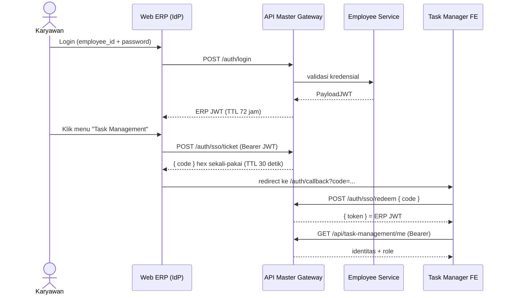

## Deskripsi

*Single Sign-On (SSO) ekosistem bip-erp memungkinkan karyawan login sekali di portal ERP, lalu berpindah ke aplikasi internal lain (mis. Task Manager) tanpa login ulang. Mekanismenya adalah **one-time-code handoff** lewat [[CORE - API Master Gateway]] — **bukan** Identity Provider eksternal (OAuth/SAML pihak ketiga). Dokumen ini merangkai alurnya end-to-end; detail per komponen ada di dokumen masing-masing.*

- **Tipe**: one-time-code handoff internal (kode hex sekali-pakai → ditukar jadi ERP JWT)
- **Token**: ERP JWT (HS256, secret `JWT_SECRET`, TTL 72 jam) yang diterbitkan gateway
- **Status**: ✅ Implemented (dipakai produksi; Task Manager sudah cut-over penuh ke gateway)

## Komponen & Peran

| Komponen | Peran dalam SSO | Dokumen |
|---|---|---|
| Web ERP (`hris-dashboard`) | **Identity Provider** — tempat login utama & pemicu handoff | [[APP - Web ERP]] |
| API Master Gateway | Menerbitkan JWT, menyimpan one-time code, endpoint `ticket`/`redeem` | [[CORE - API Master Gateway]] |
| Employee Service | **Sumber kredensial** — validasi login, balikin `PayloadJWT` | [[Microservices - Employee Service]] |
| Task Manager (FE) | **Konsumen SSO** — redeem code jadi sesi | [[APP - Dynamic Task Tracker]] |

## Alur SSO End-to-End

**Skenario utama (outbound launch):** karyawan sudah login di Web ERP, lalu membuka Task Manager.

**Skenario alternatif (inbound handoff):** karyawan membuka Task Manager dulu dalam keadaan belum login.
1. Task Manager mendeteksi belum ada token → redirect ke login Web ERP dengan query `?redirect_url=<task-manager>/auth/callback`.
2. Karyawan login di Web ERP; setelah sukses, Web ERP mint `code` via `/auth/sso/ticket` lalu redirect balik ke `redirect_url?code=...`.
3. Lanjut sama seperti skenario utama mulai dari `/auth/sso/redeem`.

## Endpoint SSO (di Gateway)

| Endpoint | Auth | Fungsi |
|---|---|---|
| `POST /auth/login` | publik | Login; gateway delegasi ke employee-service, lalu mint ERP JWT |
| `POST /auth/sso/ticket` | Bearer JWT valid | Menerbitkan one-time code (hex), disimpan di `ssoStore` in-memory, TTL 30 detik |
| `POST /auth/sso/redeem` | publik (rate-limited) | Menukar one-time code menjadi ERP JWT |

## Token & Sesi

- **ERP JWT**: HS256, secret `JWT_SECRET`, TTL **72 jam**, divalidasi di gateway via shared-library/auth.
- Web ERP menyimpan token sebagai cookie + auto-refresh (`/auth/refresh`) menjelang expiry.
- Task Manager menyimpan token di `localStorage` (`erp_token`), dikirim sebagai `Authorization: Bearer` dan sebagai `?token=` pada koneksi WebSocket. **Tanpa refresh token** — 401 memaksa SSO ulang.
- Untuk call internal antar-service, gateway menambahkan header `INTERNAL_GATEWAY_KEY` (bukan JWT user).

## Implementasi Login Redirect (panduan developer)

*Cara membuat login Web ERP mendukung redirect SSO, dan langkah menambah aplikasi konsumen baru. Backend gateway **sudah generic** (`ticket`/`redeem` agnostik aplikasi) → menambah konsumen baru **tidak butuh perubahan backend**, hanya sisi FE + app konsumen + env.*

**Yang sudah ada di kode** (referensi grounding):
- FE inbound redirect: `erp-frontend/src/app/login/page.tsx` — pada `onSuccess` login, baca query `redirect_url`, validasi allowlist, `POST /auth/sso/ticket`, lalu `window.location.href = redirect_url?code=...` (fallback `/dashboard` bila tak ada / gagal).
- FE outbound launch: `erp-frontend/src/features/erp/auth/hooks/use-task-manager-sso.ts` (`useTaskManagerSSO`).
- Gateway: `bip-erp/api-gateway/sso.go` (`ticketHandler`/`redeemHandler`, `ssoStore`, `ssoCodeTTL = 30s`) + `main.go` (`/sso/ticket` di-`ValidateJWT`, `/sso/redeem` + `strictLimiter`).

**Langkah menambah app konsumen SSO baru:**

1. **Sisi ERP (IdP) — allowlist redirect.** Gateway FE (`erp-frontend`) secara dinamis sudah **mengizinkan semua subdomain** `*.bharatainternasional.com` dan `localhost`. Jadi, Anda tidak perlu lagi menambah URL ke env variable untuk mendaftarkan aplikasi internal baru!
2. **Sisi app konsumen.** (a) Guard "belum login" → `redirect ke ${ERP_BASE_URL}/login?redirect_url=${encodeURIComponent(APP_URL + "/auth/callback")}`. **(Penting: Pastikan untuk mematikan auto-redirect ini jika user baru saja menekan tombol Logout, misalnya dengan mengecek parameter `?logged_out=1`, agar tidak terjadi *infinite auto-login loop*)**. (b) Halaman `/auth/callback`: halaman ini **wajib** dikecualikan dari penjagaan AuthGuard! Ambil `?code=`, `POST /auth/sso/redeem { code }` → simpan `token`, kirim `Authorization: Bearer` ke `/api/...`.
3. **Env & CORS.** ERP: (Tidak perlu setting tambahan). App Konsumen: set `GATEWAY_BASE_URL` (prod `https://api.bharatainternasional.com`) & `ERP_BASE_URL`. Gateway Backend: pastikan tidak terblokir CORS jika butuh tembak langsung via browser (namun jika `redeem` dilakukan via Server-to-Server, CORS tidak berpengaruh).

**Verifikasi:** buka app tanpa sesi → ter-redirect ke `/login?redirect_url=...` → login → balik ke `<app>/auth/callback?code=...` (bukan `/dashboard`) → `redeem` balikin `token` → request Bearer 200. Origin di luar allowlist harus diabaikan; code kedaluwarsa (>30s) / dipakai 2× → `redeem` 401.

## Role & Otorisasi

- Role berasal dari `system_roles` di collection `system_authentication` ([[Microservices - Employee Service]]). Tipe Go: `map[string]Role` (type alias `map[string]string`); key = department/feature key (mis. `"hris"`, `"it"`, `"insentive"`), value = role string (`"staff"`, `"supervisor"`, `"admin"`, dll).
- Daftar key dan available roles per key dikelola di master data: `master_department` (department-based) dan `master_system_role` (feature-based) — lihat [[HRIS - Organization Structure]].
- Gateway menurunkan identitas + role lalu meneruskannya ke service via header `BIP-System-Roles` (JSON); service membaca role dari header (mis. Task Manager: `system_roles["task-management"]` → admin / supervisor / staff).
- Penambahan department/role baru **tidak memerlukan perubahan kode** — cukup tambah via CRUD master data endpoint atau frontend `/hris/master-data`. ⚠️ Berlaku untuk **penambahan**; departemen yang benar-benar baru masih perlu entri di `deptKeyToNames` (`shared-library/common/roles.go`) dan di switch jadwal absensi. Detail: [[HRIS - Organization Structure]] §TBD.

### Cakupan supervisi lintas departemen

- Klaim JWT **`supervised_departments`** (array nama departemen) + header **`BIP-Supervised-Departments`** (JSON array) membawa departemen yang berada dalam cakupan supervisi pemakai. Diisi employee-service saat login dari `master_department.supervised_by`.
- **Menyertai, bukan menggantikan** `BIP-Department` yang tetap berisi satu nilai (departemen asal pemakai), sehingga konsumen lama tak terpengaruh.
- Klaim **hanya disertakan** bila cakupannya lebih dari departemen sendiri, supaya token non-supervisor tak membengkak. Konsumen **wajib** punya fallback ke `BIP-Department` — token berlaku 72 jam, jadi setelah rilis masih banyak token beredar tanpa klaim ini (`common.SupervisedDepartments`).
- Perubahan relasi di master data **baru terasa setelah login ulang**, karena cakupannya ikut di token.
- Klaim JWT **`company_id`** + header **`BIP-Company-ID`** (fallback `"BIP"`) membawa perusahaan/tenant pemakai (multi-perusahaan); diisi employee-service saat login dari `work_data.company_id`. Dasar isolasi data lintas-perusahaan: [[ADR - 0029 Multi-Tenant Presensi Row-Level company_id]].
- 🔒 **Gateway membuang seluruh namespace `BIP-*` yang datang dari klien** sebelum mengisinya dari klaim JWT. Penyalinan header masuk sebelumnya membawa serta header BIP-* kiriman pemanggil, sementara pengisian dari klaim bersifat kondisional — header yang kebetulan tak terisi bisa dipalsukan pemanggil untuk memperluas aksesnya sendiri. **Header BIP-* apa pun yang ditambahkan ke depan wajib masuk daftar penghapusan itu.**
- `routes.InternalRequest` (panggilan antar-service, tanpa gateway) **sudah** meneruskan header cakupan, sehingga hasilnya sama baik lewat gateway maupun antar-service. ⚠️ `InternalRequestMultipart` dan `InternalRequestCustomHeader` **tidak**, karena keduanya memang tak meneruskan `BIP-Department` sama sekali (hanya EmployeeID, Username, SystemRoles) — konsumen lewat dua jalur itu jatuh ke perilaku satu departemen. Menyeragamkannya berarti mengubah perilaku alur yang sudah jalan (mis. pembuatan perjalanan dinas multipart) = **TBD**.

## Aplikasi: Pakai SSO atau Tidak

| Aplikasi | SSO? | Keterangan |
|---|---|---|
| [[APP - Web ERP]] (web ERP) | ✅ (IdP) | Tempat login utama + pemicu handoff |
| [[APP - Dynamic Task Tracker]] (Task Manager) | ✅ (konsumen) | Gateway-cutover selesai; tanpa login lokal |
| [[APP - MyBharata]] (MyBharata) | ❌ | Login JWT **langsung** ke HRIS backend (`admin.hris-bharata.com`), ekosistem terpisah |
| [[GA - Guestbook System (Complete)]] | ❌ | Publik, akses via token kunjungan (bukan SSO) |

## Catatan & Keterbatasan

- **`ssoStore` in-memory** tidak aman untuk deployment multi-instance gateway (kode di satu instance tak terlihat instance lain) — sudah ditandai di kode, disarankan pindah ke Mongo TTL.
- **Revoke token saat refresh/biometrics** masih placeholder — JWT lama tidak benar-benar di-revoke.
- Route `/dev/*` & `/debug/get-jwt` (mint admin token) **insecure**, khusus dev, harus dihapus di production.
- **Allowlist redirect masih single-app** (`startsWith(NEXT_PUBLIC_TASK_MANAGER_APP_URL)`) — generalisasi multi-origin masih TBD; `startsWith` rawan **open redirect**, sebaiknya pindah ke pencocokan per-origin sebelum membuka untuk banyak app.
- **Re-login paksa**: login page meng-auto-logout saat mount (hapus cookie `token` dkk), sehingga user ERP yang sudah login lalu diarahkan ke `/login?redirect_url=...` tetap dipaksa login ulang. Perbaikan TBD: bila token masih valid + origin allowlist, langsung mint code tanpa minta password.
- **Silent fallback**: bila `/auth/sso/ticket` gagal, user diam-diam mendarat di `/dashboard` ERP tanpa pesan ke app asal.

## Dokumen Terkait

- [[CORE - API Master Gateway]]
- [[Microservices - Employee Service]]
- [[APP - Web ERP]]
- [[APP - Dynamic Task Tracker]]
- [[Microservices - Task Management Service]]
- [[BASE - Enterance Point]]
