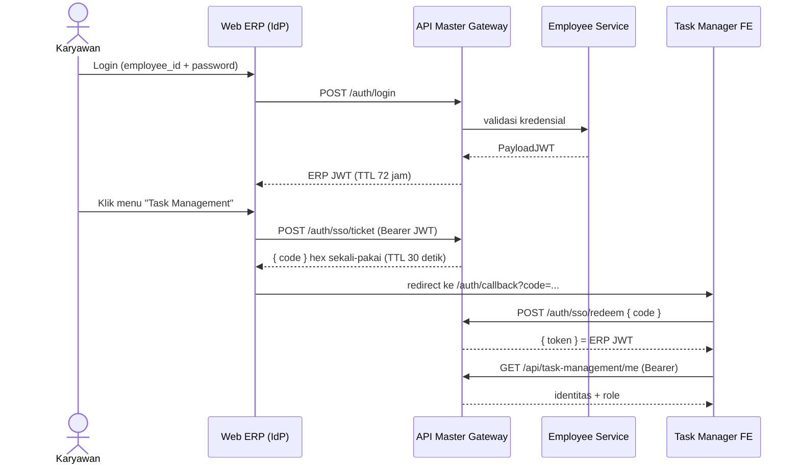

## Deskripsi

*Single Sign-On (SSO) ekosistem bip-erp memungkinkan karyawan login sekali di portal ERP, lalu berpindah ke aplikasi internal lain (mis. Task Manager) tanpa login ulang. Mekanismenya adalah **one-time-code handoff** lewat [[CORE - API Master Gateway]] — **bukan** Identity Provider eksternal (OAuth/SAML pihak ketiga). Dokumen ini merangkai alurnya end-to-end; detail per komponen ada di dokumen masing-masing.*

- **Tipe**: one-time-code handoff internal (kode hex sekali-pakai → ditukar jadi ERP JWT)
- **Token**: ERP JWT (HS256, secret `JWT_SECRET`, TTL 72 jam) yang diterbitkan gateway
- **Status**: ✅ Implemented (dipakai produksi; Task Manager sudah cut-over penuh ke gateway)

## Komponen & Peran

| Komponen | Peran dalam SSO | Dokumen |
|---|---|---|
| Web ERP (`hris-dashboard`) | **Identity Provider** — tempat login utama & pemicu handoff | [[APP - Web Application]] |
| API Master Gateway | Menerbitkan JWT, menyimpan one-time code, endpoint `ticket`/`redeem` | [[CORE - API Master Gateway]] |
| Employee Service | **Sumber kredensial** — validasi login, balikin `PayloadJWT` | [[Microservices - Employee Service]] |
| Task Manager (FE) | **Konsumen SSO** — redeem code jadi sesi | [[APP - Dynamic Task Tracker]] |

## Alur SSO End-to-End

**Skenario utama (outbound launch):** karyawan sudah login di Web ERP, lalu membuka Task Manager.

**Skenario alternatif (inbound handoff):** karyawan membuka Task Manager dulu dalam keadaan belum login.
1. Task Manager mendeteksi belum ada token → redirect ke login Web ERP dengan query `?redirect_url=<task-manager>/auth/callback`.
2. Karyawan login di Web ERP; setelah sukses, Web ERP mint `code` via `/auth/sso/ticket` lalu redirect balik ke `redirect_url?code=...`.
3. Lanjut sama seperti skenario utama mulai dari `/auth/sso/redeem`.

## Endpoint SSO (di Gateway)

| Endpoint | Auth | Fungsi |
|---|---|---|
| `POST /auth/login` | publik | Login; gateway delegasi ke employee-service, lalu mint ERP JWT |
| `POST /auth/sso/ticket` | Bearer JWT valid | Menerbitkan one-time code (hex), disimpan di `ssoStore` in-memory, TTL 30 detik |
| `POST /auth/sso/redeem` | publik (rate-limited) | Menukar one-time code menjadi ERP JWT |

## Token & Sesi

- **ERP JWT**: HS256, secret `JWT_SECRET`, TTL **72 jam**, divalidasi di gateway via shared-library/auth.
- Web ERP menyimpan token sebagai cookie + auto-refresh (`/auth/refresh`) menjelang expiry.
- Task Manager menyimpan token di `localStorage` (`erp_token`), dikirim sebagai `Authorization: Bearer` dan sebagai `?token=` pada koneksi WebSocket. **Tanpa refresh token** — 401 memaksa SSO ulang.
- Untuk call internal antar-service, gateway menambahkan header `INTERNAL_GATEWAY_KEY` (bukan JWT user).

## Role & Otorisasi

- Role berasal dari `system_roles` (map `module → role | role[]`) di collection `system_authentication` ([[Microservices - Employee Service]]).
- Gateway menurunkan identitas + role lalu meneruskannya ke service via header; service membaca role dari header (mis. Task Manager: `system_roles["task-management"]` → admin / supervisor / staff).

## Aplikasi: Pakai SSO atau Tidak

| Aplikasi | SSO? | Keterangan |
|---|---|---|
| [[APP - Web Application]] (web ERP) | ✅ (IdP) | Tempat login utama + pemicu handoff |
| [[APP - Dynamic Task Tracker]] (Task Manager) | ✅ (konsumen) | Gateway-cutover selesai; tanpa login lokal |
| [[APP - Mobile Application]] (MyBharata) | ❌ | Login JWT **langsung** ke HRIS backend (`admin.hris-bharata.com`), ekosistem terpisah |
| [[GA - Guestbook System (Complete)]] | ❌ | Publik, akses via token kunjungan (bukan SSO) |

## Catatan & Keterbatasan

- **`ssoStore` in-memory** tidak aman untuk deployment multi-instance gateway (kode di satu instance tak terlihat instance lain) — sudah ditandai di kode, disarankan pindah ke Mongo TTL.
- **Revoke token saat refresh/biometrics** masih placeholder — JWT lama tidak benar-benar di-revoke.
- Route `/dev/*` & `/debug/get-jwt` (mint admin token) **insecure**, khusus dev, harus dihapus di production.

## Dokumen Terkait

- [[CORE - API Master Gateway]]
- [[Microservices - Employee Service]]
- [[APP - Web Application]]
- [[APP - Dynamic Task Tracker]]
- [[Microservices - Task Management Service]]
- [[BASE - Enterance Point]]
