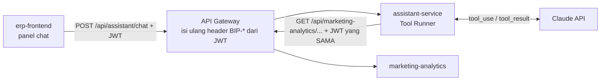

## Deskripsi

*Asisten tanya-jawab di dalam Web ERP yang menjawab pertanyaan tentang angka bisnis dengan cara MERUTEKAN pertanyaan ke endpoint yang sudah menghitungnya, bukan dengan menghitung sendiri. Ia memanggil endpoint memakai JWT orang yang bertanya, sehingga hak aksesnya identik dengan hak akses orang itu di layar. Irisan pertama diarahkan ke data marketing analytics.*

- **Status**: 🟡 **Konsep**, 2026-08-29, **0 kode**. Belum ada direktori service, belum ada ADR yang mengesahkannya.
- **Stack (rencana)**: Go + [Anthropic Go SDK](https://github.com/anthropics/anthropic-sdk-go) dengan **Tool Runner** (masih beta) + MongoDB untuk riwayat percakapan.
- **Path di repo (rencana)**: `bip-erp/services/assistant/`, mengikuti pola `services/.template`.
- **Rute (rencana)**: lewat [[CORE - API Master Gateway]] seperti service lain. ⚠️ Cara mengantar jawabannya BELUM diputuskan karena gateway tidak meneruskan stream (lihat § Temuan gateway).
- **Keputusan yang mengikat**: [[ADR - 0058 Kapabilitas AI Digerbang Kelayakan Data, Bukan Kelayakan Teknologi]]

## Latar Belakang

Angka bisnis sudah tersedia lengkap di [[Microservices - Marketing Analytics Service]], tetapi tersebar di belasan layar. Orang yang ingin tahu satu angka harus tahu lebih dulu layar mana yang memuatnya. Asisten ini memperpendek jarak itu, dan **hanya** itu.

Yang membuatnya berbeda dari kapabilitas AI lain yang sudah ada di [[CORE - Kapabilitas AI dan Machine Learning]]: ini kapabilitas pertama yang **membaca data ERP atas nama seorang pemakai**. [[APP - Ideamills]] dan [[Sales - TikTok Sentiment Pipeline]] tidak menyentuh data ERP, dan [[Microservices - Vault MCP Service]] membaca dokumentasi, bukan angka. Karena itu pertanyaan hak akses di sini baru, dan dijawab di § Keputusan 2.

## Keputusan yang diambil saat perancangan

Empat keputusan di bawah punya alasan yang lebih dalam daripada preferensi.

### 1. Bukan LangGraph, melainkan Tool Runner

[[Sales - Veo (Gemini) Automation Layer]] memakai LangGraph, dan di sana ia tepat: alurnya bercabang, berjalan lama, dan berhenti menunggu persetujuan manusia. Terverifikasi di `ideamiils/package.json` (`@langchain/langgraph` 1.4.4, `@langchain/langgraph-checkpoint-mongodb`) dengan graf nyata di `ideamiils/automation/graph/`.

Asisten ini tidak punya satu pun sifat itu. Ia satu putaran tanya, panggil beberapa tool, jawab. Tool Runner di SDK resmi sudah menjalankan loop itu. Memakai LangGraph berarti membawa checkpointer, state machine, dan node graph yang tak satu pun fiturnya terpakai.

### 2. Tool memanggil endpoint LEWAT GATEWAY dengan JWT pemakai, bukan lewat jalur internal

Ini keputusan terpenting di dokumen ini. Ongkosnya satu lompatan HTTP ekstra. Imbalannya hak akses asisten **identik** dengan hak akses orang itu di layar, bukan mirip, karena melewati kode gerbang yang sama persis.

Terverifikasi di `shared-library/routes/gateway_request.go`: gateway **membuang seluruh namespace header `BIP-*` kiriman klien** lalu mengisinya ulang dari klaim JWT (`BIP-Employee-ID`, `BIP-System-Roles`, `BIP-Department`, `BIP-Supervised-Departments`, `BIP-Company-ID`, `BIP-Permissions`). Jadi service ini tidak bisa memperluas aksesnya sendiri sekalipun mencoba.

Alternatif memanggil `/internal/` ditolak. Vault sudah mencatat dua kali bahwa `/internal/` bukan berarti privat dan bahwa penyaringan hak akses wajib dikerjakan di service sumber ([[Microservices - Calendar Service]]). Menulis ulang aturan izin di sini akan melahirkan sumber kebenaran kedua yang pasti menyimpang.

### 3. Asisten DILARANG berhitung

Angka hanya boleh berasal dari yang sudah dihitung endpoint. Aturan pemakaian kolom yang berbahaya tetap tinggal di Go, tidak disalin ke prompt.

Alasannya spesifik dan sudah terdokumentasi di [[CORE - Kapabilitas AI dan Machine Learning]] § Aturan pemakaian kolom: `iklan_sia_sia` adalah himpunan bagian dari `ads_cost` dan tidak boleh dijumlahkan ke laba, `spend_vsa` dan `spend_gmv_max` dua basis atribusi berbeda yang tidak boleh digabung, dan pendapatan nol di tingkat video bisa berarti tidak ada datanya. Model bahasa yang diberi angka mentah akan menjumlahkannya dengan percaya diri, kegagalannya bukan galat melainkan **angka salah yang masuk akal**, dan tak ada test yang menangkapnya.

### 4. Jawaban adalah pintu, bukan tujuan

Tiap jawaban wajib membawa tautan ke layar yang menampilkan angka yang sama. Layar tetap sumber kebenaran dan tiap angka bisa diperiksa dalam satu klik. Prinsip ini disalin sadar dari [[Microservices - Calendar Service]], yang sudah memakainya untuk `deep_link`.

## Alur

⚠️ Rute akar modul didaftarkan di `app.Get("/")`, **bukan** `/assistant`, karena gateway memotong prefix `/api/<module>` sebelum meneruskan. Unit test tetap hijau bila keliru karena memanggil path lokal langsung ke Fiber.

## Permukaan tool

Satu tool per endpoint baca, sekitar delapan sampai dua belas untuk irisan pertama. Kandidatnya dari rute yang sudah ada di `services/marketing-analytics/handler_mart.go` dan tetangganya: `/beranda`, `/summary`, `/profit/shops`, `/profit/products`, `/profit/skus`, `/profit/campaigns`, `/profit/ads`, `/videos`, `/lives`, `/returns/breakdown`. Daftar finalnya **TBD**.

Semua tool `strict: true` supaya argumennya dijamin valid.

Yang sengaja **TIDAK** ada, dan alasannya bukan kehati-hatian umum:

| Tidak dibuat | Alasan |
|---|---|
| Tool bash atau perintah bebas | Harness hanya menerima string buram, sehingga tak bisa menggerbang, mengaudit, atau merender per aksi |
| Tool query bebas ke MongoDB | Membuka jalan bagi asisten menghitung sendiri, yang justru dilarang Keputusan 3 |
| Tool tulis apa pun | Irisan pertama baca-saja. Aksi menulis menuntut gerbang konfirmasi tersendiri yang belum dirancang |

## Penjaga supaya tidak lahir angka karangan

Empat-empatnya wajib, dan ketiadaannya tidak akan terlihat sebagai test merah.

1. **Tidak berhitung.** Lihat Keputusan 3.
2. **Tautan ke layar** di tiap jawaban. Lihat Keputusan 4.
3. **Umur data ikut dijawab.** [[ADR - 0058 Kapabilitas AI Digerbang Kelayakan Data, Bukan Kelayakan Teknologi]] mencatat bahwa pada 2026-08-28 job `sync-shop-performance` terakhir sukses 2026-08-20 dan `sync-live-sessions` 2026-08-19, dan kegagalannya **tidak berbunyi di layar mana pun**. Asisten yang menjawab di atas data berhenti empat hari akan terdengar sama meyakinkannya dengan yang benar. Karena itu tiap hasil tool membawa keterangan periode dan kesegaran sumbernya, dan asisten menyebutkannya.
4. **Tidak tahu adalah jawaban yang sah.** Bila tak ada tool yang memegang angkanya, asisten menjawab tidak tahu dan menunjuk layarnya, bukan menaksir.

## Gerbang ADR 0058

[[ADR - 0058 Kapabilitas AI Digerbang Kelayakan Data, Bukan Kelayakan Teknologi]] § 1 memasang tiga syarat. Dua yang pertama mengikat keras kapabilitas **prediktif** karena hanya yang prediktif menuntut label historis; asisten ini **generatif** dan tidak menaksir apa pun.

Yang tetap mengikat penuh adalah syarat ketiga: **ada keputusan yang benar-benar berubah, dan ada orang yang mengambilnya.** Belum dijawab dengan angka. Sampai terjawab, dokumen ini konsep.

⚠️ § 2 ADR yang sama menyatakan model menumpang service pemilik data dan tidak ada service AI terpisah. Asisten ini **service terpisah**, dan itu perlu dicatat terus terang. Alasan mengapa tidak dianggap melanggar: § 2 mengatur tempat **model** supaya tidak terpisah dari data yang dibacanya, sedangkan service ini tidak memuat model dan tidak membaca database mana pun. Ia pemanggil endpoint HTTP dan sifatnya memang lintas modul. **Menyelesaikan ketegangan ini menuntut ADR baru, bukan tafsir di dokumen ini.**

## Temuan gateway yang mengikat rancangan

Diukur langsung dari `shared-library/routes/gateway_request.go` pada 2026-08-29, dan keduanya membatalkan bentuk pengantaran jawaban yang paling wajar.

| Temuan | Baris | Akibat |
|---|---|---|
| Respons non-biner dibaca penuh ke memori (`io.ReadAll` lalu `c.Send`) | 157-158 | `text/event-stream` **tidak** ada di daftar biner, jadi SSE ditahan sampai selesai. Jawaban tidak mengalir, layar diam lalu tiba-tiba penuh |
| `http.Client{Timeout: 30 * time.Second}` | 118 | Giliran yang memanggil beberapa tool bisa melewati 30 detik, dan gateway membalas **502**, bukan pesan yang bisa dibaca |

Empat jalan keluar yang terbuka, belum dipilih:

1. Tambah `text/event-stream` ke cabang streaming dan buat timeout dapat diatur per-rute. Tempatnya benar, tetapi berkas itu **dipakai SELURUH service**, jadi ongkos salahnya jatuh ke semua orang. ⚠️ Perlu diverifikasi juga apakah cabang biner yang ada (`io.Copy` ke `BodyWriter`) benar-benar mengalir, atau fasthttp tetap menahannya sampai handler selesai; bila yang kedua, cabang itu pun bukan streaming sungguhan.
2. Tanpa stream, satu jawaban utuh sekali kirim, dengan tiap giliran dipaksa selesai di bawah 30 detik.
3. Tidak lewat gateway, berdiri sebagai host sendiri seperti [[Microservices - Vault MCP Service]]. Preseden ada, tetapi ongkosnya persis yang paling ingin dipertahankan Keputusan 2, yaitu pewarisan hak akses lewat gateway.
4. FE menarik berkala: POST memulai giliran dan membalas id, FE mengambil potongan jawabannya menyusul.

## Persona / Pengguna

| Persona | Peran & Divisi | Akses / RBAC | Device |
|---|---|---|---|
| ICC pemegang toko | Tim ICC, Marketing | Mewarisi gerbang endpoint yang dipanggil; kunci RBAC untuk membuka asistennya sendiri **TBD** | Web ERP |
| Atasan marketing | Supervisor Marketing | Lingkup divisi, diturunkan dari header `BIP-Supervised-Departments` | Web ERP |

- **Tujuan**: mendapatkan satu angka tanpa harus tahu lebih dulu layar mana yang memuatnya.
- **Pain point**: angkanya ada, tetapi tersebar di belasan layar.
- **Aksi utama**: bertanya, membaca jawabannya, lalu mengklik tautannya untuk memeriksa sendiri di layar aslinya.

## Di luar lingkup

- **Menghitung, menaksir, dan meramal.** Seluruhnya. Yang prediktif tunduk pada gerbang [[ADR - 0058 Kapabilitas AI Digerbang Kelayakan Data, Bukan Kelayakan Teknologi]] dan bukan pekerjaan service ini.
- **Aksi menulis.** Irisan pertama baca-saja.
- **Otomasi komentar di media sosial (buzzer).** Dibahas 2026-08-29 dan **ditolak**, dicatat di sini supaya tidak diusulkan berulang. Komentar otomatis yang dirancang agar terbaca seperti datang dari orang sungguhan menipu pembacanya, dan melanggar aturan platform. Taruhannya bukan kecil: omzet Rp 40,44 miliar dalam 146 hari yang diukur ADR 0058 mengalir lewat toko-toko yang akan kena sanksinya. **Yang sah dan tetap terbuka**: triase komentar masuk, draf balasan yang dikirim setelah ditinjau orang, dan balasan otomatis sebagai akun brand secara terbuka untuk pertanyaan berulang. Pembedanya satu, yaitu apakah identitas yang bicara disamarkan.
- **Modul selain marketing analytics.** Irisan pertama saja; perluasan diputuskan setelah irisan pertama terbukti hidup.

## Belum Diputuskan (TBD)

- **Cara mengantar jawaban.** Empat pilihan di § Temuan gateway, belum dipilih. Ini penghalang pertama, bukan detail.
- **Daftar tool final** beserta bentuk argumen dan bentuk hasilnya.
- **Kunci RBAC** yang menentukan siapa boleh membuka asistennya. Mewarisi gerbang endpoint sudah menutup kebocoran data, tetapi belum menjawab siapa yang boleh memakai fiturnya sama sekali.
- **Penyimpanan riwayat percakapan**: koleksi, masa simpan, dan apakah isinya boleh dibaca siapa pun selain penanyanya.
- **Model dan ongkos.** Bawaan `claude-opus-5` ($5 per 1 juta token masuk, $25 keluar). Turun ke `claude-sonnet-5` atau `claude-haiku-4-5` mungkin dan jauh lebih murah, tetapi belum ada ukuran nyata untuk memutuskannya. Batas pemakaian per orang per hari juga belum ada.
- **Prompt caching**: daftar tool dan system prompt yang tetap seharusnya di-cache, penempatan breakpoint-nya belum dirancang.
- **Penyimpanan kunci API Anthropic** dan siapa yang memegangnya.
- **Seluruh sisi frontend**: letak panel, komponen, dan kunci i18n `id` serta `en` yang diwajibkan [[ADR - 0010 Internasionalisasi (i18n) Dua Bahasa]].
- **Irisan dan gerbang verifikasinya.** Belum disusun.
- **ADR** yang menyelesaikan ketegangan dengan ADR 0058 § 2. Belum ditulis.

## Dependensi & Integrasi

| Bergantung pada | Untuk apa | Bila mati |
|---|---|---|
| [[CORE - API Master Gateway]] | Jalur masuk, dan jalur keluar tool ke endpoint data | Asisten tak bisa dipanggil maupun memanggil |
| [[Microservices - Marketing Analytics Service]] | Seluruh angka yang dijawab | Asisten wajib menjawab tidak tahu, bukan menaksir |
| Claude API (Anthropic) | Model bahasa | Fitur padam; kegagalannya wajib berbunyi, bukan diam |
| [[CORE - SSO Flow]] | JWT yang diwarisi tool | Tak ada identitas, tak ada jawaban |

**Tidak** bergantung pada: notification-service, calendar-service, dan database mana pun milik service lain.

## Dokumen Terkait

- [[CORE - Kapabilitas AI dan Machine Learning]], peta seluruh kapabilitas AI dan aturan pemakaian kolomnya
- [[ADR - 0058 Kapabilitas AI Digerbang Kelayakan Data, Bukan Kelayakan Teknologi]], gerbang yang mengikat
- [[Microservices - Marketing Analytics Service]], pemilik seluruh angka yang dijawab
- [[API - Marketing Analytics Service]], endpoint yang jadi tool
- [[Microservices - Vault MCP Service]], preseden akses Claude ke data internal, dan preseden tidak lewat gateway
- [[Sales - Veo (Gemini) Automation Layer]], kapabilitas yang memakai LangGraph dan kenapa di sini tidak
- [[APP - Web ERP]], tempat panel chat berdiri
