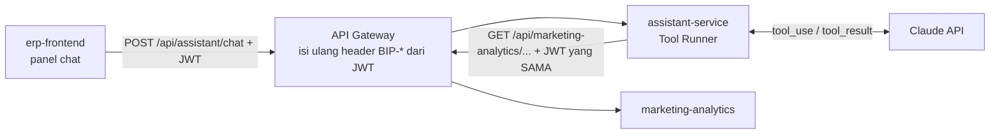

## Deskripsi

*Asisten tanya-jawab di dalam Web ERP yang menjawab pertanyaan tentang angka bisnis dengan cara MERUTEKAN pertanyaan ke endpoint yang sudah menghitungnya, bukan dengan menghitung sendiri. Ia memanggil endpoint memakai JWT orang yang bertanya, sehingga hak aksesnya identik dengan hak akses orang itu di layar. ~~Irisan pertama diarahkan ke data marketing analytics.~~ **Diputuskan berbeda 2026-09-28** ([[ADR - 0132 Asisten AI Tanya-Jawab Lintas Modul, Lapisan Data Bisnis per Service Bukan Terpusat]]): cakupan lintas modul sejak awal, dimulai beberapa modul percontohan sekaligus, dibatasi ke Supervisor/Direktur/IT.*

- **Status**: 🟡 **Konsep**, 2026-08-29. ~~0 kode, dikonfirmasi ulang lewat `git grep` langsung ke
  kode 2026-09-28.~~ **T1 sekarang punya kode nyata, 2026-09-28**: `bip-erp/services/assistant/`
  ada — `internal/aiclient/` (klien tipis OpenAI-compatible, `client.go`+`types.go`+11 test) dan
  `cmd/probe/main.go` (CLI verifikasi manual), 536 baris. Baru klien AI dasar (T1 di papan kerja
  `ANALISA - Asisten AI Lintas Modul`); **belum ada Fiber/gateway route, RBAC, maupun endpoint
  modul apa pun** (T2 dst). Merged 2026-09-29
  ([bip-erp#2150](https://github.com/bip-itteam-internal/bip-erp/pull/2150)) — status
  keseluruhan tetap 🟡 Konsep sampai lebih banyak T-task selesai.
  **T2 kerangka service ditulis 2026-09-29** (branch `feat/assistant-skeleton`): Fiber +
  `ValidateGateway`, hanya `GET /` dan `GET /health` (`{"message":"ok"}`), tanpa database dan
  tanpa rute AI. Merged (bip-erp #2151) dan **terbukti di DEV 2026-09-29** lewat gateway dengan
  JWT sungguhan (`/api/assistant/health` → 200). PROD dinaikkan manusia 2026-09-29 (healthy,
  env gateway benar; panggilan ber-JWT lewat gateway prod belum dicoba).
  **Frontend: banner pengumuman "Copilot" + halaman placeholder `/copilot`** — murni pengumuman
  "Segera Hadir", **tidak memanggil backend apa pun**. Nama fitur yang diputuskan: **Copilot**.
  Sempat berupa menu di puncak sidebar
  ([erp-frontend#1788](https://github.com/bip-itteam-internal/erp-frontend/pull/1788)), lalu
  2026-09-28 diganti strip pengumuman di atas header yang sementara hanya terlihat Tech
  Development (erp-frontend#1790, lalu dipindah dari dalam konten ke atas header). Lihat § Persona.
  **Jadwal Tugas** diputuskan sebagai pengingat, bukan eksekusi otomatis — lihat § Jadwal Tugas.
  ⚠️ **SEBAGIAN DIGANTIKAN 2026-09-22** oleh [[ADR - 0120 Asisten Analisa Marketing Jadi Menu ERP, Template dan Jadwal Lebih Dulu Tanpa AI]]
  **untuk kasus laporan Marketing terjadwal saja**: asisten analisa marketing diputuskan berdiri
  **di dalam service pemilik data lewat klien tipis `shared-library/ai`**, bukan sebagai service
  tersendiri. ⚠️ **Klien `shared-library/ai` yang disebut di sana TERNYATA BELUM ADA sama sekali
  di kode** — diverifikasi `git grep` menyeluruh 2026-09-28, nol hasil di luar false-positive.
  Ketegangan dengan ADR 0058 §2 yang dicatat dokumen ini (§ Dua ketegangan terbuka) **sudah
  dijawab** di sana, tapi HANYA untuk kasus satu domain (Marketing) — untuk kasus tanya-jawab
  bebas **lintas modul**, ketegangan itu **dijawab beda** oleh
  [[ADR - 0132 Asisten AI Tanya-Jawab Lintas Modul, Lapisan Data Bisnis per Service Bukan Terpusat]]
  (2026-09-28): asisten lintas
  modul secara struktural **tetap jadi service terpisah** (`services/assistant/`, sesuai rencana
  di dokumen ini), karena tidak ada satu service pemilik untuk semua modul sekaligus.
  ⚠️ **"Tanya-jawab bebas ditunda sampai template terbukti dipakai" (2026-09-22) DIPUTUSKAN TIDAK
  BERLAKU LAGI oleh ADR-0132** (2026-09-28) — keputusan sadar untuk mulai cakupan lintas modul
  sekarang, bukan menunggu. Kunci RBAC yang dicatat TBD di dokumen ini (§ Belum Diputuskan)
  **sudah ditegaskan** ADR-0132 §3: Supervisor departemen mana pun ATAU Direktur ATAU IT (Corp
  Sec belum ditegaskan). Yang TETAP berlaku dari dokumen ini: empat keputusan rancangannya
  (asisten dilarang berhitung, tool memanggil lewat gateway dengan JWT pemakai, jawaban adalah
  pintu), empat penjaga anti angka karangan, dan § Temuan gateway soal batas 30 detik — semuanya
  jadi dasar ADR-0132.
  **Sinkron 2026-10-01 (PR merged 2026-09-30..10-01)**: 42 tool ditawarkan (tiga HRIS, dua belas
  marketing, **27 HRGA** dalam dua tahap), penggabungan per orang lintas tool, umpan balik jempol,
  sapaan dari server, pencocokan divisi marketing, jawaban di latar (202). Detail di § Tool HRGA
  sampai § Realisasi pengukuran T8. ⚠️ Belum diuji ulang di prod sesudah perbaikan penggabungan
  (#2406).
  **Sinkron 2026-10-01 (lanjutan, diperiksa ke `origin/main`)**: **43 tool** ditawarkan (+ `daftar_karyawan`,
  bip-erp #2421), `rekap_telat_tim` bisa merinci per kejadian (#2423), dan **penjaga skala rupiah**
  merged (#2425). Yang **PR terbuka, belum di `main`** (dibaca dari branch, bukan dari `main`):
  penjaga jawaban umum `feat/copilot-penjaga-jawaban` (bip-erp #2437), rekap umpan `feat/copilot-rekap-umpan` (bip-erp #2438),
  uji pertanyaan tetap `feat/copilot-uji-tetap` (bip-erp #2435). Lihat § Penjaga jawaban,
  § Rekap umpan untuk tinjauan IT, § Uji pertanyaan tetap. Daftar celah yang tersisa
  (keandalan, data, biaya, adopsi) dicatat di issue privat repo kode bip-erp#2422.
- **Stack**: Go, `net/http` langsung (klien tipis hand-roll, BUKAN SDK Anthropic — divalidasi
  2026-09-28, lihat
  [[ADR - 0132 Asisten AI Tanya-Jawab Lintas Modul, Lapisan Data Bisnis per Service Bukan Terpusat]]
  §Context & §2a) ke `https://code.bharatainternasional.com/v1`
  (OpenAI-compatible, bukan format native Anthropic), model dipatok literal `cc/claude-*` +
  MongoDB untuk riwayat percakapan.
  ✅ **Tool/function-calling terbukti didukung** endpoint ini (probe 2026-09-28: `tool_calls` +
  `finish_reason:"tool_calls"` kembali benar untuk skema tool sederhana). Overhead terukur ~2.332
  prompt token per giliran dengan satu tool. Router bisa membalas 401 OAuth-expired transien
  (pulih ~2 menit) — klien wajib retry sekali untuk kelas galat ini.
- **Path di repo**: `bip-erp/services/assistant/` — `internal/aiclient/` dan `cmd/probe/` (T1);
  `main.go` + `main_test.go` + `Dockerfile` (T2, mengikuti pola `services/.template` tanpa Mongo).
- **Port & deploy**: `ASSISTANT_SERVICE_PORT=6991`, container `Assistant-Service`
  (`docker-compose.yml`), healthcheck ber-header `BIP-Gateway-ID`. Tidak ada di `deploy.yml`,
  tetapi **DEV tetap ter-deploy otomatis oleh Harness `bip_erp_deploy_dev`** saat merge (terjadi
  2026-09-29); PROD manual. ⚠️ `.env` server wajib memuat `ASSISTANT_SERVICE_PORT`
  **sebelum** `api-gateway` di-`--force-recreate`: tanpanya `ASSISTANT_MODULE_URL` menjadi
  `http://assistant-service:` (tak kosong, jadi gateway tidak panic) dan `/api/assistant/*`
  membalas 502 tanpa petunjuk.
- **Rute**: lewat [[CORE - API Master Gateway]] seperti service lain; modul `assistant`, tanpa cache
  gateway (`noCacheRoutes`) karena jawaban berbeda per pertanyaan. Kini `/api/assistant/` dan
  `/api/assistant/health` (tanpa gate, dipakai healthcheck), plus **`GET /api/assistant/akses`**
  (T3, branch `feat/assistant-gate-copilot`) di belakang `common.RequireCopilot`: 200
  `{"boleh":true}` atau 403 — pintu tanya "boleh pakai Copilot?" untuk frontend. ⚠️ Cara mengantar jawabannya BELUM diputuskan karena gateway tidak meneruskan stream (lihat § Temuan gateway).
- **Keputusan yang mengikat**: [[ADR - 0058 Kapabilitas AI Digerbang Kelayakan Data, Bukan Kelayakan Teknologi]]

## Latar Belakang

Angka bisnis sudah tersedia lengkap di [[Microservices - Marketing Analytics Service]], tetapi tersebar di belasan layar. Orang yang ingin tahu satu angka harus tahu lebih dulu layar mana yang memuatnya. Asisten ini memperpendek jarak itu, dan **hanya** itu.

Yang membuatnya berbeda dari kapabilitas AI lain yang sudah ada di [[CORE - Kapabilitas AI dan Machine Learning]]: ini kapabilitas pertama yang **membaca data ERP atas nama seorang pemakai**. [[APP - Ideamills]] dan [[Sales - TikTok Sentiment Pipeline]] tidak menyentuh data ERP, dan [[Microservices - Vault MCP Service]] membaca dokumentasi, bukan angka. Karena itu pertanyaan hak akses di sini baru, dan dijawab di § Keputusan 2.

## Keputusan yang diambil saat perancangan

Empat keputusan di bawah punya alasan yang lebih dalam daripada preferensi.

### 1. Bukan LangGraph, melainkan Tool Runner

[[Sales - Veo (Gemini) Automation Layer]] memakai LangGraph, dan di sana ia tepat: alurnya bercabang, berjalan lama, dan berhenti menunggu persetujuan manusia. Terverifikasi di `ideamiils/package.json` (`@langchain/langgraph` 1.4.4, `@langchain/langgraph-checkpoint-mongodb`) dengan graf nyata di `ideamiils/automation/graph/`.

Asisten ini tidak punya satu pun sifat itu. Ia satu putaran tanya, panggil beberapa tool, jawab. Tool Runner di SDK resmi sudah menjalankan loop itu. Memakai LangGraph berarti membawa checkpointer, state machine, dan node graph yang tak satu pun fiturnya terpakai.

### 2. Tool memanggil endpoint LEWAT GATEWAY dengan JWT pemakai, bukan lewat jalur internal

Ini keputusan terpenting di dokumen ini. Ongkosnya satu lompatan HTTP ekstra. Imbalannya hak akses asisten **identik** dengan hak akses orang itu di layar, bukan mirip, karena melewati kode gerbang yang sama persis.

Terverifikasi di `shared-library/routes/gateway_request.go`: gateway **membuang seluruh namespace header `BIP-*` kiriman klien** lalu mengisinya ulang dari klaim JWT (`BIP-Employee-ID`, `BIP-System-Roles`, `BIP-Department`, `BIP-Supervised-Departments`, `BIP-Company-ID`, `BIP-Permissions`). Jadi service ini tidak bisa memperluas aksesnya sendiri sekalipun mencoba.

Alternatif memanggil `/internal/` ditolak. Vault sudah mencatat dua kali bahwa `/internal/` bukan berarti privat dan bahwa penyaringan hak akses wajib dikerjakan di service sumber ([[Microservices - Calendar Service]]). Menulis ulang aturan izin di sini akan melahirkan sumber kebenaran kedua yang pasti menyimpang.

### 3. Asisten DILARANG berhitung

Angka hanya boleh berasal dari yang sudah dihitung endpoint. Aturan pemakaian kolom yang berbahaya tetap tinggal di Go, tidak disalin ke prompt.

Alasannya spesifik dan sudah terdokumentasi di [[CORE - Kapabilitas AI dan Machine Learning]] § Aturan pemakaian kolom: `iklan_sia_sia` adalah himpunan bagian dari `ads_cost` dan tidak boleh dijumlahkan ke laba, `spend_vsa` dan `spend_gmv_max` dua basis atribusi berbeda yang tidak boleh digabung, dan pendapatan nol di tingkat video bisa berarti tidak ada datanya. Model bahasa yang diberi angka mentah akan menjumlahkannya dengan percaya diri, kegagalannya bukan galat melainkan **angka salah yang masuk akal**, dan tak ada test yang menangkapnya.

### 4. Jawaban adalah pintu, bukan tujuan

Tiap jawaban wajib membawa tautan ke layar yang menampilkan angka yang sama. Layar tetap sumber kebenaran dan tiap angka bisa diperiksa dalam satu klik. Prinsip ini disalin sadar dari [[Microservices - Calendar Service]], yang sudah memakainya untuk `deep_link`.

## Alur


```mermaid
flowchart LR
    FE["erp-frontend<br/>panel chat"]
    GW["API Gateway<br/>isi ulang header BIP-* dari JWT"]
    AS["assistant-service<br/>Tool Runner"]
    CL["Claude API"]
    MA["marketing-analytics"]

    FE -->|"POST /api/assistant/chat + JWT"| GW
    GW --> AS
    AS <-->|"tool_use / tool_result"| CL
    AS -->|"GET /api/marketing-analytics/... + JWT yang SAMA"| GW
    GW --> MA
```

⚠️ Rute akar modul didaftarkan di `app.Get("/")`, **bukan** `/assistant`, karena gateway memotong prefix `/api/<module>` sebelum meneruskan. Unit test tetap hijau bila keliru karena memanggil path lokal langsung ke Fiber.

## Permukaan tool

Satu tool per endpoint baca, sekitar delapan sampai dua belas untuk irisan pertama. Kandidatnya dari rute yang sudah ada di `services/marketing-analytics/handler_mart.go` dan tetangganya: `/beranda`, `/summary`, `/profit/shops`, `/profit/products`, `/profit/skus`, `/profit/campaigns`, `/profit/ads`, `/videos`, `/lives`, `/returns/breakdown`. ~~Daftar finalnya **TBD**.~~
~~Per 2026-09-30 ada **lima belas** tool di kode.~~ ~~Per 2026-10-01 ada **42 tool**.~~ Per 2026-10-01
(sesudah #2421) ada **43 tool yang ditawarkan ke model**: tiga HRIS (`rekap_telat_tim`,
`antrean_persetujuan`, `cuti_tim`), dua belas marketing (§ Tool marketing), dan 28 HRGA (§ Tool
HRGA; tahap 1 = 14 sejak `daftar_karyawan`, tahap 2 = 14; kepegawaian kini empat tool,
`alat_hrga_kepegawaian.go`). Satu tool lagi,
`insentif_snapshot`, **sudah ditulis tetapi sengaja tidak ditawarkan** (alasannya di § Tool HRGA).
Satu daftar (`daftarAlat()` di `tanya.go`) dipakai untuk menawarkan tool ke model sekaligus untuk
dispatch, dan `TestDaftarAlat_NamaUnikDanHrgaLengkap` (`hrga_test.go`) mengunci nama yang tak boleh
ganda. ⚠️ Semua definisi tool ikut di tiap giliran, jadi prompt makin panjang per tool. Ongkos
nyatanya terukur di PROD 2026-09-30 (§ Realisasi pengukuran T8): satu giliran dua tool 8.977 token
masuk, satu laporan marketing enam tool sekitar 110 ribu token masuk.

Semua tool `strict: true` supaya argumennya dijamin valid.

**Tool pertama yang ada di kode (T6, 2026-09-29, branch `feat/assistant-tanya-rekap-telat`)**:
`rekap_telat_tim(periode?, minimal?)` → `GET /api/attendance/rekap-telat/tim` lewat
`GATEWAY_URL` dengan header `Authorization` **milik penanya** (hak akses = penanya; assistant tak
pernah membuat token). Status gagal (`tidak_berhak`, `sumber_tak_terjangkau`, `tanpa_identitas`,
`argumen_tidak_sah`) dikirim ke model sebagai teks, bukan galat, supaya model tak menaksir.
`periode` kosong diteruskan kosong: attendance yang menurunkan periode payroll berjalan.
Pintunya `POST /api/assistant/tanya` `{pertanyaan}` di belakang `RequireCopilot`: satu giliran,
maksimal 3 putaran model-tool, tenggat **25 detik** (di bawah batas proxy 30 detik; lewat =
**504** berpesan), balasan `{jawaban, sumber[]{alat, endpoint, dihitung_pada}}`. Env
`AI_BASE_URL`/`AI_API_KEY`/`AI_MODEL`/`GATEWAY_URL` kosong = `/tanya` **503**, service tetap hidup.
⚠️ **Bentuk balasan itu kini hanya jalur langsung (cadangan).** Bila riwayat tersedia, `/tanya`
membalas **202** `{percakapan_id, giliran_id, status:"diproses"}` dan jawabannya dikerjakan di latar
(§ Giliran di latar); jalur langsung membawa juga `tampilan`, `penanda`, `giliran_id`, `tersimpan`
(`tanya.go` `handlerTanya`, `mulaiLatar`).

**Tool kedua (2026-09-29, bip-erp #2362)**: `antrean_persetujuan(jenis?, tampilan?)` →
`GET /api/attendance/hr/requests?as=reviewer` **apa adanya** (tanpa endpoint baru). Filternya
relasional, sama dengan jalur setuju/tolak (`build*ReviewFilter`): hanya pengajuan yang menunggu
keputusan penanya, milik sendiri dikecualikan; penanya yang bukan penyetuju mendapat 0 baris, bukan
403. ⚠️ Endpoint mengurutkan **terbaru dulu** dan berpaginasi (`limit` maks 100), jadi tool
**menarik semua halaman** sampai `total` (berbatas 5 halaman, lalu melapor "terbaca N dari
total"), lalu mengurutkan ulang dari yang **paling lama menunggu**; lama menunggu (hari) dihitung
server. ⚠️ `from`/`to` di endpoint itu menyaring **tanggal dibuat**, bukan tanggal cuti, jadi tool
sengaja tak memakainya. Terbukti di DEV 2026-09-29 dengan pengajuan uji (dibatalkan sesudahnya):
supervisor Manufaktur melihatnya dalam tabel; pemilik (staf) 403 di gerbang Copilot; HRD tak
melihatnya karena belum sampai tahap HR.

**Tool ketiga (2026-09-30, bip-erp #2363)**: `cuti_tim(dari?, sampai?, tampilan?)` →
`GET /api/attendance/cuti/tim`, endpoint **baru** di attendance (lihat
[[API - Attendance Service]]). Endpoint cuti yang sudah ada tak bisa menjawab "siapa di tim saya
yang cuti minggu ini": `/request/view` hanya memuat pengajuan yang pernah ditinjau pemanggil.
Cakupan "tim" sama persis dengan `rekap_telat_tim`, rentang maks 62 hari, hanya status menunggu dan
disetujui, dan alasan/lampiran pengajuan tidak pernah dikirim. ⚠️ **Belum diuji end-to-end di DEV**
(per 2026-09-30).

### Tool marketing (2026-09-30, bip-erp #2367 + #2374, erp-frontend #1906 + #1910)

Dua belas tool di atas `marketing-analytics`, semuanya memakai endpoint yang sudah ada, satu klien
bersama (`internal/alat/marketing.go`, `KlienMarketing`) dengan saringan seragam
`dari`/`sampai`/`bulan`/`divisi`/`channel`. Lima yang terakhir (#2374) dikerjakan paralel oleh tiga
agen di worktree terpisah lalu disatukan:

| Tool | Endpoint | Yang dijawab |
|---|---|---|
| `ringkasan_marketing` | `/beranda` | vonis laba, penggerus, peluang periode |
| `laba_toko` | `/profit/shops` | laba/omzet per toko (bulan-bulan digabung per toko di tool) |
| `laba_produk` | `/profit/products` | laba per produk master (lintas toko / per toko / lintas channel) |
| `iklan` | `/profit/campaigns` atau `/profit/ads`, plus `/ambang` | belanja, ROAS terhadap target |
| `live` | `/lives/analisis` atau `/lives` | performa sesi live |
| `retur` | `/returns/breakdown` | retur per status dan pemicu |
| `affiliate_video` | `/affiliate` atau `/videos/periode` | performa affiliate dan video |
| `laba_sku_listing` | `/profit/skus` atau `/profit/items` (argumen `level`) | laba per SKU master / per listing marketplace |
| `matriks_produk_toko` | `/matrix/sku-shop` | produk × toko satu metrik aditif |
| `account_specialist` | `/penanggung-jawab/analisis` | laba per pemegang toko |
| `performa_host` | `/live-shifts/performa` | performa live per host |
| `retur_detail` | `/returns/detail` | rincian order retur/batal |

Aturan khusus lima tool terakhir, juga ditegakkan di tool:

- `laba_sku_listing`: `lingkup` tak dikirim (kedua endpoint menolaknya dengan 400; penggabungan
  dikerjakan tool). ⛔ **Biaya iklan level SKU/listing ditagihkan ke SATU entitas** yang terbaca lebih
  dulu (marketing-analytics `agregasi_profit.go` ~1344-1388: belanja listing Shopee ke satu varian
  SKU, belanja TikTok per SKU ke satu listing). Totalnya benar, pembagiannya tidak bermakna, jadi
  model diberi tahu untuk **tidak memeringkat ROAS/laba antar SKU atau listing** dan memakai `iklan`
  atau `laba_toko` untuk ROAS. Dikunci `TestLabaSKUListing_CatatanBiayaIklanTertumpuk`.
- `matriks_produk_toko`: **sel absen ≠ nol**. Pasangan tanpa baris dikirim sebagai
  `toko_tanpa_penjualan`, nol nyata sebagai 0. Tabel berbentuk panjang (satu baris per produk×toko,
  maks 200) karena matriks lebar tak terbaca di panel chat. Rasio ditolak.
- `account_specialist`: `per_orang` tak pernah dijumlahkan (totalnya `ringkasan`), `retur` bukan
  pengurang laba, `belum_matang` bukan kabar buruk; `bulan` diterjemahkan dan rentang > 92 hari
  ditolak sebelum memanggil sumber. Kolom `status` berisi kode vonis yang diterjemahkan layar.
- `performa_host`: rasio tanpa penyebut (tak ada klik/tontonan) jadi `null`, bukan 0 seperti yang
  dikirim sumber.
- `retur_detail`: paginasi berbatas **1.000 order** (2 × 500) dan dilaporkan "terbaca N dari total";
  `total:-1` bukan 0; data pembeli dan nomor resi tak pernah dikirim ke model.
- Nama orang (Account Specialist, host, penanggung jawab) selalu lewat samaran.

Aturan kolom **ditegakkan di tool, bukan diserahkan ke model** (sumbernya [[Microservices - Marketing Analytics Service]] § Aturan Pemakaian Angka):

- `null` = tidak diketahui, **bukan 0**. Rasio (ROAS, margin, porsi) **dihitung ulang dari total**,
  tak pernah dijumlah atau dirata-rata.
- `pembatalan` dan `iklan_sia_sia` bukan komponen kerugian; `produk_terjual` tak aditif (pakai
  `unit_terjual`); `orders_berresi` himpunan bagian `orders`; `gmv_live_tanpa_performa` tidak
  ditambahkan ke GMV toko; belanja USD tidak dikonversi; revenue VSA `null` bukan kerugian.
- Target ROAS **dibaca dari `/ambang`**, tidak ditulis di tool.
- `bulan` diterjemahkan ke `dari`/`sampai` untuk endpoint yang mengabaikannya.
- **`divisi` dicocokkan dari nama ke id sumber** (bip-erp #2386, `marketing.go` `cocokkanDivisi`, satu
  tempat untuk semua tool marketing). Sumbernya menerima **satu id divisi** yang sama persis
  termasuk huruf besar-kecil (id = nama departemen di `integration_db.department_shops`, mis.
  "Kyura"), sementara model mengirim "kyura": di PROD 2026-09-30 "kinerja iklan di kyura" dibalas
  400 tanpa daftar pilihan. Kini daftar `/divisi` dibaca dulu lalu dicocokkan dengan id atau nama
  (abaikan huruf besar-kecil), atau nama yang memuat teksnya bila **hanya satu** yang memuat. Tak
  cocok = status `argumen_tidak_sah` berisi pilihan yang sah, bukan saringan yang dilunakkan ke
  semua divisi. Nilai berkoma (lebih dari satu divisi) ditolak. Bila daftar `/divisi` sendiri tak
  terbaca, nilai diteruskan apa adanya dan sumber yang memvalidasi.

Siapa yang bisa memakai: gerbang Copilot (`RequireCopilot`) **dan** gerbang baca marketing
(`common.RequireAnalitikMarketing`, bip-erp #2365) berlaku berlapis. Supervisor departemen
non-marketing lolos gerbang Copilot, tetapi tool marketing-nya membalas `tidak_berhak`, bukan angka
nol. `account_specialist` dan `performa_host` memakai gerbang yang lebih sempit,
`common.RequireAnalisisPerOrangMarketing` (bip-erp #2375): marketing leader + Direktur/Corporate
Secretary, **tanpa** staf integration. ⚠️ **Belum diuji end-to-end di DEV** dengan akun leader
marketing dan akun non-marketing (per 2026-09-30); `laba_toko` baru terbukti sekali di layar PROD.

`laba_produk` sempat selalu mengirim peringatan "data harian terpotong 5000 baris" karena cacat
sumbernya (bip-erp #2366). Sejak #2369 sumbernya menjumlah seluruh baris, jadi peringatan tinggal
berbunyi saat **daftar produk** mentok di limit endpoint (5000 produk).

### Samaran identitas sebelum ke relay AI (keputusan user 2026-09-29)

Persetujuan tertulis Direksi untuk data asli yang keluar lewat `code.bharatainternasional.com`
belum ada, jadi `internal/samaran` memastikan yang keluar hanya **token `Karyawan-N`, angka, dan
nama departemen**:

- Nama dan `employee_id` dari hasil tool diganti token; **jabatan tidak dikirim sama sekali**
  (jabatan tunggal, mis. satu-satunya supervisor, mengidentifikasi orangnya sama baiknya dengan nama).
- Sebelum TIAP kiriman, seluruh percakapan disamarkan dengan peta yang sudah ada (termasuk nama
  yang diketik penanya), lalu **penjaga** memindainya sekali lagi: sisa identitas = kiriman
  **dibatalkan** (500 "Jawaban ditahan"), bukan sekadar dicatat.
- Jawaban dipulihkan ke nama asli hanya di balasan untuk penanya.
- ⚠️ **Batas yang diketahui**: nama yang diketik penanya di pertanyaan **pertama** terkirim apa
  adanya, karena sebelum tool pertama berjalan peta masih kosong. Nama panggilan/sebagian nama
  ("Danu" untuk "Danu Prayuda") tak dikenali penyamaran. Pada percakapan yang **dilanjutkan**
  (§ Riwayat) peta lama dipulihkan, jadi nama yang sudah dikenal ikut tersamar sejak putaran pertama.

### Riwayat percakapan (keputusan user 2026-09-29, bip-erp #2332, erp-frontend #1899)

- **Disimpan selamanya, hanya pemiliknya yang bisa membaca.** Database sendiri
  `assistant-mongo-db` (container `Assistant-MongoDB`, env `MONGO_ASSISTANT_DB`), koleksi
  `percakapan`. Pemilik ditegakkan di **filter penyimpanan** (`riwayat.FilterMilik` =
  `_id` + `employee_id`), bukan di handler: milik orang lain dibalas **404**, sama dengan tidak ada.
- Rute di belakang `RequireCopilot`: `GET /percakapan` (100 terbaru), `GET /percakapan/:id`,
  `DELETE /percakapan/:id` (hapus **permanen**, 204), dan sejak 2026-09-30
  `PUT /percakapan/:id/giliran/:gid/umpan` (§ Umpan balik jempol). `POST /tanya` menerima
  `percakapan_id` untuk melanjutkan; balasannya membawa `percakapan_id`, `giliran_id`, dan
  `tersimpan` (atau 202 di jalur latar). `GET /percakapan/:id` kini memuat `umpan` per giliran.
- Tiap giliran menyimpan dua versi: nama asli (untuk layar) dan versi tersamar (yang dikirim ulang ke
  model, maksimal 6 giliran terakhir), plus **peta samaran**. Peta dan `employee_id` tak pernah ikut
  di balasan JSON.
- Gagal menyimpan **tidak** membatalkan jawaban: `tersimpan:false`, layar memberi keterangan.
  `MONGO_URI` kosong/Mongo mati = rute riwayat 503, `/tanya` tetap menjawab.
- ⚠️ **`MONGO_DB` kosong juga wajib ditolak di awal** (bip-erp #2368, `alasanRiwayatNonaktif`):
  `Connect` tetap berhasil lalu tiap baca/tulis gagal `database name cannot be empty` sementara
  container tampak sehat. Terjadi di PROD 2026-09-29 karena `MONGO_ASSISTANT_DB` tak ada di `.env`
  server; riwayat mati belasan jam tanpa tanda di `/health`. Kini log berbunyi `[Copilot] riwayat
  nonaktif: MONGO_DB kosong (isi MONGO_ASSISTANT_DB di .env)` dan rute riwayat 503. PROD dibetulkan
  manusia 2026-09-30 (`printenv MONGO_DB` = `assistant_db`).
- Terbukti di DEV 2026-09-29 lewat gateway dengan dua akun: simpan, isolasi (baca/hapus/lanjutkan
  milik orang lain = 404), lanjutkan, hapus 204 lalu 404.
- Deploy pertama menuntut `up -d` **tanpa** `--no-deps` supaya `assistant-mongo-db` ikut tercipta.

### Blok tampilan: tabel dan grafik (T9b, keputusan user 2026-09-29, bip-erp #2359)

- **Model memilih bentuk, angka dari tool.** Tool berdata baris punya argumen `tampilan`
  (`teks`/`tabel`/`grafik`) yang diisi model saat memanggilnya (nol putaran tambahan). Isi blok
  dibangun **server** dari balasan endpoint (`internal/alat/tampilan.go`), dengan nama asli, dan
  diantar hanya ke penanya di field `tampilan` (array, `[]` bila tak ada). Model tak pernah
  mengetik isi tabel, dan kiriman ke relay tetap tersamar.
- Bentuk blok: `jenis`, `alat`, `periode`, `kolom` (**kunci**, bukan label: labelnya milik layar,
  [[ADR - 0010 Internasionalisasi (i18n) Dua Bahasa]]), `baris`, `kategori`/`nilai` (sumbu grafik),
  `total`. Rekap telat: terurut dari yang paling sering telat; grafik dipotong **15** dengan `total`.
- Tanpa blok bila model memilih teks, data kosong, atau status gagal/tidak berhak.
- Blok ikut tersimpan di riwayat dan **tidak pernah** dikirim ulang ke model.
- Frontend: `features/copilot/components/blok-tampilan.tsx` (tabel `components/ui/table`, grafik
  batang mendatar lewat `ChartContainer` + `WARNA_BAGAN.violet`); jenis asing diabaikan.
- Terukur di DEV 2026-09-29 (akun Direktur, seluruh perusahaan): "rekap April 2026" → tabel 56 baris
  (12 dtk); "grafik ... April 2026" → grafik 15 dari 56 (7 dtk). ⚠️ Pertanyaan "satu orang paling
  sering telat" juga mendapat tabel 56 baris, karena model memilih sebelum melihat data; perketat
  deskripsi argumen bila terasa berlebihan.

### Tool HRGA: 28 tool atas endpoint yang sudah ada (bip-erp #2387 tahap 1, #2392 tahap 2, 2026-09-30; #2421 `daftar_karyawan`, 2026-10-01)

Keputusan user 2026-09-30: pemakai HRGA = **supervisor HRGA + Direksi**, cakupan **kelima area tahap 1
dan area tahap 2 sekaligus**. Semua tool membaca endpoint GET yang **sudah ada** di service pemiliknya
lewat satu klien (`internal/alat/hrga.go`, `KlienHrga`), **lewat gateway dengan JWT penanya**
(Keputusan 2). Tool tak punya gerbang dan tak punya aturan bisnis sendiri (gaji, potongan, periode
26-25): 403/401 dari service dijawab sebagai `tidak_berhak`, bukan angka (`hrga.go` `ambil`). Argumen
yang tak dikenal ditolak sebelum satu permintaan pun keluar (`bacaArgumenKetat`,
`DisallowUnknownFields`), supaya isian karangan model tak diam-diam jatuh ke bawaan.

| Area | Tool | Endpoint yang dibaca |
|---|---|---|
| Kepegawaian | `komposisi_karyawan` | `employee /analysis` |
| | `daftar_karyawan` | `employee /v2/internal/aggregate/employees` |
| | `kontrak_karyawan` | `employee /contract/summary` + `/contract` |
| | `turnover_karyawan` | `employee /resign/summary/riwayat` + `/resign` |
| Presensi | `rekap_kehadiran` | `attendance /report` |
| | `pengajuan_karyawan` | `attendance /hr/requests` + `/hr/requests/summary` |
| | `surat_peringatan` | `employee /warnings` |
| | `sisa_cuti` | `employee /vacation` |
| Payroll | `ringkasan_payroll` | `payroll /payroll-runs` |
| | `rincian_payroll` | `payroll /payroll-runs/:id` |
| Rekrutmen & GA | `rekrutmen_ringkasan` | `recruitment /postings`, `/candidates`, `/requisitions`, `/offers` |
| | `pemenuhan_rekrutmen` | `recruitment /requisitions/pemenuhan` |
| | `aset_ga` | `inventory /summary` |
| | `pemakaian_ruang` | `inventory /peminjaman/jadwal` + `/peminjaman/ruang` |
| KPI (tahap 2) | `kpi_ringkasan_departemen` | `employee /kpi/ringkasan-departemen` |
| | `kpi_skor_karyawan` | `employee /kpi` |
| Jadwal | `jadwal_shift_harian` | `attendance /entries` |
| | `jadwal_roster` | `attendance /roster` |
| | `jadwal_hari_libur` | `attendance /holiday` |
| Pelatihan & dokumen | `pelatihan_sesi` | `learning /training` + `/training/:id/participants` |
| | `pelatihan_rencana` | `learning /training/plan-items` |
| | `dokumen_hrd` | `hrd-document /documents` + `/document-types` |
| Hubungan industrial & lain | `mutasi_karyawan` | `employee /mutasi` |
| | `catatan_kepatuhan` | `employee /compliance-notes/rekap` + `/master/compliance-violation-types` |
| | `struktur_organisasi` | `employee /org-chart` |
| | `pengumuman_terbaru` | `notification /article` |
| | `kunjungan_tamu` | `attendance /guestbook` |
| | `program_culture` | `form-builder /culture/summary` (+ `/me/capability`) |

(Sumber: konstanta `endpoint*` dan pemanggilan `ambil(...)` di tiap berkas `internal/alat/*.go`; daftar
per area di `alat_hrga_*.go`, dirakit `alatHrga()` di `main.go`. Pengajuan tukar shift tidak punya tool
sendiri karena sudah dijawab `pengajuan_karyawan` dan `antrean_persetujuan`.) Payroll hanya menjawab
penanya dengan paket `payroll.view` (`alat_hrga_payroll.go`).

⚠️ **`insentif_snapshot` ditulis tetapi TIDAK ditawarkan** (`alat_hrga_kpi.go`, 2026-09-30): gerbang
endpoint-nya `RequireMenu(MenuFinanceInsentif)` terbuka untuk semua yang login selama belum ada akun
yang di-assign ke menu itu (`catalog_menu.go`, fallback true, disengaja demi panggilan
service-ke-service). Lewat Copilot itu berarti supervisor departemen mana pun bisa membaca insentif per
orang seluruh perusahaan, lebih luas dari pemakai yang ditetapkan. **Aktifkan setelah menu itu
dikunci di prod.** Ini contoh ADR-0132 §9: gerbang yang belum ada diperbaiki lebih dulu, bukan diwarisi.

**`daftar_karyawan`** (bip-erp #2421, merged): dibuat karena di PROD 2026-10-01 "siapa saja yang ada di
tim tech dev" dijawab "nama tidak tersedia" (`komposisi_karyawan` sengaja hanya mencacah). Membaca
`GET /v2/internal/aggregate/employees` yang digerbang `common.RequireHRISStaff` (`employee main.go`
1813), jadi hanya penanya berhak HRIS yang mendapat daftar; selain itu `tidak_berhak`. Argumen
`departemen` (nama atau label grup seperti HRGA; filter di sumber lewat `ResolveDepartmentFilter`
menurut komentar kode), `status` (`aktif` bawaan/`nonaktif`/`semua`), `tampilan`. Menarik semua halaman
(100 per halaman, **maks 10 halaman**), dan bila tak lengkap menandai `PenandaSebagian`. Balasan sumber
memuat telepon, email, foto, dan rekening: struct dekodenya **hanya** identitas kerja. Ke model hanya
token `Karyawan-N`, departemen, status, dan hitungan per departemen (maks **200** baris,
`maksSaringanKaryawan`); **jabatan hanya ke blok tabel penanya**, tidak ke model. Token-nya bisa
diteruskan ke argumen `karyawan` tool lain (§ Penggabungan data per orang).

**`rekap_telat_tim` merinci per kejadian** (bip-erp #2423, merged): argumen `rincian` (bool) dan
`karyawan` (daftar token, saringan yang sama dengan § Penggabungan). Tool meneruskan
`?rincian=true` ke attendance ([[API - Attendance Service]]), yang membalas `kejadian[]`
{`tanggal` WIB, `jam_masuk`, `jam_telat`} per orang (maks 31). ⛔ **`jam_telat` adalah jam potongan
(`late_hour`), bukan menit**, dan hanya entri telat yang **dihitung** yang masuk (kriteria sama dengan
rekap angka), jadi rincian tak pernah memuat telat yang tak berakibat potongan. Rincian tampil di
layar sebagai **blok anak** `rincian_telat` di bawah tabel rekap (kolom `karyawan`, `tanggal`,
`jam_masuk`, `jam_telat`; maks **100** baris, sisanya terhitung di `total`), hanya bila `tampilan`
tabel (`internal/alat/rekap_telat_tim.go` `blokRekap`, `batasBarisRincianTelat`). Tanggal dan jam
bukan identitas sehingga ikut ke model; nama tetap token. ⚠️ **Urutan deploy: attendance DULU, baru
assistant-service.** Attendance lama tak membaca `rincian` (simpulan dari kode; belum diuji pada
biner lama), sehingga tool mengira rincian terkirim padahal `kejadian` kosong, tanpa galat.

**Aturan privasi yang ditegakkan di tool, bukan diserahkan ke model** (melanjutkan § Samaran identitas):

- **Jabatan tak pernah dikirim ke model**, termasuk dari tool yang sumbernya memuatnya
  (`komposisi_karyawan` membuang hitungan per jabatan, `komposisi_karyawan.go`; `struktur_organisasi`
  hanya cacah per departemen, `hi_struktur.go`). Alasannya sama dengan § Samaran: jabatan tunggal
  ditambah gaji atau SP mengidentifikasi orangnya.
- **Dekode berdaftar-putih**: balasan endpoint diurai ke struct yang hanya memuat field yang
  dibutuhkan, sehingga nomor rekening, NIK, NPWP, BPJS, telepon, email, alamat, alasan
  pengajuan/berhenti (teks bebas), lampiran, dan foto dibuang sebelum sampai ke model (`hrga.go`
  kepala berkas). Kandidat rekrutmen hanya **cacah** per lowongan/status/tahap, nama kandidat tak
  dikirim bahkan sebagai token, penawaran hanya status + persetujuan tanpa gaji
  (`rekrutmen_ringkasan.go`, `rekrutmen_ga_bersama.go`). Isi pengumuman, kronologi kasus, dan data
  pribadi tamu juga tidak dikirim (`alat_hrga_hi.go`).
- Nama karyawan hanya sebagai token `Karyawan-N`, dipulihkan di blok tampilan untuk penanya.

⛔ **Deskripsi tool dilarang memuat aturan hak akses** (bip-erp #2391). Di PROD 2026-09-30
"kontrak karyawan yang segera berakhir" dijawab "tidak berhak" **tanpa memanggil alat**, padahal
penanya berhak: model menyimpulkan hak dari kalimat "hanya HR yang berhak" di deskripsi. Kini hak
akses hanya diketahui gerbang service, dan aturan prompt 4 melarang menolak sebelum alatnya dipanggil:
"tidak berhak" hanya boleh diucapkan sesudah alat membalas `tidak_berhak`. Dikunci
`TestDeskripsiAlat_TanpaAturanHakAkses` (`hrga_test.go`), yang memindai deskripsi dan skema **semua**
tool terhadap pola kalimat aturan-akses dan menuntut kalimat larangan itu ada di prompt.

**Batas yang diketahui** (sumber tak menyediakannya, jadi Copilot menjawab "belum tersedia", bukan menaksir):

- **Payroll tanpa pecahan per departemen**: slip tidak memuat departemen; `rincian_payroll`
  menyatakannya di deskripsi (`payroll_rincian.go`: "Rincian per departemen belum tersedia").
- **Tak ada alur pengajuan lembur**: yang ada hanya `overtime_hour` pada presensi
  (`attendance/main.go`), jadi "siapa mengajukan lembur" tak punya jawaban. Lembur di payroll hanya
  komponen slip.
- **Aset GA tanpa tanggal jatuh tempo pengembalian**, sehingga "aset terlambat dikembalikan" tak bisa
  dijawab (`aset_ga.go`).
- **`dokumen_hrd` tidak menunjukkan berapa karyawan yang sudah menyetujui**, dan bukan kelengkapan
  berkas pribadi (KTP, ijazah, dst.) per departemen (`dokumen_hrd.go`). Penyelesaian pelatihan wajib
  juga tak punya tool: sumber yang dipakai (`pelatihan_*`) tak memuatnya (**TBD**, belum diukur
  terhadap sumber lain).
- **Satgas tidak ditawarkan** dengan alasan di kode: bacaannya per orang (temuan inspeksi berfoto)
  (`alat_hrga_hi.go`). Komentar yang sama menyebut rute FE lamanya tak lagi ada di form-builder;
  ⚠️ **TBD, belum terverifikasi**: `employee/satgas_finding.go` mendaftarkan `/satgas-findings`,
  jadi pernyataan "FE memanggil rute yang tak ada" perlu diukur per rute sebelum dijadikan temuan.
- Temuan keamanan yang muncul saat memeriksa gerbang endpoint dicatat di **issue privat repo kode**,
  bukan di vault (repo publik).

### Penggabungan data per orang lintas tool (T8, bip-erp #2406, 2026-09-30)

Cacat yang mendorongnya, terukur di PROD 2026-09-30: "karyawan yang kontraknya segera berakhir,
bagaimana KPI-nya" dijawab dengan dua orang dan sisanya disebut "kemungkinan belum dinilai", padahal
minimal delapan orang lain berskor. Model menerima **25 baris dari tiap tool** (51 kontrak, 119 skor)
lalu menggabungkan dua potongan; ketiadaan di daftar yang dipotong bukan bukti apa pun
(`internal/alat/gabung_karyawan.go`, kepala berkas).

Mekanismenya, dua sisi:

1. **Tool yang daftarnya dipotong mengirim `karyawan_semua`**: token seluruh orang di daftarnya
   (hanya token, murah; maks 200, unik per orang). Dikirim oleh `kontrak_karyawan`,
   `kpi_skor_karyawan`, `rekap_kehadiran`, `surat_peringatan`.
2. **Tool penerima punya argumen `karyawan`** (daftar token, maks 200): `kpi_skor_karyawan` dan
   `rekap_kehadiran`. Token diterjemahkan ke `employee_id` lewat peta samaran percakapan
   (`samaran.Peta.IDDariToken`), data **lengkap** disaring dari sumber (tidak dipotong 25), dan token
   yang orangnya tak muncul di sumber dilaporkan eksplisit di `karyawan_tidak_ada_di_sumber`. Token
   yang bukan milik percakapan ditolak (`argumen_tidak_sah`): model tak boleh mengarang orang.

Prompt aturan 12 (`tanya.go`) mewajibkan urutannya (panggil tool pertama, lalu tool kedua dengan
`karyawan` berisi token) dan melarang menyimpulkan "tidak ada", "belum dinilai", atau nol dari
ketiadaan di daftar yang dipotong; "tidak ada" hanya boleh bila tool menyebutnya di
`karyawan_tidak_ada_di_sumber`. Aturan prompt 3 melarang menyingkat token ("Karyawan-27, 28" muncul di
layar sebagai "28, 29" tanpa nama di PROD 2026-09-30). **Pelajaran: join tak boleh dikerjakan di atas
daftar yang terpotong; "tidak ada" hanya datang dari sumber.**

### Penjaga jawaban sisi server (bip-erp #2425 merged; generalisasinya PR terbuka)

Aturan prompt saja tidak cukup menahan model, dan tiga kegagalan PROD 2026-09-30..10-01 membuktikannya.
Penjaga memeriksa **jawaban yang sudah ditulis** terhadap apa yang benar-benar terjadi pada giliran itu
(hasil dan status tool), bukan terhadap ingatan model:

| Kegagalan terukur | Penjaga | Penanda bila tetap gagal |
|---|---|---|
| Laporan marketing menulis omzet "Rp 7,32 triliun", laba "Rp 532,7 miliar", iklan "Rp 1,37 triliun"; angka tool 7.324.709.296, 532.718.526, 1.372.605.160 (meleset 1.000x saat mengubah angka jadi kata; kartu di layar benar karena diformat sistem) | **Skala rupiah**: tiap "Rp X [satuan]" harus cocok dengan salah satu angka hasil tool giliran itu | `angka_tak_cocok` |
| "Karyawan-27, 28" muncul di layar sebagai "28, 29" tanpa nama | **Token disingkat**: `Karyawan-N` yang disambung angka tanpa awalan | `token_disingkat` |
| "Kontrak segera berakhir" dijawab "tidak berhak" tanpa memanggil tool (§ Deskripsi tool dilarang memuat aturan hak akses) | **Akses tak terbukti**: jawaban menyatakan penanya tak punya akses padahal tak ada tool yang membalas `tidak_berhak` | `akses_tak_terbukti` |

**Di `main` (bip-erp #2425)** hanya baris pertama: `penjaga_rupiah.go` + `jawab.go`. Pencocokan rupiah
(`rupiahTakCocok`): satuan `ribu/rb/juta/jt/miliar/milyar/triliun`, format Indonesia (koma desimal, titik
ribuan); cocok bila selisih dalam **toleransi pembulatan** yang ditulis (setengah digit terakhir kali
satuan) atau dalam **1%** angka sumber; angka di bawah 1.000 dilewati; **tanpa angka sumber (jawaban
tanpa tool) tak ada yang diperiksa**, karena penjaga ini soal skala, bukan sumber. Angka sumber = seluruh
angka (nilai mutlak, sedalam apa pun) dari JSON hasil semua tool giliran itu (`angkaDariHasilAlat`).
Dicek pada versi **samaran**, sebelum nama dipulihkan.

**Mekanisme koreksi**: bila ada yang gagal dan masih ada putaran, model diminta menulis ulang
**SELURUH** jawaban **satu kali** per giliran lewat pesan `KOREKSI SISTEM` (`jawab.go`, bendera satu-jatah);
bila tetap gagal, jawaban **tidak ditolak** melainkan diberi **penanda** yang tampil sebagai badge
"perlu diperiksa" (sama dengan penanda dari model, aturan prompt 10). `Alasan` penanda hanya berisi
daftar potongan yang melanggar; **kalimat penjelasnya milik label layar**
(`copilot.penanda.<kode>`, [[ADR - 0010 Internasionalisasi (i18n) Dua Bahasa]]), bukan teks backend.
Satu fakta satu tempat: label `angka_tak_cocok` hidup di `i18n/locales`, bukan di sini.

**PR terbuka, belum di `main`** (branch `feat/copilot-penjaga-jawaban` (bip-erp #2437) di bip-erp, satu commit di atas
main; diperiksa 2026-10-01): `penjaga.go` mengangkat penjaga jadi **daftar** (`daftarPenjaga`) dengan
satu jalur dan **satu jatah koreksi bersama**: semua penjaga yang gagal digabung jadi **satu** pesan
koreksi, model menulis ulang sekali, sisanya jadi penanda. Penjaga akses satu-satunya yang
mengizinkan model memanggil tool lagi dalam koreksinya (`bolehAlat`); dua lainnya menyuruh memakai hasil
tool yang ada. Pola akses: "tidak berhak", "tidak memiliki akses", "tidak punya akses", "tidak
diizinkan". Daftar status tool dikumpulkan per giliran dari kunci `status` tingkat atas hasil tool.
Pelabelan layar kedua penanda baru ada di erp-frontend branch lokal `feat/copilot-label-penjaga`
(belum di-push, **belum merged**). Penjaga baru cukup ditambahkan ke `daftarPenjaga`.

⛔ **Batas yang diketahui**: penjaga **mengurangi** kegagalan ini, tidak menghapusnya. Ia tidak
memeriksa angka non-rupiah (persen, jumlah), tidak memeriksa kebenaran nama, dan bergantung pada pola
teks (kalimat penolakan yang diparafrasa di luar pola lolos). **TBD**: apakah pola akses perlu diperluas
belum diukur terhadap jawaban PROD.

### Rekap umpan untuk tinjauan IT (PR terbuka `feat/copilot-rekap-umpan` (bip-erp #2438), belum di `main`)

Tujuan (issue privat bip-erp#2422): umpan jempol turun yang terkonfirmasi jadi perbaikan + test, jadi
tim IT perlu membacanya. Pembaca umpan yang tadinya **TBD** (§ Umpan balik jempol) ditulis di branch ini
(`umpan_rekap_rute.go`, `internal/riwayat`, `internal/umpan`; diperiksa 2026-10-01):

- `GET /umpan/rekap?dari&sampai&nilai` di belakang **`common.RequireITSupervisor`** (IT
  supervisor/admin, `shared-library/common/roles.go:62`), dipasang di **pendaftaran rute**, **bukan**
  gerbang Copilot. Bawaan 7 hari terakhir WIB, rentang maks **92 hari**; `nilai` tak disebut = `turun`,
  kosong atau `semua` = naik dan turun; maks **200** baris (`terpotong:true` bila lebih).
- ⛔ **Sengaja melewati isolasi pemilik**: `riwayat.AmbilUntukTinjauan` memuat percakapan **semua**
  pemilik berdasarkan id, tanpa `FilterMilik` (§ Riwayat percakapan: pemilik ditegakkan di filter
  penyimpanan). Komentar di kode menyatakan fungsi ini hanya untuk rute rekap umpan dan tak boleh dipakai rute
  lain; rute baru yang membaca percakapan orang lain menyimpang dari keputusan "hanya pemiliknya yang
  bisa membaca" dan butuh keputusan tersendiri.
- Baris memuat pertanyaan, jawaban (dipotong **1.000 karakter**), catatan, nama tool, kode penanda, dan
  `employee_id` penanya. Karena jawaban memuat nama asli karyawan, isinya hanya untuk peninjau di dalam
  ERP; pertanyaan, jawaban, dan catatan **tak pernah dicatat ke log**.
- ⛔ **Jawaban yang memakai tool gaji disembunyikan**: giliran yang memakai `ringkasan_payroll`,
  `rincian_payroll`, atau `insentif_snapshot` dikirim `jawaban_disembunyikan:true` dengan teks kosong,
  karena IT supervisor belum tentu berhak `payroll.view`. Pertanyaan, catatan, tool, dan penanda tetap
  tampil. (Gerbang payroll tak diwariskan oleh rute ini, jadi penyembunyian itu dikerjakan di rute.)
- Baris umpan yang percakapan atau gilirannya tak ditemukan (mis. percakapan dihapus) tetap dikirim
  dengan `percakapan_hilang:true`.

### Uji pertanyaan tetap (PR terbuka bip-erp #2435, belum di `main`)

`cmd/ujitetap` + `uji/pertanyaan-tetap.json` (19 kasus; 2 percakapan lanjutan) menjalankan pertanyaan
tetap terhadap Copilot yang **sudah ter-deploy** dan mencetak tabel PASS/FAIL, supaya regresi pasca-deploy
terbaca tanpa menebak (T8 belum diuji ulang di prod; § Realisasi pengukuran T8). Diperiksa dari branch
`feat/copilot-uji-tetap` 2026-10-01:

- **Dijalankan manusia dengan token login miliknya sendiri**, dari env `COPILOT_UJI_GATEWAY` (akar
  gateway tanpa `/api`) dan `COPILOT_UJI_TOKEN`. Agent tak pernah membuat, membaca, atau menyimpan token;
  alat ini tak mencetak dan tak menulis token ke disk, dan env dihapus sesudah dipakai. Dokumen ini
  sengaja tidak menyalin langkah perintahnya: pegangannya `services/assistant/uji/README.md`.
- Tiap kasus punya `asal` (kejadian nyata yang melatarbelakanginya) dan pemeriksaan atas jawaban
  terakhir: tool wajib/terlarang, `tanpa_alat`, teks wajib/terlarang, blok tampilan wajib, dan penanda
  terlarang. Penanda `angka_tak_cocok`, `token_disingkat`, `akses_tak_terbukti` **selalu** dilarang.
  `boleh_tidak_berhak` meluluskan jawaban "tidak berhak" untuk tool yang bergantung hak (mis. payroll).
- ⚠️ **Hasilnya bergantung pada hak aksesmu**: kasus yang gagal karena akun penguji tak berhak harus
  dibaca sebagai itu, bukan regresi Copilot. Deteksi "tidak berhak" memakai teks jawaban (tak ada
  status terstruktur di respons). Menyentuh DEV atau PROD sesuai gateway yang ditunjuk, hanya baca, tetapi
  **memakai token AI** (sampai 5 putaran model per giliran): jalankan sesudah deploy, bukan tiap
  perubahan kecil. Jawaban model tak deterministik, jadi ulangi kasus gagal sebelum menyimpulkan regresi.

### Giliran di latar (bip-erp, `tanya.go`)

Bila riwayat tersedia, `/tanya` menyimpan giliran berstatus `diproses`, membalas **202**, lalu
menjawab di goroutine (`mulaiLatar`, `selesaikanLatar`); layar menarik `GET /percakapan/:id` sampai
giliran selesai. Tenggat latar **3 menit** (`tenggatLatarBawaan`), maksimal **5 putaran**
(`maksPutaranLatar`), tiap tool tetap ber-timeout HTTP **20 detik** (`penanyaDariEnv`), dan tool
dalam satu putaran berjalan **paralel**. Jalur langsung (tenggat 25 detik, 3 putaran) hanya dipakai
bila Mongo riwayat tak ada atau giliran awal gagal tersimpan. Percakapan yang masih punya giliran
`diproses` menolak pertanyaan baru dengan **409**. Giliran `diproses` yang melewati tenggat latar
ditampilkan `gagal` oleh rute baca, tanpa mengubah dokumennya (service mati saat menjawab).
`strings.Clone` atas `Authorization` dan `employee_id` **wajib** sebelum goroutine berjalan: nilai
`c.Get` fasthttp memakai buffer yang dipakai ulang, dan tanpanya tool di latar bisa berjalan dengan
JWT penanya berikutnya (ditemukan di bip-erp #2382).

### Umpan balik jempol (bip-erp #2416, erp-frontend #1930)

- `PUT /percakapan/:id/giliran/:gid/umpan` `{nilai: "naik"|"turun"|"", catatan}`, di belakang
  `RequireCopilot` (`riwayat_rute.go`, `internal/umpan/umpan.go`). Nilai kosong menghapus umpan.
  `catatan` paling panjang **500 karakter** dan hanya disimpan untuk `turun`. Balasan `{nilai}`; 404
  bila percakapan bukan milik penanya atau `gid` tak ada; **409** bila giliran belum selesai atau
  gagal; 503 bila Mongo tak ada.
- **Koleksi terpisah `umpan_balik`** (database yang sama dengan riwayat), upsert berkunci
  `employee_id + percakapan_id + giliran_id`. Alasannya tertulis di kode: dokumen `percakapan`
  **ditimpa utuh** saat giliran latar selesai (`selesaikanLatar` menyimpan salinan yang diambil saat
  giliran dimulai), jadi umpan yang diletakkan di dalamnya hilang senyap bila diberikan selagi giliran
  lain diproses.
- `GET /percakapan/:id` menyisipkan `umpan {nilai, catatan}` per giliran dari koleksi itu; gagal
  membaca umpan tidak menggagalkan halaman. `DELETE /percakapan/:id` ikut menghapus umpannya.
- Setiap giliran tersimpan kini punya `id` (dipakai menempelkan umpan), dan balasan jalur langsung
  maupun 202 membawa `giliran_id`. Log umpan **tidak memuat teks catatan** (bisa memuat nama).
- Frontend: `features/copilot/components/tombol-umpan.tsx`, `hooks/use-umpan-copilot.ts`.
- Di `main` belum ada pembaca: tak ada rute atau laporan yang mengagregasi umpan. Pembacanya (rekap
  untuk tinjauan IT) ada di PR terbuka, lihat § Rekap umpan untuk tinjauan IT.

### Sapaan dan bentuk laporan (bip-erp #2385)

- **Sapaan ditambahkan server, bukan ditulis model.** Model yang menyapa lewat token memulihkannya
  ke nama **lengkap** di tiap jawaban (keluhan user 2026-09-30). Kini server menambahkan
  "Halo <nama depan>!" **sekali**, di jawaban pertama percakapan (`sapaanAwal`, `namaSapaan`: kata
  pertama yang bukan singkatan seperti "M." atau "Hj", berkapital di awal saja); prompt melarang
  model menyapa. Percakapan yang sudah punya jawaban tak disapa lagi, dan sapaan tak masuk
  `JawabanSamaran` supaya model tak meniru.
- **Laporan selalu kartu + komposisi, teks = ringkasan eksekutif paling banyak lima kalimat.** Aturan
  prompt 11: untuk permintaan laporan menyeluruh, panggil semua tool sekaligus dalam satu putaran,
  tampilan grafik untuk `ringkasan_marketing`, `laba_toko`, `iklan` dan tabel untuk daftar; teks
  tak mengulang angka yang sudah tampil. Dasarnya PROD 2026-09-30: laporan lengkap keluar sebagai
  5.537 karakter teks yang mengulang angka tabel tanpa satu grafik pun.
- Penanda "perlu diperiksa" (T10): aturan prompt 10 + `penanda.go`; layar menampilkannya sebagai badge.

### Layar Copilot (erp-frontend #1914, #1916, #1929, #1930)

- Label layar untuk 13 tool HRGA tahap 1 (#1914) dan 14 tahap 2 (#1916), id + en
  ([[ADR - 0010 Internasionalisasi (i18n) Dua Bahasa]]).
- Area jawaban selebar `max-w-6xl` (1152 px, tabel HR dan lima kartu sebaris mulai `lg`), sementara
  kolom input tetap `max-w-3xl` (`panel-tanya.tsx`, dikunci `panel-tanya.test.tsx`) (#1929).
- Tombol jempol naik/turun per jawaban (#1930), lihat § Umpan balik jempol.
- **Percakapan yang dibuka hidup di URL**: `/copilot?percakapan=<id>` (erp-frontend #1941, merged;
  `panel-tanya.tsx`, konstanta `PARAM_PERCAKAPAN`). Alasannya refresh dan tautan kembali ke percakapan
  yang sama, dan tombol Back peramban bekerja. Jawaban pertama yang tersimpan menulis id lewat
  `router.replace` (tanpa entri riwayat baru); memilih dari Riwayat atau "Percakapan baru" memakai
  `router.push` (Back kembali). Id yang tak ada, bukan milik penanya, atau rusak membuat param
  **dibuang** supaya refresh tak mengulang galat; percakapan yang dihapus ikut `replace` supaya Back
  tak kembali ke URL yang pasti 404. `page.tsx` membungkus panel dengan `Suspense` karena
  `useSearchParams` tanpa itu gagal di `pnpm build`, bukan di test. Key `percakapan` milik panel ini
  saja di rute `/copilot`.
- Label layar dua penanda penjaga baru (`token_disingkat`, `akses_tak_terbukti`) ada di branch lokal
  `feat/copilot-label-penjaga` (id + en), **belum merged** per 2026-10-01; label `angka_tak_cocok`
  sudah di `main`.

### Realisasi pengukuran T8 (PROD 2026-09-30, dari log `[Copilot] giliran`)

Log per giliran memuat `durasi_ms`, `putaran`, `alat`, `token_masuk`, `token_keluar` (`jawab.go`).

| Pertanyaan | Tool | Putaran | Waktu | Token masuk / keluar |
|---|---|---|---|---|
| "kontrak segera berakhir × KPI" (lintas modul) | 2, paralel | 2 | 14,5 dtk | 8.977 / 645 |
| Laporan lengkap marketing | 6, paralel, satu putaran | 1 | 21 dtk | sekitar 110 ribu masuk |

Yang bisa disimpulkan: karena jalur latar tak terikat batas proxy gateway 30 detik (`/tanya` sudah
membalas 202), **jumlah tool per pertanyaan tak lagi dibatasi 30 detik**; batas praktisnya tenggat latar
(3 menit, 5 putaran, 20 detik per tool) dan **ongkos token**. Angka "maksimal modul per pertanyaan"
yang dikosongkan ADR-0132 §6 dicatat balik di sana. Jawaban pertama pertanyaan lintas modul itu
**salah** (lihat § Penggabungan per orang); perbaikannya bip-erp #2406. ⚠️ **Uji ulang pertanyaan yang
sama sesudah #2406 di-deploy belum dikonfirmasi** per 2026-10-01; yang terbukti baru test kode
(`gabung_karyawan_test.go`). Biaya rupiah per pertanyaan **TBD** (T12: token sudah tercatat di log,
konversi ke rupiah belum).

Yang sengaja **TIDAK** ada, dan alasannya bukan kehati-hatian umum:

| Tidak dibuat | Alasan |
|---|---|
| Tool bash atau perintah bebas | Harness hanya menerima string buram, sehingga tak bisa menggerbang, mengaudit, atau merender per aksi |
| Tool query bebas ke MongoDB | Membuka jalan bagi asisten menghitung sendiri, yang justru dilarang Keputusan 3 |
| Tool tulis apa pun | Irisan pertama baca-saja. Aksi menulis menuntut gerbang konfirmasi tersendiri yang belum dirancang |

## Penjaga supaya tidak lahir angka karangan

Empat-empatnya wajib, dan ketiadaannya tidak akan terlihat sebagai test merah.

1. **Tidak berhitung.** Lihat Keputusan 3.
2. **Tautan ke layar** di tiap jawaban. Lihat Keputusan 4.
3. **Umur data ikut dijawab.** [[ADR - 0058 Kapabilitas AI Digerbang Kelayakan Data, Bukan Kelayakan Teknologi]] mencatat bahwa pada 2026-08-28 job `sync-shop-performance` terakhir sukses 2026-08-20 dan `sync-live-sessions` 2026-08-19, dan kegagalannya **tidak berbunyi di layar mana pun**. Asisten yang menjawab di atas data berhenti empat hari akan terdengar sama meyakinkannya dengan yang benar. Karena itu tiap hasil tool membawa keterangan periode dan kesegaran sumbernya, dan asisten menyebutkannya.
4. **Tidak tahu adalah jawaban yang sah.** Bila tak ada tool yang memegang angkanya, asisten menjawab tidak tahu dan menunjuk layarnya, bukan menaksir.

## Gerbang ADR 0058

[[ADR - 0058 Kapabilitas AI Digerbang Kelayakan Data, Bukan Kelayakan Teknologi]] § 1 memasang tiga syarat. Dua yang pertama mengikat keras kapabilitas **prediktif** karena hanya yang prediktif menuntut label historis; asisten ini **generatif** dan tidak menaksir apa pun.

Yang tetap mengikat penuh adalah syarat ketiga: **ada keputusan yang benar-benar berubah, dan ada orang yang mengambilnya.** Belum dijawab dengan angka. Sampai terjawab, dokumen ini konsep.

⚠️ § 2 ADR yang sama menyatakan model menumpang service pemilik data dan tidak ada service AI terpisah. Asisten ini **service terpisah**, dan itu perlu dicatat terus terang. Alasan mengapa tidak dianggap melanggar: § 2 mengatur tempat **model** supaya tidak terpisah dari data yang dibacanya, sedangkan service ini tidak memuat model dan tidak membaca database mana pun. Ia pemanggil endpoint HTTP dan sifatnya memang lintas modul. **Menyelesaikan ketegangan ini menuntut ADR baru, bukan tafsir di dokumen ini.**

## Temuan gateway yang mengikat rancangan

Diukur langsung dari `shared-library/routes/gateway_request.go` pada 2026-08-29, dan keduanya membatalkan bentuk pengantaran jawaban yang paling wajar.

| Temuan | Baris | Akibat |
|---|---|---|
| Respons non-biner dibaca penuh ke memori (`io.ReadAll` lalu `c.Send`) | 157-158 | `text/event-stream` **tidak** ada di daftar biner, jadi SSE ditahan sampai selesai. Jawaban tidak mengalir, layar diam lalu tiba-tiba penuh |
| `http.Client{Timeout: 30 * time.Second}` | 118 | Giliran yang memanggil beberapa tool bisa melewati 30 detik, dan gateway membalas **502**, bukan pesan yang bisa dibaca |

Empat jalan keluar yang terbuka, belum dipilih:

1. Tambah `text/event-stream` ke cabang streaming dan buat timeout dapat diatur per-rute. Tempatnya benar, tetapi berkas itu **dipakai SELURUH service**, jadi ongkos salahnya jatuh ke semua orang. ⚠️ Perlu diverifikasi juga apakah cabang biner yang ada (`io.Copy` ke `BodyWriter`) benar-benar mengalir, atau fasthttp tetap menahannya sampai handler selesai; bila yang kedua, cabang itu pun bukan streaming sungguhan.
2. Tanpa stream, satu jawaban utuh sekali kirim, dengan tiap giliran dipaksa selesai di bawah 30 detik.
3. Tidak lewat gateway, berdiri sebagai host sendiri seperti [[Microservices - Vault MCP Service]]. Preseden ada, tetapi ongkosnya persis yang paling ingin dipertahankan Keputusan 2, yaitu pewarisan hak akses lewat gateway.
4. FE menarik berkala: POST memulai giliran dan membalas id, FE mengambil potongan jawabannya menyusul.

## Persona / Pengguna

| Persona | Peran & Divisi | Akses / RBAC | Device |
|---|---|---|---|
| Supervisor departemen mana pun | Tim mana pun, ber-`is_supervisor` | Mewarisi gerbang endpoint yang dipanggil; DAN gate Copilot ([[ADR - 0132 Asisten AI Tanya-Jawab Lintas Modul, Lapisan Data Bisnis per Service Bukan Terpusat]] §3) lewat `SupervisedDepartmentsStrict` non-kosong | Web ERP |
| Direktur & Corporate Secretary | Kesekretariatan | Sama seperti di atas, lewat `common.SetaraDirektur` atas `BIP-Position` (Corp Sec ditegaskan ikut 2026-09-29); Direktur juga lolos lewat derivasi `it:supervisor` | Web ERP |
| Tim IT | IT | Sama seperti di atas, lewat `common.IsITMember` (staf ke atas) | Web ERP |

**Gate Copilot di kode** (T3): satu-satunya tempat aturannya `shared-library/common/akses_copilot.go`
(`BolehPakaiCopilot`, dibungkus `RequireCopilot`). Gagal-tertutup: token lama tanpa klaim
`supervised_departments` ditolak sampai login ulang, dan versi berfallback `SupervisedDepartments`
sengaja TIDAK dipakai (membuat setiap staf tampak supervisor departemennya sendiri). Jabatan
dicocokkan PERSIS: "Direktur Utama" tidak lolos lewat cabang jabatan. ⛔ **Frontend wajib bertanya
ke `GET /api/assistant/akses`, jangan memakai `aksesSemuaMenu`**: helper FE itu sengaja TIDAK
mencakup Corporate Secretary, jadi halaman Copilot yang digerbang dengannya menolak Corp Sec
tanpa pesan apa pun.

⚠️ **Pengumuman INTERIM jauh lebih sempit dari tabel di atas** (erp-frontend 2026-09-28): belum
ada menu Copilot sama sekali. Yang ada strip pengumuman tipis DI ATAS HEADER seluruh halaman,
selebar kolom konten (`components/layout/banner-copilot.tsx`, dirender `Container` sebelum
`<Header/>`; tak sticky sehingga tergulir hilang, sidebar tak digeser), hanya untuk
**departemen Tech Development** — dibandingkan dengan konstanta `DIVISI_IT`, **bukan**
`system_roles.it` (peran itu juga dipegang orang HR, Kesekretariatan, dan Finance). Selalu tampil
tanpa tombol tutup, tombol "Pelajari" menuju `/copilot`, dan disembunyikan di `/copilot` sendiri.
Izin `assistant.view` tetap `tolak` di `FALLBACK` (`utils/menu-permission.ts`) sebagai penjaga,
walau tak ada menu yang memakainya: izin tak-terdaftar diloloskan untuk semua orang. ~~Halaman
`/copilot` sendiri tidak menggerbangi apa pun karena tak memuat data (ADR 0031).~~ **Sejak
2026-09-29 (branch erp-frontend `feat/copilot-akses`) halaman `/copilot` bertanya ke
`GET /api/assistant/akses`** lewat `features/copilot/hooks/use-akses-copilot.ts`: yang tak berhak
mendapat **404** (`notFound`), selama memuat `Skeleton`, gagal-tertutup (403/502/badan lain =
tidak boleh), `retry: false`. Banner **tetap khusus Tech Development** (keputusan user
2026-09-29), jadi yang berhak di luar Tech Development baru bisa masuk lewat URL.
⚠️ Belum diverifikasi: `KonteksPortal.supervisedDepartments` di `components/layout/portal-menu.ts`
didokumentasikan sebagai sinyal supervisor yang benar — relevan saat menu sungguhan dibuka ke
supervisor (T3).

- **Tujuan**: mendapatkan satu angka tanpa harus tahu lebih dulu layar mana yang memuatnya.
- **Pain point**: angkanya ada, tetapi tersebar di belasan layar.
- **Aksi utama**: bertanya, membaca jawabannya, lalu mengklik tautannya untuk memeriksa sendiri di layar aslinya.

## Jadwal Tugas (🟡 backend menunggu merge PR https://github.com/bip-itteam-internal/bip-erp/pull/2382)

Keputusan dan alasannya di [[ADR - 0135 Jadwal Tugas Copilot Mengirim Pengingat, Bukan Menjalankan Tanpa Kehadiran Pemakai]]. Bagian ini menjelaskan cara kerjanya.

**Backend (menunggu merge PR https://github.com/bip-itteam-internal/bip-erp/pull/2382, issue bip-erp#2356):**
- Rute (akar modul, gateway memotong `/api/assistant`), semuanya di belakang `common.RequireCopilot`: `GET/POST /jadwal`, `GET/PATCH/DELETE /jadwal/:id`, `GET /jadwal/:id/riwayat`, `POST /jadwal/:id/dibuka {slot}`. Jadwal milik orang lain dibalas **404**, bukan 403; `PATCH` sebagian (field absen = tak berubah).
- Kode: `services/assistant/jadwal_rute.go`, `pengingat.go`, `internal/jadwal/` (slot berikutnya sebagai fungsi murni zona Asia/Jakarta, gudang Mongo + memori, pemindai). Koleksi `jadwal_tugas` dan `jadwal_pengingat`; indeks unik (`jadwal_id`, `slot`) menjamin paling banyak satu pengingat per slot. Pengiriman **at-most-once**: slot diklaim dulu, lalu dikirim.
- Kategori inbox **`copilot-jadwal`**. Tautan notifikasi `/copilot?jadwal=<id>&slot=<RFC3339>`; judul = nama jadwal, badan satu kalimat tetap, instruksi tidak ikut terkirim.
- Env `NOTIFICATION_MODULE_URL` dan `NOTIFICATION_SERVICE_KEY` di blok compose `assistant-service`; bila kosong, pemindai nonaktif dengan log dan rute lain tetap hidup.
- Layar pengelola dan penerima tautan di erp-frontend: issue erp-frontend#1898.

```
buat jadwal (nama + instruksi/template + frekuensi + jam)      @ Copilot > Jadwal Tugas
        │
cron assistant-service (Asia/Jakarta) ── slot jatuh tempo? ── klaim atomik (tugas, slot) unik
        │
kirim pengingat: inbox + push, kategori baru, tautan pre-fill  ── TANPA panggilan AI / data
        │
pemakai klik ── Tanya Jawab terbuka berisi instruksi ── jalan dengan JWT HIDUP miliknya
        │                                                     (gate ADR-0132 §3 dinilai ulang)
riwayat: kapan terkirim, kapan dibuka
```

- **Tidak ada eksekusi tanpa kehadiran pemakai.** Itu satu-satunya alasan fitur ini tak butuh mekanisme identitas baru: cron di kode hari ini memanggil lewat `InternalRequest(nil, …)` tanpa header RBAC apa pun, dan perhitungan izin efektif cuma hidup privat di titik penerbitan JWT employee-service (rincian di ADR-0135 § Context).
- **Isi tugas**: nama, instruksi atau template Copilot, frekuensi (harian, hari kerja, mingguan+hari, bulanan+tanggal) + jam. Tanpa mode izin, pilihan model, atau project.
- **Biaya AI nol sampai pemakai membuka tautan**; jadwal yang diabaikan tak memakan token.
- ⚠️ **Deploy**: kategori inbox baru → `notification-service` naik LEBIH DULU, baru `assistant-service` (lihat [[Microservices - Notification Service]]).
- **TBD**: batas jumlah tugas per orang dan interval minimum (angka PRD claude.ai tak dipakai), serta apakah pengingat berikutnya ditahan bila yang sebelumnya belum dibuka.

## Di luar lingkup

- **Menghitung, menaksir, dan meramal.** Seluruhnya. Yang prediktif tunduk pada gerbang [[ADR - 0058 Kapabilitas AI Digerbang Kelayakan Data, Bukan Kelayakan Teknologi]] dan bukan pekerjaan service ini.
- **Aksi menulis.** Irisan pertama baca-saja.
- **Otomasi komentar di media sosial (buzzer).** Dibahas 2026-08-29 dan **ditolak**, dicatat di sini supaya tidak diusulkan berulang. Komentar otomatis yang dirancang agar terbaca seperti datang dari orang sungguhan menipu pembacanya, dan melanggar aturan platform. Taruhannya bukan kecil: omzet Rp 40,44 miliar dalam 146 hari yang diukur ADR 0058 mengalir lewat toko-toko yang akan kena sanksinya. **Yang sah dan tetap terbuka**: triase komentar masuk, draf balasan yang dikirim setelah ditinjau orang, dan balasan otomatis sebagai akun brand secara terbuka untuk pertanyaan berulang. Pembedanya satu, yaitu apakah identitas yang bicara disamarkan.
- ~~**Modul selain marketing analytics.** Irisan pertama saja; perluasan diputuskan setelah irisan pertama terbukti hidup.~~ **Diputuskan berbeda 2026-09-28** oleh [[ADR - 0132 Asisten AI Tanya-Jawab Lintas Modul, Lapisan Data Bisnis per Service Bukan Terpusat]]: cakupan lintas modul sejak awal (beberapa modul percontohan sekaligus, bukan satu-satu bergantian menunggu bukti).

## Belum Diputuskan (TBD)

- ~~**Cara mengantar jawaban.** Empat pilihan di § Temuan gateway, belum dipilih.~~ **Diputuskan user 2026-09-29: sekaligus, tanpa stream**, lewat gateway biasa dengan tenggat 25 detik (cukup untuk satu-dua tool). Stream ditunda sampai pertanyaan lintas modul (T8) membuktikan 25 detik tak cukup.
- **Daftar tool final** beserta bentuk argumen dan bentuk hasilnya. Daftar per 2026-10-01 ada di
  § Permukaan tool; `insentif_snapshot` menunggu menu insentif dikunci di prod.
- **Batas pemakaian per orang per hari** belum ada; **agregasi umpan jempol** belum ada pembacanya di `main` (rekap tinjauan IT ada di PR terbuka, § Rekap umpan untuk tinjauan IT).
- ~~**Kunci RBAC** yang menentukan siapa boleh membuka asistennya.~~ **Ditegaskan 2026-09-28** oleh [[ADR - 0132 Asisten AI Tanya-Jawab Lintas Modul, Lapisan Data Bisnis per Service Bukan Terpusat]] §3: Supervisor departemen mana pun ATAU Direktur ATAU IT. ~~Yang masih TBD: apakah Corporate Secretary ikut termasuk.~~ Corporate Secretary **ikut** (ditegaskan 2026-09-29).
- ~~**Penyimpanan riwayat percakapan**: koleksi, masa simpan, dan apakah isinya boleh dibaca siapa pun selain penanyanya.~~ **Diputuskan user 2026-09-29**: koleksi `percakapan` di `assistant-mongo-db`, disimpan selamanya, hanya pemiliknya. Lihat § Riwayat percakapan.
- **Model dan ongkos.** Probe 2026-09-28 memakai `cc/claude-sonnet-4-6` (bukan opus) — terbukti mendukung tool-calling, 2.332 prompt token untuk satu tool sederhana. Token per giliran kini tercatat di log (PROD 2026-09-30: 8.977 masuk untuk dua tool, sekitar 110 ribu masuk untuk laporan enam tool; § Realisasi pengukuran T8), tetapi **biaya rupiah per pertanyaan masih belum dihitung** (task T12 di papan kerja `ANALISA - Asisten AI Lintas Modul`, dokumen `Workspace/` yang tak boleh ditaut dari dok terbit). Batas pemakaian per orang per hari juga belum ada.
- **Prompt caching**: daftar tool dan system prompt yang tetap seharusnya di-cache, penempatan breakpoint-nya belum dirancang.
- ~~**Penyimpanan kunci API Anthropic** dan siapa yang memegangnya.~~ **Sebagian terjawab 2026-09-28**: `AI_BASE_URL`/`AI_API_KEY` sudah ada sebagai env var di SEMUA container prod (termasuk container MongoDB — kemungkinan dari blok/anchor compose bersama yang terlalu luas, layak ditinjau terpisah, di luar cakupan dok ini) lewat `~/apps/bip-erp/.env` di server. Siapa yang mengelola rotasi/akses kunci ini masih belum jelas.
- ~~**Seluruh sisi frontend**~~ **Sebagian terjawab 2026-09-28**: pengumuman lewat banner
  (bukan menu) dengan kilau beranimasi (keyframe `copilot-kilau`, garis putih transparan supaya
  tak jadi bayangan di tema gelap, mati untuk `prefers-reduced-motion`); halaman placeholder
  `/copilot` + kunci i18n `copilot.*` dan `copilot.banner.*` di `id`/`en`
  ([[ADR - 0010 Internasionalisasi (i18n) Dua Bahasa]]). Yang masih TBD: letak menu Copilot
  sungguhan saat fiturnya hidup, panel chat, render tabel/chart jawaban, dan sub-menu (Tanya
  Jawab, Jadwal Tugas). **Panel chat, riwayat, dan render tabel/grafik sudah dibangun 2026-09-29**
  (§ Riwayat percakapan, § Blok tampilan).
- **Irisan dan gerbang verifikasinya.** Belum disusun.
- ~~**ADR** yang menyelesaikan ketegangan dengan ADR 0058 § 2.~~ **Ditulis 2026-09-28**: [[ADR - 0132 Asisten AI Tanya-Jawab Lintas Modul, Lapisan Data Bisnis per Service Bukan Terpusat]] §2 — asisten lintas modul tetap jadi service terpisah, karena tidak ada satu service pemilik untuk semua modul.

## Dependensi & Integrasi

| Bergantung pada | Untuk apa | Bila mati |
|---|---|---|
| [[CORE - API Master Gateway]] | Jalur masuk, dan jalur keluar tool ke endpoint data | Asisten tak bisa dipanggil maupun memanggil |
| [[Microservices - Marketing Analytics Service]] | Seluruh angka yang dijawab | Asisten wajib menjawab tidak tahu, bukan menaksir |
| Claude API (Anthropic) | Model bahasa | Fitur padam; kegagalannya wajib berbunyi, bukan diam |
| [[CORE - SSO Flow]] | JWT yang diwarisi tool | Tak ada identitas, tak ada jawaban |
| [[Microservices - Employee Service]], [[Microservices - Attendance Service]], [[Microservices - Payroll Service]], [[Microservices - Recruitment Service]], [[Microservices - Inventory Service]], [[Microservices - Learning Service]], [[Microservices - HRD Document Service]] | Tool HRGA membaca endpoint GET-nya lewat gateway dengan JWT penanya | Tool terkait membalas `sumber_tak_terjangkau`, bukan angka; tool lain tetap jalan |

**Tidak** bergantung pada: notification-service, calendar-service, dan database mana pun milik service lain.

## Dokumen Terkait

- [[ADR - 0132 Asisten AI Tanya-Jawab Lintas Modul, Lapisan Data Bisnis per Service Bukan Terpusat]], keputusan yang menggantikan cakupan & RBAC dokumen ini
- [[CORE - Kapabilitas AI dan Machine Learning]], peta seluruh kapabilitas AI dan aturan pemakaian kolomnya
- [[ADR - 0058 Kapabilitas AI Digerbang Kelayakan Data, Bukan Kelayakan Teknologi]], gerbang yang mengikat
- [[Microservices - Marketing Analytics Service]], pemilik seluruh angka yang dijawab
- [[API - Marketing Analytics Service]], endpoint yang jadi tool
- [[Microservices - Vault MCP Service]], preseden akses Claude ke data internal, dan preseden tidak lewat gateway
- [[Sales - Veo (Gemini) Automation Layer]], kapabilitas yang memakai LangGraph dan kenapa di sini tidak
- [[APP - Web ERP]], tempat panel chat berdiri
