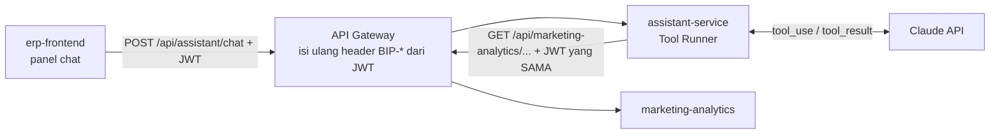

## Deskripsi

*Asisten tanya-jawab di dalam Web ERP yang menjawab pertanyaan tentang angka bisnis dengan cara MERUTEKAN pertanyaan ke endpoint yang sudah menghitungnya, bukan dengan menghitung sendiri. Ia memanggil endpoint memakai JWT orang yang bertanya, sehingga hak aksesnya identik dengan hak akses orang itu di layar. ~~Irisan pertama diarahkan ke data marketing analytics.~~ **Diputuskan berbeda 2026-09-28** ([[ADR - 0132 Asisten AI Tanya-Jawab Lintas Modul, Lapisan Data Bisnis per Service Bukan Terpusat]]): cakupan lintas modul sejak awal, dimulai beberapa modul percontohan sekaligus, dibatasi ke Supervisor/Direktur/IT.*

- **Status**: ⚠️ **Implemented (ada catatan)**, ditetapkan 2026-10-08 saat sinkron ke `origin/main`
  bip-erp `ff3ea482`: service, gerbang, alat, riwayat, penjaga, Jadwal Tugas, dan penyajian laporan
  semuanya ada di `main`. Catatannya: sebagian besar gelombang belum diukur di PROD maupun diuji
  end-to-end lewat gateway (tertulis per gelombang di bawah), dan biaya per pertanyaan belum dihitung.
  Riwayat status berikut dipertahankan apa adanya.
  ~~🟡 **Konsep**, 2026-08-29.~~ ~~0 kode, dikonfirmasi ulang lewat `git grep` langsung ke
  kode 2026-09-28.~~ **T1 sekarang punya kode nyata, 2026-09-28**: `bip-erp/services/assistant/`
  ada — `internal/aiclient/` (klien tipis OpenAI-compatible, `client.go`+`types.go`+11 test) dan
  `cmd/probe/main.go` (CLI verifikasi manual), 536 baris. Baru klien AI dasar (T1 di papan kerja
  `ANALISA - Asisten AI Lintas Modul`); **belum ada Fiber/gateway route, RBAC, maupun endpoint
  modul apa pun** (T2 dst). Merged 2026-09-29
  ([bip-erp#2150](https://github.com/bip-itteam-internal/bip-erp/pull/2150)) — status
  keseluruhan tetap 🟡 Konsep sampai lebih banyak T-task selesai.
  **T2 kerangka service ditulis 2026-09-29** (branch `feat/assistant-skeleton`): Fiber +
  `ValidateGateway`, hanya `GET /` dan `GET /health` (`{"message":"ok"}`), tanpa database dan
  tanpa rute AI. Merged (bip-erp #2151) dan **terbukti di DEV 2026-09-29** lewat gateway dengan
  JWT sungguhan (`/api/assistant/health` → 200). PROD dinaikkan manusia 2026-09-29 (healthy,
  env gateway benar; panggilan ber-JWT lewat gateway prod belum dicoba).
  **Frontend: banner pengumuman "Copilot" + halaman placeholder `/copilot`** — murni pengumuman
  "Segera Hadir", **tidak memanggil backend apa pun**. Nama fitur yang diputuskan: **Copilot**.
  Sempat berupa menu di puncak sidebar
  ([erp-frontend#1788](https://github.com/bip-itteam-internal/erp-frontend/pull/1788)), lalu
  2026-09-28 diganti strip pengumuman di atas header yang sementara hanya terlihat Tech
  Development (erp-frontend#1790, lalu dipindah dari dalam konten ke atas header). Lihat § Persona.
  **Jadwal Tugas** diputuskan sebagai pengingat, bukan eksekusi otomatis — lihat § Jadwal Tugas.
  ⚠️ **SEBAGIAN DIGANTIKAN 2026-09-22** oleh [[ADR - 0120 Asisten Analisa Marketing Jadi Menu ERP, Template dan Jadwal Lebih Dulu Tanpa AI]]
  **untuk kasus laporan Marketing terjadwal saja**: asisten analisa marketing diputuskan berdiri
  **di dalam service pemilik data lewat klien tipis `shared-library/ai`**, bukan sebagai service
  tersendiri. ⚠️ **Klien `shared-library/ai` yang disebut di sana TERNYATA BELUM ADA sama sekali
  di kode** — diverifikasi `git grep` menyeluruh 2026-09-28, nol hasil di luar false-positive.
  Ketegangan dengan ADR 0058 §2 yang dicatat dokumen ini (§ Dua ketegangan terbuka) **sudah
  dijawab** di sana, tapi HANYA untuk kasus satu domain (Marketing) — untuk kasus tanya-jawab
  bebas **lintas modul**, ketegangan itu **dijawab beda** oleh
  [[ADR - 0132 Asisten AI Tanya-Jawab Lintas Modul, Lapisan Data Bisnis per Service Bukan Terpusat]]
  (2026-09-28): asisten lintas
  modul secara struktural **tetap jadi service terpisah** (`services/assistant/`, sesuai rencana
  di dokumen ini), karena tidak ada satu service pemilik untuk semua modul sekaligus.
  ⚠️ **"Tanya-jawab bebas ditunda sampai template terbukti dipakai" (2026-09-22) DIPUTUSKAN TIDAK
  BERLAKU LAGI oleh ADR-0132** (2026-09-28) — keputusan sadar untuk mulai cakupan lintas modul
  sekarang, bukan menunggu. Kunci RBAC yang dicatat TBD di dokumen ini (§ Belum Diputuskan)
  **sudah ditegaskan** ADR-0132 §3: Supervisor departemen mana pun ATAU Direktur ATAU IT (Corp
  Sec belum ditegaskan). Yang TETAP berlaku dari dokumen ini: empat keputusan rancangannya
  (asisten dilarang berhitung, tool memanggil lewat gateway dengan JWT pemakai, jawaban adalah
  pintu), empat penjaga anti angka karangan, dan § Temuan gateway soal batas 30 detik — semuanya
  jadi dasar ADR-0132.
  **Sinkron 2026-10-01 (PR merged 2026-09-30..10-01)**: ~~42 tool~~ (angka saat itu; hitungan terkini di § Permukaan tool) ditawarkan (tiga HRIS, dua belas
  marketing, **27 HRGA** dalam dua tahap), penggabungan per orang lintas tool, umpan balik jempol,
  sapaan dari server, pencocokan divisi marketing, jawaban di latar (202). Detail di § Tool HRGA
  sampai § Realisasi pengukuran T8. ⚠️ Belum diuji ulang di prod sesudah perbaikan penggabungan
  (#2406).
  **Sinkron 2026-10-01 (lanjutan, diperiksa ke `origin/main`)**: ~~43 tool~~ (angka saat itu) ditawarkan (+ `daftar_karyawan`,
  bip-erp #2421), `rekap_telat_tim` bisa merinci per kejadian (#2423), dan **penjaga skala rupiah**
  merged (#2425). ~~Yang PR terbuka, belum di `main`: #2437, #2438, #2435.~~ **Ketiganya sudah merged
  ke `main` 2026-10-01** (merge commit `310132bb`, `74ef4bf5`, `76bc54ca`; berkas `penjaga.go`,
  `umpan_rekap_rute.go`, `cmd/ujitetap/` ada di `origin/main`). Lihat § Penjaga jawaban,
  § Rekap umpan untuk tinjauan IT, § Uji pertanyaan tetap. Daftar celah yang tersisa
  (keandalan, data, biaya, adopsi) dicatat di issue privat repo kode bip-erp#2422.
  **Sinkron 2026-10-01 (sesudah #2447, #2448, #2464, diukur ke `origin/main`)**: ~~51 tool~~ (angka saat
  itu; hitungan terkini hanya di § Permukaan tool) ditawarkan. Baru: saringan gabung lintas alat
  (§ Penggabungan data per orang), rincian per kejadian (§ Rincian per kejadian), delapan tool baru
  (§ Tool HRGA gelombang 2026-10-01), dan daftar sumber yang **sengaja dilewati**
  (§ Sumber yang sengaja dilewati). ⚠️ Belum ada pengukuran PROD atas gelombang ini.
  **Sinkron 2026-10-02 (diukur ke `origin/main`, bip-erp #2474, #2475, #2484; erp-frontend #1982, #1986)**:
  sebelas tool baru di tiga area, **GA** (`booking_ruang`, `permintaan_barang_ga`, `opname_perlengkapan`),
  **hubungan industrial** (`usulan_sp`, `inspeksi_area`, `temuan_satgas`, `culture_antrean_klub`), dan
  **pelatihan** (`evaluasi_pelatihan`, `kursus_elearning`, `permintaan_pelatihan`, `sertifikat_pelatihan`);
  rinciannya di § Tool HRGA gelombang 2026-10-02, dan daftar sumber yang sengaja dilewati bertambah. Label
  layar sebelas tool itu sudah ada di `id.ts` dan `en.ts` erp-frontend `origin/main` (kunci tiap nama tool
  ditemukan lewat `git grep`; isi kalimatnya tak dibaca dokumen ini). ⚠️ Belum ada pengukuran PROD maupun uji
  di DEV atas gelombang ini (yang terbukti baru kode dan test di repo).
  **Sinkron 2026-10-02 (lanjutan, diukur ke `origin/main`, bip-erp #2509, #2510, #2535; erp-frontend #2006, #2036)**:
  Copilot keluar dari HRGA dan marketing. **Tujuh paket baru** (finance, akuntansi, tiket, procurement, gudang,
  manufaktur, lintas modul) menambah 35 tool; hitungan terkini hanya di § Permukaan tool dan rinciannya di
  § Paket tool di luar HRGA dan marketing. Gerbang baca uang di integration-service (#2509) menjadi
  prasyarat paket akuntansi, lihat [[API - Integration Service]] § Accounting. Label layar paket baru ada di erp-frontend
  #2036 (kunci delapan tool contoh ditemukan lewat `git grep` di `id.ts` dan `en.ts`; isi kalimatnya dan jumlah
  persisnya tak dibaca dokumen ini) dan #2006 (branch `fix/penjaga-layar-rekonsiliasi`; isinya tak dibaca,
  **TBD**). ⚠️ Belum ada uji
  end-to-end lewat gateway per tool maupun pengukuran PROD atas gelombang ini; yang terbukti baru kode dan test di repo.
  **Sinkron 2026-10-07 (diukur ke `origin/main` bip-erp `5f4b0859`; PR merged 2026-10-03..04: bip-erp #2554, #2555, #2558,
  #2562, #2565, #2566, #2567, #2569, #2570, #2571; erp-frontend #2043, #2044, #2047)**: enam belas tool baru (§ Tool
  gelombang 2026-10-03..04, termasuk `ringkasan_harian`), kontrak blok yang diperluas (keterangan sumber, tautan ke
  halaman daftar, blok `tren` + proyeksi; § Kontrak sumber dan blok), progres alat lewat polling (§ Progres alat), dan fitur
  layar baru (§ Layar Copilot). Jumlah tool terkini hanya di § Permukaan tool. ⚠️ Belum ada uji end-to-end lewat gateway
  maupun pengukuran PROD atas gelombang ini; yang terbukti baru kode dan test di repo.
  **Sinkron 2026-10-08 (diukur ke `origin/main` bip-erp `ff3ea482` dan erp-frontend `a4151449c`; PR merged 2026-10-07..08:
  bip-erp #2728, #2788, #2789, #2822, #2827; erp-frontend #2179, #2195, #2204, #2205, #2208)**: bentuk tampilan kini
  **dipilih sistem**, bukan model; jenis blok bertambah; Temuan dihitung sistem; Dugaan & saran AI dan paragraf penjelasan
  per grafik ditulis model di jalur terpisah; `laba_produk` dan `laba_toko` mengirim laporan berblok
  (§ Penyajian laporan). Alat `aset_tetap` dan `ppn_masukan` ada (§ Paket tool di luar HRGA dan marketing, butir terbuka 2),
  dan Jadwal Tugas hidup di backend dan layar (§ Jadwal Tugas). Panduan gayanya untuk alat berikutnya:
  [[REF - Penyajian Laporan Copilot]]. ⚠️ Belum ada uji end-to-end lewat gateway maupun pengukuran PROD atas gelombang ini.
- **Stack**: Go, `net/http` langsung (klien tipis hand-roll, BUKAN SDK Anthropic — divalidasi
  2026-09-28, lihat
  [[ADR - 0132 Asisten AI Tanya-Jawab Lintas Modul, Lapisan Data Bisnis per Service Bukan Terpusat]]
  §Context & §2a) ke `https://code.bharatainternasional.com/v1`
  (OpenAI-compatible, bukan format native Anthropic), model dipatok literal `cc/claude-*` +
  MongoDB untuk riwayat percakapan.
  ✅ **Tool/function-calling terbukti didukung** endpoint ini (probe 2026-09-28: `tool_calls` +
  `finish_reason:"tool_calls"` kembali benar untuk skema tool sederhana). Overhead terukur ~2.332
  prompt token per giliran dengan satu tool. Router bisa membalas 401 OAuth-expired transien
  (pulih ~2 menit) — klien wajib retry sekali untuk kelas galat ini.
- **Path di repo**: `bip-erp/services/assistant/` — `internal/aiclient/` dan `cmd/probe/` (T1);
  `main.go` + `main_test.go` + `Dockerfile` (T2, mengikuti pola `services/.template` tanpa Mongo).
- **Port & deploy**: `ASSISTANT_SERVICE_PORT=6991`, container `Assistant-Service`
  (`docker-compose.yml`), healthcheck ber-header `BIP-Gateway-ID`. Tidak ada di `deploy.yml`,
  tetapi **DEV tetap ter-deploy otomatis oleh Harness `bip_erp_deploy_dev`** saat merge (terjadi
  2026-09-29); PROD manual. ⚠️ `.env` server wajib memuat `ASSISTANT_SERVICE_PORT`
  **sebelum** `api-gateway` di-`--force-recreate`: tanpanya `ASSISTANT_MODULE_URL` menjadi
  `http://assistant-service:` (tak kosong, jadi gateway tidak panic) dan `/api/assistant/*`
  membalas 502 tanpa petunjuk.
- **Rute**: lewat [[CORE - API Master Gateway]] seperti service lain; modul `assistant`, tanpa cache
  gateway (`noCacheRoutes`) karena jawaban berbeda per pertanyaan. Kini `/api/assistant/` dan
  `/api/assistant/health` (tanpa gate, dipakai healthcheck), plus **`GET /api/assistant/akses`**
  (T3, branch `feat/assistant-gate-copilot`) di belakang `common.RequireCopilot`: 200
  `{"boleh":true}` atau 403 — pintu tanya "boleh pakai Copilot?" untuk frontend. ⚠️ Cara mengantar jawabannya BELUM diputuskan karena gateway tidak meneruskan stream (lihat § Temuan gateway).
- **Keputusan yang mengikat**: [[ADR - 0058 Kapabilitas AI Digerbang Kelayakan Data, Bukan Kelayakan Teknologi]]

## Latar Belakang

Angka bisnis sudah tersedia lengkap di [[Microservices - Marketing Analytics Service]], tetapi tersebar di belasan layar. Orang yang ingin tahu satu angka harus tahu lebih dulu layar mana yang memuatnya. Asisten ini memperpendek jarak itu, dan **hanya** itu.

Yang membuatnya berbeda dari kapabilitas AI lain yang sudah ada di [[CORE - Kapabilitas AI dan Machine Learning]]: ini kapabilitas pertama yang **membaca data ERP atas nama seorang pemakai**. [[APP - Ideamills]] dan [[Sales - TikTok Sentiment Pipeline]] tidak menyentuh data ERP, dan [[Microservices - Vault MCP Service]] membaca dokumentasi, bukan angka. Karena itu pertanyaan hak akses di sini baru, dan dijawab di § Keputusan 2.

## Keputusan yang diambil saat perancangan

Empat keputusan di bawah punya alasan yang lebih dalam daripada preferensi.

### 1. Bukan LangGraph, melainkan Tool Runner

[[Sales - Veo (Gemini) Automation Layer]] memakai LangGraph, dan di sana ia tepat: alurnya bercabang, berjalan lama, dan berhenti menunggu persetujuan manusia. Terverifikasi di `ideamiils/package.json` (`@langchain/langgraph` 1.4.4, `@langchain/langgraph-checkpoint-mongodb`) dengan graf nyata di `ideamiils/automation/graph/`.

Asisten ini tidak punya satu pun sifat itu. Ia satu putaran tanya, panggil beberapa tool, jawab. Tool Runner di SDK resmi sudah menjalankan loop itu. Memakai LangGraph berarti membawa checkpointer, state machine, dan node graph yang tak satu pun fiturnya terpakai.

### 2. Tool memanggil endpoint LEWAT GATEWAY dengan JWT pemakai, bukan lewat jalur internal

Ini keputusan terpenting di dokumen ini. Ongkosnya satu lompatan HTTP ekstra. Imbalannya hak akses asisten **identik** dengan hak akses orang itu di layar, bukan mirip, karena melewati kode gerbang yang sama persis.

Terverifikasi di `shared-library/routes/gateway_request.go`: gateway **membuang seluruh namespace header `BIP-*` kiriman klien** lalu mengisinya ulang dari klaim JWT (`BIP-Employee-ID`, `BIP-System-Roles`, `BIP-Department`, `BIP-Supervised-Departments`, `BIP-Company-ID`, `BIP-Permissions`). Jadi service ini tidak bisa memperluas aksesnya sendiri sekalipun mencoba.

Alternatif memanggil `/internal/` ditolak. Vault sudah mencatat dua kali bahwa `/internal/` bukan berarti privat dan bahwa penyaringan hak akses wajib dikerjakan di service sumber ([[Microservices - Calendar Service]]). Menulis ulang aturan izin di sini akan melahirkan sumber kebenaran kedua yang pasti menyimpang.

### 3. Asisten DILARANG berhitung

Angka hanya boleh berasal dari yang sudah dihitung endpoint. Aturan pemakaian kolom yang berbahaya tetap tinggal di Go, tidak disalin ke prompt.

Alasannya spesifik dan sudah terdokumentasi di [[CORE - Kapabilitas AI dan Machine Learning]] § Aturan pemakaian kolom: `iklan_sia_sia` adalah himpunan bagian dari `ads_cost` dan tidak boleh dijumlahkan ke laba, `spend_vsa` dan `spend_gmv_max` dua basis atribusi berbeda yang tidak boleh digabung, dan pendapatan nol di tingkat video bisa berarti tidak ada datanya. Model bahasa yang diberi angka mentah akan menjumlahkannya dengan percaya diri, kegagalannya bukan galat melainkan **angka salah yang masuk akal**, dan tak ada test yang menangkapnya.

### 4. Jawaban adalah pintu, bukan tujuan

Tiap jawaban wajib membawa tautan ke layar yang menampilkan angka yang sama. Layar tetap sumber kebenaran dan tiap angka bisa diperiksa dalam satu klik. Prinsip ini disalin sadar dari [[Microservices - Calendar Service]], yang sudah memakainya untuk `deep_link`.

## Alur


```mermaid
flowchart LR
    FE["erp-frontend<br/>panel chat"]
    GW["API Gateway<br/>isi ulang header BIP-* dari JWT"]
    AS["assistant-service<br/>Tool Runner"]
    CL["Claude API"]
    MA["marketing-analytics"]

    FE -->|"POST /api/assistant/chat + JWT"| GW
    GW --> AS
    AS <-->|"tool_use / tool_result"| CL
    AS -->|"GET /api/marketing-analytics/... + JWT yang SAMA"| GW
    GW --> MA
```

⚠️ Rute akar modul didaftarkan di `app.Get("/")`, **bukan** `/assistant`, karena gateway memotong prefix `/api/<module>` sebelum meneruskan. Unit test tetap hijau bila keliru karena memanggil path lokal langsung ke Fiber.

## Permukaan tool

Satu tool per endpoint baca, sekitar delapan sampai dua belas untuk irisan pertama. Kandidatnya dari rute yang sudah ada di `services/marketing-analytics/handler_mart.go` dan tetangganya: `/beranda`, `/summary`, `/profit/shops`, `/profit/products`, `/profit/skus`, `/profit/campaigns`, `/profit/ads`, `/videos`, `/lives`, `/returns/breakdown`. ~~Daftar finalnya **TBD**.~~
~~Per 2026-09-30 ada **lima belas** tool di kode.~~ ~~Per 2026-10-01 ada **42 tool**.~~ ~~Per 2026-10-01 (sesudah #2421) ada 43 tool.~~ ~~Per 2026-10-01
(sesudah #2464) ada 51 tool.~~ ~~Per 2026-10-02 (sesudah #2474, #2475,
#2484) ada 62 tool.~~ ~~Per 2026-10-02 (sesudah #2510 dan #2535) ada 97 tool.~~

⚠️ **Angka 113 di bawah diukur 2026-10-07 dan belum diukur ulang.** Sesudahnya `DaftarAkuntansi` bertambah dari 5 menjadi 7
alat (`aset_tetap`, `ppn_masukan`; `alat_akuntansi.go` pada `origin/main` `ff3ea482`, bip-erp #2728). Daftar lain tidak
dihitung ulang pada sinkron 2026-10-08, jadi jumlah terkini **TBD** sampai test pencacah dijalankan lagi.

**Per 2026-10-07 (diukur ke `origin/main` bip-erp `5f4b0859`) ada 113 tool yang ditawarkan ke model, 113 nama unik.**
Cara menghitung: test sementara di salinan `origin/main` (`git archive`, tidak di-commit) yang merakit `Penanya` persis
seperti `TestDaftarAlat_NamaUnikDanHrgaLengkap` (`hrga_test.go`), lalu mencacah `p.daftarAlat()` dan nama unik dari
`Definisi().Function.Name`; test penjaga itu sendiri lulus pada pohon yang sama. Rinciannya: 3 tool lama (`rekap_telat_tim`,
`antrean_persetujuan`, `cuti_tim`), 12 marketing (`alatMarketing()`), dan 98 lewat `alatHrga()` di `main.go` (17 daftar):
Kepegawaian 7, Presensi 5, Payroll 4, RekrutmenGA 10, KPIInsentif 7, Jadwal 6, PelatihanDokumen 8, HubunganIndustrial 11
(HRGA = 58), Finance 4, Akuntansi 5, Tiket 4, Procurement 5, Gudang 4, Manufaktur 7, LintasModul 6 (= 35), HeadcountAset 4,
RingkasanHarian 1. 3 + 12 + 58 + 35 + 4 + 1 = **113**. `insentif_snapshot` tetap tidak ditawarkan.

~~Rincian hitungan 2026-10-02 (97 tool)~~, dipertahankan sebagai riwayat: tiga HRIS (`rekap_telat_tim`,
`antrean_persetujuan`, `cuti_tim`; `Rekap`, `Antrean`, `Cuti` di `daftarAlat()`, `tanya.go`), dua belas
marketing (§ Tool marketing; `alatMarketing()` di `main.go`), **47 HRGA** (§ Tool HRGA; dihitung
dari elemen `[]Alat` tiap fungsi `Daftar*` di `alat_hrga_*.go`: kepegawaian 6, presensi 5, payroll 2,
rekrutmen & GA 9, KPI 5, jadwal 3, pelatihan & dokumen 7, hubungan industrial 10; 6+5+2+9+5+3+7+10 = 47),
dan **35 di luar HRGA dan marketing** (§ Paket tool di luar HRGA dan marketing, dari fungsi `Daftar*` di
`alat_finance.go` 4, `alat_akuntansi.go` 5, `alat_tiket.go` 4, `alat_procurement.go` 5, `alat_gudang.go` 4,
`alat_manufaktur.go` 7, `alat_lintas.go` 6; 4+5+4+5+4+7+6 = 35). Semua `Daftar*` itu dirakit satu fungsi,
`alatHrga()` di `main.go` (15 daftar; namanya warisan dari paket pertama), jadi 47+35 = 82 lewat fungsi itu, dan
3+12+82 = **97**. Hitungan dari membaca elemen daftar di kode, bukan dari uraian PR; jumlah di badan PR (mis. "31 alat")
tidak dicocokkan. Ini **satu-satunya
tempat** jumlah tool ditulis; dok lain (termasuk ADR dan ANALISA) cukup menaut ke sini. Satu tool lagi,
`insentif_snapshot`, **sudah ditulis tetapi sengaja tidak ditawarkan** (alasannya di § Tool HRGA).
Satu daftar (`daftarAlat()` di `tanya.go`) dipakai untuk menawarkan tool ke model sekaligus untuk
dispatch, dan `TestDaftarAlat_NamaUnikDanHrgaLengkap` (`hrga_test.go`) mengunci nama yang tak boleh
ganda. ⚠️ Semua definisi tool ikut di tiap giliran, jadi prompt makin panjang per tool. Ongkos
nyatanya terukur di PROD 2026-09-30 (§ Realisasi pengukuran T8): satu giliran dua tool 8.977 token
masuk, satu laporan marketing enam tool sekitar 110 ribu token masuk.

Semua tool `strict: true` supaya argumennya dijamin valid.

**Tool pertama yang ada di kode (T6, 2026-09-29, branch `feat/assistant-tanya-rekap-telat`)**:
`rekap_telat_tim(periode?, minimal?)` → `GET /api/attendance/rekap-telat/tim` lewat
`GATEWAY_URL` dengan header `Authorization` **milik penanya** (hak akses = penanya; assistant tak
pernah membuat token). Status gagal (`tidak_berhak`, `sumber_tak_terjangkau`, `tanpa_identitas`,
`argumen_tidak_sah`) dikirim ke model sebagai teks, bukan galat, supaya model tak menaksir.
`periode` kosong diteruskan kosong: attendance yang menurunkan periode payroll berjalan.
Pintunya `POST /api/assistant/tanya` `{pertanyaan}` di belakang `RequireCopilot`: satu giliran,
maksimal 3 putaran model-tool, tenggat **25 detik** (di bawah batas proxy 30 detik; lewat =
**504** berpesan), balasan `{jawaban, sumber[]{alat, endpoint, dihitung_pada}}`. Env
`AI_BASE_URL`/`AI_API_KEY`/`AI_MODEL`/`GATEWAY_URL` kosong = `/tanya` **503**, service tetap hidup.
⚠️ **Bentuk balasan itu kini hanya jalur langsung (cadangan).** Bila riwayat tersedia, `/tanya`
membalas **202** `{percakapan_id, giliran_id, status:"diproses"}` dan jawabannya dikerjakan di latar
(§ Giliran di latar); jalur langsung membawa juga `tampilan`, `penanda`, `giliran_id`, `tersimpan`
(`tanya.go` `handlerTanya`, `mulaiLatar`).

**Tool kedua (2026-09-29, bip-erp #2362)**: `antrean_persetujuan(jenis?, tampilan?)` →
`GET /api/attendance/hr/requests?as=reviewer` **apa adanya** (tanpa endpoint baru). Filternya
relasional, sama dengan jalur setuju/tolak (`build*ReviewFilter`): hanya pengajuan yang menunggu
keputusan penanya, milik sendiri dikecualikan; penanya yang bukan penyetuju mendapat 0 baris, bukan
403. ⚠️ Endpoint mengurutkan **terbaru dulu** dan berpaginasi (`limit` maks 100), jadi tool
**menarik semua halaman** sampai `total` (berbatas 5 halaman, lalu melapor "terbaca N dari
total"), lalu mengurutkan ulang dari yang **paling lama menunggu**; lama menunggu (hari) dihitung
server. ⚠️ `from`/`to` di endpoint itu menyaring **tanggal dibuat**, bukan tanggal cuti, jadi tool
sengaja tak memakainya. Terbukti di DEV 2026-09-29 dengan pengajuan uji (dibatalkan sesudahnya):
supervisor Manufaktur melihatnya dalam tabel; pemilik (staf) 403 di gerbang Copilot; HRD tak
melihatnya karena belum sampai tahap HR.

**Tool ketiga (2026-09-30, bip-erp #2363)**: `cuti_tim(dari?, sampai?, tampilan?)` →
`GET /api/attendance/cuti/tim`, endpoint **baru** di attendance (lihat
[[API - Attendance Service]]). Endpoint cuti yang sudah ada tak bisa menjawab "siapa di tim saya
yang cuti minggu ini": `/request/view` hanya memuat pengajuan yang pernah ditinjau pemanggil.
Cakupan "tim" sama persis dengan `rekap_telat_tim`, rentang maks 62 hari, hanya status menunggu dan
disetujui, dan alasan/lampiran pengajuan tidak pernah dikirim. ⚠️ **Belum diuji end-to-end di DEV**
(per 2026-09-30).

### Tool marketing (2026-09-30, bip-erp #2367 + #2374, erp-frontend #1906 + #1910)

Dua belas tool di atas `marketing-analytics`, semuanya memakai endpoint yang sudah ada, satu klien
bersama (`internal/alat/marketing.go`, `KlienMarketing`) dengan saringan seragam
`dari`/`sampai`/`bulan`/`divisi`/`channel`. Lima yang terakhir (#2374) dikerjakan paralel oleh tiga
agen di worktree terpisah lalu disatukan:

| Tool | Endpoint | Yang dijawab |
|---|---|---|
| `ringkasan_marketing` | `/beranda` | vonis laba, penggerus, peluang periode |
| `laba_toko` | `/profit/shops` | laba/omzet per toko (bulan-bulan digabung per toko di tool) |
| `laba_produk` | `/profit/products` | laba per produk master (lintas toko / per toko / lintas channel) |
| `iklan` | `/profit/campaigns` atau `/profit/ads`, plus `/ambang` | belanja, ROAS terhadap target |
| `live` | `/lives/analisis` atau `/lives` | performa sesi live |
| `retur` | `/returns/breakdown` | retur per status dan pemicu |
| `affiliate_video` | `/affiliate` atau `/videos/periode` | performa affiliate dan video |
| `laba_sku_listing` | `/profit/skus` atau `/profit/items` (argumen `level`) | laba per SKU master / per listing marketplace |
| `matriks_produk_toko` | `/matrix/sku-shop` | produk × toko satu metrik aditif |
| `account_specialist` | `/penanggung-jawab/analisis` | laba per pemegang toko |
| `performa_host` | `/live-shifts/performa` | performa live per host |
| `retur_detail` | `/returns/detail` | rincian order retur/batal |

Aturan khusus lima tool terakhir, juga ditegakkan di tool:

- `laba_sku_listing`: `lingkup` tak dikirim (kedua endpoint menolaknya dengan 400; penggabungan
  dikerjakan tool). ⛔ **Biaya iklan level SKU/listing ditagihkan ke SATU entitas** yang terbaca lebih
  dulu (marketing-analytics `agregasi_profit.go` ~1344-1388: belanja listing Shopee ke satu varian
  SKU, belanja TikTok per SKU ke satu listing). Totalnya benar, pembagiannya tidak bermakna, jadi
  model diberi tahu untuk **tidak memeringkat ROAS/laba antar SKU atau listing** dan memakai `iklan`
  atau `laba_toko` untuk ROAS. Dikunci `TestLabaSKUListing_CatatanBiayaIklanTertumpuk`.
- `matriks_produk_toko`: **sel absen ≠ nol**. Pasangan tanpa baris dikirim sebagai
  `toko_tanpa_penjualan`, nol nyata sebagai 0. Tabel berbentuk panjang (satu baris per produk×toko,
  maks 200) karena matriks lebar tak terbaca di panel chat. Rasio ditolak.
- `account_specialist`: `per_orang` tak pernah dijumlahkan (totalnya `ringkasan`), `retur` bukan
  pengurang laba, `belum_matang` bukan kabar buruk; `bulan` diterjemahkan dan rentang > 92 hari
  ditolak sebelum memanggil sumber. Kolom `status` berisi kode vonis yang diterjemahkan layar.
- `performa_host`: rasio tanpa penyebut (tak ada klik/tontonan) jadi `null`, bukan 0 seperti yang
  dikirim sumber.
- `retur_detail`: paginasi berbatas **1.000 order** (2 × 500) dan dilaporkan "terbaca N dari total";
  `total:-1` bukan 0; data pembeli dan nomor resi tak pernah dikirim ke model.
- Nama orang (Account Specialist, host, penanggung jawab) selalu lewat samaran.

Aturan kolom **ditegakkan di tool, bukan diserahkan ke model** (sumbernya [[Microservices - Marketing Analytics Service]] § Aturan Pemakaian Angka):

- `null` = tidak diketahui, **bukan 0**. Rasio (ROAS, margin, porsi) **dihitung ulang dari total**,
  tak pernah dijumlah atau dirata-rata.
- `pembatalan` dan `iklan_sia_sia` bukan komponen kerugian; `produk_terjual` tak aditif (pakai
  `unit_terjual`); `orders_berresi` himpunan bagian `orders`; `gmv_live_tanpa_performa` tidak
  ditambahkan ke GMV toko; belanja USD tidak dikonversi; revenue VSA `null` bukan kerugian.
- Target ROAS **dibaca dari `/ambang`**, tidak ditulis di tool.
- `bulan` diterjemahkan ke `dari`/`sampai` untuk endpoint yang mengabaikannya.
- **`divisi` dicocokkan dari nama ke id sumber** (bip-erp #2386, `marketing.go` `cocokkanDivisi`, satu
  tempat untuk semua tool marketing). Sumbernya menerima **satu id divisi** yang sama persis
  termasuk huruf besar-kecil (id = nama departemen di `integration_db.department_shops`, mis.
  "Kyura"), sementara model mengirim "kyura": di PROD 2026-09-30 "kinerja iklan di kyura" dibalas
  400 tanpa daftar pilihan. Kini daftar `/divisi` dibaca dulu lalu dicocokkan dengan id atau nama
  (abaikan huruf besar-kecil), atau nama yang memuat teksnya bila **hanya satu** yang memuat. Tak
  cocok = status `argumen_tidak_sah` berisi pilihan yang sah, bukan saringan yang dilunakkan ke
  semua divisi. Nilai berkoma (lebih dari satu divisi) ditolak. Bila daftar `/divisi` sendiri tak
  terbaca, nilai diteruskan apa adanya dan sumber yang memvalidasi.

Siapa yang bisa memakai: gerbang Copilot (`RequireCopilot`) **dan** gerbang baca marketing
(`common.RequireAnalitikMarketing`, bip-erp #2365) berlaku berlapis. Supervisor departemen
non-marketing lolos gerbang Copilot, tetapi tool marketing-nya membalas `tidak_berhak`, bukan angka
nol. `account_specialist` dan `performa_host` memakai gerbang yang lebih sempit,
`common.RequireAnalisisPerOrangMarketing` (bip-erp #2375): marketing leader + Direktur/Corporate
Secretary, **tanpa** staf integration. ⚠️ **Belum diuji end-to-end di DEV** dengan akun leader
marketing dan akun non-marketing (per 2026-09-30); `laba_toko` baru terbukti sekali di layar PROD.

`laba_produk` sempat selalu mengirim peringatan "data harian terpotong 5000 baris" karena cacat
sumbernya (bip-erp #2366). Sejak #2369 sumbernya menjumlah seluruh baris, jadi peringatan tinggal
berbunyi saat **daftar produk** mentok di limit endpoint (5000 produk).

### Samaran identitas sebelum ke relay AI (keputusan user 2026-09-29)

Persetujuan tertulis Direksi untuk data asli yang keluar lewat `code.bharatainternasional.com`
belum ada, jadi `internal/samaran` memastikan yang keluar hanya **token `Karyawan-N`, angka, dan
nama departemen**:

- Nama dan `employee_id` dari hasil tool diganti token; **jabatan tidak dikirim sama sekali**
  (jabatan tunggal, mis. satu-satunya supervisor, mengidentifikasi orangnya sama baiknya dengan nama).
- Sebelum TIAP kiriman, seluruh percakapan disamarkan dengan peta yang sudah ada (termasuk nama
  yang diketik penanya), lalu **penjaga** memindainya sekali lagi: sisa identitas = kiriman
  **dibatalkan** (500 "Jawaban ditahan"), bukan sekadar dicatat.
- Jawaban dipulihkan ke nama asli hanya di balasan untuk penanya.
- ⚠️ **Batas yang diketahui**: nama yang diketik penanya di pertanyaan **pertama** terkirim apa
  adanya, karena sebelum tool pertama berjalan peta masih kosong. Nama panggilan/sebagian nama
  ("Danu" untuk "Danu Prayuda") tak dikenali penyamaran. Pada percakapan yang **dilanjutkan**
  (§ Riwayat) peta lama dipulihkan, jadi nama yang sudah dikenal ikut tersamar sejak putaran pertama.

### Riwayat percakapan (keputusan user 2026-09-29, bip-erp #2332, erp-frontend #1899)

- **Disimpan selamanya, hanya pemiliknya yang bisa membaca.** Database sendiri
  `assistant-mongo-db` (container `Assistant-MongoDB`, env `MONGO_ASSISTANT_DB`), koleksi
  `percakapan`. Pemilik ditegakkan di **filter penyimpanan** (`riwayat.FilterMilik` =
  `_id` + `employee_id`), bukan di handler: milik orang lain dibalas **404**, sama dengan tidak ada.
- Rute di belakang `RequireCopilot`: `GET /percakapan` (100 terbaru), `GET /percakapan/:id`,
  `DELETE /percakapan/:id` (hapus **permanen**, 204), dan sejak 2026-09-30
  `PUT /percakapan/:id/giliran/:gid/umpan` (§ Umpan balik jempol). `POST /tanya` menerima
  `percakapan_id` untuk melanjutkan; balasannya membawa `percakapan_id`, `giliran_id`, dan
  `tersimpan` (atau 202 di jalur latar). `GET /percakapan/:id` kini memuat `umpan` per giliran.
- Tiap giliran menyimpan dua versi: nama asli (untuk layar) dan versi tersamar (yang dikirim ulang ke
  model, maksimal 6 giliran terakhir), plus **peta samaran**. Peta dan `employee_id` tak pernah ikut
  di balasan JSON.
- Gagal menyimpan **tidak** membatalkan jawaban: `tersimpan:false`, layar memberi keterangan.
  `MONGO_URI` kosong/Mongo mati = rute riwayat 503, `/tanya` tetap menjawab.
- ⚠️ **`MONGO_DB` kosong juga wajib ditolak di awal** (bip-erp #2368, `alasanRiwayatNonaktif`):
  `Connect` tetap berhasil lalu tiap baca/tulis gagal `database name cannot be empty` sementara
  container tampak sehat. Terjadi di PROD 2026-09-29 karena `MONGO_ASSISTANT_DB` tak ada di `.env`
  server; riwayat mati belasan jam tanpa tanda di `/health`. Kini log berbunyi `[Copilot] riwayat
  nonaktif: MONGO_DB kosong (isi MONGO_ASSISTANT_DB di .env)` dan rute riwayat 503. PROD dibetulkan
  manusia 2026-09-30 (`printenv MONGO_DB` = `assistant_db`).
- Terbukti di DEV 2026-09-29 lewat gateway dengan dua akun: simpan, isolasi (baca/hapus/lanjutkan
  milik orang lain = 404), lanjutkan, hapus 204 lalu 404.
- Deploy pertama menuntut `up -d` **tanpa** `--no-deps` supaya `assistant-mongo-db` ikut tercipta.

### Blok tampilan: tabel dan grafik (T9b, keputusan user 2026-09-29, bip-erp #2359)

- ⚠️ **Butir "model memilih bentuk" di bawah ini digantikan 2026-10-08** (bip-erp #2789): bentuk kini dipilih
  **sistem** dari data alat, dan potongan grafik 15 batang kini disertai tabel lengkap. Yang berlaku ada di
  § Penyajian laporan; butir ini dipertahankan sebagai riwayat. Yang tetap benar: angka dan isi blok dibangun
  server, model tak pernah mengetik isi tabel, kolom berupa kunci, dan blok tak pernah dikirim ulang ke model.
- ~~**Model memilih bentuk, angka dari tool.**~~ Tool berdata baris punya argumen `tampilan`
  (`teks`/`tabel`/`grafik`) yang diisi model saat memanggilnya (nol putaran tambahan). Isi blok
  dibangun **server** dari balasan endpoint (`internal/alat/tampilan.go`), dengan nama asli, dan
  diantar hanya ke penanya di field `tampilan` (array, `[]` bila tak ada). Model tak pernah
  mengetik isi tabel, dan kiriman ke relay tetap tersamar.
- Bentuk blok: `jenis`, `alat`, `periode`, `kolom` (**kunci**, bukan label: labelnya milik layar,
  [[ADR - 0010 Internasionalisasi (i18n) Dua Bahasa]]), `baris`, `kategori`/`nilai` (sumbu grafik),
  `total`. Rekap telat: terurut dari yang paling sering telat; grafik dipotong **15** dengan `total`.
- Tanpa blok bila model memilih teks, data kosong, atau status gagal/tidak berhak.
- Blok ikut tersimpan di riwayat dan **tidak pernah** dikirim ulang ke model.
- Frontend: `features/copilot/components/blok-tampilan.tsx` (tabel `components/ui/table`, grafik
  batang mendatar lewat `ChartContainer` + `WARNA_BAGAN.violet`); jenis asing diabaikan.
- Terukur di DEV 2026-09-29 (akun Direktur, seluruh perusahaan): "rekap April 2026" → tabel 56 baris
  (12 dtk); "grafik ... April 2026" → grafik 15 dari 56 (7 dtk). ⚠️ Pertanyaan "satu orang paling
  sering telat" juga mendapat tabel 56 baris, karena model memilih sebelum melihat data; perketat
  deskripsi argumen bila terasa berlebihan.

### Tool HRGA: atas endpoint yang sudah ada (bip-erp #2387 tahap 1, #2392 tahap 2, 2026-09-30; #2421 `daftar_karyawan`, #2464 delapan tool, 2026-10-01; #2474, #2475, #2484 sebelas tool, 2026-10-02)

Keputusan user 2026-09-30: pemakai HRGA = **supervisor HRGA + Direksi**, cakupan **kelima area tahap 1
dan area tahap 2 sekaligus**. Semua tool membaca endpoint GET yang **sudah ada** di service pemiliknya
lewat satu klien (`internal/alat/hrga.go`, `KlienHrga`), **lewat gateway dengan JWT penanya**
(Keputusan 2). Tool tak punya gerbang dan tak punya aturan bisnis sendiri (gaji, potongan, periode
26-25): 403/401 dari service dijawab sebagai `tidak_berhak`, bukan angka (`hrga.go` `ambil`). Argumen
yang tak dikenal ditolak sebelum satu permintaan pun keluar (`bacaArgumenKetat`,
`DisallowUnknownFields`), supaya isian karangan model tak diam-diam jatuh ke bawaan.

| Area | Tool | Endpoint yang dibaca |
|---|---|---|
| Kepegawaian | `komposisi_karyawan` | `employee /analysis` |
| | `daftar_karyawan` | `employee /v2/internal/aggregate/employees` |
| | `kontrak_karyawan` | `employee /contract/summary` + `/contract` |
| | `turnover_karyawan` | `employee /resign/summary/riwayat` + `/resign` |
| Presensi | `rekap_kehadiran` | `attendance /report` |
| | `pengajuan_karyawan` | `attendance /hr/requests` + `/hr/requests/summary` |
| | `surat_peringatan` | `employee /warnings` |
| | `sisa_cuti` | `employee /vacation` |
| Payroll | `ringkasan_payroll` | `payroll /payroll-runs` |
| | `rincian_payroll` | `payroll /payroll-runs/:id` |
| Rekrutmen & GA | `rekrutmen_ringkasan` | `recruitment /postings`, `/candidates`, `/requisitions`, `/offers` |
| | `pemenuhan_rekrutmen` | `recruitment /requisitions/pemenuhan` |
| | `aset_ga` | `inventory /summary` |
| | `pemakaian_ruang` | `inventory /peminjaman/jadwal` + `/peminjaman/ruang` |
| KPI (tahap 2) | `kpi_ringkasan_departemen` | `employee /kpi/ringkasan-departemen` |
| | `kpi_skor_karyawan` | `employee /kpi` |
| Jadwal | `jadwal_shift_harian` | `attendance /entries` |
| | `jadwal_roster` | `attendance /roster` |
| | `jadwal_hari_libur` | `attendance /holiday` |
| Pelatihan & dokumen | `pelatihan_sesi` | `learning /training` + `/training/:id/participants` |
| | `pelatihan_rencana` | `learning /training/plan-items` |
| | `dokumen_hrd` | `hrd-document /documents` + `/document-types` |
| Hubungan industrial & lain | `mutasi_karyawan` | `employee /mutasi` |
| | `catatan_kepatuhan` | `employee /compliance-notes/rekap` + `/master/compliance-violation-types` |
| | `struktur_organisasi` | `employee /org-chart` |
| | `pengumuman_terbaru` | `notification /article` |
| | `kunjungan_tamu` | `attendance /guestbook` |
| | `program_culture` | `form-builder /culture/summary` (+ `/me/capability`) |

(Sumber: konstanta `endpoint*` dan pemanggilan `ambil(...)` di tiap berkas `internal/alat/*.go`; daftar
per area di `alat_hrga_*.go`, dirakit `alatHrga()` di `main.go`. Pengajuan tukar shift tidak punya tool
sendiri karena sudah dijawab `pengajuan_karyawan` dan `antrean_persetujuan`.) Payroll hanya menjawab
penanya dengan paket `payroll.view` (`alat_hrga_payroll.go`).

⚠️ **`insentif_snapshot` ditulis tetapi TIDAK ditawarkan** (`alat_hrga_kpi.go`, 2026-09-30): gerbang
endpoint-nya `RequireMenu(MenuFinanceInsentif)` terbuka untuk semua yang login selama belum ada akun
yang di-assign ke menu itu (`catalog_menu.go`, fallback true, disengaja demi panggilan
service-ke-service). Lewat Copilot itu berarti supervisor departemen mana pun bisa membaca insentif per
orang seluruh perusahaan, lebih luas dari pemakai yang ditetapkan. **Aktifkan setelah menu itu
dikunci di prod.** Ini contoh ADR-0132 §9: gerbang yang belum ada diperbaiki lebih dulu, bukan diwarisi.

**`daftar_karyawan`** (bip-erp #2421, merged): dibuat karena di PROD 2026-10-01 "siapa saja yang ada di
tim tech dev" dijawab "nama tidak tersedia" (`komposisi_karyawan` sengaja hanya mencacah). Membaca
`GET /v2/internal/aggregate/employees` yang digerbang `common.RequireHRISStaff` (`employee main.go`
1813), jadi hanya penanya berhak HRIS yang mendapat daftar; selain itu `tidak_berhak`. Argumen
`departemen` (nama atau label grup seperti HRGA; filter di sumber lewat `ResolveDepartmentFilter`
menurut komentar kode), `status` (`aktif` bawaan/`nonaktif`/`semua`), `tampilan`. Menarik semua halaman
(100 per halaman, **maks 10 halaman**), dan bila tak lengkap menandai `PenandaSebagian`. Balasan sumber
memuat telepon, email, foto, dan rekening: struct dekodenya **hanya** identitas kerja. Ke model hanya
token `Karyawan-N`, departemen, status, dan hitungan per departemen (maks **200** baris,
`maksSaringanKaryawan`); **jabatan hanya ke blok tabel penanya**, tidak ke model. Token-nya bisa
diteruskan ke argumen `karyawan` tool lain (§ Penggabungan data per orang).

**`rekap_telat_tim` merinci per kejadian** (bip-erp #2423, merged): argumen `rincian` (bool) dan
`karyawan` (daftar token, saringan yang sama dengan § Penggabungan). Tool meneruskan
`?rincian=true` ke attendance ([[API - Attendance Service]]), yang membalas `kejadian[]`
{`tanggal` WIB, `jam_masuk`, `jam_telat`} per orang (maks 31). ⛔ **`jam_telat` adalah jam potongan
(`late_hour`), bukan menit**, dan hanya entri telat yang **dihitung** yang masuk (kriteria sama dengan
rekap angka), jadi rincian tak pernah memuat telat yang tak berakibat potongan. Rincian tampil di
layar sebagai **blok anak** `rincian_telat` di bawah tabel rekap (kolom `karyawan`, `tanggal`,
`jam_masuk`, `jam_telat`; maks **100** baris, sisanya terhitung di `total`), hanya bila `tampilan`
tabel (`internal/alat/rekap_telat_tim.go` `blokRekap`, `batasBarisRincianTelat`). Tanggal dan jam
bukan identitas sehingga ikut ke model; nama tetap token. ⚠️ **Urutan deploy: attendance DULU, baru
assistant-service.** Attendance lama tak membaca `rincian` (simpulan dari kode; belum diuji pada
biner lama), sehingga tool mengira rincian terkirim padahal `kejadian` kosong, tanpa galat.

### Tool HRGA gelombang 2026-10-01 (bip-erp #2464, merged; berisi #2453/#2456/#2459/#2461)

Delapan tool baru, semuanya membaca endpoint yang sudah ada lewat `KlienHrga` dengan JWT penanya
(gerbang tetap milik service sumber, tool tak punya gerbang sendiri), dekode berdaftar-putih seperti
tool lain. Tabel di atas belum memuat baris-barisnya; daftar lengkapnya dikunci
`TestDaftarAlat_NamaUnikDanHrgaLengkap` (`hrga_test.go`).

| Tool | Endpoint yang dibaca | Yang dijawab, dan batasnya |
|---|---|---|
| `rekap_telat_perusahaan` | `attendance /internal/late-recap` + daftar karyawan `employee /v2/internal/aggregate/employees` (`rekap_telat_perusahaan.go:19`, `:171`) | Jumlah telat per karyawan **seluruh perusahaan** untuk satu periode payroll. Sumber hanya membalas `{employee_id, late_count}` (tanpa nama/departemen), nama + departemen digabung dari daftar karyawan; gerbang sumber `common.RequireHRISStaff`. `periode` **wajib** (sumber 400 bila kosong). Tanpa rincian tanggal (beda dengan `rekap_telat_tim`, yang mengikuti hak supervisor). Aturan telat tetap milik attendance (periode 26-25, `late_hour > 0`): tool tak menghitung ulang |
| `pengangkatan_karyawan` | `employee /pengangkatan/menunggu` (`pengangkatan_karyawan.go:13`) | Magang yang menunggu diangkat jadi tetap: siap diangkat, proses berjalan, atau proses gagal dan perlu diulang. Kode status sumber di luar tiga yang dikenal diteruskan apa adanya, tak dibuang |
| `akun_nonaktif_tanpa_catatan` | `employee /resign/non-aktif-tanpa-catatan` (`akun_nonaktif_tanpa_catatan.go:15`) | Backlog kebersihan data HR: akun non-aktif yang belum punya catatan resign. Jabatan tak dideklarasikan di struct dekode |
| `kpi_otomasi_karyawan` | `employee /kpi/auto-scores` (`kpi_otomasi_karyawan.go:17`) | Skor KPI yang **dihitung sistem** per orang untuk satu periode (usulan otomatis, belum tentu final). Departemen diteruskan **apa adanya**: label grup (HRGA) diterjemahkan sumber lewat `cakupanDepartemenKPI` |
| `kpi_rincian_karyawan` | `employee /kpi/score` (`kpi_rincian_karyawan.go:16`) | Rincian skor KPI **tersimpan** satu orang per periode (per metrik: bobot, nilai, jenis sumber, target dan realisasi beku, rincian). Sumber melayani satu orang per permintaan; tool menurunkan `employee_id` dari token percakapan. Tiga jenis baris rincian (komponen, hasil berawalan `=`, pengecualian berfrasa "tak ikut dihitung") dipisah **dari teks label sumber** (`jenisRincianKPI`), jadi penandanya heuristik, bukan kontrak: label Go yang diubah mengembalikan barisnya jadi komponen tanpa galat |
| `kpi_penetapan_template` | `employee /kpi/template-assignment` (`kpi_penetapan_template.go:17`) | Siapa yang templatenya sudah **ditetapkan manusia**, hanya ditebak dari riwayat penilaian, atau belum bisa ditentukan; hanya orang di posisi yang punya lebih dari satu template. Nama template dan kandidat tak dibaca (hanya jumlah kandidat) |
| `mpp_cakupan` | `recruitment /manpower-plans/coverage`, `/manpower-plans`, `/mpp/vacancies` (`mpp_cakupan.go:41-43`) | Rencana kebutuhan orang (MPP), tiga `bagian` per panggilan: `cakupan` (rencana per posisi vs kandidat berstatus **Buffer**), `rencana` (diagregasi per departemen), `posisi_kosong` (posisi yang ditinggalkan karyawan resign, tanpa nama). `posisi_kosong` digerbang lebih sempit (`PermRecruitmentWork`) daripada dua bagian lain |
| `onboarding_karyawan` | `recruitment /onboarding-instances` + `/onboarding-reviews` (`onboarding_karyawan.go:35`) | Karyawan baru yang sedang onboarding atau masa evaluasi, per orang (token samaran, bukan kandidat luar). Digabung per `employee_id`: yang masih berjalan menang, selain itu yang terbaru. Penilai hanya dihitung; jawaban/rating/esai penilai tak dibaca |

⛔ **`mpp_cakupan`: MPP tidak menyimpan "terisi".** Sumber hanya memuat `jumlah_rencana`; pembanding di layar
adalah buffer kandidat. Tool tidak menghitung dan tidak boleh menyebut "terisi", dan `kekurangan_buffer` =
rencana dikurangi buffer, **bukan** kekurangan karyawan; MPP kosong berarti belum disusun, bukan 0% (komentar
`mpp_cakupan.go` kepala berkas dan deskripsi tool). Baris MPP hasil resign membawa identitas karyawan yang
pergi: struct dekode tidak membacanya, hanya dihitung berapa yang berstatus pengganti. Pembanding yang
sah untuk "sudah terisi" adalah **kandidat Buffer**, bukan jumlah karyawan: keputusan apakah pembanding
karyawan perlu dibangun masih **TBD**.

`kpi_skor_karyawan` kini juga membawa **kelengkapan bukti**: `bukti_metrik_ada` dari `bukti_metrik_total` per
orang (hanya jumlah metrik berlampiran, isi berkas tak dibaca) dan `cakupan_bukti_persen` per departemen
(`kpi_skor_karyawan.go:142`, `:294-295`, `:329`). Kunci absen = tidak diketahui (belum dinilai atau gagal
dihitung), **bukan nol bukti**. Samaran: `samaran.Peta.NamaDariID`
(`samaran.go:109`) mengembalikan nama yang sudah dikenal peta untuk sebuah `employee_id`, dipakai tool yang
sumbernya tanpa nama (rekap telat perusahaan, KPI otomasi) agar nama kosong dilengkapi dan
`Samarkan` (`samaran.go:63`) tetap menjadi satu-satunya pintu keluar ke model.

### Tool HRGA gelombang 2026-10-02 (bip-erp #2474 GA, #2475 hubungan industrial, #2484 pelatihan; merged)

Sebelas tool, semuanya membaca endpoint GET yang sudah ada lewat `KlienHrga` dengan JWT penanya; gerbang
tetap milik service sumber, dekode berdaftar-putih, nama hanya token `Karyawan-N`. Tabel di § Tool HRGA
belum memuat baris-barisnya; nama unik dikunci `TestDaftarAlat_NamaUnikDanHrgaLengkap` (`hrga_test.go`).
Sumber: komentar kepala berkas tiap tool di `internal/alat/` pada `origin/main` 2026-10-02.

| Tool | Endpoint yang dibaca | Yang dijawab, dan batasnya |
|---|---|---|
| `booking_ruang` | `inventory /peminjaman` + `/peminjaman/perlu-aksi` (`booking_ruang.go:33`, `:179`) | Pengajuan booking **ruang** GA per status (menunggu, disetujui, ditolak, dibatalkan). Daftar dipotong 200 di sumber (`terpotong`); `perlu-aksi` = antrean persetujuan **milik penanya** (hanya penyetuju yang ditunjuk HR, selain itu 403) dan tak punya penanda pemotongan, jadi tepat 200 baris ditandai sebagian. Pemohon token; keperluan, no. WA, dan riwayat tak dibaca. **Sistem hanya mengenal peminjaman RUANG**, bukan aset, jadi tak ada tenggat kembali (`booking_ruang.go:24`) |
| `permintaan_barang_ga` | `inventory /permintaan` + `/permintaan/sinyal-stok` + `/permintaan/cadangan-mengendap` (`permintaan_barang_ga.go:39`) | Permintaan barang staf ke gudang GA, sinyal stok habis, cadangan mengendap. Daftar dipotong 200 terbaru tanpa penanda. **Peminta hanya dirinci (token + saringan `karyawan`) bila penanya lolos gerbang serah GA**, diukur dari jawaban `sinyal-stok`, bukan aturan sendiri; yang tak lolos mendapat daftar tanpa peminta (`permintaan_barang_ga.go:28-31`, `:247`). Teks bebas (keperluan, keterangan baris, alasan tutup paksa) tak dibaca; hanya ada-tidaknya tutup paksa yang jadi `ditutup_paksa` |
| `opname_perlengkapan` | `inventory /perlengkapan-opname?periode=YYYY-MM` (`opname_perlengkapan.go:32`) | Hasil stock opname perlengkapan GA satu bulan; `data` kosong = belum ada opname, bukan galat. `selisih` = qty fisik dikurangi snapshot Accurate **yang dilihat penghitung saat opname**, bukan qty Accurate hari ini, jadi tak bergeser oleh sinkronisasi. Persen akurasi dihitung layar sumber, **tool tak mengarangnya** (hanya cacah cocok/kurang/lebih). Bukan alat per orang: employee_id penghitung tak didekode |
| `usulan_sp` | `employee /warnings/suggestions` (`hi_usulan_sp.go:17`) | Usulan SP yang **disusun sistem** dari akumulasi telat satu periode payroll; sistem hanya mengusulkan, HR yang menerbitkan. Jabatan dan teks dasar usulan tak didekode; `late_count` hilang = balasan rusak, bukan nol telat. Digerbang `RequireHRISStaff` di pendaftaran rute (`warning.go:305`) |
| `inspeksi_area` | `employee /area-inspections/rekap` (`hi_inspeksi_area.go:18`) | Rekap inspeksi 5R per departemen satu bulan; objeknya departemen, bukan orang. Catatan bebas, foto, dan petugas tak dibaca. ⚠️ **Ketiadaan sebuah departemen BUKAN bukti bersih atau belum diinspeksi**: hanya departemen yang sudah diinspeksi dan boleh dilihat penanya yang ada (`hi_inspeksi_area.go:170`) |
| `temuan_satgas` | `employee /satgas-findings` (`hi_satgas.go:18`; terdaftar `satgas_finding.go:154` dengan `gatePembacaSatgas`) | **Agregat saja** temuan Satgas 5R dan K3 (jumlah per status, departemen, bulan). Sumbernya per orang berfoto, jadi orang, jabatan, catatan, dan foto tak didekode. Ini membalik catatan lama di § Batas yang diketahui bahwa Satgas tidak ditawarkan |
| `culture_antrean_klub` | `form-builder /culture/terlaksana/pending` + `/culture/clubs` (`hi_culture_antrean_klub.go:16`) | Dua bagian per panggilan (`bagian`): `antrean_terlaksana` (tanda "terlaksana" program non-event yang menunggu persetujuan) dan `klub_culture` (klub beserta jumlah anggota). Hanya agregat; pengaju, catatan, tautan grup, dan daftar anggota tak didekode. `jumlah` klub hilang = rusak, bukan klub kosong |
| `evaluasi_pelatihan` | `learning /training` + `/training/trainers` + `/training/:id/evaluation` + `/training/trainers/:id/evaluation` (`pelatihan_evaluasi.go:15`) | Penilaian peserta atas pelatihan selesai, per kelas atau per trainer, agregat (penilai dan komentar tak ada di sumber). **Skor hanya keluar bila responden ≥ 3** (`pelatihanMinResponden`, cermin `MinRespondenEvaluasi` di `services/learning/models_evaluation.go:29`; di bawahnya status `responden_kurang`, jangan disebut nol). Trainer jadi token (eksternal: kunci sintetis). Dibaca terbaru dulu, **maks 8 trainer** per panggilan (`pelatihanMaksTrainerEvaluasi`), kelas dibatasi `pelatihanMaksKelasPerId`; hasil sebagian diberi `peringatan` |
| `kursus_elearning` | `learning /courses` + `/courses/:id/attempts` (`pelatihan_kursus.go:15`) | Kursus e-learning dan hasil ujian per orang (pre-test, post-test). Satu baris = satu orang pada satu kursus, persen = skor/skor maksimum dari percobaan terbaik. **Maks 12 kursus** dibaca per panggilan (`pelatihanMaksKursus`); jawaban, soal, alasan pembatalan tak dibaca |
| `permintaan_pelatihan` | `learning /training/requests` (`as=reviewer` dan `as=reviewed`) + `/training/types` (`pelatihan_permintaan.go:16`) | Pengajuan pelatihan (rantai SPV lalu HR) per status dan departemen. Alasan, topik (teks bebas), dan catatan peninjau tak dibaca |
| `sertifikat_pelatihan` | `learning /training` + `/training/:id/certificates` (`pelatihan_sertifikat.go:16`) | Status sertifikat peserta pada kelas selesai (terbit, tertunda, tidak memenuhi syarat, dicabut). Nomor dan berkas tak dibaca. ⛔ **Kode sumber `tidak_berhak` diterjemahkan jadi `tidak_memenuhi_syarat`** (`pelatihan_sertifikat.go:23`, `:29`): `tidak_berhak` adalah status alat untuk penanya yang ditolak sumber (penjaga `akses_tak_terbukti`, prompt aturan 4), dan model yang membacanya di data peserta bisa menyimpulkan penolakan akses. Kolom layarnya **`alasan_sertifikat`**, bukan `alasan`, karena `alasan` di layar dipakai `retur_detail` untuk teks bebas (`pelatihan_sertifikat.go:248`) |

Aturan pemakaian kolom yang wajib ikut (tegak di tool, sumbernya komentar Go): `tertunda` ≠ `tidak_memenuhi_syarat`
(yang pertama syarat terpenuhi tetapi belum terbit, mis. penanda tangan belum diatur); selisih opname memakai
snapshot, bukan qty Accurate kini; skor evaluasi di bawah tiga responden **bukan nol**. Frontend: label layar
sebelas tool di erp-frontend #1982 dan #1986 (merged 2026-10-02).

**Keputusan dan butir terbuka gelombang ini**: (1) `GET /culture/clubs` **menyemai klub bawaan bila koleksi
kosong** (`services/form-builder/culture_clubs.go:109`, `ensureClubs`), jadi sebuah pembacaan bisa menulis;
bagian `klub_culture` memicunya di sumber. **Diputuskan 2026-10-02 (pemilik produk): bagian itu
dipertahankan.** Copilot tetap tak menulis apa pun sendiri; penyemaian adalah perilaku sumber dan hanya
terjadi pada koleksi kosong. (2) Gerbang baca daftar `/permintaan` di inventory **longgar** (praktis terbuka
untuk seluruh staf, handler tak menyaring per peminta); Copilot hanya merinci peminta bagi pemegang gerbang
serah GA. Pengetatan di sumber dicatat di issue privat bip-erp#2389 (2026-10-02) dan tidak diuraikan di sini
(repo publik). (3) **Diputuskan 2026-10-02 (pemilik produk): baris rincian KPI tetap dikirim ke model**
(label + nilai, dibedakan komponen / hasil / pengecualian), bukan hanya jumlahnya.

### Paket tool di luar HRGA dan marketing (bip-erp #2510 dan #2535, merged 2026-10-02)

Tujuh paket, **35 tool** (jumlah per paket dan cara menghitungnya di § Permukaan tool). Semuanya membaca
endpoint GET yang **sudah ada** di service pemiliknya lewat `KlienHrga` (gateway + JWT penanya), dengan dekode
berdaftar-putih, tanpa gerbang buatan tool: 403/401 dari sumber menjadi `tidak_berhak`, bukan angka. Satu-satunya
pengecualian klien: `kohort_audiens` memakai `KlienMarketing` (pesan `tidak_berhak` khas marketing,
`alat_lintas.go`). Tak satu pun tool di paket ini mengirim nama karyawan ke model, kecuali yang dinyatakan di
tabelnya (token `Karyawan-N`). Sumber: komentar kepala berkas `internal/alat/{fin_,tiket_,procurement_,gudang_,mfg_,lintas_,akt_}*.go`
pada `origin/main` 2026-10-02; nomor baris yang disebut ada di komentar itu dan **mengikuti kode sumber pada
saat komentar ditulis**, jadi ukur ulang sebelum dijadikan rujukan.

**Finance** (`finance-service`, modul gateway `finance`; `alat_finance.go`, `fin_*.go`)

| Tool | Endpoint yang dibaca | Gerbang di sumber | Batas dan field yang sengaja tak dibaca |
|---|---|---|---|
| `pajak_kewajiban` | `GET /pajak/ringkasan` | `PermFinancePajakView` | Periode = bulan **tenggat**, bukan masa pajak. Status diturunkan di sumber (terlambat dll.), tool tak menghitung keterlambatan atau skor KPI. Nilai `null` = belum diisi. `riwayat` (memuat employee_id dan alasan), bukti, nomor BPE, nomor pengajuan, tanggal lapor tak didekode. Cacah jatuh tempo 0 bisa berarti penerbitan kewajiban otomatis belum jalan (periksa `masa_terakhir_terbit`), bukan pencapaian |
| `temuan_audit` | `GET /audit/temuan` (+ `/audit/uji` untuk nama uji) | `PermAuditView` | Sumber mengirim **seluruh** temuan tanpa paginasi; daftar ke model dipotong, cacah tetap utuh. Kondisi, sampel, akar penyebab, dampak, rekomendasi, kriteria, dan penerbit tak didekode. Registry uji gagal dibaca = kode uji saja |
| `kertas_kerja_audit` | `GET /audit/periode/:periode` | `PermAuditView` | Keadaan **efektif** tiap item uji (vonis manusia menang atas keadaan mesin). Maks 40 baris (`batasBarisKertasKerjaFin`). Angka hasil uji, ringkasan, rincian, catatan, sampel, dan nama peninjau tak didekode |
| `kecocokan_cv` | `GET /akuntansi-cv/kecocokan` | `akuntansicv.view` | Sumber yang gagal dibaca dibalas 200 berstatus per sumber dan pemeriksaan yang bergantung padanya **tidak dijalankan**: tool meneruskan status itu, jadi "tak ada selisih" jenis itu **bukan** bukti cocok. Rujukan jenis `PEMEGANG_TANPA_IZIN` (employee_id) tak dikirim; `/penugasan` tak dipanggil |

**Akuntansi** (`integration-service`, `alat_akuntansi.go`, `akt_*.go`; gerbangnya [[API - Integration Service]] § Accounting)

| Tool | Endpoint yang dibaca | Gerbang di sumber (nama kelompok di `finance_baca_gate.go`) | Batas dan aturan kolom |
|---|---|---|---|
| `laba_rugi` | `GET /accounting/profit-loss` | `GerbangFinanceLaporan` | Laporan datang **sudah tersusun** dari Accurate; tool tak menghitung ulang |
| `saldo_akun` | `GET /accounting/account-balance` | `GerbangFinanceLaporan` | Akun neraca bersaldo **per tanggal**, akun laba rugi **sepanjang rentang**. `/balance-sheet` tak dipakai (gerbangnya lain) |
| `anggaran_mingguan` | `GET /accounting/anggaran/mingguan` | `GerbangFinanceAkuntansi` | Akurasi `null` bila `akurasi_terdefinisi` false: nol di sumber berarti **belum diukur**, bukan 0% |
| `piutang` | `GET /transactions/orders/piutang/summary` + `GET /accounting/receivables` | `GerbangFinancePiutang` | Dua bagian terpisah, `marketplace` (order sudah dikirim, uang belum cair) dan `b2b` (faktur Accurate belum lunas): **dua basis berbeda, tidak pernah dijumlahkan jadi satu total**. Kelompok umur marketplace bertanda `subset=true` adalah **bagian dari** kelompok lain, jangan dijumlahkan. Daftar faktur dan nama pelanggan B2B tak dikirim |
| `kas_dan_dompet` | `GET /accounting/kas/rekonsiliasi/ringkasan` + `/kesegaran` + `GET /wallet/saldo` | rekonsiliasi dan kesegaran `GerbangFinanceRekonsiliasiKas`; dompet `GerbangFinanceDompet` | Tiga bagian terpisah, **gerbangnya berbeda** sehingga satu bagian bisa `tidak_berhak` sementara yang lain terbaca. Rentang rekonsiliasi maks **31 hari** (`batasRentangRekonAkun`): sumbernya memindai buku besar Accurate per toko untuk seluruh rentang, dan rentang panjang berujung timeout gateway 30 detik yang terbaca seperti "audit lambat". `saldo_tersedia_ada=false` (TikTok) = sumber tak menyediakan saldo, **bukan nol, jangan dijumlahkan** |

Aturan paket akuntansi: laporan dicache 10 menit di integration, jadi tool menyebut umur cache itu di keluarannya
(`catatanCacheAkun`). **Kelima tool masuk `alatJawabanTertutup`** (`umpan_rekap_rute.go`) bersama alat payroll:
teks jawaban giliran yang memakainya disembunyikan dari peninjau rekap umpan IT, karena gerbang izin finance
bukan gerbang IT; test `TestAlatAkuntansiAkt_SemuaJawabanTertutup` mengunci bahwa alat baru di `DaftarAkuntansi`
tak boleh lupa didaftarkan, dan menjaga `pajak_kewajiban` **tidak** ikut tertutup tanpa keputusan.

**Tiket** (`task-management`, modul gateway `task-management`; `alat_tiket.go`, `tiket_*.go`)

Gerbang semua tool tiket: rute laporan tim di belakang `reportGate` (`gateOrSpaceAdmin(PermTicketReportTeam,
supervisor, admin)`, `routes.go:86-92`) dan `/tasks/stats` (`staffOrSup`, `routes.go:30`). **Cakupan baris
ditentukan sumber** (`scopeSpaceLaporan` + `terapkanScopeLaporan`), tool tak menyaring hak akses.

| Tool | Endpoint yang dibaca | Aturan kolom dan batas |
|---|---|---|
| `ringkasan_tiket` | `GET /report/summary-by-department`, `GET /tasks/stats`, `GET /report/timeline` (hanya bila `rincian_harian`) | Rentang = tanggal **dibuat**, bawaan 30 hari, maks 92 hari, selalu dikirim eksplisit supaya angkanya berrentang tertulis. `division` = divisi **pemohon**, bukan pemilik ruang kerja. `reopened`/`reopen_rate` di `/tasks/stats` **selalu nol** di rute ini jadi tak diambil. Sumber tak punya hitungan per prioritas |
| `sla_tiket` | `GET /report/sla`, `GET /report/sla-breaches` | `on_time_rate` persen 0-100 tetapi **bernilai 0 saat `total` 0**: **nol tiket terukur = `null`, bukan 0%**. Hanya tiket yang punya tenggat **dan** sudah selesai yang terukur. Pelanggaran dihitung pada saat panggilan (tiket terbuka yang lewat tenggat ikut, `overdue_hours` terus bertambah); tiket yang ditahan tak pernah tercatat melanggar. Judul tiket (`keluhan`) dan `assignee_name` hanya ke tabel penanya, tak ke model |
| `csat_tiket` | `GET /report/csat` | Rentang memakai **tanggal rating** (`csat.rated_at`), **bukan** tanggal tiket dibuat (beda dari tool tiket lain), hanya tiket berstatus Done. **`top2box_pct` sumbernya PECAHAN 0..1** walau bernama `_pct` (`csat.go:95`, tak dikali 100); tool mengubahnya ke persen. `count` 0 membuat `average` dan `top2box_pct` bernilai 0 di sumber: tanpa rating, bukan rating nol. Komentar rating tak diminta |
| `kinerja_personel_tiket` | `GET /report/manpower-performance` | Tiket yang ditugaskan ke beberapa orang dihitung **sekali per orang**, jadi jumlah `total` antar-orang bisa melebihi jumlah tiket. `avg_response_hours`/`avg_resolution_hours` bernilai 0 baik saat tak ada data maupun saat rata-ratanya di bawah 3 menit (sumber tak membedakan). `avg_csat` berpenyebut `csat_count`: 0 = tanpa rating. `name` jatuh ke employee_id bila data pribadi tak ditemukan di sumber; orang disamarkan token, employee_id mentah tak dikirim |

**Procurement** (`procurement-service`; `alat_procurement.go`, `procurement_*.go`)

| Tool | Endpoint yang dibaca | Gerbang di sumber | Aturan kolom dan batas |
|---|---|---|---|
| `ringkasan_procurement` | `GET /ringkasan` | `gate(PermProcurementView)` berfallback tier | `pembelian_terbaca`/`penjualan_terbaca` false = angka kelompok itu **dibuang** dari keluaran, bukan dikirim sebagai nol. **`po_berjalan`, `po_diterima_30_hari`, `rata_lead_time` menghitung PO buatan ERP** (koleksi `purchase_order`, 0 dokumen di produksi menurut komentar `ringkasan.go`); angka pembelian nyata ada di `nilai_pembelian` (cermin Accurate). `nilai_pembelian` dan `pesanan_menunggu_persetujuan` dijumlah atas **seluruh** pesanan yang tercermin, bukan atas periode `dari`/`sampai`. Return rate hanya dikirim bila `retur_tersedia` dan `punya_retur` (retur baru tercatat sejak Juni 2026). `pembelian_error`/`penjualan_error` (galat Mongo) tak didekode |
| `utang_pemasok` | `GET /tagihan/aging`, `GET /tagihan/per-pemasok`, `GET /pemasok/ringkas` | `gate(PermProcurementView)` | Nominal = `prime_owing` (**sisa** utang), bukan total faktur. `tanpa_jatuh_tempo` dipisah dari keempat ember supaya jumlah ember sama dengan total. Per-pemasok tak berpaginasi dan tanpa nama (nama dari `/pemasok/ringkas`; gagal = baris tetap tampil berkode). Nama pemasok = badan usaha, boleh tampil |
| `pembelian_pemasok` | `GET /pesanan`, `GET /penerimaan`, `GET /po/lead-time` | `gate(PermProcurementView)` | Selalu `limit=100` + baca `total`: tanpa limit eksplisit sumber memotong diam-diam. Penerimaan **tak menyimpan `vendor_no`**: pemasoknya terbaca lewat nomor pesanan tertaut, dan lapis detail itu hanya ada 6 bulan terakhir. Lead time berasal dari PO buatan ERP sehingga hampir selalu kosong. `catatan_erp`, metadata, `keterangan_tidak_sesuai`, dan pencatat tak didekode |
| `pengajuan_barang` | `GET /pengajuan-barang`, `GET /pengajuan-barang/antrean` | **tanpa gerbang di pendaftaran rute**; gerbang di badan handler per cakupan penanya (departemen sendiri atau dinaungi, yang ia tindak; Finance semua departemen) | Daftar yang pendek untuk non-Finance adalah cakupan sumber, bukan kerusakan. `perlu_perhatian` hanya string `"true"` persis (`1` diabaikan diam-diam dan mengembalikan daftar penuh). `cakupan_cv_gagal` true = antrean mungkin lebih pendek dari seharusnya. Alasan/riwayat, lampiran, tujuan dana, spesifikasi barang, rekening, dan id dokumen tak didekode; pengaju token |
| `pengajuan_budget` | `GET /budget/pengajuan`, `GET /budget/persetujuan` | `gateBacaBudget` (supervisor mana pun atau pemegang izin budget) **lalu** lapis kedua di handler | Tanpa `approve.finance`/`approve.direksi`, daftar disaring ke `dibuat_oleh = penanya` (cakupan sumber, bukan kerusakan). Penanya tanpa tahap yang bisa ia setujui menerima daftar kosong 200 di `/budget/persetujuan`, bukan 403. Keperluan, tautan, lampiran, riwayat alasan, dan alokasi akuntansi tak didekode. Sumber hanya mengirim employee_id pengaju (tanpa nama): tool memberinya token |

**Gudang** (`warehouse-service` dan stok `manufacture-service`; `alat_gudang.go`, `gudang_*.go`). Semuanya cacah atau agregat: pelapor, packer, pencatat, nomor pesanan, resi, pembeli, alamat, catatan, ulasan, dan foto tak didekode, jadi tak satu pun memakai penggabungan per orang.

| Tool | Endpoint yang dibaca | Gerbang di sumber | Aturan kolom dan batas |
|---|---|---|---|
| `status_antrean_gudang` | `GET /fulfillment/dashboard` + `GET /fulfillment/queue/counts` | `warehouseGuard("admin_gudang","leader","spv","admin_qc"[,sadewa])` (`warehouse main.go:158,175`) | ⛔ **`total_today` di sumber BUKAN "hari ini"**: ia total semua status yang cocok filter tanggal, dan tanpa rentang berarti seluruh riwayat. **Kolom per status adalah himpunan bagian dari total, jangan dijumlahkan ke total**; `handed_over_rincian` (dikirim, selesai) adalah pecahan `handed_over`, bukan status tambahan. Hitungan hilang = balasan rusak, bukan nol |
| `komplain_gudang` | `GET /wms/komplain` | `gerbangBacaKomplain` (`warehouse main.go:224`) | Komplain marketing atas pekerjaan packing, per status, kategori, toko, channel, bulan |
| `waste_packing` | `GET /wms/waste` | `warehouseGuard` (`warehouse main.go:231`) | Barang jadi rusak/kedaluwarsa satu bulan, per sebab dan SKU. `/wms/sla-dispatch` sengaja tak dipanggil: isinya konfigurasi cutoff, bukan data waste |
| `stok_gudang` | `GET /stok/sektor`; rincian barang `GET /stok` + master bahan/produk bila ada saringan | `requireTabRead("stock")` (`manufacture main.go:146-148`) | ⛔ **Field `stock` di `/stok/sektor` sengaja tak didekode**: ia menjumlahkan qty **lintas satuan** (gram + liter + pcs), angka yang tak bermakna. `/stok` mengirim seluruh koleksi tanpa filter, disaring di tool; saringan dengan NAMA saat master tak terbaca akan diam-diam kurang, jadi kegagalan master dikembalikan sebagai status |

**Manufaktur** (`manufacture-service`; `alat_manufaktur.go`, `mfg_*.go`). Gerbang milik sumber per tab WMS (`requireTabRead`), `requireGudangRead`, `requireK3Read`. Daftar manufacture **tidak berpaginasi dan tak menerima limit**: rentang dan pemotongan dikerjakan di tool, dan balasan mencapai 16 MB (batas baca `KlienHrga.ambil`) dilaporkan `sumber_tak_terjangkau`, **bukan dihitung sebagian**. Nama orang (pelapor, penerima, PIC, penginput) dan teks bebas tak didekode; label master diketik orang dipotong dan yang memuat urutan angka panjang dibuang (`teksAmanMfg`).

| Tool | Endpoint yang dibaca | Gerbang di sumber | Aturan kolom dan batas |
|---|---|---|---|
| `produksi` | `GET /production-log` | `requireTabRead("production")` | Log produksi **tidak punya status**, hanya catatan hasil. `per_tanggal` memuat 31 hari terbaru. Angka dibaca seperti sumber (nilai non-angka = nol tanpa menggagalkan baris) |
| `po_marketing` | `GET /marketing-po` + `/marketing-po/menunggu-count` | `requireTabRead("orders_po")` | Pesanan barang jadi (MO) marketing ke produksi: status, tenggat kirim, yang menunggu PPIC. Pelanggan, PIC, harga, keterangan tak didekode |
| `material_order` | `GET /material-order` + `GET /procurement-po` | `requireTabRead("orders_po")` | Permintaan bahan produksi dan PO pembelian bahan. Harga satuan PO multi-bahan **tak dikirim**: bahan tambahan ada di `detail`, jadi harga tak bisa dikalikan dengan aman |
| `selisih_rm` | `GET /selisih-rm` | `requireTabRead("selisih_rm")` | Selisih bahan baku **dikirim gudang RM vs diterima produksi**. Filter `date` sumber hanya satu hari persis, jadi rentang disaring di tool dan `date` dikirim hanya bila `dari == sampai` |
| `gudang_bahan` | `GET /lot-bahan?sisa=true` + `GET /cycle-count` | `requireGudangRead` | Lot bahan yang masih bersisa (FIFO/FEFO) dan cycle count mingguan. `no_lot` pemasok, penyetuju, dan alasan tolak tak didekode |
| `piutang_konsinyasi` | `GET /piutang-konsinyasi?toko=` (+ `GET /lokasi-gudang?aktif=true` bila `toko` kosong) | `requireTabRead("piutang_konsinyasi")`; daftar lokasi `requireTabRead("master_lokasi")` | ⛔ **Piutang BARANG, bukan rupiah**: semua angka kuantitas, satuan tak dikirim sumber, jadi **jangan dijumlahkan antar-barang dan jangan diberi satuan atau nilai rupiah**. Sumber tak punya umur piutang, harga, nominal, dan menolak (400) toko yang bukan lokasi konsinyasi aktif |
| `insiden_k3` | `GET /accident-report?periode=` + `GET /gmp-ceklis?periode=` | `requireK3Read` | **Agregat saja**; sumber menerima satu periode per panggilan, jadi tool memanggil sekali per bulan (maks 6 bulan) dan tak pernah memakai hasil sebagian bulan. Korban, pelapor, kronologi, tindakan (hanya ada-tidaknya), dan nama poin ceklis tak dibaca. Persetujuan `nil` = belum diputuskan. `area_wajib` hilang = cakupan tak dihitung, bukan galat |

Sengaja **tidak** ada di paket manufaktur: `/transaksi` (disaring diam-diam untuk Finance di sumber sehingga angkanya berbeda menurut penanya) dan `/kpi/*` (kunci layanan, bukan JWT penanya).

**Lintas modul** (`alat_lintas.go`, `lintas_*.go`). Hak akses diputuskan service sumber; tak ada penggabungan per orang karena tak satu pun mengirim nama.

| Tool | Endpoint yang dibaca | Gerbang di sumber | Aturan kolom dan batas |
|---|---|---|---|
| `agenda` | `GET /api/calendar/` | tanpa gerbang modul di rute; visibilitas diputuskan **service sumber tiap feed** ([[Microservices - Calendar Service]]) | Ke model hanya tanggal, jam WIB, seharian, jenis, sumber, status, lingkup. **Judul agenda hanya ke tabel penanya** (bisa memuat nama atau teks bebas). Agenda seharian hanya mengirim tanggal mulai karena semantik `end_at` beragam antar feed |
| `insentif_saya` | `GET /api/insentive/profit-dashboard/saya` | tanpa gerbang peran di rute; filter dokumen `barisMilik(rows, employeeID)` dari header gateway, bukan parameter | Insentif **milik penanya sendiri**. Dua potret satu rupiah: `rows[].insentif` = hitungan **live**, `snapshot[].insentif` = yang **dibekukan** (angka yang dibayar): **bukan komponen yang dijumlahkan**, dan realisasi/target satu level tak dijumlahkan dengan level lain (realisasi leader/supervisor sudah memuat tim). Rute `/profit-dashboard` dan `/results*` sengaja tak dipakai |
| `ulasan_produk` | `GET /reviews/summary` + `GET /reviews/products` (integration) | `MiddlewareCakupanUlasan`: leader/SPV marketing dan staf Integration semua toko, selain itu hanya toko di mapping ICC aktif; gagal membaca mapping = 500 (gagal tertutup) | Sebaran bintang adalah **hitungan**, dijumlahkan hanya **dalam satu channel**: sumber memakai snapshot kumulatif TikTok (ambil yang terbaru) tetapi menjumlah Shopee sepanjang rentang, jadi **total lintas channel tidak dibuat**. Tak ada paginasi, pemotongan di tool dan ditandai. `/reviews/comments` tak dipakai (teks pembeli). Nama produk dipotong 80 karakter |
| `indeks_layanan_divisi` | `GET /me/service-index` (form-builder) | gerbang departemen **di handler**: `SupervisedDepartments` harus memuat departemen yang ditanyakan, kalau tidak 403 | Respons tanpa amplop `data`. Departemen tanpa form (`has_form:false`) adalah keadaan **normal**. `index` null = belum ada jawaban berskala. `unweighted` (pertanyaan berbobot nol) bukan komponen indeks dan tak dijumlahkan ke dalamnya. Label aspek (teks pertanyaan) dipotong 80 karakter |
| `kesehatan_sistem` | `GET /summary` + `GET /incidents?limit=` (monitoring) | `lihat := gate(PermMonitoringView, isITStaff)` | Daftar insiden dipotong di `limit` kejadian terbaru oleh sumber yang **tak melaporkan total**, jadi daftar berisi tepat `limit` baris ditandai sebagian. **Satu gangguan = dua baris** (down lalu up): jumlah baris bukan jumlah gangguan. `message` insiden mentah tak dibaca |
| `kohort_audiens` | `GET /cohort` + `GET /audience` (marketing-analytics) | `common.RequireAnalitikMarketing` di pendaftaran rute | `/cohort` **hanya Shopee** (buyer.id TikTok/Lazada kosong). **`buyers` per SKU tak dijumlahkan antar SKU** (pembeli dua SKU terhitung di keduanya); `returns` himpunan bagian `orders`; `return_value` bukan pengurang `revenue`. Kegagalan membaca `integration_db` **bukan 5xx** melainkan 200 berisi nol baris dengan `unavailable_channels` beralasan "Data gagal dibaca": tool mengubahnya jadi `sumber_tak_terjangkau`, bukan "nol pembeli". Order pada tanggal `sampai` sendiri sebagian besar **tidak ikut** (sumber membaca `sampai` sebagai awal hari UTC) |

**Butir terbuka paket ini** (diputuskan atau dikerjakan terpisah, bukan oleh dokumen ini):

1. **Rute TULIS di grup `/accounting` integration-service belum bergerbang finance.** Gerbang #2509 hanya
   menutup rute BACA; apakah rute tulis perlu gerbang adalah keputusan yang belum diambil. Rinciannya di issue
   privat repo kode bip-erp#2389 dan **tidak diuraikan di vault** (repo publik). Copilot sendiri tidak menulis apa pun.
2. ~~**`aset_tetap` dan `ppn_masukan` belum dibuat** sebagai tool~~ **Sudah dibuat** (bip-erp #2728, merged 2026-10-07;
   `akt_aset_tetap.go`, `akt_ppn_masukan.go`, terdaftar di `DaftarAkuntansi`). Keduanya tanpa rincian per baris dan
   mengirim satu blok `kartu`:
   - `aset_tetap` (tanpa argumen) membaca `GET /accounting/fixed-assets/summary` integration-service, gerbang
     `GerbangFinanceAkuntansi()` di pendaftaran rute: ringkasan aset tetap menurut **pembukuan** (jumlah aset final, draft
     dipisah, yang belum didepresiasi, total biaya perolehan, akumulasi penyusutan, nilai buku). Berbeda dari
     `penyusutan_aset` (estimasi garis lurus dari inventaris GA). Daftar per aset `GET /accounting/fixed-assets`
     **sengaja tidak dipakai** karena rutenya belum bergerbang finance di sumber (komentar kepala berkas).
   - `ppn_masukan(periode?)` membaca `GET /accounting/ppn-masukan?tahun=&bulan=`, gerbang `GerbangFinanceLaporan()`:
     jumlah faktur, taxable dan non-taxable, total DPP dan total PPN (keduanya hanya dari faktur taxable). `periode`
     `YYYY-MM` diterjemahkan alat ke `tahun` dan `bulan`; kosong = bulan berjalan.
   - Keduanya membaca **salinan lokal** yang disegarkan berkala, jadi waktu salinan (`disinkron_pada`) ikut dijawab, dan
     `salinan_kosong=true` berarti **tidak diketahui**, bukan nol. Keduanya masuk `alatJawabanTertutup`.
   - `uji/pertanyaan-tetap.json` memuat kedua nama alat ini (4 baris cocok lewat `git grep` di `origin/main` 2026-10-08).

   `/accounting/journals` tetap belum dibuat. Keputusan terpisah.
3. **Belum ada uji end-to-end lewat gateway per tool** dengan akun berizin dan akun tak berizin. Yang terbukti
   baru kode dan test di repo; `kas_dan_dompet`, `piutang`, dan kawan-kawannya belum dibandingkan dengan layar
   Finance. `uji/pertanyaan-tetap.json` (§ Uji pertanyaan tetap) **belum memuat satu pun nama tool paket ini**
   (delapan nama contoh dicari dengan `Select-String` di berkas itu pada `origin/main` 2026-10-02, semuanya nol),
   jadi uji pasca-deploy belum menjaga paket ini.
4. ~~Daftar karyawan masuk per bulan (butir terbuka § Sumber yang sengaja dilewati) tetap tak terjawab.~~ Terjawab sejak
   bip-erp #2554 + #2562 (alat `karyawan_masuk`, § Tool gelombang 2026-10-03..04).

### Tool gelombang 2026-10-03..04 (bip-erp #2558, #2562, #2567, #2569; merged)

Enam belas tool, semuanya membaca endpoint GET yang sudah ada lewat `KlienHrga` (gateway + JWT penanya), gerbang milik
sumber, dekode berdaftar-putih. Sumber: komentar kepala berkas tiap tool di `internal/alat/` pada `origin/main` 2026-10-07.

| Tool | Endpoint yang dibaca | Batas dan aturan kolom |
|---|---|---|
| `bpjs_karyawan` | employee `/bpjs` (`bpjs_karyawan.go`) | ⛔ Sumber hanya menyimpan **nomor** kesehatan dan ketenagakerjaan, tanpa status kepesertaan/kelas/program: alat hanya menjawab **nomor tercatat atau belum** (lengkap, belum lengkap, belum kesehatan, belum ketenagakerjaan). Nomornya sendiri tak pernah dibaca ke model maupun blok. Maks 1.600 karyawan aktif per panggilan (200 × 8 halaman) |
| `komponen_gaji` | payroll `/salary-components` | Master komponen (pendapatan/potongan, sifat input, ikut dasar pajak/BPJS), **tanpa nominal per orang** |
| `biaya_karyawan` | payroll `/employer-cost` (`payroll_biaya_karyawan.go`) | Bruto + iuran BPJS pemberi kerja per orang, maks **20 orang** per panggilan, diteruskan apa adanya. `belum_ditetapkan` = belum ada penetapan gaji, **bukan beban nol**. Gerbang sumber: [[API - Payroll Service]] § Gerbang `/employer-cost` |
| `status_psikotes` | recruitment `/candidates` + `/candidates/psikotes/status` | **Cacah saja** per jenis paket; nama, id, dan skor kandidat tak dikirim. "Belum diterbitkan" = selisih kandidat tanpa sesi, hanya bila semua paket terbaca |
| `kpi_dashboard` | employee `/kpi/dashboard` | Ambang golongan (`< 60`, `>= 80`) **milik sumber**; alat hanya menyalinnya sebagai keterangan, tak pernah membandingkan skor sendiri. Jabatan dan foto tak dibaca |
| `kpi_ikhtisar_otomatis` | employee `/kpi/auto-overview` | Diagnostik otomasi KPI **satu departemen**. Sumber tak menerjemahkan label grup, jadi **label grup (HRGA) ditolak sebelum permintaan keluar** (meneruskannya = 200 berisi nol karyawan) |
| `pola_shift` | attendance `/company-work-schedule` + `/company-group-rotation` | Definisi jadwal dan rotasi perusahaan, bukan data per orang |
| `tukar_shift` | attendance `/schedule-exchange/view` | Daftar **milik penanya** (sebagai pemohon/rekan, atau antrean/riwayat tinjauannya), bukan seluruh perusahaan; alasan dan catatan tak dibaca |
| `jadwal_karyawan` | attendance `/work-schedule-assignment/:employee_id` | Satu panggilan sumber per orang (dibatasi); 403 bisa terjadi untuk sebagian orang saja dan dilaporkan per orang; `tidak_ada_di_jadwal` lahir di alat |
| `riwayat_pelatihan` | learning `/training/history/:employeeId` + `/training` | 1 sampai 5 karyawan per panggilan; status kelulusan/sertifikat bukan di sini (`sertifikat_pelatihan`) |
| `program_culture_detail` | form-builder `/culture/programs?scope=all` + `/culture/programs/:id/detail` | `scope=all` diam-diam mengecil untuk yang bukan pengelola form, jadi `/me/capability` diperiksa dulu. Rating per orang, komentar, PIC, lokasi tak dikirim |
| `ringkasan_headcount` | employee `/v2/internal/aggregate/employees/summary` | Basis tiap angka **dibaca dari field `basis` sumber**, tidak ditanam; bagian `null` = tak terbaca, bukan 0. Kontrak: [[API - Employee Service]] |
| `karyawan_masuk` | employee `/karyawan-masuk` | `bulan` atau `dari`/`sampai` (maks 366 hari); termasuk yang kini non-aktif; `tanggal_tak_terbaca` menandai hasil sebagian |
| `aset_pemegang` | inventory `/aset/pemegang` | Ditarik sampai `total` (100 × maks 10 halaman), berhenti lebih awal = sebagian. **Perlengkapan ikut** |
| `penyusutan_aset` | inventory `/aset/penyusutan-ringkas` | ⛔ **Estimasi garis lurus SAAT INI, bukan nilai buku**; sumber tak membaca parameter periode, jadi alat tak menawarkannya. Perlengkapan **tidak** ikut. Kontrak: [[API - Inventory Service]] § Baca aset bergerbang |
| `ringkasan_harian` | tidak mengambil data sendiri | Lihat § Ringkasan harian |

#### Ringkasan harian (bip-erp #2569)

`ringkasan_harian` (tanpa parameter) menjalankan **alat yang sudah ada** secara paralel dengan JWT penanya dan argumen tetap,
lalu meneruskan hasil aslinya per bagian; tak ada salinan logika dan tak ada teks ringkasan buatan alat ini. Satu-satunya
daftar bagian `daftarBagianHarian` (`ringkasan_harian.go`): `agenda` (hari ini), `antrean_persetujuan`, `cuti_tim` (hari ini),
`ringkasan_headcount`, `ringkasan_tiket`, `ringkasan_marketing`, `ringkasan_procurement` (tiga terakhir rentang bawaan alatnya,
30 hari). Bagian yang dibalas `tidak_berhak` hanya dicatat namanya di `tak_tersedia` (isinya tak diteruskan), bagian gagal
di `gagal`. Tenggat **15 detik** per bagian dan **18 detik** total (`waktu_habis`). Bagian dipilih dari alat yang **tidak** ada di
`alatJawabanTertutup`, sehingga ringkasan ini sendiri tak perlu ditutup; dijaga `ringkasan_harian_tertutup_test.go`.

#### Jawaban tertutup bagi peninjau rekap umpan

`alatJawabanTertutup` (`umpan_rekap_rute.go`) per 2026-10-08: `ringkasan_payroll`, `rincian_payroll`, `insentif_snapshot`,
`laba_rugi`, `saldo_akun`, `anggaran_mingguan`, `piutang`, `kas_dan_dompet`, `aset_tetap`, `ppn_masukan`, `bpjs_karyawan`,
`biaya_karyawan`. Giliran yang memakai salah satunya dikirim ke `GET /umpan/rekap` dengan `jawaban_disembunyikan:true`,
dan **`analisa_ai` serta paragraf penjelasan per grafik ikut ditutup** (keduanya bagian dari jawaban;
`TestRekapUmpan_PenjelasanIkutDitutup`). **`komponen_gaji` sengaja tidak**
ditutup (isinya master tanpa nominal per orang, komentar kode). Daftar ini satu-satunya; § Rekap umpan menaut ke sini.

### Kontrak sumber dan blok (bip-erp #2570, #2571)

- **Keterangan sumber seragam.** `Sumber` kini membawa `jumlah_baris`, `dari`, `sampai`, `lengkap`, diisi **terpusat** di
  jalur jawab (`jawab.go` memanggil `alat.LengkapiKeterangan` untuk setiap alat; yang sudah diisi alat menang). Aturannya
  (`keterangan_sumber.go`): `jumlah_baris` dari `Blok.Total` (bukan untuk blok kartu); rentang **hanya** bila periode blok
  tertulis utuh dua sisi sebagai tanggal (`YYYY-MM-DD..YYYY-MM-DD` atau pemisah ` – `), bentuk lain (mis. `YYYY-MM` periode
  payroll 26-25) dibiarkan kosong agar tak mengarang; `lengkap` = false bila ada penanda sebagian/nilai tak diketahui, true
  bila status `ok` tanpa penanda itu, absen bila tak bisa ditentukan. Layar: `lib/keterangan-sumber.ts` ("12 baris · rentang ·
  data lengkap"); "tak diketahui" hanya ditulis bila ada keterangan lain, supaya jawaban lama di riwayat tak berubah bunyi.
- **Tautan ke halaman daftar** (`Blok.tautan`, `tautan.go`). BE hanya mengenal **tujuan semantik** dan **kunci filter semantik**;
  rute dan nama query param milik FE (`lib/tautan-tujuan.ts`, satu-satunya peta). Daftar-izin `tujuanTautanSah`:

  | Tujuan | Filter boleh | Rute FE |
  |---|---|---|
  | `daftar_kpi` | `departemen`, `periode` | `/hris/kpi` (`periode` → `?period=`, `departemen` → `?kartu=`, bukan `?dept=` yang dimiliki `useKpiUrlSync`) |
  | `daftar_inspeksi_individu` | – | `/hris/satgas?tab=individu` |
  | `daftar_inspeksi_area` | – | `/hris/satgas?tab=area` |
  | `daftar_surat_peringatan` | – | `/hris/surat-peringatan` |
  | `daftar_kontrak` | – | `/hris/contract` |

  Pemasangnya kini `kpi_ringkasan_departemen`, `inspeksi_area`, `temuan_satgas`, `surat_peringatan`, `kontrak_karyawan`.
  Tautan dibangun dari data alat, tak pernah dari teks model; nilai kosong dibuang, nilai berisi token `Karyawan-N` membuat
  tautan ditolak, dan `SaringTautan` di jalur jawab membuang tautan tak sah sebagai lapis kedua. Tujuan/kunci yang tak dikenal
  FE diabaikan (bukan ditebak).
- **Blok `tren` + proyeksi** (`tren.go`). Deret per periode `YYYY-MM` urut kronologis; bulan tanpa titik tampil `null` (jeda,
  bukan 0); rentang ≥ 36 bulan atau periode berbentuk lain = tanpa tren (jatuh ke tabel). Pemakai: `turnover_karyawan` (seri
  `masuk`, `keluar`, `keluar_sukarela`) dan `kpi_ringkasan_departemen` (bagian `kpi_tren_departemen`, seri per departemen).
  **Metode proyeksi (satu tempat, konstanta di `tren.go`)**: per seri, regresi linier kuadrat terkecil atas **paling banyak 6**
  titik non-null terakhir (`proyeksiMaksTitik`), hanya bila ada **minimal 4** titik (`proyeksiMinTitik`) sesudah pengecualian,
  **3** periode ke depan (`proyeksiLangkah`). Periode belum penuh tetap tampil tetapi **tak ikut** regresi: turnover = bulan
  berjalan WIB ke atas; KPI = titik yang sumbernya tandai `lengkap=false`. Hitungan orang dipotong ≥ 0 dan dibulatkan; skor
  KPI dipotong [0,100] satu desimal. Seri yang tak memenuhi syarat bernilai `null`. Model menerima `proyeksi` beserta metode
  dan catatan bahwa itu **perkiraan**, bukan data aktual. Layar menggambarnya putus-putus, terpisah dari baris aktual
  (`lib/tren-blok.ts`); sumbu Y skor KPI dikunci `[0, 100]`, lainnya `[0, auto]`.

### Penyajian laporan (bip-erp #2789, #2822, #2827; erp-frontend #2195, #2204, #2205, #2208; merged 2026-10-08)

Bagian ini mencatat **kontraknya** (field, kode, batas). Aturan gaya dan alasannya, tabel "temuan mana jadi grafik apa",
dan daftar periksa menambah alat ada di **[[REF - Penyajian Laporan Copilot]]** dan sengaja tidak disalin ke sini.

**Bentuk dipilih sistem** (`internal/alat/bentuk_bawaan.go`; `jawab.go` memanggil `PutuskanBentuk` sebelum dan `Selesaikan`
sesudah **setiap** alat). Dasarnya PROD 2026-10-08 atas 81 giliran: 61% blok berupa tabel dan 9 jawaban berdata tanpa blok,
karena model yang memilih.

- Model meminta bentuk grafik yang sah di enum `tampilan` alat itu: dihormati. Model mengisi `teks`, `tabel`, atau
  mengosongkan: argumennya diganti bentuk bawaan alat (`aturanBentukAlat`, satu-satunya tempat; alat lain: tabel).
- Berbentuk bawaan hari ini: `laba_toko`, `laba_produk`, `iklan`, `rekap_telat_tim`, `retur`, `ringkasan_marketing`,
  `kpi_ringkasan_departemen`, `affiliate_video` (batang) dan `live` (area).
- **Tabel tak pernah hilang**: `Blok.rincian` (`{kolom, baris, total, jumlah?}`) memuat tabel lengkap bila baris grafik bukan
  seluruh tabelnya; alat menggabungkan keduanya hanya lewat `denganRincian`
  (`TestBentukBawaan_AlatBeraturanMembawaSeluruhBaris`).
- Sesudah alat berjalan: batang pilihan sistem dengan kurang dari 2 batang bernilai turun jadi tabel; tabel alat tanpa
  aturan khusus naik jadi batang hanya bila tabelnya utuh, 2 sampai 15 baris, tepat satu kolom angka berkunci ukuran, dan
  ada satu kolom teks unik (`grafikDariTabel`); blok tabel satu baris yang tak diminta model dibuang.
- Keterangan `tampilan` di hasil alat untuk model ditulis ulang bila bentuk berubah, supaya model tak menyebut tabel di
  atas grafik. Prompt aturan 7 menyuruh model mengosongkan `tampilan` kecuali penanya meminta bentuk tertentu.

**Jenis blok** (`tampilan.go`; menggantikan daftar di § Blok tampilan dan § Kontrak sumber dan blok):

| `jenis` | Isi | Pembangun |
|---|---|---|
| `tabel` | `kolom` + `baris` | tiap alat |
| `grafik` | batang; `kategori`, `nilai`, maks 15 batang (`BatasGrafik`) | tiap alat, lewat `denganRincian` |
| `kartu` | `kartu[]` (`kunci`, `nilai`, `satuan`, `perubahan`, `perubahan_poin`, `arah_baik`, `catatan`, `target`) | alat |
| `komposisi` | porsi bagian; `porsi_persen` dihitung alat | alat |
| `tren` | deret per `YYYY-MM` + `seri` + `proyeksi` | `blokTren` (`tren.go`) |
| `area` | deret volume harian/bulanan, 1 sampai 2 seri, nilai tak negatif, maks 92 hari atau 36 bulan | `blokArea` |
| `donat` | komposisi utuh 2 sampai 6 bagian | `blokDonat` |
| `radar` | 3 sampai 8 metrik berskala sama (0 sampai `maks`), 1 sampai 3 subjek | `blokRadar` |
| `radial` | 1 sampai 4 kartu ber-`target` kiriman sumber | `blokRadial` |
| `urai` | `kartu` = [`sebelum`, `kini`], `baris` = komponen selisih (`karena_omzet`, `karena_margin`) | `blokUraiSelisih` |
| `selisih` | batang dua arah: perubahan per baris terhadap `pembanding`, urut dari paling turun | `blokPenyumbang` |
| `sebaran` | titik per baris: X = kolom `sumbu_x`, Y = kolom `nilai`, `target` = garis mendatar | `blokSebaranOmzetMargin` |

Pembangun `area`, `donat`, `radar`, `radial` ada di `grafik_jenis.go`; data yang tak memenuhi syarat menghasilkan `nil` dan
alat jatuh ke bentuk sebelumnya. Field blok baru: `rincian`, `sorot`, `target` + `target_kolom` + `target_label`, `temuan`,
`penjelasan`, `lainnya` (`{jumlah, nilai}`), `sumbu_x`, `maks`.

**Sorot dan target** (`isiSorot`). Sistem menandai baris grafik batang dari nilai yang sudah ada: `negatif`; `tertinggi` dan
`terendah` hanya bila ada minimal 3 baris bernilai dan nilainya dimiliki tepat satu baris (seri = tak ada yang disorot;
grafik terpotong tanpa tabel lengkap = ekstrem tak ditandai); `di_bawah_target` dan `di_atas_target` hanya bila **sumber**
mengirim target (`iklan`: `roas_minimum` dari `GET /ambang`). Blok sebaran memakai `rasio_rendah` dan `rasio_tinggi`, diisi
pembangunnya. Target tak pernah dikarang; satu pengecualian yang dinyatakan labelnya adalah `margin_gabungan` (rasio yang
dihitung ulang dari total baris alat itu).

**Temuan** (`internal/alat/temuan.go`, fungsi murni; kalimatnya milik layar, `copilot.temuan.<kode>`). `Blok.temuan[]` =
`{kode, arah, data}`, `arah` = `baik` | `buruk` | kosong.

| `kode` | Arti | Syarat utama |
|---|---|---|
| `perubahan` | total kolom lawan periode pembanding | kedua total diketahui; `persen` null bila basis nol atau negatif |
| `urai_perubahan` | selisih laba = efek omzet + efek margin (identitas, tanpa sisa) | omzet dan laba diketahui di kedua periode, kedua omzet positif |
| `penyumbang_turun`, `penyumbang_naik` | maks 3 baris penyumbang terbesar | dicocokkan per **kunci** penggabungan alat, bukan label |
| `konsentrasi` | n teratas (1 sampai 5) menyumbang minimal 50% | populasi lengkap, minimal 5 baris, tanpa null, tanpa nilai negatif |
| `negatif` | berapa baris bernilai negatif dan jumlahnya | populasi lengkap |
| `rasio_terendah`, `rasio_tertinggi` | rasio ekstrem di antara baris besar (ukuran minimal median) | minimal 4 baris besar; selisih dengan median minimal 5 poin (margin) atau 20% relatif (ROAS) |
| `di_bawah_target` | berapa baris di bawah target sumber | target dikirim sumber |

- **Aturan null**: `null` = tidak diketahui. Baris bernilai null tak ikut; bila itu membuat sebuah total tak bisa dipercaya,
  temuan yang butuh total itu **tidak dibuat**. Null tak pernah diganti 0. Populasi terpotong = tanpa temuan tentang
  seluruhnya.
- Paling banyak 4 temuan per blok (`maksTemuan`), urutan prioritas `urutanTemuan`. Model menerimanya di kunci `temuan` hasil
  alat dan dilarang bertentangan dengannya (prompt aturan 7).
- **Pembanding periode** (`periodePembanding`): bulan lewat lawan bulan sebelumnya utuh; **bulan berjalan = tanggal 1 sampai
  kemarin lawan tanggal 1 sampai tanggal yang sama bulan lalu**; `dari..sampai` lawan rentang sama panjang tepat sebelumnya;
  tanpa rentang = jendela bawaan sumber 30 hari lawan jendela sebelumnya. Tanggal dibaca WIB. Pembanding diambil lewat
  panggilan kedua ke endpoint yang sama dengan JWT penanya (bulan berjalan butuh panggilan ketiga), berbagi satu tenggat
  alat. Dipakai hanya bila kedua sisi lengkap, berisi, dan cakupan channel-nya sama (`pembandingSah`); gagal dalam bentuk
  apa pun hanya menghilangkan bagian pembanding, jawaban utama tetap jadi.
- Jalur umum (`temuanUmumBlok`) memberi alat lain `konsentrasi`, `negatif`, dan `di_bawah_target` pada blok utamanya, hanya
  atas tabel lengkap dan kolom yang sah dijumlah (`kolomAditif`, daftar-izin). `laba_produk` dan `laba_toko` menghitung
  sendiri (`alatBertemuanSendiri`).

**Laporan laba berblok** (`laporan_laba.go`; `laba_produk` dan `laba_toko` hanya menyiapkan datanya). Urutan blok,
`bagian` = kunci judul layar sekaligus alamat penjelasan:

| `bagian` | `jenis` | Dikirim bila |
|---|---|---|
| `angka_utama` | `kartu` | selalu: omzet, laba kotor, margin, unit terjual dari seluruh baris; perubahan bila pembanding sah, margin dalam poin (`perubahan_poin`) |
| `peringkat` | `grafik` | selalu: maks 10 batang (`BatasPeringkat`) + `lainnya`; `rincian` = tabel lengkap maks 500 baris (`BatasRincianLaporan`) + `rincian.jumlah` |
| `urai_selisih` | `urai` | selisih laba bisa diurai |
| `penyumbang` | `selisih` | pembanding sah dan ada baris yang berubah; 5 perubahan terbesar |
| `omzet_margin` | `sebaran` | minimal 6 baris punya omzet dan margin; digambar maks 60 titik beromzet terbesar |

Blok bersyarat yang syaratnya tak terpenuhi tidak dikirim. Model tetap hanya menerima 20 baris teratas, ditambah total
seluruh baris di kunci `angka_utama` supaya ia tak menjumlah sendiri (`keluaranLaporan`). Lebih dari 500 baris: `total`
menyebut jumlah asli dan sumber ditandai sebagian. Daftar yang mentok limit endpoint 5.000 baris dianggap tak lengkap:
tanpa pembanding dan tanpa temuan atas seluruh populasi.

**Dugaan & saran AI** (`analisa_ai.go`, prompt aturan 13). Ditulis **model**, tanpa putaran tambahan: model menutup jawaban
dengan baris `DUGAAN: ...` dan `SARAN: ...`, server mencabutnya dari `jawaban` dan menaruhnya di field `analisa_ai`
`{dugaan[], saran[]}` (balasan `/tanya`, riwayat giliran). Maks 2 butir per jenis; prompt meminta paling panjang 200 karakter per butir, batas pengaman server 400. Penjaga jawaban
berjalan atas teks lengkap lebih dulu (jatah koreksi bersama), lalu butirnya diperiksa lagi: butir yang masih melanggar
membuat **seluruh** `analisa_ai` dibuang, jawabannya tetap. ⛔ Saran atas orang dilarang (sanksi, penilaian kinerja,
tindakan terhadap karyawan tertentu). Versi samarannya (`analisa_ai_samaran`) dikirim ulang ke model saat percakapan
dilanjutkan.

**Penjelasan per grafik** (`penjelasan.go`, alamat di `internal/alat/alamat_blok.go`, prompt aturan 14). Juga ditulis model
tanpa putaran tambahan: baris `PENJELASAN <alamat>: <satu paragraf>` dicabut dari jawaban dan ditempelkan ke
`Blok.penjelasan`.

- **Alamat** = `<alat>.<bagian>`; blok tanpa `bagian` beralamat `<alat>`. Hanya blok **grafik** yang beralamat (tabel,
  kartu, dan radial tidak). Hasil alat menuliskannya untuk model di `tampilan.penjelasan_untuk` (dan daftar `tampilan.bagian`).
  `<bagian>` saja diterima hanya bila tepat satu blok grafik di jawaban itu berbagian demikian; tak dikenal atau ambigu =
  dibuang, tak pernah ditebak (`CocokkanAlamat`).
- Maks 6 paragraf per jawaban; prompt meminta paling panjang 400 karakter per paragraf, batas pengaman server 700; blok
  yang sudah berpenjelasan tak ditimpa.
- Tiap paragraf diperiksa penjaga **sendiri-sendiri**; yang melanggar dibuang itu saja, dan layar jatuh ke kalimat temuan
  blok itu. Versi samarannya disimpan di `penjelasan_samaran` untuk dikirim ulang ke model.

**Butir dan paragraf AI tak pernah dipotong di tengah kalimat** (keputusan pemilik produk 2026-10-08 malam; bip-erp #2829,
merged 2026-10-08, diukur ke `origin/main` `500ed91e`). Teks yang melampaui batas pengaman (butir 400, paragraf 700
karakter; `maksRuneButirAnalisa`, `maksRunePenjelasan`) dipotong di akhir kalimat terakhir yang masih muat, tanpa elipsis;
bila tak ada kalimat utuh yang muat, butir atau paragraf itu dibuang (`potongDiKalimat` di `analisa_ai.go`, dipakai
`potongButirAnalisa` dan `potongPenjelasan`). Sebelum #2829 keduanya memotong di 200 dan 400 karakter lalu menempelkan
elipsis. ⚠️ Berlaku sesudah `assistant-service` di-deploy. Bagian layar keputusan yang sama (nama kategori di sumbu grafik
dibungkus, bukan dipotong elipsis) belum ada di `origin/main` erp-frontend.

**Layar dan unduhan** (erp-frontend `src/features/copilot/`):

- Susunan satu jawaban diputuskan `lib/susunan-blok.ts` (kartu, lalu grafik, lalu tabel per panggilan alat; tabel kembar
  dilebur ke grafiknya; `urai` + `selisih` berdampingan; tabel lengkap grafik laporan jadi bagian "Rincian").
- Kepala bagian grafik (judul kesimpulan dari temuan pertama, baris keterangan, paragraf) dari `lib/laporan-visual.ts`;
  kalimat temuan dari `lib/temuan.ts`; warna dan sorotan dari `lib/sorot-blok.ts`. Komponen: `blok-tampilan.tsx`,
  `grafik-jenis.tsx` (area, donat, radar, radial), `grafik-laporan.tsx` (urai, sebaran), `temuan-analisa.tsx`
  ("Temuan utama" dan kotak "Dugaan & saran AI" berlabel bukan fakta).
- PDF (`lib/laporan-pdf.ts`, `lib/tangkap-grafik.ts`): kop dari `src/lib/kop-bharata.ts` selebar bidang isi, judul =
  pertanyaan, kalimat jawaban model tidak dicetak, grafik vektor lewat `svg2pdf.js`, tabel penuh berkepala ulang.
- Excel (`lib/laporan-excel.ts`): angka penuh, sheet "Temuan utama"; **belum** memuat paragraf penjelasan dan baris total
  (`git grep` atas `origin/main` 2026-10-08: nol hasil untuk `penjelasan` dan `.jumlah` di berkas itu).

### Progres alat (bip-erp #2571, erp-frontend #2047)

- **Kenapa polling, bukan streaming**: gateway mem-buffer seluruh respons non-biner dengan batas 30 detik (§ Temuan gateway),
  jadi SSE tak sampai ke layar sebelum selesai (`internal/progres/progres.go`, kepala berkas).
- Layar mengirim `id_permintaan` (pola `^[A-Za-z0-9-]{8,64}$`) bersama `POST /tanya`; kosong/tak sah = progres tak dicatat,
  pertanyaan tetap dijawab. Progres dibuka **sebelum** balasan 202.
- `GET /tanya/progres/:id` di belakang `RequireCopilot` membalas `{alat:[{nama, status: berjalan|selesai, hasil?}], selesai}`.
  `hasil` hanya kode yang dikenal (`ok`, `tidak_berhak`, `sumber_tak_terjangkau`, `argumen_tidak_sah`); argumen dan isi hasil
  alat tak pernah dicatat. Pemilik = `employee_id` dari header gateway.
- **404 seragam** untuk milik orang lain, tak ada, basi, id tak sah, atau Copilot belum dikonfigurasi, supaya keberadaan
  progres orang lain tak terbaca.
- Penyimpanan di **memori proses** (satu instance): TTL **2 menit** sesudah giliran selesai, entri yang tak pernah ditutup
  dibuang sesudah **10 menit**, maks **1.000** entri. Restart menghilangkan progres (giliran latarnya juga terputus).
- FE (`hooks/use-tanya-copilot.ts`) menarik tiap **1 detik** sampai `selesai`; galat apa pun (termasuk 404) diam dan layar
  jatuh ke indikator umum. Teks "Membaca: <label alat>" dari `lib/progres-alat.ts`; nama alat mentah tak pernah tampil.

### Keterbatasan yang diketahui gelombang ini

- **Saran lanjutan dan chip saran tidak disaring per alat.** Satu-satunya aturan akses di layar adalah `GET /akses`, yang
  hanya membalas `{boleh}` (`main.go:88-89`); saran untuk alat yang tak boleh dipakai penanya tetap tampil, dan baru ditolak
  backend (`tidak_berhak`) saat ditanyakan (`lib/saran-lanjutan.ts`, kepala berkas).
- **`bukti_kpi` tidak dibuat** (`git grep bukti_kpi` di `services/assistant` nol hasil); alasan pengerjanya: sumbernya
  menyempit diam-diam menurut penanya. `kpi/evidence` tetap di § Sumber yang sengaja dilewati.
- **BPJS hanya "nomor tercatat atau belum"**, bukan status kepesertaan (batas data sumber, `bpjs_karyawan.go`).
- **Penyusutan hanya keadaan saat ini**: tak ada penyusutan per bulan lampau; dan cakupan sumbernya belum mengecualikan aset
  yang di-soft-delete ([[Microservices - Inventory Service]]).

### Sumber yang sengaja dilewati (jangan dicoba ulang tanpa membaca alasannya)

Diperiksa saat menyusun gelombang 2026-10-01. Alasan di kolom kanan berasal dari pembacaan kode oleh
pengerjanya; yang bertanda **dugaan** belum diukur ke data.

| Sumber | Alasan dilewati |
|---|---|
| Koreksi absen dan dinas luar | Rutenya antrean peninjau; sudah dicakup `pengajuan_karyawan` dan `antrean_persetujuan` |
| `payroll-supplement` | Gerbang sumbernya terlalu longgar untuk data gaji; rincian celah ada di issue privat bip-erp#2389, **bukan di vault** (repo publik) |
| `resign/summary` | Sama dengan yang sudah dibaca `turnover_karyawan` lewat `/resign/summary/riwayat` |
| ~~`aggregate employees/summary`~~ | ~~Galat hitung jadi 0 diam-diam~~. **Dipakai sejak 2026-10-03** (`ringkasan_headcount`) sesudah sumbernya diperbaiki (bip-erp #2554, #2566) |
| `supervisor-assignment` | Gerbang IT + HR dan datanya per orang |
| ~~`kpi/auto-overview`~~ | **Dipakai sejak 2026-10-03** (`kpi_ikhtisar_otomatis`): label grup ditolak di alat karena sumber tak menerjemahkannya |
| ~~`kpi/dashboard`~~ | **Dipakai sejak 2026-10-03** (`kpi_dashboard`): ambang tetap milik sumber, alat hanya meneruskan golongan dari sumber |
| `kpi/evidence` | Teks bebas, berisiko memuat identitas |
| ~~psikotes status~~ | **Dipakai sejak 2026-10-03 sebagai cacah saja** (`status_psikotes`), tanpa identitas kandidat |
| `inventory /items` (2026-10-02) | Gerbangnya terbuka, tanpa halaman, dan memuat pemegang aset |
| `inventory /penyusutan` (2026-10-02) | Tetap dilewati; penggantinya rute bergerbang `/aset/penyusutan-ringkas` (`penyusutan_aset`, 2026-10-03) |
| `inventory /item/repair/:id/all` (2026-10-02) | Per aset, bukan daftar |
| Peminjaman **aset** / tenggat kembali (2026-10-02) | Sistem tak punya: yang ada hanya peminjaman RUANG (`booking_ruang.go:24`) |
| Kaizen (2026-10-02) | Programnya direncanakan dihapus (komentar `alat_hrga_hi.go`) |
| `/legal/disputes` (2026-10-02) | Domain Corporate Secretary, bukan HRGA |
| ~~`learning /training/history/:employeeId`~~ | **Dipakai sejak 2026-10-03** (`riwayat_pelatihan`, 1 sampai 5 orang per panggilan, gerbang `gate(PermTrainingView, nil)` di sumber) |
| finance `/biaya-variabel` (2026-10-02) | Tanpa gerbang izin di sumber (komentar `alat_finance.go`); menunggu gerbang |
| finance `/cost-control/rekomendasi` (2026-10-02) | "Keputusan terpisah, bukan kelalaian" (komentar `alat_finance.go`); alasan lebih rinci tak tertulis, **TBD** |
| insentive `/results*` dan `/profit-dashboard` (2026-10-02) | `/profit-dashboard` digerbang `RequireMenu` yang gagal-terbuka dan memuat seluruh orang serta `biaya_gaji`; `/results*` tanpa gerbang (komentar `lintas_insentif_saya.go`). Yang dipakai hanya `/profit-dashboard/saya` (baris milik penanya) |
| integration `/accounting/anggaran/varians` (2026-10-02) | **Sengaja terbuka di sumber** (terdaftar di `ruteBacaSengajaTerbuka`, `finance_baca_gate_test.go:195`, alasan "dipanggil layanan lain langsung"); pemakai yang terverifikasi di kode: sumber KPI employee (`kpi_sumber_varians_anggaran.go:362`). Pemakai lain (kartu efisiensi GA, menurut keterangan pemilik produk) **belum diverifikasi** dokumen ini. Memaparkannya lewat Copilot memberi anggaran vs realisasi OPEX ke penanya mana pun yang login, jadi menunggu gerbang di sumber (`akt_anggaran_mingguan.go`) |
| integration `/accounting/riwayat-akun` (2026-10-02) | Kunci layanan, rute mesin-ke-mesin; bukan JWT penanya (`alat_akuntansi.go`) |
| integration `/accounting/journals`, `/fixed-assets/summary`, `/ppn-masukan` (2026-10-02) | Rutenya sudah bergerbang tetapi tool-nya belum dikerjakan; keputusan terpisah (`alat_akuntansi.go`) |
| manufacture `/transaksi` dan `/kpi/*` (2026-10-02) | `/transaksi` disaring diam-diam untuk Finance di sumber sehingga angkanya berbeda menurut penanya; `/kpi/*` berkunci layanan, bukan JWT penanya (`alat_manufaktur.go`) |
| warehouse `/wms/sla-dispatch` (2026-10-02) | Isinya konfigurasi cutoff dan hari kerja KPI dispatch, bukan data waste; menempelkannya jadi derau (`gudang_waste.go`) |
| task-management `/engagement/*`, `/users`, `/notifications`, `/audits` (2026-10-02) | Teks bebas (judul, komentar, isi notifikasi) dan data orang tanpa kebutuhan jawaban agregat (`alat_tiket.go`) |
| procurement: saldo kas Accurate langsung, `/harga/banding`; marketing/integration `/icc/sla-chat`, `/live-shifts` (selain `/live-shifts/performa`) (2026-10-02) | Dilewati dalam gelombang ini; **alasannya tidak tertulis di komentar kode asisten pada `origin/main`** dan belum ditelusuri dokumen ini (**TBD**). Jangan menambahkannya tanpa membaca gerbang sumbernya lebih dulu |

**Butir terbuka dari gelombang ini**: (1) ~~**daftar karyawan MASUK per bulan belum bisa dijawab**~~ **terjawab 2026-10-03 lewat `karyawan_masuk`**; catatan lama: karena
tak ada sumber bergerbang HR yang memuat `join_date` (hasil pencarian pengerjanya; belum diulang
`git grep` oleh dokumen ini); butuh endpoint daftar karyawan masuk bergerbang HR. (2) ~~Apakah baris
rincian KPI dikirim ke model atau hanya jumlahnya belum diputuskan.~~ Diputuskan 2026-10-02: tetap dikirim
(lihat butir di atas).

**Aturan privasi yang ditegakkan di tool, bukan diserahkan ke model** (melanjutkan § Samaran identitas):

- **Jabatan tak pernah dikirim ke model**, termasuk dari tool yang sumbernya memuatnya
  (`komposisi_karyawan` membuang hitungan per jabatan, `komposisi_karyawan.go`; `struktur_organisasi`
  hanya cacah per departemen, `hi_struktur.go`). Alasannya sama dengan § Samaran: jabatan tunggal
  ditambah gaji atau SP mengidentifikasi orangnya.
- **Dekode berdaftar-putih**: balasan endpoint diurai ke struct yang hanya memuat field yang
  dibutuhkan, sehingga nomor rekening, NIK, NPWP, BPJS, telepon, email, alamat, alasan
  pengajuan/berhenti (teks bebas), lampiran, dan foto dibuang sebelum sampai ke model (`hrga.go`
  kepala berkas). Kandidat rekrutmen hanya **cacah** per lowongan/status/tahap, nama kandidat tak
  dikirim bahkan sebagai token, penawaran hanya status + persetujuan tanpa gaji
  (`rekrutmen_ringkasan.go`, `rekrutmen_ga_bersama.go`). Isi pengumuman, kronologi kasus, dan data
  pribadi tamu juga tidak dikirim (`alat_hrga_hi.go`).
- Nama karyawan hanya sebagai token `Karyawan-N`, dipulihkan di blok tampilan untuk penanya.

⛔ **Deskripsi tool dilarang memuat aturan hak akses** (bip-erp #2391). Di PROD 2026-09-30
"kontrak karyawan yang segera berakhir" dijawab "tidak berhak" **tanpa memanggil alat**, padahal
penanya berhak: model menyimpulkan hak dari kalimat "hanya HR yang berhak" di deskripsi. Kini hak
akses hanya diketahui gerbang service, dan aturan prompt 4 melarang menolak sebelum alatnya dipanggil:
"tidak berhak" hanya boleh diucapkan sesudah alat membalas `tidak_berhak`. Dikunci
`TestDeskripsiAlat_TanpaAturanHakAkses` (`hrga_test.go`), yang memindai deskripsi dan skema **semua**
tool terhadap pola kalimat aturan-akses dan menuntut kalimat larangan itu ada di prompt.

**Batas yang diketahui** (sumber tak menyediakannya, jadi Copilot menjawab "belum tersedia", bukan menaksir):

- **Payroll tanpa pecahan per departemen**: slip tidak memuat departemen; `rincian_payroll`
  menyatakannya di deskripsi (`payroll_rincian.go`: "Rincian per departemen belum tersedia").
- **Tak ada alur pengajuan lembur**: yang ada hanya `overtime_hour` pada presensi
  (`attendance/main.go`), jadi "siapa mengajukan lembur" tak punya jawaban. Lembur di payroll hanya
  komponen slip.
- **Aset GA tanpa tanggal jatuh tempo pengembalian**, sehingga "aset terlambat dikembalikan" tak bisa
  dijawab (`aset_ga.go`).
- **`dokumen_hrd` tidak menunjukkan berapa karyawan yang sudah menyetujui**, dan bukan kelengkapan
  berkas pribadi (KTP, ijazah, dst.) per departemen (`dokumen_hrd.go`). Penyelesaian pelatihan wajib
  juga tak punya tool: sumber yang dipakai (`pelatihan_*`) tak memuatnya (**TBD**, belum diukur
  terhadap sumber lain).
- ~~**Satgas tidak ditawarkan** dengan alasan di kode: bacaannya per orang (temuan inspeksi berfoto).~~
  **Sejak 2026-10-02 hanya agregatnya yang ditawarkan** (`temuan_satgas`, `inspeksi_area`; § Tool HRGA
  gelombang 2026-10-02); data per orang, jabatan, catatan, dan foto tetap tak pernah sampai ke model.
  `employee/satgas_finding.go:154` memang mendaftarkan `GET /satgas-findings` (dengan `gatePembacaSatgas`),
  jadi pernyataan lama "rute FE lamanya tak ada di form-builder" tak relevan untuk tool ini.
- Temuan keamanan yang muncul saat memeriksa gerbang endpoint dicatat di **issue privat repo kode**,
  bukan di vault (repo publik).

### Penggabungan data per orang lintas tool (T8, bip-erp #2406, 2026-09-30)

Cacat yang mendorongnya, terukur di PROD 2026-09-30: "karyawan yang kontraknya segera berakhir,
bagaimana KPI-nya" dijawab dengan dua orang dan sisanya disebut "kemungkinan belum dinilai", padahal
minimal delapan orang lain berskor. Model menerima **25 baris dari tiap tool** (51 kontrak, 119 skor)
lalu menggabungkan dua potongan; ketiadaan di daftar yang dipotong bukan bukti apa pun
(`internal/alat/gabung_karyawan.go`, kepala berkas).

Mekanismenya, dua sisi:

1. **Tool yang daftarnya dipotong mengirim `karyawan_semua`**: token seluruh orang di daftarnya
   (hanya token, murah; maks 200, unik per orang). Dikirim oleh `kontrak_karyawan`,
   `kpi_skor_karyawan`, `rekap_kehadiran`, `surat_peringatan`.
2. **Tool penerima punya argumen `karyawan`** (daftar token, maks 200): `kpi_skor_karyawan` dan
   `rekap_kehadiran`. Token diterjemahkan ke `employee_id` lewat peta samaran percakapan
   (`samaran.Peta.IDDariToken`), data **lengkap** disaring dari sumber (tidak dipotong 25), dan token
   yang orangnya tak muncul di sumber dilaporkan eksplisit di `karyawan_tidak_ada_di_sumber`. Token
   yang bukan milik percakapan ditolak (`argumen_tidak_sah`): model tak boleh mengarang orang.

**Diperluas ke semua alat daftar-per-orang (bip-erp #2447, merged 2026-10-01).** Semula empat tool
(di atas; `kpi_skor_karyawan` dan `rekap_kehadiran` sudah lengkap sebelumnya). Commit `0f2255e5` menyentuh
sebelas tool, yang kini semuanya menerima `karyawan` dan, bila daftarnya dipotong, mengirim
`karyawan_semua`: `cuti_tim`, `daftar_karyawan`, `mutasi_karyawan`, `jadwal_roster`, `jadwal_shift_harian`,
`kontrak_karyawan`, `rincian_payroll`, `pengajuan_karyawan`, `sisa_cuti`, `surat_peringatan`,
`turnover_karyawan` (daftar dari berkas yang diubah commit `0f2255e5`; `gabung_semua_alat_test.go` menguji
tiap alat dengan empat pertanyaan yang sama). Tool gelombang 2026-10-01 yang berdaftar orang
(`kpi_otomasi_karyawan`, `kpi_rincian_karyawan`, `kpi_penetapan_template`, `onboarding_karyawan`,
`pengangkatan_karyawan`, `akun_nonaktif_tanpa_catatan`) memakai mekanisme yang sama (`bacaSaringanKaryawan`).
Sumber yang **terbaca tidak lengkap** (dipotong halaman, gagal sebagian) tidak boleh menghasilkan
`karyawan_tidak_ada_di_sumber`: token yang tak ditemukan dilaporkan sebagai **`karyawan_tak_terbaca`**
(`gabung_karyawan.go:123-140`), dengan catatan bahwa itu belum tentu tak punya data. Alat yang sumbernya
selalu terbaca lengkap (roster, payroll, cuti tim) tak punya jalur ini
(komentar `gabung_semua_alat_test.go`).

Prompt aturan 12 (`tanya.go`) mewajibkan urutannya (panggil tool pertama, lalu tool kedua dengan
`karyawan` berisi token) dan melarang menyimpulkan "tidak ada", "belum dinilai", atau nol dari
ketiadaan di daftar yang dipotong; "tidak ada" hanya boleh bila tool menyebutnya di
`karyawan_tidak_ada_di_sumber`, dan token di `karyawan_tak_terbaca` bukan bukti tidak ada: model harus
berkata datanya belum terbaca seluruhnya (`tanya.go:153`). Aturan prompt 3 melarang menyingkat token ("Karyawan-27, 28" muncul di
layar sebagai "28, 29" tanpa nama di PROD 2026-09-30). **Pelajaran: join tak boleh dikerjakan di atas
daftar yang terpotong; "tidak ada" hanya datang dari sumber.**

### Rincian per kejadian di tiga tool (bip-erp #2448, merged 2026-10-01)

Selain `rekap_telat_tim` (§ di atas), tiga tool menerima `rincian` dan mengirim baris per kejadian. Batasnya
ditegakkan di tool: orang yang boleh membawa rincian ke model dibatasi, di atasnya
`rekap_kehadiran` dan `catatan_kepatuhan` membalas `rincian_tidak_dikirim` berisi petunjuk menyempitkan
`karyawan`, bukan memotong diam-diam (`pemakaian_ruang` memotong ke 100 booking dan menghitung sisanya).

| Tool | Isi rincian | Batas |
|---|---|---|
| `rekap_kehadiran` | harian per orang (tanggal, jam; bukan identitas) | **20 orang** ke model (`batasOrangRincianKehadiran`, `rekap_kehadiran.go:83`); baris tabel layar dibatasi `batasBarisRincianKehadiran`, sisanya di `total` |
| `catatan_kepatuhan` | rincian catatan per orang, **tanpa narasi** (`reason`), balasan, dan berkas (`hi_kepatuhan_rincian.go:87`) | 20 orang (`batasOrangRincianKepatuhan`), 100 catatan, 100 baris tabel |
| `pemakaian_ruang` | booking per ruang; **pemohon hanya ke tabel penanya**, tidak ke model | 100 booking ke model (`batasBookingRincianRuang`, `pemakaian_ruang.go:83`), jendela 31 hari |

~~⚠️ **Daftar karyawan MASUK per bulan belum bisa dijawab**~~ (terjawab sejak 2026-10-03 lewat `karyawan_masuk`): pengerjanya dulu tak menemukan sumber bergerbang HR yang
memuat `join_date` (§ Sumber yang sengaja dilewati, butir terbuka).

### Penjaga jawaban sisi server (bip-erp #2425 dan #2437, keduanya merged)

Aturan prompt saja tidak cukup menahan model, dan tiga kegagalan PROD 2026-09-30..10-01 membuktikannya.
Penjaga memeriksa **jawaban yang sudah ditulis** terhadap apa yang benar-benar terjadi pada giliran itu
(hasil dan status tool), bukan terhadap ingatan model:

| Kegagalan terukur | Penjaga | Penanda bila tetap gagal |
|---|---|---|
| Laporan marketing menulis omzet "Rp 7,32 triliun", laba "Rp 532,7 miliar", iklan "Rp 1,37 triliun"; angka tool 7.324.709.296, 532.718.526, 1.372.605.160 (meleset 1.000x saat mengubah angka jadi kata; kartu di layar benar karena diformat sistem) | **Skala rupiah**: tiap "Rp X [satuan]" harus cocok dengan salah satu angka hasil tool giliran itu | `angka_tak_cocok` |
| "Karyawan-27, 28" muncul di layar sebagai "28, 29" tanpa nama | **Token disingkat**: `Karyawan-N` yang disambung angka tanpa awalan | `token_disingkat` |
| "Kontrak segera berakhir" dijawab "tidak berhak" tanpa memanggil tool (§ Deskripsi tool dilarang memuat aturan hak akses) | **Akses tak terbukti**: jawaban menyatakan penanya tak punya akses padahal tak ada tool yang membalas `tidak_berhak` | `akses_tak_terbukti` |

~~**Di `main` (bip-erp #2425)** hanya baris pertama.~~ Baris pertama masuk lewat #2425 (`penjaga_rupiah.go` +
`jawab.go`), dua lainnya lewat #2437. Pencocokan rupiah
(`rupiahTakCocok`): satuan `ribu/rb/juta/jt/miliar/milyar/triliun`, format Indonesia (koma desimal, titik
ribuan); cocok bila selisih dalam **toleransi pembulatan** yang ditulis (setengah digit terakhir kali
satuan) atau dalam **1%** angka sumber; angka di bawah 1.000 dilewati; **tanpa angka sumber (jawaban
tanpa tool) tak ada yang diperiksa**, karena penjaga ini soal skala, bukan sumber. Angka sumber = seluruh
angka (nilai mutlak, sedalam apa pun) dari JSON hasil semua tool giliran itu (`angkaDariHasilAlat`).
Dicek pada versi **samaran**, sebelum nama dipulihkan.

**Mekanisme koreksi**: bila ada yang gagal dan masih ada putaran, model diminta menulis ulang
**SELURUH** jawaban **satu kali** per giliran lewat pesan `KOREKSI SISTEM` (`jawab.go`, bendera satu-jatah);
bila tetap gagal, jawaban **tidak ditolak** melainkan diberi **penanda** yang tampil sebagai badge
"perlu diperiksa" (sama dengan penanda dari model, aturan prompt 10). `Alasan` penanda hanya berisi
daftar potongan yang melanggar; **kalimat penjelasnya milik label layar**
(`copilot.penanda.<kode>`, [[ADR - 0010 Internasionalisasi (i18n) Dua Bahasa]]), bukan teks backend.
Satu fakta satu tempat: label `angka_tak_cocok` hidup di `i18n/locales`, bukan di sini.

**Generalisasinya merged (bip-erp #2437, merge commit `310132bb`, 2026-10-01; ~~PR terbuka~~)**:
`penjaga.go` mengangkat penjaga jadi **daftar** (`daftarPenjaga`, `penjaga.go:39`) dengan
satu jalur dan **satu jatah koreksi bersama**: semua penjaga yang gagal digabung jadi **satu** pesan
koreksi, model menulis ulang sekali, sisanya jadi penanda. Penjaga akses satu-satunya yang
mengizinkan model memanggil tool lagi dalam koreksinya (`bolehAlat`); dua lainnya menyuruh memakai hasil
tool yang ada. Pola akses: "tidak berhak", "tidak memiliki akses", "tidak punya akses", "tidak
diizinkan". Daftar status tool dikumpulkan per giliran dari kunci `status` tingkat atas hasil tool.
Label layar kedua penanda baru sudah ada di `main` erp-frontend (`copilot.penanda.token_disingkat` dan
`akses_tak_terbukti`, `src/i18n/locales/id.ts:15228-15229`, diperiksa 2026-10-01; ~~branch lokal belum
merged~~). Penjaga baru cukup ditambahkan ke `daftarPenjaga`.

⛔ **Batas yang diketahui**: penjaga **mengurangi** kegagalan ini, tidak menghapusnya. Ia tidak
memeriksa angka non-rupiah (persen, jumlah), tidak memeriksa kebenaran nama, dan bergantung pada pola
teks (kalimat penolakan yang diparafrasa di luar pola lolos). **TBD**: apakah pola akses perlu diperluas
belum diukur terhadap jawaban PROD.

### Rekap umpan untuk tinjauan IT (bip-erp #2438, merged 2026-10-01, merge commit `74ef4bf5`)

Tujuan (issue privat bip-erp#2422): umpan jempol turun yang terkonfirmasi jadi perbaikan + test, jadi
tim IT perlu membacanya. Pembaca umpan yang tadinya **TBD** (§ Umpan balik jempol) kini ada di `main`
(`umpan_rekap_rute.go:93`, `internal/riwayat`, `internal/umpan`; diperiksa ke `origin/main` 2026-10-01):

- `GET /umpan/rekap?dari&sampai&nilai` di belakang **`common.RequireITSupervisor`** (IT
  supervisor/admin, `shared-library/common/roles.go:62`), dipasang di **pendaftaran rute**, **bukan**
  gerbang Copilot. Bawaan 7 hari terakhir WIB, rentang maks **92 hari**; `nilai` tak disebut = `turun`,
  kosong atau `semua` = naik dan turun; maks **200** baris (`terpotong:true` bila lebih).
- ⛔ **Sengaja melewati isolasi pemilik**: `riwayat.AmbilUntukTinjauan` memuat percakapan **semua**
  pemilik berdasarkan id, tanpa `FilterMilik` (§ Riwayat percakapan: pemilik ditegakkan di filter
  penyimpanan). Komentar di kode menyatakan fungsi ini hanya untuk rute rekap umpan dan tak boleh dipakai rute
  lain; rute baru yang membaca percakapan orang lain menyimpang dari keputusan "hanya pemiliknya yang
  bisa membaca" dan butuh keputusan tersendiri.
- Baris memuat pertanyaan, jawaban (dipotong **1.000 karakter**), catatan, nama tool, kode penanda, dan
  `employee_id` penanya. Karena jawaban memuat nama asli karyawan, isinya hanya untuk peninjau di dalam
  ERP; pertanyaan, jawaban, dan catatan **tak pernah dicatat ke log**.
- ⛔ **Jawaban yang memakai tool gaji/uang disembunyikan** (daftar terkini hanya di § Jawaban tertutup bagi peninjau rekap umpan; kalimat berikut menyebut tiga yang pertama): giliran yang memakai `ringkasan_payroll`,
  `rincian_payroll`, atau `insentif_snapshot` dikirim `jawaban_disembunyikan:true` dengan teks kosong,
  karena IT supervisor belum tentu berhak `payroll.view`. Pertanyaan, catatan, tool, dan penanda tetap
  tampil. (Gerbang payroll tak diwariskan oleh rute ini, jadi penyembunyian itu dikerjakan di rute.)
- Baris umpan yang percakapan atau gilirannya tak ditemukan (mis. percakapan dihapus) tetap dikirim
  dengan `percakapan_hilang:true`.

### Uji pertanyaan tetap (bip-erp #2435, merged 2026-10-01, merge commit `76bc54ca`)

`cmd/ujitetap` + `uji/pertanyaan-tetap.json` (19 kasus; 2 percakapan lanjutan) menjalankan pertanyaan
tetap terhadap Copilot yang **sudah ter-deploy** dan mencetak tabel PASS/FAIL, supaya regresi pasca-deploy
terbaca tanpa menebak (T8 belum diuji ulang di prod; § Realisasi pengukuran T8). Diperiksa dari branch
`feat/copilot-uji-tetap` 2026-10-01:

- **Dijalankan manusia dengan token login miliknya sendiri**, dari env `COPILOT_UJI_GATEWAY` (akar
  gateway tanpa `/api`) dan `COPILOT_UJI_TOKEN`. Agent tak pernah membuat, membaca, atau menyimpan token;
  alat ini tak mencetak dan tak menulis token ke disk, dan env dihapus sesudah dipakai. Dokumen ini
  sengaja tidak menyalin langkah perintahnya: pegangannya `services/assistant/uji/README.md`.
- Tiap kasus punya `asal` (kejadian nyata yang melatarbelakanginya) dan pemeriksaan atas jawaban
  terakhir: tool wajib/terlarang, `tanpa_alat`, teks wajib/terlarang, blok tampilan wajib, dan penanda
  terlarang. Penanda `angka_tak_cocok`, `token_disingkat`, `akses_tak_terbukti` **selalu** dilarang.
  `boleh_tidak_berhak` meluluskan jawaban "tidak berhak" untuk tool yang bergantung hak (mis. payroll).
- ⚠️ **Hasilnya bergantung pada hak aksesmu**: kasus yang gagal karena akun penguji tak berhak harus
  dibaca sebagai itu, bukan regresi Copilot. Deteksi "tidak berhak" memakai teks jawaban (tak ada
  status terstruktur di respons). Menyentuh DEV atau PROD sesuai gateway yang ditunjuk, hanya baca, tetapi
  **memakai token AI** (sampai 5 putaran model per giliran): jalankan sesudah deploy, bukan tiap
  perubahan kecil. Jawaban model tak deterministik, jadi ulangi kasus gagal sebelum menyimpulkan regresi.

### Giliran di latar (bip-erp, `tanya.go`)

Bila riwayat tersedia, `/tanya` menyimpan giliran berstatus `diproses`, membalas **202**, lalu
menjawab di goroutine (`mulaiLatar`, `selesaikanLatar`); layar menarik `GET /percakapan/:id` sampai
giliran selesai. Tenggat latar **3 menit** (`tenggatLatarBawaan`), maksimal **5 putaran**
(`maksPutaranLatar`), tiap tool tetap ber-timeout HTTP **20 detik** (`penanyaDariEnv`), dan tool
dalam satu putaran berjalan **paralel**. Jalur langsung (tenggat 25 detik, 3 putaran) hanya dipakai
bila Mongo riwayat tak ada atau giliran awal gagal tersimpan. Percakapan yang masih punya giliran
`diproses` menolak pertanyaan baru dengan **409**. Giliran `diproses` yang melewati tenggat latar
ditampilkan `gagal` oleh rute baca, tanpa mengubah dokumennya (service mati saat menjawab).
`strings.Clone` atas `Authorization` dan `employee_id` **wajib** sebelum goroutine berjalan: nilai
`c.Get` fasthttp memakai buffer yang dipakai ulang, dan tanpanya tool di latar bisa berjalan dengan
JWT penanya berikutnya (ditemukan di bip-erp #2382).

### Umpan balik jempol (bip-erp #2416, erp-frontend #1930)

- `PUT /percakapan/:id/giliran/:gid/umpan` `{nilai: "naik"|"turun"|"", catatan}`, di belakang
  `RequireCopilot` (`riwayat_rute.go`, `internal/umpan/umpan.go`). Nilai kosong menghapus umpan.
  `catatan` paling panjang **500 karakter** dan hanya disimpan untuk `turun`. Balasan `{nilai}`; 404
  bila percakapan bukan milik penanya atau `gid` tak ada; **409** bila giliran belum selesai atau
  gagal; 503 bila Mongo tak ada.
- **Koleksi terpisah `umpan_balik`** (database yang sama dengan riwayat), upsert berkunci
  `employee_id + percakapan_id + giliran_id`. Alasannya tertulis di kode: dokumen `percakapan`
  **ditimpa utuh** saat giliran latar selesai (`selesaikanLatar` menyimpan salinan yang diambil saat
  giliran dimulai), jadi umpan yang diletakkan di dalamnya hilang senyap bila diberikan selagi giliran
  lain diproses.
- `GET /percakapan/:id` menyisipkan `umpan {nilai, catatan}` per giliran dari koleksi itu; gagal
  membaca umpan tidak menggagalkan halaman. `DELETE /percakapan/:id` ikut menghapus umpannya.
- Setiap giliran tersimpan kini punya `id` (dipakai menempelkan umpan), dan balasan jalur langsung
  maupun 202 membawa `giliran_id`. Log umpan **tidak memuat teks catatan** (bisa memuat nama).
- Frontend: `features/copilot/components/tombol-umpan.tsx`, `hooks/use-umpan-copilot.ts`.
- ~~Di `main` belum ada pembaca.~~ Pembacanya (`GET /umpan/rekap`, rekap untuk tinjauan IT) sudah di
  `main` sejak #2438, lihat § Rekap umpan untuk tinjauan IT.

### Sapaan dan bentuk laporan (bip-erp #2385)

- **Sapaan ditambahkan server, bukan ditulis model.** Model yang menyapa lewat token memulihkannya
  ke nama **lengkap** di tiap jawaban (keluhan user 2026-09-30). Kini server menambahkan
  "Halo <nama depan>!" **sekali**, di jawaban pertama percakapan (`sapaanAwal`, `namaSapaan`: kata
  pertama yang bukan singkatan seperti "M." atau "Hj", berkapital di awal saja); prompt melarang
  model menyapa. Percakapan yang sudah punya jawaban tak disapa lagi, dan sapaan tak masuk
  `JawabanSamaran` supaya model tak meniru.
- **Laporan selalu kartu + komposisi, teks = ringkasan eksekutif paling banyak lima kalimat.** Aturan
  prompt 11: untuk permintaan laporan menyeluruh, panggil semua tool sekaligus dalam satu putaran,
  tampilan grafik untuk `ringkasan_marketing`, `laba_toko`, `iklan` dan tabel untuk daftar; teks
  tak mengulang angka yang sudah tampil. Dasarnya PROD 2026-09-30: laporan lengkap keluar sebagai
  5.537 karakter teks yang mengulang angka tabel tanpa satu grafik pun. **Sejak 2026-10-08 (bip-erp #2789)** aturan 11
  tak lagi menyebut bentuk per tool: argumen `tampilan` dikosongkan dan sistem yang memilih (§ Penyajian laporan); batas
  lima kalimat dan larangan mengulang angka tetap.
- Penanda "perlu diperiksa" (T10): aturan prompt 10 + `penanda.go`; layar menampilkannya sebagai badge.

### Layar Copilot (erp-frontend #1914, #1916, #1929, #1930)

- Label layar untuk 13 tool HRGA tahap 1 (#1914) dan 14 tahap 2 (#1916), id + en
  ([[ADR - 0010 Internasionalisasi (i18n) Dua Bahasa]]).
- Area jawaban selebar `max-w-6xl` (1152 px, tabel HR dan lima kartu sebaris mulai `lg`), sementara
  kolom input tetap `max-w-3xl` (`panel-tanya.tsx`, dikunci `panel-tanya.test.tsx`) (#1929).
- Tombol jempol naik/turun per jawaban (#1930), lihat § Umpan balik jempol.
- **Percakapan yang dibuka hidup di URL**: `/copilot?percakapan=<id>` (erp-frontend #1941, merged;
  `panel-tanya.tsx`, konstanta `PARAM_PERCAKAPAN`). Alasannya refresh dan tautan kembali ke percakapan
  yang sama, dan tombol Back peramban bekerja. Jawaban pertama yang tersimpan menulis id lewat
  `router.replace` (tanpa entri riwayat baru); memilih dari Riwayat atau "Percakapan baru" memakai
  `router.push` (Back kembali). Id yang tak ada, bukan milik penanya, atau rusak membuat param
  **dibuang** supaya refresh tak mengulang galat; percakapan yang dihapus ikut `replace` supaya Back
  tak kembali ke URL yang pasti 404. `page.tsx` membungkus panel dengan `Suspense` karena
  `useSearchParams` tanpa itu gagal di `pnpm build`, bukan di test. Key `percakapan` milik panel ini
  saja di rute `/copilot`.
- Label layar tiga penanda penjaga (`angka_tak_cocok`, `token_disingkat`, `akses_tak_terbukti`) sudah di
  `main` erp-frontend (`src/i18n/locales/id.ts:15228-15229`, diperiksa 2026-10-01; ~~dua yang terakhir di
  branch lokal belum merged~~).
- Label layar delapan tool gelombang 2026-10-01 dan tabel rincian kejadian: erp-frontend #1966
  (`feat/copilot-label-rincian-kejadian`) dan #1976 (`integrasi/copilot-label-area-hrga`), merged
  2026-10-01 (merge commit `33021df31`, `0047fce03`). ⚠️ Isi persisnya tak dibaca dokumen ini (**TBD**).
- **Gelombang 2026-10-04 (erp-frontend #2043, #2044, #2047, diukur ke `origin/main`)**:
  - Label alat baru (#2043, #2047); kunci `biaya_karyawan`, `karyawan_masuk`, `ringkasan_harian` ditemukan di `id.ts`
    (`copilot.panel.namaSumber.*` dan judul blok).
  - **Saran lanjutan deterministik** per jawaban (#2044, `lib/saran-lanjutan.ts`): alat di `sumber[].alat` dipetakan ke kunci
    saran statis di i18n (tanpa nama orang, tanpa interpolasi); alat tanpa peta tak mendapat saran. Tidak disaring per alat
    (§ Keterbatasan yang diketahui gelombang ini).
  - **Cari dan "Tampilkan semua" di tabel** (#2044, `blok-tampilan.tsx`): kotak cari sisi klien muncul bila baris > 5
    (`AMBANG_KOTAK_CARI`), tabel diringkas 10 baris (`BATAS_BARIS_RINGKAS`); yang dicari teks yang terlihat, data tak berubah.
  - **Keterangan sumber, tombol tautan, grafik tren dengan garis proyeksi putus-putus, indikator "Membaca: <alat>", sumbu skor
    KPI 0-100** (#2047): kontraknya di § Kontrak sumber dan blok dan § Progres alat.

### Realisasi pengukuran T8 (PROD 2026-09-30, dari log `[Copilot] giliran`)

Log per giliran memuat `durasi_ms`, `putaran`, `alat`, `token_masuk`, `token_keluar` (`jawab.go`).

| Pertanyaan | Tool | Putaran | Waktu | Token masuk / keluar |
|---|---|---|---|---|
| "kontrak segera berakhir × KPI" (lintas modul) | 2, paralel | 2 | 14,5 dtk | 8.977 / 645 |
| Laporan lengkap marketing | 6, paralel, satu putaran | 1 | 21 dtk | sekitar 110 ribu masuk |

Yang bisa disimpulkan: karena jalur latar tak terikat batas proxy gateway 30 detik (`/tanya` sudah
membalas 202), **jumlah tool per pertanyaan tak lagi dibatasi 30 detik**; batas praktisnya tenggat latar
(3 menit, 5 putaran, 20 detik per tool) dan **ongkos token**. Angka "maksimal modul per pertanyaan"
yang dikosongkan ADR-0132 §6 dicatat balik di sana. Jawaban pertama pertanyaan lintas modul itu
**salah** (lihat § Penggabungan per orang); perbaikannya bip-erp #2406. ⚠️ **Uji ulang pertanyaan yang
sama sesudah #2406 di-deploy belum dikonfirmasi** per 2026-10-01; yang terbukti baru test kode
(`gabung_karyawan_test.go`). Biaya rupiah per pertanyaan **TBD** (T12: token sudah tercatat di log,
konversi ke rupiah belum).

Yang sengaja **TIDAK** ada, dan alasannya bukan kehati-hatian umum:

| Tidak dibuat | Alasan |
|---|---|
| Tool bash atau perintah bebas | Harness hanya menerima string buram, sehingga tak bisa menggerbang, mengaudit, atau merender per aksi |
| Tool query bebas ke MongoDB | Membuka jalan bagi asisten menghitung sendiri, yang justru dilarang Keputusan 3 |
| Tool tulis apa pun | Irisan pertama baca-saja. Aksi menulis menuntut gerbang konfirmasi tersendiri yang belum dirancang |

## Penjaga supaya tidak lahir angka karangan

Empat-empatnya wajib, dan ketiadaannya tidak akan terlihat sebagai test merah.

1. **Tidak berhitung.** Lihat Keputusan 3.
2. **Tautan ke layar** di tiap jawaban. Lihat Keputusan 4.
3. **Umur data ikut dijawab.** [[ADR - 0058 Kapabilitas AI Digerbang Kelayakan Data, Bukan Kelayakan Teknologi]] mencatat bahwa pada 2026-08-28 job `sync-shop-performance` terakhir sukses 2026-08-20 dan `sync-live-sessions` 2026-08-19, dan kegagalannya **tidak berbunyi di layar mana pun**. Asisten yang menjawab di atas data berhenti empat hari akan terdengar sama meyakinkannya dengan yang benar. Karena itu tiap hasil tool membawa keterangan periode dan kesegaran sumbernya, dan asisten menyebutkannya.
4. **Tidak tahu adalah jawaban yang sah.** Bila tak ada tool yang memegang angkanya, asisten menjawab tidak tahu dan menunjuk layarnya, bukan menaksir.

## Gerbang ADR 0058

[[ADR - 0058 Kapabilitas AI Digerbang Kelayakan Data, Bukan Kelayakan Teknologi]] § 1 memasang tiga syarat. Dua yang pertama mengikat keras kapabilitas **prediktif** karena hanya yang prediktif menuntut label historis; asisten ini **generatif** dan tidak menaksir apa pun.

Yang tetap mengikat penuh adalah syarat ketiga: **ada keputusan yang benar-benar berubah, dan ada orang yang mengambilnya.** Belum dijawab dengan angka. Sampai terjawab, dokumen ini konsep.

⚠️ § 2 ADR yang sama menyatakan model menumpang service pemilik data dan tidak ada service AI terpisah. Asisten ini **service terpisah**, dan itu perlu dicatat terus terang. Alasan mengapa tidak dianggap melanggar: § 2 mengatur tempat **model** supaya tidak terpisah dari data yang dibacanya, sedangkan service ini tidak memuat model dan tidak membaca database mana pun. Ia pemanggil endpoint HTTP dan sifatnya memang lintas modul. **Menyelesaikan ketegangan ini menuntut ADR baru, bukan tafsir di dokumen ini.**

## Temuan gateway yang mengikat rancangan

Diukur langsung dari `shared-library/routes/gateway_request.go` pada 2026-08-29, dan keduanya membatalkan bentuk pengantaran jawaban yang paling wajar.

| Temuan | Baris | Akibat |
|---|---|---|
| Respons non-biner dibaca penuh ke memori (`io.ReadAll` lalu `c.Send`) | 157-158 | `text/event-stream` **tidak** ada di daftar biner, jadi SSE ditahan sampai selesai. Jawaban tidak mengalir, layar diam lalu tiba-tiba penuh |
| `http.Client{Timeout: 30 * time.Second}` | 118 | Giliran yang memanggil beberapa tool bisa melewati 30 detik, dan gateway membalas **502**, bukan pesan yang bisa dibaca |

Empat jalan keluar yang terbuka, belum dipilih:

1. Tambah `text/event-stream` ke cabang streaming dan buat timeout dapat diatur per-rute. Tempatnya benar, tetapi berkas itu **dipakai SELURUH service**, jadi ongkos salahnya jatuh ke semua orang. ⚠️ Perlu diverifikasi juga apakah cabang biner yang ada (`io.Copy` ke `BodyWriter`) benar-benar mengalir, atau fasthttp tetap menahannya sampai handler selesai; bila yang kedua, cabang itu pun bukan streaming sungguhan.
2. Tanpa stream, satu jawaban utuh sekali kirim, dengan tiap giliran dipaksa selesai di bawah 30 detik.
3. Tidak lewat gateway, berdiri sebagai host sendiri seperti [[Microservices - Vault MCP Service]]. Preseden ada, tetapi ongkosnya persis yang paling ingin dipertahankan Keputusan 2, yaitu pewarisan hak akses lewat gateway.
4. FE menarik berkala: POST memulai giliran dan membalas id, FE mengambil potongan jawabannya menyusul.

## Persona / Pengguna

| Persona | Peran & Divisi | Akses / RBAC | Device |
|---|---|---|---|
| Supervisor departemen mana pun | Tim mana pun, ber-`is_supervisor` | Mewarisi gerbang endpoint yang dipanggil; DAN gate Copilot ([[ADR - 0132 Asisten AI Tanya-Jawab Lintas Modul, Lapisan Data Bisnis per Service Bukan Terpusat]] §3) lewat `SupervisedDepartmentsStrict` non-kosong | Web ERP |
| Direktur & Corporate Secretary | Kesekretariatan | Sama seperti di atas, lewat `common.SetaraDirektur` atas `BIP-Position` (Corp Sec ditegaskan ikut 2026-09-29); Direktur juga lolos lewat derivasi `it:supervisor` | Web ERP |
| Tim IT | IT | Sama seperti di atas, lewat `common.IsITMember` (staf ke atas) | Web ERP |

**Gate Copilot di kode** (T3): satu-satunya tempat aturannya `shared-library/common/akses_copilot.go`
(`BolehPakaiCopilot`, dibungkus `RequireCopilot`). Gagal-tertutup: token lama tanpa klaim
`supervised_departments` ditolak sampai login ulang, dan versi berfallback `SupervisedDepartments`
sengaja TIDAK dipakai (membuat setiap staf tampak supervisor departemennya sendiri). Jabatan
dicocokkan PERSIS: "Direktur Utama" tidak lolos lewat cabang jabatan. ⛔ **Frontend wajib bertanya
ke `GET /api/assistant/akses`, jangan memakai `aksesSemuaMenu`**: helper FE itu sengaja TIDAK
mencakup Corporate Secretary, jadi halaman Copilot yang digerbang dengannya menolak Corp Sec
tanpa pesan apa pun.

⚠️ **Pengumuman INTERIM jauh lebih sempit dari tabel di atas** (erp-frontend 2026-09-28): belum
ada menu Copilot sama sekali. Yang ada strip pengumuman tipis DI ATAS HEADER seluruh halaman,
selebar kolom konten (`components/layout/banner-copilot.tsx`, dirender `Container` sebelum
`<Header/>`; tak sticky sehingga tergulir hilang, sidebar tak digeser), hanya untuk
**departemen Tech Development** — dibandingkan dengan konstanta `DIVISI_IT`, **bukan**
`system_roles.it` (peran itu juga dipegang orang HR, Kesekretariatan, dan Finance). Selalu tampil
tanpa tombol tutup, tombol "Pelajari" menuju `/copilot`, dan disembunyikan di `/copilot` sendiri.
Izin `assistant.view` tetap `tolak` di `FALLBACK` (`utils/menu-permission.ts`) sebagai penjaga,
walau tak ada menu yang memakainya: izin tak-terdaftar diloloskan untuk semua orang. ~~Halaman
`/copilot` sendiri tidak menggerbangi apa pun karena tak memuat data (ADR 0031).~~ **Sejak
2026-09-29 (branch erp-frontend `feat/copilot-akses`) halaman `/copilot` bertanya ke
`GET /api/assistant/akses`** lewat `features/copilot/hooks/use-akses-copilot.ts`: yang tak berhak
mendapat **404** (`notFound`), selama memuat `Skeleton`, gagal-tertutup (403/502/badan lain =
tidak boleh), `retry: false`. Banner **tetap khusus Tech Development** (keputusan user
2026-09-29), jadi yang berhak di luar Tech Development baru bisa masuk lewat URL.
⚠️ Belum diverifikasi: `KonteksPortal.supervisedDepartments` di `components/layout/portal-menu.ts`
didokumentasikan sebagai sinyal supervisor yang benar — relevan saat menu sungguhan dibuka ke
supervisor (T3).

- **Tujuan**: mendapatkan satu angka tanpa harus tahu lebih dulu layar mana yang memuatnya.
- **Pain point**: angkanya ada, tetapi tersebar di belasan layar.
- **Aksi utama**: bertanya, membaca jawabannya, lalu mengklik tautannya untuk memeriksa sendiri di layar aslinya.

## Jadwal Tugas (⚠️ backend dan layar sudah di `main`; belum ada pengukuran PROD)

Keputusan dan alasannya di [[ADR - 0135 Jadwal Tugas Copilot Mengirim Pengingat, Bukan Menjalankan Tanpa Kehadiran Pemakai]]. Bagian ini menjelaskan cara kerjanya.

**Backend** (~~menunggu merge~~ **merged 2026-09-30**, bip-erp #2382, issue bip-erp#2356; perbaikan tujuan klik web bip-erp #2788, merged 2026-10-08):
- Rute (akar modul, gateway memotong `/api/assistant`), semuanya di belakang `common.RequireCopilot`: `GET/POST /jadwal`, `GET/PATCH/DELETE /jadwal/:id`, `GET /jadwal/:id/riwayat`, `POST /jadwal/:id/dibuka {slot}`. Jadwal milik orang lain dibalas **404**, bukan 403; `PATCH` sebagian (field absen = tak berubah).
- Kode: `services/assistant/jadwal_rute.go`, `pengingat.go`, `internal/jadwal/` (slot berikutnya sebagai fungsi murni zona Asia/Jakarta, gudang Mongo + memori, pemindai). Koleksi `jadwal_tugas` dan `jadwal_pengingat`; indeks unik (`jadwal_id`, `slot`) menjamin paling banyak satu pengingat per slot. Pengiriman **at-most-once**: slot diklaim dulu, lalu dikirim.
- Kategori inbox **`copilot-jadwal`** (terdaftar di `shared-library/models/notification/models.go`). Judul = nama jadwal, badan satu kalimat tetap, instruksi tidak ikut terkirim.
- **Tautan pengingat** (bip-erp #2788, `pengingat.go`): assistant mengirim `AppRoute` `/copilot/jadwal/<id>/<slot RFC3339 WIB>` dan `ExternalURL` sengaja kosong; notification-service menurunkan tujuan klik web `/copilot?jadwal=<id>&slot=<slot>` lewat daftar-izin `aturanRuteWeb` (`services/notification/webpush.go`). Bentuk `AppRoute` dikunci berkas emas `testdata/pengingat_app_route.txt` yang juga dibaca test notification. Sebelum perbaikan ini tujuan ditaruh di `ExternalURL` yang tak dibaca konsumen mana pun, sehingga notifikasi tiba tanpa tombol. MyBharata tidak punya layar Copilot, jadi rute ini hanya dipakai web.
- **Pemindai** (`internal/jadwal/pemindai.go`): ticker tiap 1 menit di proses service (`main.go`), bukan `robfig/cron` seperti yang direncanakan ADR 0135 §4. Pengingat yang telat lebih dari 2 jam tidak dikirim lagi (`BatasTelat`, keputusan implementasi). Slot yang jatuh sebelum definisi jadwal terakhir berubah tak pernah dikirim (`BerlakuSejak`). Kiriman yang gagal melepas klaimnya supaya tik berikutnya mencoba lagi. Bila indeks unik gagal dibuat, CRUD tetap jalan tetapi pemindai tidak dinyalakan.
- Batas isian: nama 1 sampai 100 karakter, instruksi 1 sampai 2.000 karakter (`MaksNama`, `MaksInstruksi`); bulanan dibatasi tanggal 1 sampai 28.
- Env `NOTIFICATION_MODULE_URL` dan `NOTIFICATION_SERVICE_KEY` di blok compose `assistant-service`; bila kosong, pemindai nonaktif dengan log dan rute lain tetap hidup.

**Layar** (erp-frontend #2179, merged 2026-10-08; issue erp-frontend#1898):
- **Sheet "Jadwal Tugas"** (`features/copilot/components/sheet-jadwal.tsx`, `form-jadwal.tsx`, `hooks/use-jadwal-copilot.ts`): daftar jadwal, form buat/ubah, dan riwayat pengingat, tiga tampilan di satu sheet berangka tiga (header tetap, badan menggulir, aksi di `SheetFooter`). "Jalankan sekarang" **mengisi kotak tanya**, tidak mengirim. Tombol "Jadwalkan pertanyaan ini" di jawaban membuka form dengan instruksi terisi (`panel-tanya.tsx`).
- Validasi klien di `lib/jadwal.ts` adalah **cermin** `internal/jadwal/jadwal.go` (Go dan TypeScript tak bisa berbagi satu sumber): yang menyunting aturan di satu sisi wajib menyunting sisi lain. Riwayat dibaca paling banyak 100 pengingat terbaru (`BATAS_RIWAYAT`).
- **Penerima tautan** `/copilot?jadwal=<id>&slot=<RFC3339>` (`hooks/use-tautan-jadwal.ts`; key `jadwal` dan `slot` milik penerima ini, `percakapan` milik riwayat): param dibuang dari URL **sebelum** apa pun dijalankan supaya refresh dan Back tak mengulang panggilan AI yang berbiaya, jadwal diambil lewat `GET /jadwal/:id`, instruksinya dijalankan **sekali** sebagai pertanyaan baru, lalu `POST /jadwal/:id/dibuka` mencatat pengingatnya dibuka (gagal mencatat tak menggagalkan jawaban). Jadwal yang dimatikan pemiliknya tidak dijalankan; 404 (tak ada atau milik orang lain) dan 400 tampil sebagai "hilang".

```
buat jadwal (nama + instruksi/template + frekuensi + jam)      @ Copilot > Jadwal Tugas
        │
cron assistant-service (Asia/Jakarta) ── slot jatuh tempo? ── klaim atomik (tugas, slot) unik
        │
kirim pengingat: inbox + push, kategori baru, tautan pre-fill  ── TANPA panggilan AI / data
        │
pemakai klik ── Tanya Jawab terbuka berisi instruksi ── jalan dengan JWT HIDUP miliknya
        │                                                     (gate ADR-0132 §3 dinilai ulang)
riwayat: kapan terkirim, kapan dibuka
```

- **Tidak ada eksekusi tanpa kehadiran pemakai.** Itu satu-satunya alasan fitur ini tak butuh mekanisme identitas baru: cron di kode hari ini memanggil lewat `InternalRequest(nil, …)` tanpa header RBAC apa pun, dan perhitungan izin efektif cuma hidup privat di titik penerbitan JWT employee-service (rincian di ADR-0135 § Context).
- **Isi tugas**: nama, instruksi atau template Copilot, frekuensi (harian, hari kerja, mingguan+hari, bulanan+tanggal) + jam. Tanpa mode izin, pilihan model, atau project.
- **Biaya AI nol sampai pemakai membuka tautan**; jadwal yang diabaikan tak memakan token.
- ⚠️ **Deploy**: kategori inbox baru → `notification-service` naik LEBIH DULU, baru `assistant-service` (lihat [[Microservices - Notification Service]]).
- **TBD**: batas jumlah tugas per orang dan interval minimum (angka PRD claude.ai tak dipakai), serta apakah pengingat berikutnya ditahan bila yang sebelumnya belum dibuka.

## Di luar lingkup

- **Menghitung, menaksir, dan meramal.** Seluruhnya. Yang prediktif tunduk pada gerbang [[ADR - 0058 Kapabilitas AI Digerbang Kelayakan Data, Bukan Kelayakan Teknologi]] dan bukan pekerjaan service ini.
- **Aksi menulis.** Irisan pertama baca-saja.
- **Otomasi komentar di media sosial (buzzer).** Dibahas 2026-08-29 dan **ditolak**, dicatat di sini supaya tidak diusulkan berulang. Komentar otomatis yang dirancang agar terbaca seperti datang dari orang sungguhan menipu pembacanya, dan melanggar aturan platform. Taruhannya bukan kecil: omzet Rp 40,44 miliar dalam 146 hari yang diukur ADR 0058 mengalir lewat toko-toko yang akan kena sanksinya. **Yang sah dan tetap terbuka**: triase komentar masuk, draf balasan yang dikirim setelah ditinjau orang, dan balasan otomatis sebagai akun brand secara terbuka untuk pertanyaan berulang. Pembedanya satu, yaitu apakah identitas yang bicara disamarkan.
- ~~**Modul selain marketing analytics.** Irisan pertama saja; perluasan diputuskan setelah irisan pertama terbukti hidup.~~ **Diputuskan berbeda 2026-09-28** oleh [[ADR - 0132 Asisten AI Tanya-Jawab Lintas Modul, Lapisan Data Bisnis per Service Bukan Terpusat]]: cakupan lintas modul sejak awal (beberapa modul percontohan sekaligus, bukan satu-satu bergantian menunggu bukti).

## Belum Diputuskan (TBD)

- ~~**Cara mengantar jawaban.** Empat pilihan di § Temuan gateway, belum dipilih.~~ **Diputuskan user 2026-09-29: sekaligus, tanpa stream**, lewat gateway biasa dengan tenggat 25 detik (cukup untuk satu-dua tool). Stream ditunda sampai pertanyaan lintas modul (T8) membuktikan 25 detik tak cukup.
- **Daftar tool final** beserta bentuk argumen dan bentuk hasilnya. Daftar dan jumlah terkini ada di
  § Permukaan tool; sumber yang sengaja dilewati di § Sumber yang sengaja dilewati; `insentif_snapshot` menunggu menu insentif dikunci di prod.
- **Batas pemakaian per orang per hari** belum ada; ~~**agregasi umpan jempol** belum ada pembacanya di `main`~~ (pembacanya sudah merged lewat #2438, § Rekap umpan untuk tinjauan IT).
- ~~**Kunci RBAC** yang menentukan siapa boleh membuka asistennya.~~ **Ditegaskan 2026-09-28** oleh [[ADR - 0132 Asisten AI Tanya-Jawab Lintas Modul, Lapisan Data Bisnis per Service Bukan Terpusat]] §3: Supervisor departemen mana pun ATAU Direktur ATAU IT. ~~Yang masih TBD: apakah Corporate Secretary ikut termasuk.~~ Corporate Secretary **ikut** (ditegaskan 2026-09-29).
- ~~**Penyimpanan riwayat percakapan**: koleksi, masa simpan, dan apakah isinya boleh dibaca siapa pun selain penanyanya.~~ **Diputuskan user 2026-09-29**: koleksi `percakapan` di `assistant-mongo-db`, disimpan selamanya, hanya pemiliknya. Lihat § Riwayat percakapan.
- **Model dan ongkos.** Probe 2026-09-28 memakai `cc/claude-sonnet-4-6` (bukan opus) — terbukti mendukung tool-calling, 2.332 prompt token untuk satu tool sederhana. Token per giliran kini tercatat di log (PROD 2026-09-30: 8.977 masuk untuk dua tool, sekitar 110 ribu masuk untuk laporan enam tool; § Realisasi pengukuran T8), tetapi **biaya rupiah per pertanyaan masih belum dihitung** (task T12 di papan kerja `ANALISA - Asisten AI Lintas Modul`, dokumen `Workspace/` yang tak boleh ditaut dari dok terbit). Batas pemakaian per orang per hari juga belum ada.
- **Prompt caching**: daftar tool dan system prompt yang tetap seharusnya di-cache, penempatan breakpoint-nya belum dirancang.
- ~~**Penyimpanan kunci API Anthropic** dan siapa yang memegangnya.~~ **Sebagian terjawab 2026-09-28**: `AI_BASE_URL`/`AI_API_KEY` sudah ada sebagai env var di SEMUA container prod (termasuk container MongoDB — kemungkinan dari blok/anchor compose bersama yang terlalu luas, layak ditinjau terpisah, di luar cakupan dok ini) lewat `~/apps/bip-erp/.env` di server. Siapa yang mengelola rotasi/akses kunci ini masih belum jelas.
- ~~**Seluruh sisi frontend**~~ **Sebagian terjawab 2026-09-28**: pengumuman lewat banner
  (bukan menu) dengan kilau beranimasi (keyframe `copilot-kilau`, garis putih transparan supaya
  tak jadi bayangan di tema gelap, mati untuk `prefers-reduced-motion`); halaman placeholder
  `/copilot` + kunci i18n `copilot.*` dan `copilot.banner.*` di `id`/`en`
  ([[ADR - 0010 Internasionalisasi (i18n) Dua Bahasa]]). Yang masih TBD: letak menu Copilot
  sungguhan saat fiturnya hidup, panel chat, render tabel/chart jawaban, dan sub-menu (Tanya
  Jawab, Jadwal Tugas). **Panel chat, riwayat, dan render tabel/grafik sudah dibangun 2026-09-29**
  (§ Riwayat percakapan, § Blok tampilan).
- **Irisan dan gerbang verifikasinya.** Belum disusun.
- ~~**ADR** yang menyelesaikan ketegangan dengan ADR 0058 § 2.~~ **Ditulis 2026-09-28**: [[ADR - 0132 Asisten AI Tanya-Jawab Lintas Modul, Lapisan Data Bisnis per Service Bukan Terpusat]] §2 — asisten lintas modul tetap jadi service terpisah, karena tidak ada satu service pemilik untuk semua modul.

## Dependensi & Integrasi

| Bergantung pada | Untuk apa | Bila mati |
|---|---|---|
| [[CORE - API Master Gateway]] | Jalur masuk, dan jalur keluar tool ke endpoint data | Asisten tak bisa dipanggil maupun memanggil |
| [[Microservices - Marketing Analytics Service]] | Seluruh angka yang dijawab | Asisten wajib menjawab tidak tahu, bukan menaksir |
| Claude API (Anthropic) | Model bahasa | Fitur padam; kegagalannya wajib berbunyi, bukan diam |
| [[CORE - SSO Flow]] | JWT yang diwarisi tool | Tak ada identitas, tak ada jawaban |
| [[Microservices - Employee Service]], [[Microservices - Attendance Service]], [[Microservices - Payroll Service]], [[Microservices - Recruitment Service]], [[Microservices - Inventory Service]], [[Microservices - Learning Service]], [[Microservices - HRD Document Service]], [[Microservices - Form Builder Service]] (`culture_antrean_klub`) | Tool HRGA membaca endpoint GET-nya lewat gateway dengan JWT penanya | Tool terkait membalas `sumber_tak_terjangkau`, bukan angka; tool lain tetap jalan |
| [[API - Finance Service]], [[Microservices - Integration Service]] (akuntansi, ulasan), [[Microservices - Task Management Service]], [[Microservices - Procurement Service]], [[Microservices - Warehouse Service]], [[Microservices - Manufacture Service]], [[Microservices - Insentive Service]], [[Microservices - Monitoring Service]], [[Microservices - Calendar Service]] | Paket tool di luar HRGA dan marketing (§ Paket tool di luar HRGA dan marketing) membaca endpoint GET-nya lewat gateway dengan JWT penanya | Tool terkait membalas `sumber_tak_terjangkau` atau `tidak_berhak`, bukan angka; tool lain tetap jalan |

| [[Microservices - Notification Service]] | Pengingat Jadwal Tugas (`POST /inbox/send`, kategori `copilot-jadwal`) | Pemindai gagal mengirim dan mencoba lagi selama masih dalam 2 jam; tanya-jawab tak terpengaruh |

**Tidak** bergantung pada: database mana pun milik service lain. ~~notification-service, calendar-service~~ (notification-service kini dipakai Jadwal Tugas; calendar-service dibaca alat `agenda` lewat gateway seperti sumber lain).

## Dokumen Terkait

- [[ADR - 0132 Asisten AI Tanya-Jawab Lintas Modul, Lapisan Data Bisnis per Service Bukan Terpusat]], keputusan yang menggantikan cakupan & RBAC dokumen ini
- [[REF - Penyajian Laporan Copilot]], panduan gaya penyajian jawaban dan daftar periksa menambah alat baru
- [[ADR - 0135 Jadwal Tugas Copilot Mengirim Pengingat, Bukan Menjalankan Tanpa Kehadiran Pemakai]], keputusan Jadwal Tugas
- [[CORE - Kapabilitas AI dan Machine Learning]], peta seluruh kapabilitas AI dan aturan pemakaian kolomnya
- [[ADR - 0058 Kapabilitas AI Digerbang Kelayakan Data, Bukan Kelayakan Teknologi]], gerbang yang mengikat
- [[Microservices - Marketing Analytics Service]], pemilik seluruh angka yang dijawab
- [[API - Marketing Analytics Service]], endpoint yang jadi tool
- [[Microservices - Vault MCP Service]], preseden akses Claude ke data internal, dan preseden tidak lewat gateway
- [[Sales - Veo (Gemini) Automation Layer]], kapabilitas yang memakai LangGraph dan kenapa di sini tidak
- [[API - Integration Service]], gerbang baca uang (`RequireFinanceBaca`) yang menjadi prasyarat paket akuntansi
- [[APP - Web ERP]], tempat panel chat berdiri
