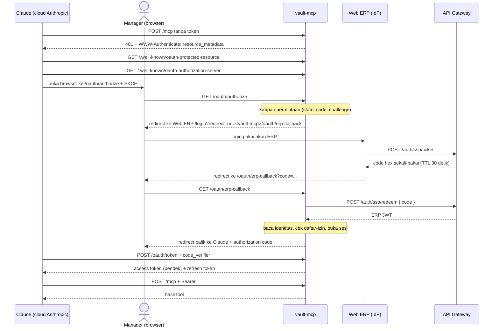

## Deskripsi

*MCP server yang membuka vault `architecture-draft` untuk Claude, supaya management bisa membaca sistem yang sudah terdokumentasi dan menuangkan kebutuhan baru langsung dari Claude Desktop / claude.ai tanpa menyentuh Obsidian, git, maupun editor. Identitasnya menumpang SSO ERP yang sudah ada, dan setiap tulisan mendarat di vault sebagai commit git ber-author manager yang bersangkutan.*

- **Status**: ⚠️ **Irisan 1 merged ke `main`, BELUM di-deploy ke mana pun** (PR [#1488](https://github.com/bip-itteam-internal/bip-erp/pull/1488) + [#1489](https://github.com/bip-itteam-internal/bip-erp/pull/1489), 2026-08-27). Kode baca-saja lengkap dan terkunci 93 test, termasuk alur OAuth penuh lewat HTTP sungguhan dan klien MCP sungguhan. Tetapi ia **belum pernah dijalankan di mana pun**: `docker build` belum pernah berhasil dicoba, dan DNS, proxy host, serta sertifikat belum berdiri. Irisan 2 (tulis) dan 3 belum ada kode.
- ⛔ **#1488 di-merge sebelum `/review` sempat jalan, dan reviewnya menemukan tiga celah keamanan** yang semuanya lolos 74 test hijau: `redirect_uri` tak dicocokkan dengan daftar terdaftar, nol pembatasan laju, dan rotasi refresh token baca-lalu-tulis. Ditutup di #1489. Jangan men-deploy commit yang lebih tua dari itu.
- **Stack**: Go + [MCP Go SDK resmi](https://github.com/modelcontextprotocol/go-sdk) (Tier 1, dirawat bersama Google) + MongoDB (koleksi `mcp_sessions`). Transport **Streamable HTTP**.
- **Path di repo** (rencana): `bip-erp/services/vault-mcp/`, mengikuti pola `services/.template`.
- **Rute**: ⛔ **TIDAK lewat [[CORE - API Master Gateway]].** Dipaparkan langsung sebagai `https://mcp.bharatainternasional.com` lewat Nginx Proxy Manager (`bip-erp/infra/npm/`). Claude menyambung dari infrastruktur cloud Anthropic, bukan dari laptop pemakai, sehingga server wajib terjangkau internet publik.

## Kenapa service ini ada

Dokumentasi arsitektur tim tinggal di vault Obsidian yang hanya nyaman dibuka orang teknis. Management yang ingin tahu "sistem ini sebenarnya bekerja bagaimana", atau ingin menyampaikan "saya butuh yang seperti ini", harus lewat perantara seorang dev. Service ini menghapus perantara itu dari kedua arah: membaca vault sebagai jawaban, dan menulis kebutuhan baru sebagai dokumen.

Yang **tidak** dilakukan service ini: menjadi kalender kedua, menjadi tempat kebenaran kedua, atau menyalin isi vault ke penyimpanan lain. Ia hanya lapisan akses.

## Keputusan yang mengikat

Lima keputusan di bawah punya alasan yang lebih dalam daripada preferensi. Mengubahnya menuntut ADR, bukan sekadar sunting kode.

### 1. Server menerbitkan token OAuth sendiri, TIDAK meneruskan ERP JWT

Dua alasan yang keduanya mengikat:

- Spec MCP mewajibkan resource server memvalidasi bahwa token memang diterbitkan **untuk dirinya** (audience binding, [RFC 8707](https://www.rfc-editor.org/rfc/rfc8707.html)). ERP JWT tidak punya audience itu. Menerimanya berarti setiap ERP JWT yang bocor dari aplikasi lain mana pun langsung menjadi akses tulis penuh ke dokumentasi arsitektur, yaitu confused deputy dalam bentuk paling telanjang.
- Alur SSO ERP tidak menerbitkan refresh token dan JWT-nya ber-TTL 72 jam ([[CORE - SSO Flow]]). Meneruskannya apa adanya memaksa manager menyambungkan ulang connector tiap tiga hari.

ERP JWT tetap dipakai, tapi **sekali saja**, yaitu saat menukar identitas di langkah callback. Sesudah itu ia dibuang.

### 2. Tidak lewat API Gateway

Gateway menuntut ERP JWT pada `/api/*` dan membuang prefix `/api/<module>` sebelum meneruskan. Token yang dipegang Claude bukan ERP JWT (lihat keputusan 1), jadi menaruhnya di belakang gateway berarti melemahkan gateway demi satu konsumen. Service ini berdiri sebagai host sendiri.

### 3. Author commit adalah managernya, bukan bot

Setiap tulisan menjadi commit dengan `--author="Nama <email>"` yang diambil dari identitas ERP hasil redeem. Konsekuensinya langsung berguna: `git log` menjawab siapa menulis apa, `git blame` menjawabnya per baris, dan `git revert` membatalkannya tanpa merusak riwayat. Tidak ada mekanisme audit baru yang perlu dibangun atau dipelajari, karena git sudah melakukannya.

Ini juga satu-satunya pengaman yang ada. Keputusan pemilik: manager boleh menulis ke **seluruh** isi vault tanpa gerbang review. Yang menahan kesalahan bukan pencegahan, melainkan keterlacakan dan kemudahan membatalkan.

### 4. Service ini TIDAK PERNAH menulis ke `VAULT-INDEX.json`

Berkas itu tersentuh hampir tiap commit oleh banyak orang paralel, dan konfliknya sudah jadi kelas masalah tersendiri di tim ini (aturannya ada di `architecture-draft/.agent-kit/rules/team-memory.md`). Lagipula field `ringkasan` di dalamnya dihasilkan subagent, bukan sesuatu yang bisa dikarang server.

Konsekuensi yang harus ditutup: dokumen baru tulisan manager tidak akan punya entri index. Karena itu `search_notes` **wajib** menggabungkan dua sumber (lihat § Pencarian). Regenerasi index tetap lewat `/index-vault` yang dijalankan dev.

### 5. Daftar-izin `employee_id` eksplisit, bukan diturunkan dari `system_roles`

Diperiksa di `/oauth/erp-callback`, sehingga yang tidak berhak ditolak dengan pesan jelas pada saat login, bukan gagal diam-diam saat memanggil tool. (Desain awal menaruhnya di `/oauth/authorize`; saat implementasi ternyata di titik itu identitas pemakainya belum diketahui, karena `employee_id` baru ada setelah redeem. Maksudnya tetap sama: menolak selagi orangnya masih di browser.) Diperiksa **ulang** saat refresh token dan tiap panggilan MCP, karena access token hidup satu jam dan refresh 30 hari, sehingga tanpa itu pencabutan akses baru terasa sejam sampai sebulan kemudian. Alasan tidak memakai RBAC yang sudah ada: di sini salah izin berarti orang yang tidak dimaksud bisa menyunting dokumentasi arsitektur, dan daftar nama yang bisa dibaca mata jauh lebih mudah diaudit daripada aturan role berlapis. Jumlah managernya sedikit, jadi ongkos memeliharanya kecil.

## Alur autentikasi

Menumpang penuh pada SSO ERP. **Tidak ada perubahan di `api-gateway` maupun `erp-frontend`**, karena [`erp-frontend/src/app/login/page.tsx:70`](https://github.com/bip-itteam-internal/erp-frontend/blob/main/src/app/login/page.tsx#L70) sudah mengizinkan redirect ke setiap host berakhiran `.bharatainternasional.com`, dan backend `ticket`/`redeem` memang agnostik aplikasi ([[CORE - SSO Flow]] § Implementasi Login Redirect).

**Client OAuth didaftarkan lebih dulu** (client ID + secret ditempel di pengaturan connector), sehingga Dynamic Client Registration tidak perlu dibangun.

**Yang disimpan** di koleksi `mcp_sessions`: identitas ERP hasil redeem (`employee_id`, nama, email, `system_roles`, `department`, `company_id`), refresh token, dan TTL index. Access token berumur pendek dan tidak disimpan.

⚠️ **Manager tetap harus mengetik password sekali saat menyambungkan connector**, walau sedang login di Web ERP, karena halaman login ERP memaksa logout saat di-mount ([[CORE - SSO Flow]] § Catatan & Keterbatasan). Terjadi sekali per beberapa bulan; sengaja tidak ditambal di lingkup ini.

## Endpoint (Sudah Diimplementasikan)

⚠️ **Tidak ada satu pun yang lewat `/api/<module>/*`.** Service ini dipaparkan langsung, jadi path di bawah adalah path publik apa adanya.

| Endpoint | Auth | Fungsi |
|---|---|---|
| `GET /.well-known/oauth-protected-resource` | publik | Metadata RFC 9728. Juga dilayani di `.../oauth-protected-resource/mcp` karena klien berbeda menebak berbeda |
| `GET /.well-known/oauth-authorization-server` | publik | Metadata RFC 8414. Hanya mengumumkan `S256` |
| `GET /oauth/authorize` | publik, ber-batas laju | Memeriksa client, `redirect_uri` terdaftar, dan PKCE; lalu melempar ke halaman login ERP |
| `GET /oauth/erp-callback` | publik, ber-batas laju | Menukar SSO code jadi identitas, memeriksa daftar-izin, menerbitkan authorization code |
| `POST /oauth/token` | client_secret, ber-batas laju | `authorization_code` dan `refresh_token` |
| `POST /mcp` | Bearer, ber-batas laju | Endpoint MCP Streamable HTTP |
| `GET /health` | publik | Hanya `{"status":"ok"}`; sengaja tidak menyebut keadaan internal apa pun |

## Pengamanan (dari temuan review #1489)

Ketiganya lolos test hijau di #1488, jadi ketiadaannya tidak terlihat dari mana pun.

- **`redirect_uri` dicocokkan PERSIS** terhadap `VAULT_MCP_REDIRECT_URIS`. Memeriksa bentuknya saja (https, absolut, tanpa fragment) menerima host mana pun, sehingga siapa pun yang tahu `client_id` bisa membuat server ini mengirim authorization code ke tujuan pilihannya. Bukan berawalan: `…/auth_callback.evil.example` berawalan sama dengan nilai yang sah.
- **Pembatasan laju per alamat klien** di seluruh endpoint OAuth dan MCP, plus batas keras antrean permintaan authorize. `X-Forwarded-For` dipercaya, dan itu aman **karena** compose memakai `expose` bukan `ports`; bila suatu saat container ini dipaparkan dengan `ports`, asumsi itu batal.
- **Rotasi refresh token atomik**, dengan sidik lama ikut di filter. Sesi menyimpan sidik yang baru dipensiunkan supaya pemakaian ulang bisa **dikenali**, bukan sekadar gagal "tidak dikenal". Pemakaian ulang mencabut **seluruh** sesi: menolak permintaannya saja membiarkan pencuri dan korban bergantian memperpanjang sesi tanpa ada yang menyadarinya.

## Permukaan tool

| Tool | Fungsi |
|---|---|
| `search_notes` | Cari dokumen relevan, balas path + judul + ringkasan |
| `read_note` | Baca isi satu dokumen beserta backlink-nya |
| `list_notes` | Daftar dokumen per area/folder, untuk orientasi |
| `write_note` | Buat dokumen baru atau timpa penuh |
| `patch_note` | Sunting satu bagian saja (tambah/ganti di bawah heading tertentu) |
| `delete_note` | Hapus dokumen |

`patch_note` sengaja terpisah dari `write_note` dan diperkirakan jadi yang paling sering dipakai: menambah satu paragraf ke satu heading jauh lebih kecil risikonya daripada menimpa dokumen 40 KB dan berharap seluruh isinya tersalin utuh.

### Pencarian

`VAULT-INDEX.json` menyimpan ringkasan, kata kunci, dan tautan untuk **306** dokumen, dan itu bahan pencarian yang jauh lebih baik daripada grep mentah. Tetapi vault berisi **535** berkas `.md`, jadi index saja membuat 229 dokumen tidak pernah muncul. `search_notes` **wajib** menggabungkan dua sumber: index untuk yang punya ringkasan, pemindaian isi langsung untuk sisanya. Selisih ini akan terus melebar karena keputusan 4.

## Alur tulis

Satu penulis pada satu waktu (mutex proses), lalu:

1. `git pull --rebase origin main`
2. Tulis berkasnya
3. `git add <nama berkas persis>`, ⛔ **bukan** `git add -A`, sesuai konvensi vault
4. `git commit --author="Nama Manager <email dari ERP>"`
5. `git push origin main`; bila tertinggal, ulang dari langkah 1, maksimal tiga kali

⛔ **Tidak ada `git reset --hard` di mana pun dalam alur ini.**

### Penanganan galat

| Keadaan | Perilaku |
|---|---|
| Push gagal tiga kali | Commit dibiarkan ada secara lokal; tool membalas apa adanya bahwa perubahan tersimpan tapi belum terdorong. Tulisan berikutnya dimulai `pull --rebase` sehingga commit tertunda ikut terdorong sendiri |
| Rebase konflik (dev menyunting dokumen yang sama) | Tool **gagal** menyebut path-nya dan meminta baca ulang. Server **tidak** menggabungkan sendiri: auto-merge pada dokumen acuan arsitektur melahirkan teks yang terbaca wajar tapi isinya campuran dua maksud |
| Gateway ERP tidak menjawab saat redeem | 503 dengan pesan yang menyebut penyebabnya, bukan gagal diam |
| Berkas mengandung byte NUL | `read_note` **menolak** dengan pesan yang menyebutkannya. Berkas semacam itu digolongkan biner oleh git dan dilewati ripgrep, jadi mengembalikan isinya diam-diam akan menyesatkan |
| Path mengandung `../` | Dinormalisasi lalu ditolak bila keluar dari folder vault |
| Tulis ke `.git/` atau `.obsidian/` | Ditolak. Ini pengecualian **mekanis**, bukan kebijakan: yang pertama merusak repo, yang kedua merusak aplikasi Obsidian. Seluruh isi vault selain keduanya terbuka penuh |

## Irisan

Tiap irisan berakhir pada sesuatu yang bisa dibuktikan hidup, bukan pada kode yang selesai ditulis.

**Irisan 1, sambungan dan identitas, baca saja.** DNS, proxy host di NPM, sertifikat, container jalan, seluruh alur OAuth berfungsi, plus `search_notes` / `read_note` / `list_notes`. Bagian tersulit dan paling banyak hal di luar kode ada di sini, dan risikonya ke vault nol karena belum ada tulis sama sekali.

**Irisan 2, tulis.** `write_note`, `patch_note`, alur git, atribusi author.

⛔ **Prasyarat irisan 2 yang ditemukan saat menulis irisan 1: ERP JWT TIDAK punya klaim email.** Klaim yang benar-benar diterbitkan gateway hanya `employee_id`, `full_name`, `username`, `system_roles`, `department`, `position`, `company_id` (`shared-library/auth/jwt.go` `SignJWT`). Author commit menuntut alamat email, dan **mengarangnya dari username akan masuk permanen ke riwayat git tanpa bisa dibedakan dari alamat yang benar**. Irisan 2 wajib mengambilnya dari employee-service lebih dulu, atau memutuskan secara sadar memakai bentuk `noreply` yang jelas-jelas bukan alamat orang.

**Irisan 3, sisanya.** `delete_note`, ditambah satu **MCP prompt** (`curahkan-kebutuhan`) yang memandu manager menuangkan keinginannya jadi struktur konsisten: masalah yang dirasakan, siapa yang terdampak, keadaan sekarang, yang diharapkan. Ini justru inti permintaan aslinya, tapi baru masuk akal setelah tulis terbukti jalan.

## Cara Verifikasi

Tiga lapis. Dua yang pertama sengaja **tidak** dianggap cukup.

1. **Unit test** untuk logika murni: normalisasi path, penggabungan hasil pencarian dua sumber, pemilihan heading di `patch_note`.
2. **Test yang melewati lapisan HTTP sungguhan**, bukan memanggil fungsi handler langsung. Di repo ini sudah terbukti 183 test hijau berdampingan dengan fitur yang mustahil dipakai, karena cacatnya ada di lapisan pengikatan request dan bukan di logikanya.
3. **Klien sungguhan.** Claude Code bisa jadi klien MCP remote pertama (`claude mcp add --transport http`), jadi seluruh alur OAuth dibuktikan dari mesin dev sebelum melibatkan seorang manager pun. Baru sesudah itu claude.ai.

Gerbang per irisan:

- **Irisan 1**: satu manager sungguhan menyambung dari claude.ai, bertanya tentang sistem, dan dijawab bersumber vault.
- **Irisan 2**: commit ber-author manager muncul di GitHub dan turun ke worktree dev lewat `git pull` biasa.
- **Irisan 3**: satu curahan kebutuhan utuh mendarat sebagai dokumen berstruktur.

⛔ `docker ps` hijau dan `/health` 200 **tidak dihitung sebagai bukti apa pun** di sini.

## Yang perlu disiapkan di luar kode

- Record DNS `mcp.bharatainternasional.com`
- Proxy host + sertifikat Let's Encrypt di Nginx Proxy Manager (`bip-erp/infra/npm/`)
- Deploy key repo vault dengan **hak tulis**, plus `user.name` / `user.email` git di container
- Env: daftar-izin `employee_id`, `JWT_SECRET`, alamat gateway, alamat Web ERP, client ID + secret OAuth
- Deploy prod **dijalankan manusia**, sesuai konvensi tim. Agent menyiapkan daftar container, urutan, perintah siap tempel, dan gerbang verifikasinya

## Di luar lingkup

- Plugin `obsidian-local-rest-api` yang terpasang di vault **tidak dipakai**. Plugin itu hidup di dalam aplikasi Obsidian di laptop dev; menyambungkannya membuat MCP di internet bergantung pada laptop yang menyala.
- Tidak ada UI. Satu-satunya antarmuka adalah Claude.
- Tidak ada `move_note` / rename di lingkup awal: memindahkan dokumen menuntut pembaruan seluruh tautan wiki yang menunjuk padanya, dan itu masalah tersendiri.
- Tidak menyentuh RBAC ERP maupun `system_roles`.

## Dependensi & Integrasi

| Bergantung pada | Untuk apa | Bila mati |
|---|---|---|
| [[CORE - API Master Gateway]] | `POST /auth/sso/redeem` saat menukar identitas | Penyambungan connector baru gagal; sesi yang sudah ada tetap jalan |
| [[APP - Web ERP]] | Halaman login tempat manager memasukkan kredensial | Sama: hanya penyambungan baru yang terhalang |
| Repo `architecture-draft` (git) | Sumber isi vault, di-`pull` berkala | Tool **gagal** menyebut umur data setelah melewati ambang, bukan menjawab dengan dokumen lama |
| MongoDB `vault-mcp-mongo-db` | Koleksi `mcp_sessions` | Service menolak naik; penjaga `mongodb.DB == nil` menurunkan kelasnya jadi pesan yang bisa dibaca |
| Nginx Proxy Manager (`bip-erp/infra/npm`) | Ingress + TLS | Tak terjangkau dari internet |

**Tidak** bergantung pada: RBAC ERP, `system_roles`, notification-service, calendar-service.

## Dokumen Terkait

- [[RUN - Menyambungkan Claude ke Vault MCP]], cara memakai dan memberi akses
- [[CORE - SSO Flow]], alur `ticket`/`redeem` yang ditumpangi
- [[CORE - API Master Gateway]], sengaja **tidak** dilewati, alasannya di § Keputusan 2
- [[ADR - 0003 SSO-only Gateway]], dasar keputusan satu identitas karyawan untuk semua aplikasi
- [[IT - Server, VMs and Databases]], VPS prod tempat container berdiri
