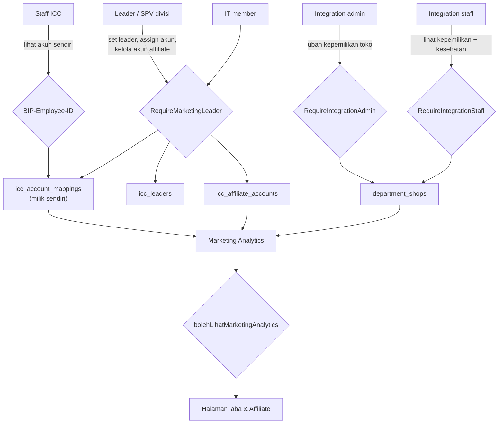
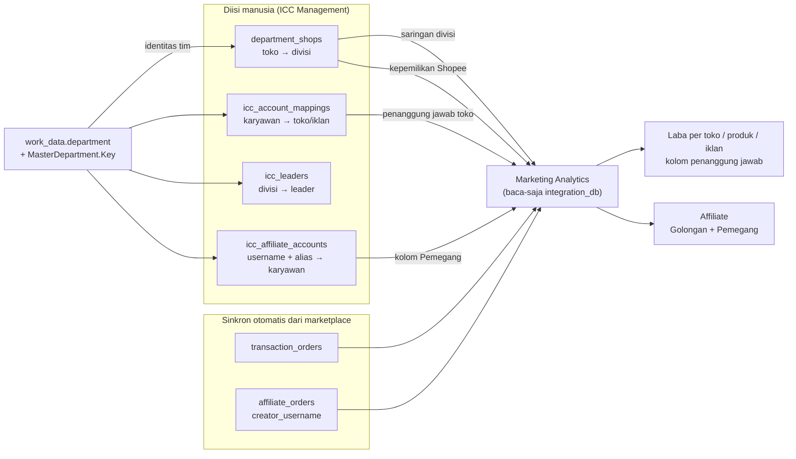

**Status**: 🟡 Diusulkan (2026-08-11) — belum dieksekusi. Seluruh angka di bawah terverifikasi langsung dari produksi pada tanggal yang sama. Menyusul [[ADR - 0030 RBAC Tiga Sumbu dengan Hak Menempel di Posisi]] dan [[ADR - 0043 Peran Sistem Diturunkan dari Jabatan]]; **tidak** menggantikan keduanya.

## Context

Pertanyaan "toko ini milik tim mana" hari ini dijawab oleh **tiga mekanisme yang tidak saling tahu**, dan tak satu pun dokumen menyatukannya. Ketiganya ditemukan saat menelusuri menu yang terasa redundan (Teams vs ICC Management).

### Tiga gagasan "tim" yang hidup bersamaan

| Kandidat | Keadaan produksi 2026-08-11 | Dipakai siapa |
|---|---|---|
| `work_data.department` (nama) | terisi penuh | `icc_account_mappings.team`, `icc_leaders.team`, `icc_affiliate_accounts.team`, header `BIP-Department`, isolasi data SPV |
| `marketing_teams` + `team_shops` | **3 tim** (`aris`, `BH`, `GB-KY`), **1 anggota**, **5 toko** (2 TikTok, 3 Shopee) | saringan divisi & penanggung jawab toko di [[Microservices - Marketing Analytics Service]] |
| `IncentiveOrg` (TIM ADE / TIM RIDO) | **koleksinya tidak ada** di `insentive_db` | rollup insentif (kode ada, data tak pernah diisi) |

Nama di `marketing_teams` membuktikan ia bukan department: `GB-KY` adalah gabungan dua brand, dan `aris` adalah nama orang yang dijadikan tim.

### Pondasi yang sudah dibangun tetapi mati suri

`integration_db.department_shops` **sudah ada** berikut entitas, endpoint (`GET/POST/DELETE /department-shops`), dan laporan kesehatan (`GET /department-shops/kesehatan` — toko yatim & pemetaan sisa). Semantiknya persis yang dibutuhkan: **satu toko milik satu departemen**, ditegakkan index unik `(channel, shop_id)`, dengan alasan yang ditulis di entitasnya — satu toko yang dimiliki dua departemen membuat omzetnya terhitung dua kali dan menaikkan skor dua supervisor sekaligus.

Kenyataannya: **0 dokumen, tanpa UI, tanpa satu pun pembaca**. Ia terbangun tetapi tak pernah tersambung — dan karena tak terdokumentasi di vault, orang berikutnya hampir pasti membangun sumber keempat.

### Empat fakta yang membentuk keputusan ini

1. **Kunci yang dipakai adalah NAMA, bukan key.** `MasterDepartment` **sudah punya** field `Key` stabil, tetapi `work_data.department` dan seluruh `icc_*.team` menyimpan namanya. Ini persis kelemahan yang [[ADR - 0030 RBAC Tiga Sumbu dengan Hak Menempel di Posisi]] selesaikan untuk posisi lewat `PositionKey`: tanpa key stabil, rename memutus kaitan tanpa jejak.
2. **Kopling nama sudah terbukti membusuk di sini.** 2026-08-07 ditemukan **12 mapping aktif** tersimpan sebagai `team: "Tech Development"` — department akun IT yang meng-assign, bukan department karyawannya. Akibatnya SPV Kyura dan Beauty Hacks tidak menemukan datanya sama sekali, karena daftar mereka disaring `?team=`. Sudah diperbaiki, tetapi membuktikan kelas kegagalannya nyata.
3. **Mencabut Teams begitu saja merusak dua hal.** `team_shops` adalah **satu-satunya sumber Shopee** untuk kolom penanggung jawab toko (3 dari 5 barisnya Shopee), dan `marketing_teams` memasok **saringan divisi** yang juga dipakai halaman Affiliate. `icc_account_mappings` punya `shopee_shop_id`, tetapi **kosong di seluruh baris aktif**.
4. **Ada tiga ruang-nama string yang mudah tertukar**: nama department (`"Kyura"`), kode modul `system_roles` (`"kyura"` — bukan nama departemen, pemetaannya di `deptKeyToNames`), dan nama tim bebas (`"GB-KY"`).

## Decision

**Satu identitas tim untuk seluruh data marketing: DEPARTMENT, dengan `department_key` sebagai kunci.**

1. **Kunci identitas = `department_key`** (slug stabil dari `MasterDepartment.Key`). Nama department tetap disimpan **hanya untuk tampilan**, tidak pernah dipakai mencocokkan. Alasannya sama dengan `PositionKey` di [[ADR - 0030 RBAC Tiga Sumbu dengan Hak Menempel di Posisi]].
2. **Kode modul `system_roles` DILARANG dipakai sebagai kunci identitas tim.** Ia menyatakan hak akses modul, bukan unit organisasi.
3. **Kepemilikan toko = `department_shops`** (satu toko satu departemen). `marketing_teams` dan `team_shops` dipensiunkan setelah pembacanya pindah.
4. **Penugasan orang → akun toko = `icc_account_mappings`** (satu toko satu pemegang aktif). Ini pertanyaan **berbeda** dari kepemilikan divisi dan tetap terpisah.
5. **Kepemilikan akun affiliate = `icc_affiliate_accounts`**, `employee_id` opsional (kosong = belum ditugaskan, bukan akun luar). Lihat [[Sales - ICC Affiliate Mapping]].
6. **Keanggotaan tim TIDAK disimpan di mana pun** — diturunkan dari `work_data.department`. `team_members` (1 baris) dibuang.
7. **Sub-tim di dalam divisi DITOLAK untuk sekarang.** Bila kelak dibutuhkan, bentuknya wajib entitas tim ber-ID stabil **dengan induk `department_key`** — bukan nama bebas seperti `marketing_teams`. Syarat memperkenalkannya: ada lebih dari satu tim nyata dalam satu divisi yang perlu dibedakan atribusinya, dan pemiliknya bersedia merawat datanya.
8. **Migrasi wajib expand → migrate → contract**, dengan gerbang cakupan (lihat §Migrasi). Big-bang swap dilarang.

### Aktor dan wewenang

Tidak ada gerbang baru yang diciptakan ADR ini; semuanya memakai yang sudah ada.

| Aktor | Boleh | Gerbang | Sumber data |
|---|---|---|---|
| **Staff ICC** | melihat performa akun **miliknya sendiri** | tanpa `RequireMarketingLeader`; disaring `BIP-Employee-ID` | `GET /icc/mappings/me` |
| **Leader team** (posisi leader / `insentive: adv_leader`) | set/ganti leader, assign akun, kelola akun affiliate **teamnya** | `RequireMarketingLeader` | `/icc/*` |
| **SPV divisi** (`kyura`/`beauty_hacks`: supervisor·admin) | idem, terbatas teamnya | `RequireMarketingLeader` | `/icc/*`, disaring `?team=` |
| **Integration staff** | **melihat** kepemilikan toko + laporan kesehatan | `RequireIntegrationStaff` | `GET /department-shops`, `/kesehatan` |
| **Integration admin** | **mengubah** kepemilikan toko | `RequireIntegrationAdmin` | `POST`/`DELETE /department-shops` |
| **IT member** | super-akses lintas team | `RequireMarketingLeader` (memuat `it`) | semua di atas |
| **Pembaca Marketing Analytics** | membaca laba & performa | `bolehLihatMarketingAnalytics` = modul `integration` **atau** marketing leader | `marketing-analytics/*` |

**Gerbang tulis kepemilikan toko tetap `RequireIntegrationAdmin` walau UI-nya pindah ke ICC Management.** Memindahkan tombol tidak boleh diam-diam melebarkan hak: `RequireMarketingLeader` jauh lebih luas, dan kepemilikan toko menentukan ke divisi mana omzet dihitung.

### Peta data: dari toko dan akun sampai layar

Empat pertanyaan berbeda, empat koleksi, tanpa tumpang-tindih:

| Pertanyaan | Koleksi | Kardinalitas | Diisi lewat |
|---|---|---|---|
| Toko ini **milik divisi mana**? | `department_shops` | 1 toko → 1 departemen | ICC Management (kartu team) |
| Toko/iklan ini **dipegang siapa**? | `icc_account_mappings` | 1 toko → 1 pemegang aktif | ICC Management → tab Toko & Iklan |
| Divisi ini **leadernya siapa**? | `icc_leaders` | 1 team → 1 leader aktif | ICC Management → Set Leader |
| Akun affiliate ini **milik siapa**? | `icc_affiliate_accounts` | banyak ↔ banyak, pemegang opsional | ICC Management → tab Akun Affiliate |

**Dua sumbu di halaman Affiliate yang sering tertukar, dan tidak boleh disatukan:**

- `collaboration_type` — sifat **order**-nya: target collaboration (kita undang) vs open collaboration (kreator datang sendiri). Datang dari TikTok.
- `kepemilikan` — siapa **karyawan** di balik username. Datang dari `icc_affiliate_accounts`.

Persilangan keduanya yang bernilai: akun kita yang ordernya masih open collab berarti belum didaftarkan target collab di toko itu; username tak terdaftar yang ordernya target collab adalah kandidat akun internal yang belum didata.

## Migrasi

Urutannya mengikat. Mencabut lebih dulu tidak menghasilkan error — hanya kolom yang diam-diam kosong.

1. **Expand** — tambahkan `department_shops` sebagai sumber **tambahan** di `penanggung_jawab.go` dan `divisi.go`, mengikuti pola `indeksICCGabungan` yang sudah berlaku: *sumber menambah, tidak menimpa*; satu sumber gagal, sumber lain tetap dipakai. Selama fase ini `team_shops` tetap hidup, sehingga mengisi koleksi baru tidak dapat merusak apa pun.
2. **Migrate** — pindahkan 5 baris `team_shops` ke `department_shops`, memakai `shop_id` + `channel` (**bukan** nama toko: nama di produksi ada yang berspasi di ujung dan ada yang beda hanya huruf besar-kecil). Petakan tiga nama tim ke department, dan **putuskan** nasib `aris` — ia data sampah, bukan tim.
3. **Gerbang** — cakupan penanggung jawab toko **tidak boleh turun** dari **51,2% (15 toko)**. Verifikasi lewat `/department-shops/kesehatan` (toko yatim & pemetaan sisa). Gagal memenuhi ini = migrasi belum selesai, bukan alasan melanjutkan.
4. **Contract** — baru cabut `marketing_teams`, `team_shops`, `team_members`, dan menu Teams.
5. **Kunci stabil** — tulis `department_key` berdampingan dengan nama, lalu pindahkan pencocokan ke key. Boleh menyusul setelah langkah 4, tetapi jangan dilupakan: selama kuncinya nama, kelas kegagalan "Tech Development" tetap terbuka.

**Laporan ketidakcocokan wajib permanen di layar**, bukan pemeriksaan sekali jalan — entitas `department_shops` sendiri mensyaratkannya. Dua pemeriksaan yang saling menguatkan: toko terotorisasi yang belum dipetakan (`/kesehatan`), dan departemen toko yang berbeda dari department pemegangnya di `icc_account_mappings`.

## Consequences

**Diterima:**

- **Satu menu hilang (Teams).** Yang tersisa dari fungsinya — pemetaan toko → divisi — pindah ke kartu team ICC Management, yang memang sudah per-departemen.
- **Nilai saringan divisi berubah** dari nama tim bebas jadi nama departemen. Tautan atau bookmark yang menyimpan nilai lama berhenti cocok.
- **Tim lintas-brand seperti `GB-KY` tidak lagi dapat dinyatakan** sampai keputusan #7 dibuka. Ini pembatasan sadar, bukan kelalaian.
- **Kopling antar-service tetap longgar**: `department_shops` menyimpan nama/kunci departemen milik employee-service, bukan referensi keras. Itu sebabnya laporan ketidakcocokan jadi bagian wajib fitur, bukan tambahan.
- **Sinkronisasi identitas menuntut disiplin rename.** Mengganti nama departemen di HRIS harus diikuti pemeriksaan kesehatan; dengan `department_key` dampaknya hilang, tanpa itu tetap ada.

**Risiko utama:** mencabut `team_shops` sebelum pembacanya pindah akan mengosongkan saringan divisi **dan** menghapus satu-satunya kepemilikan toko Shopee. Gejalanya bukan halaman error, melainkan kolom yang berbunyi "belum ditetapkan" — terbaca seperti pekerjaan tim yang belum selesai, bukan seperti regresi yang kita sebabkan. Gerbang cakupan di §Migrasi ada khusus untuk menangkap ini.

**Yang TIDAK diputuskan di sini:**

- **Migrasi permission-set modul `integration`** — modulnya belum berkatalog dan [[ADR - 0030 RBAC Tiga Sumbu dengan Hak Menempel di Posisi]] menempatkannya paling akhir karena 241 rutenya belum tergerbang. Selama itu, gerbang di tabel aktor tetap memakai `system_roles`.
- **Struktur tim untuk insentif** (`IncentiveOrg`) — ranah modul insentif; koleksinya belum pernah terisi di produksi.
- **Pengisian `shopee_shop_id` di `icc_account_mappings`** — pekerjaan data tim marketing, bukan perubahan kode.

## Dokumen Terkait

- [[ADR - 0030 RBAC Tiga Sumbu dengan Hak Menempel di Posisi]] — asal pelajaran "tanpa key stabil, rename memutus akses tanpa jejak"
- [[ADR - 0043 Peran Sistem Diturunkan dari Jabatan]] — jembatan sementara peran dari jabatan; tidak diubah ADR ini
- [[ADR - 0002 Database-per-Service]] — dasar pembacaan lintas-database baca-saja
- [[Microservices - Integration Service]] — pemilik `department_shops`, `icc_*`, `marketing_teams`
- [[Microservices - Marketing Analytics Service]] — konsumen; cakupan penanggung jawab & saringan divisi
- [[Sales - ICC Account Manager Mapping]] · [[Sales - ICC Affiliate Mapping]] — fitur yang memakai identitas tim ini
