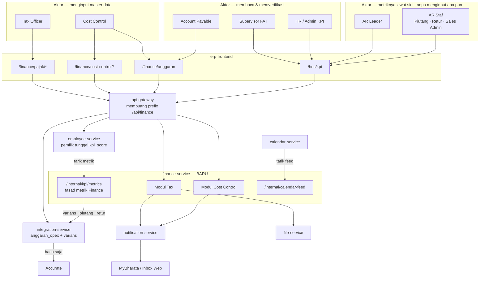
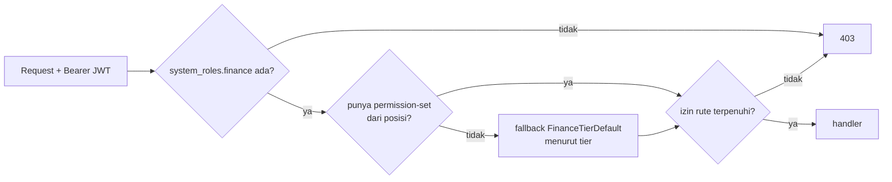
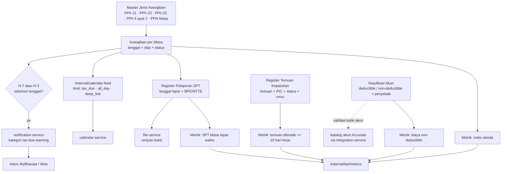
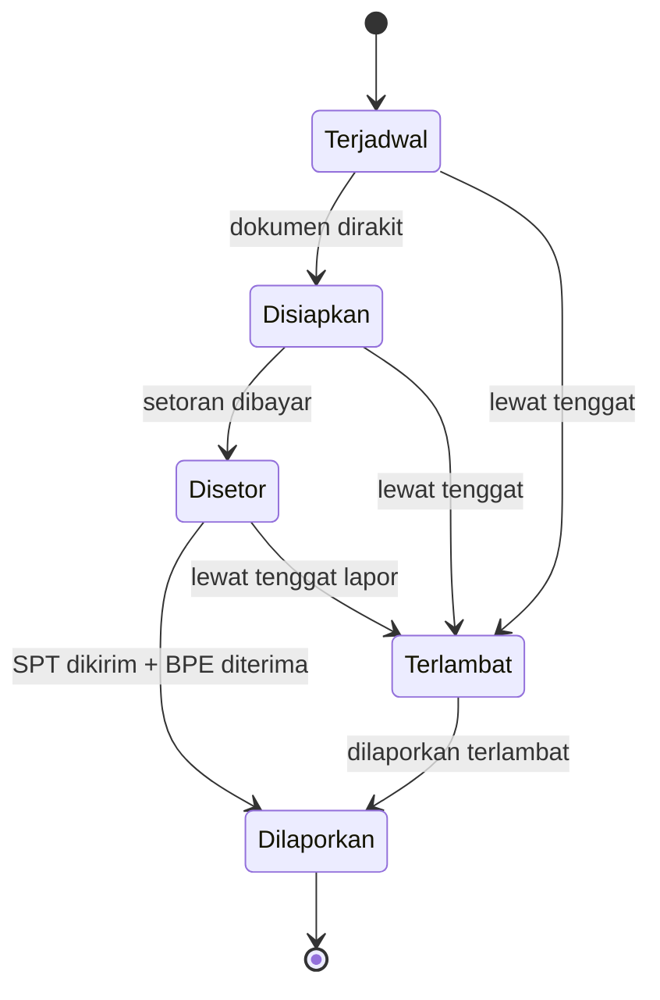
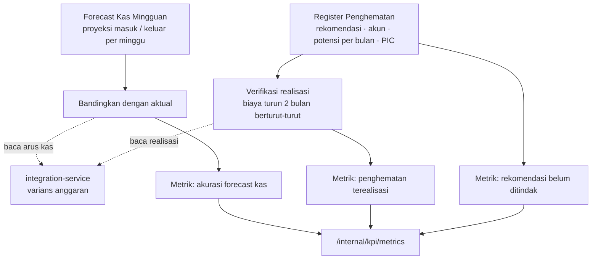
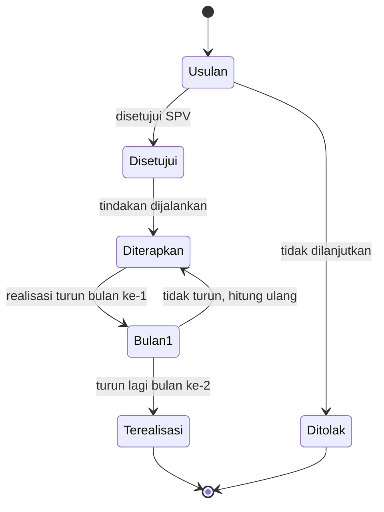
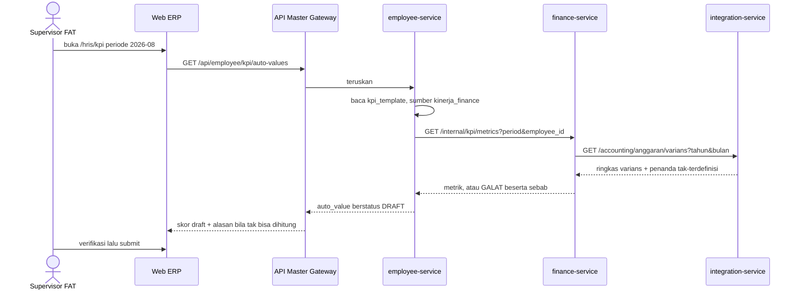
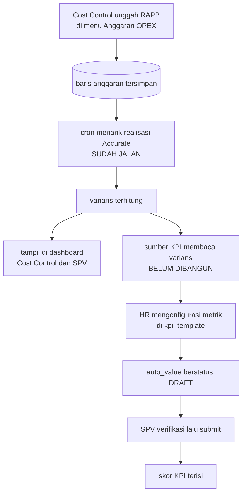

**Status**: ⚠️ **Implemented (ada catatan)** — **Fase 0 LIVE di dev & prod** sejak 2026-08-13, **daftar akun OPEX ditegakkan kode** dan metrik varians OPEX **sudah terisi otomatis** di KPI, serta **modul Cost Control Fase 1a (rekomendasi efisiensi, bobot 20%) sudah ada**, **Fase 1b (akurasi forecast kas mingguan, bobot 15%) sudah ada**, **metrik Admin & Non-Ops YoY (bobot 10%) sudah ada**, dan **registry Beban Software manual ("Opex Marketing" — breakdown per-item & per-PIC, pelengkap akun Accurate yang tak dipecah per vendor) sudah ada**. ⚠️ **Ketiga yang disebut terakhir mendarat di [[Microservices - Integration Service]], BUKAN di service ini** — beda dari Fase 1a yang memang di sini; lihat catatan gap di §Ruang Lingkup. Tersisa 🟡: modul Tax — lihat bab keputusan.

## Deskripsi

*Rancangan service baru yang menampung **master data yang hari ini tidak punya rumah di ERP mana pun** — kewajiban pajak, pelaporan SPT, temuan kepatuhan, rekomendasi efisiensi, dan forecast kas. Tujuannya bukan menambah dashboard, melainkan **memasok angka yang membuat KPI divisi FAT bisa terisi sendiri**. Master anggaran OPEX yang sudah ada di [[Microservices - Integration Service]] **tidak dimigrasi**; service ini membacanya lewat HTTP.*

- **Stack**: Go + Fiber + MongoDB (pola `calendar-service`: flat `package main`)
- **Path di repo**: `bip-erp/services/finance/` — ✅ **ada** (Fase 0: `main.go`, `routes.go`, `db.go`, Dockerfile, blok compose + `finance-mongo-db`, `FINANCE_MODULE_URL` di peta gateway). Terverifikasi lewat gateway: `GET /api/finance` membalas identitas service di **prod dan dev**
- **Status**: ⚠️ Kerangka live, modul menyusul — keputusan Finance **#1, #2, #4 sudah dijawab** (2026-08-13) dan #1 sudah ditegakkan kode; sisanya masih menunggu (lihat bab tersendiri di bawah)
- **Konsep induk**: [[Finance - Big Pictures]] · **Konsumen tampilan**: [[Finance - Dashboard per Posisi (FAT)]]

## Latar Belakang

Audit KPI Finance (dibaca langsung dari `employee_db` produksi, 2026-08-10) menemukan: **0 dari 66 metrik Finance terisi otomatis**, sementara se-perusahaan hanya 3 yang otomatis dan ketiganya milik Tech Development. Mesin skornya sendiri sudah hidup sejak 1 Agustus 2026 — lihat [[HRIS - Otomasi Skor KPI]].

Tiga penyebab yang bisa ditutup service ini, beserta bobot KPI yang dibukanya:

| Penyebab | Metrik yang terhenti | Bobot | Posisi terdampak |
|---|---|---:|---|
| **Anggaran tidak tersimpan di ERP mana pun** | Varians OPEX ≤ ±5%; Rasio EBITDA; Cashflow terpantau; Varians OPEX (Tax) | **0,85** | Cost Control, SPV FAT, Account Payable, Tax Officer |
| **Tidak ada tracker pajak / audit** | SPT Masa tepat waktu; laporan pajak diperiksa; audit internal; audit internal (Senior Acc) | **0,40** | Tax Officer, Senior Accounting |
| **Tidak ada modul forecast kas** | Forecast cashflow ≥95%; Return on Operation | **0,25** | Cost Control, SPV FAT |

Bobot yang sama juga menahan 3 metrik General Affair (0,55) yang bergantung pada master anggaran yang sama — lihat [[HRIS - Matriks KPI per Departemen]].

Bukti bahwa datanya **ada tetapi di luar sistem**: tiga rekap bulanan yang disusun manual oleh Cost Control (`Juli_Realisasi OPEX`, `Juli_Penurunan OPEX Cost Driver`, `Juli_Cashflow`) berisi persis ketiga metrik itu — termasuk **Budget Juli Rp 6.684.636.073** yang tidak pernah masuk ERP maupun Accurate.

## Ruang Lingkup / Cakupan

**Masuk lingkup**

| Modul | Isi | Membuka |
|---|---|---|
| **Tax** | Master jenis kewajiban · kewajiban per masa · register pelaporan SPT · register temuan kepatuhan · klasifikasi akun deductible | bobot 0,40 |
| **Cost Control** | Register penghematan (✅ Fase 1a, di service ini) · ~~forecast kas mingguan~~ (✅ ada, tapi bukan di sini — lihat catatan) | bobot 0,25 |
| **Jembatan KPI** | `GET /internal/kpi/metrics` + satu sumber baru `kinerja_finance` di employee-service | mengaktifkan semuanya |
| **Jalur entri OPEX** | Template unduh, salin periode, resolusi nama akun — **di integration-service** | bobot 0,85 |

> ⚠️ **Gap rencana vs implementasi (ditemukan 2026-08-19).** Baris "forecast kas mingguan" di atas menyiratkan fitur itu dibangun di finance-service — pada praktiknya **tidak**. Fase 1b (breakdown mingguan), metrik Admin & Non-Ops YoY, dan registry Beban Software manual ("Opex Marketing") semuanya dibangun di [[Microservices - Integration Service]], bergabung dengan grup `/accounting` yang sudah ada di sana (`anggaran`, `anggaran/mingguan`, `admin-nonops`, `opex-manual` — lihat [[API - Integration Service]]). Alasannya konsisten dengan baris "Jalur entri OPEX" di atas: sumber datanya (Accurate, master anggaran OPEX) sudah hidup di integration-service, dan menaruh fitur turunannya di finance-service berarti satu panggilan HTTP lintas-service ekstra untuk setiap pembacaan — biaya yang sama yang sudah diakui dok ini sendiri di §Lingkup jembatan KPI ("satu konektor keluar, bukan dua"). Pola ini terbukti berulang tiga kali berturut-turut, jadi kemungkinan besar akan terus begitu untuk fitur Cost Control turunan Accurate berikutnya — pertimbangkan itu sebagai default, bukan pengecualian, saat merencanakan fitur baru di area ini.

### Lingkup jembatan KPI — keputusan: fasad seluruh departemen Finance

`GET /internal/kpi/metrics` melayani **seluruh metrik departemen Finance**, bukan hanya metrik dari master milik service ini. Termasuk AR (piutang, retur) dan AP, yang datanya tetap milik [[Microservices - Integration Service]] — finance-service hanya **meneruskan**, tidak menghitung ulang.

Alasannya: satu konektor keluar dari employee-service, bukan dua.

> ⚠️ **Alasan itu melemah sejak 2026-08-11.** [[ADR - 0032 Kepemilikan kpi_score dan Batas Pengumpul Metrik]] kini mencatat bahwa ongkos yang dikhawatirkannya **tidak muncul** — tiap konektor hanya satu berkas `kpi_sumber_*.go` yang tak menyentuh berkas milik siapa pun — dan bahwa **apakah angka tiga masih pemicu yang bermakna sudah jadi TBD di ADR itu sendiri**. Bila pemicunya dicabut, opsi A (AR punya konektor sendiri langsung ke integration-service) jadi lebih bersih secara arsitektur, karena finance-service tak lagi menjadi perantara bagi data yang tidak dimilikinya maupun dihitungnya. Keputusan opsi B **ditinjau ulang** saat pemicu itu diputuskan.

**Tiga metrik sengaja DI LUAR fasad ini** — sumbernya bukan ranah Finance dan sudah punya jalurnya sendiri:

| Metrik | Sumbernya | Kenapa di luar |
|---|---|---|
| Ide inovasi (Kaizen) | `kaizen_ide_diajukan` / `kaizen_ide_diterapkan` di employee-service | Sudah terdaftar; lintas 10 departemen |
| Pertemuan 1-on-1 | belum ada modul di ERP mana pun | Lintas departemen, ranah HRIS |
| Monitoring Team | `skor_tim` di employee-service | Murni agregasi `kpi_score` terhadap `work_data`, tak menyentuh Finance |

### Tiga lapis rumus, dan yang mana boleh di sini

| Lapis | Contoh | Tempatnya |
|---|---|---|
| 1. Agregasi mentah | nilai piutang per bucket umur, saldo akun beban | Service pemilik datanya (integration) — **jangan ditulis ulang** |
| 2. Rumus metrik | `bucket >60 hari ÷ total AR × 100` | **employee-service**, di katalog metrik sumber — mengikuti preseden `kinerja_toko`, supaya mengganti rumus satu baris KPI cukup ubah konfigurasi tanpa deploy |
| 3. Rumus skor | metrik vs target → 0..100, reduksi, cap | `shared-library` — **mutlak**, tak boleh disentuh sumber mana pun |

Kontrak `SumberCuplikan` menyatakannya harfiah: *"Sumber tidak menghitung nilai dan tidak mengenal target."* finance-service memasok **komponen** (`piutang_lewat_60`, `total_ar`, `retur_lewat_14`, `varians_opex`, …); pembagian dan penilaiannya di luar sini.

### Metrik AR bersifat departemen, dan itu diterima

Endpoint AR (`/orders/piutang/summary`, `/accounting/receivables`) tidak punya dimensi karyawan, sehingga AR Leader dan ketiga AR Staf menerima **angka yang sama**. Ini **bukan cacat**: seluruh toko dikelola bersama oleh tim AR Sales, jadi tidak ada pembagian per orang yang bisa diukur. Pemetaan karyawan→toko seperti `icc_account_mappings` di [[Sales - ICC Account Manager Mapping]] **tidak diperlukan di sini**.

Konsekuensi yang diterima sadar: metrik AR menilai **kinerja tim**, bukan membedakan individu. Pembeda antar-orang harus datang dari metrik lain di templatnya. Bila kelak perlu dibedakan per orang, `TargetBerlaku` sudah mendukung `target_per_karyawan` — cukup lewat target, tanpa menyentuh metriknya.

Kesiapan teknis rumpun AR beserta endpoint dan celahnya ada di bab **Rumpun AR** di bawah.

**Di luar lingkup, beserta alasannya**

- **Migrasi `anggaran_opex` ke service ini** — hidupnya dari katalog akun & realisasi Accurate yang klien-nya, rate limiter-nya, dan penanganan outage-nya semua tinggal di integration-service. Memindahkannya berarti membangun konsumen Accurate kedua yang rebutan jatah limiter.
- **Halaman kalender pajak sendiri** — dilarang; wajib jadi feed [[Microservices - Calendar Service]]. Tiap kalender tambahan membawa salinan aturan visibilitasnya sendiri, dan salinan itulah yang menyimpang diam-diam.
- **Modul Kaizen / ide inovasi** — sudah ada sejak 6 Agustus 2026 di [[Microservices - Form Builder Service]], dan sumber KPI-nya (`kaizen_ide_diajukan`, `kaizen_ide_diterapkan`) sudah terdaftar di employee-service. Tinggal dikonfigurasi, bukan dibangun.
- **Log 1-on-1** — menahan ~10 baris metrik Finance, tetapi lintas-departemen dan lebih dekat ke ranah HRIS.
- **Rekonsiliasi pajak per nomor faktur** — mustahil hari ini: penjualan digunggung dan `taxNumber` kosong pada 22 dari 22 sampel probe Accurate.

### Apa yang Finance sendiri minta — kolom `SISTEM ERP`

Tiap baris di workbook KPI FAT punya kolom **`SISTEM ERP`** berisi fitur yang diharapkan pemilik metriknya. Kolom itu **tidak ada di `kpi_template`**, jadi selama ini pernyataan Finance tentang ekspektasi fiturnya hanya hidup di Excel dan tak terbaca siapa pun di luar berkas itu.

| Sheet | Metrik | Fitur yang diminta |
|---|---|---|
| Tax Officer | **7 dari 9** | `FITUR UP DOKUMEN` — SPT Masa: `(UPPROV SPV)` |
| Tax Officer | ide inovasi · 1-on-1 | `FITUR IDE KAIZEN` · `FITUR KALENDER` |
| Cost Control | varians OPEX | `DONE (DIMENU AR)` |
| Cost Control | 3 metrik | `PENAMBAHAN FITUR LAPORAN ANGGARAN VS REALISASI` (satu: `BREAKDOWN MINGGUAN`) |
| Cost Control | kas iklan | `DONE (MENU BEBAN IKLAN)` |
| SPV FAT | 3 metrik | `PENAMBAHAN FITUR LAPORAN ANGGARAN VS REALISASI` |
| SPV FAT | KPI tim | `DONE` |

Dua hal yang dikonfirmasinya, dan satu yang dibantahnya:

- ✅ **Master OPEX dan Cost Control memang yang diminta** — *"laporan anggaran vs realisasi"* persis modul itu.
- ✅ **Kaizen dan Kalender di luar lingkup**, sesuai keputusan yang sudah diambil.
- ⚠️ **Untuk Tax, Finance meminta unggah dokumen, bukan input berstruktur.** Rancangan ini **sengaja menyimpang**: dokumen yang diunggah hanya membuat KPI dapat **diaudit**, sedangkan tanggal berstruktur membuatnya dapat **dihitung mesin** — dan tujuan yang ditetapkan adalah KPI otomatis. Penyimpangan ini mengubah instrumen penilaian, jadi **wajib disetujui SPV FAT** (keputusan Finance #5), bukan diputuskan IT.

## Peta Aktor & Service



**Aturan yang mengunci bentuk ini**: [[ADR - 0032 Kepemilikan kpi_score dan Batas Pengumpul Metrik]] — `employee_db` pemilik tunggal `kpi_score`, tidak ada service lain yang menulis ke sana. finance-service hanya **menyediakan angka**; employee-service yang menariknya. Konsisten pula dengan [[ADR - 0002 Database-per-Service]].

## Persona / Pengguna

| Persona | Peran & Divisi | Akses / RBAC | Device |
|---|---|---|---|
| Tax Officer | Staf, divisi FAT, 1 orang, melapor ke Supervisor FAT | `system_roles.finance: staff` + izin pajak (usulan) | Web ERP |
| Cost Control | Staf, divisi FAT, 1 orang | `finance: staff` + izin cost control & anggaran (usulan) | Web ERP |
| Account Payable | Staf, divisi FAT | `finance: staff` — baca varians | Web ERP |
| AR Leader · AR Staf | Staf & leader divisi FAT, 4 template | `finance: staff` — **tidak membuka layar finance-service sama sekali**; metriknya lewat fasad KPI | Web ERP (`/hris/kpi`) |
| Supervisor FAT | Supervisor divisi FAT | `finance: supervisor` — menyetujui & memverifikasi skor KPI | Web ERP |
| HR / Admin KPI | HRIS | mengonfigurasi sumber otomatis di `kpi_template` | Web ERP |
| Seluruh karyawan | — | penerima notifikasi tenggat (hanya yang berhak) | MyBharata |

- **Tujuan**: berhenti menyusun rekap KPI bulanan dengan tangan; tenggat pajak tidak lagi bergantung pada ingatan seseorang.
- **Pain point**: 55% bobot KPI Cost Control saat ini dihitung sendiri oleh yang dinilai, di spreadsheet, tanpa jejak audit. Tenggat pajak tidak punya pengingat sistem sama sekali.
- **Aksi utama**: mencatat kewajiban & pelaporan pajak, mencatat temuan dan penghematan, mengisi forecast kas — lalu semuanya terbaca sendiri sebagai angka KPI.

## RBAC

Model tiga sumbu berlaku apa adanya ([[ADR - 0030 RBAC Tiga Sumbu dengan Hak Menempel di Posisi]]): hak menempel di **posisi** lewat permission-set, bukan ditempel per akun.



### Katalog izin hari ini

Seluruhnya di `bip-erp/shared-library/common/catalog_finance.go` — `finance.ar.view`, `finance.ar.export`, `finance.ap.view`, `finance.profit.view`, `finance.payout.view`, `finance.kastoko.view`, `finance.accounting.view`.

> ⚠️ **Ketujuh-tujuhnya izin BACA. Modul finance belum punya satu pun izin TULIS.** Akibatnya layar tulis `/finance/anggaran` hari ini dijaga `finance.accounting.view` — izin *melihat laporan keuangan* menjaga tombol *hapus baris anggaran*. Ini harus dibetulkan bersamaan, bukan diwariskan ke modul baru.

### Izin yang diusulkan (belum ada)

| Izin | Untuk | Diberikan ke |
|---|---|---|
| `finance.pajak.view` | melihat kalender kewajiban, SPT, temuan | Finance staff, SPV, Direktur |
| `finance.pajak.kelola` | mencatat & mengubah kewajiban, SPT, temuan, klasifikasi deductible | Tax Officer, SPV FAT |
| `finance.costcontrol.view` | melihat register penghematan & forecast | Finance staff, SPV |
| `finance.costcontrol.kelola` | mencatat & mengubah penghematan, forecast | Cost Control, SPV FAT |
| `finance.anggaran.kelola` | menulis & menghapus baris anggaran OPEX | Cost Control, SPV FAT |

Penambahan izin dilakukan di `catalog_finance.go` (satu sumber: dipakai seed employee-service, service penegak, dan gerbang halaman FE) plus mendaftarkan titik penegakannya.

### Persetujuan

Belum ada alur persetujuan yang direncanakan untuk modul ini — lihat TBD. Inventaris alur yang sudah ada: [[REF - Alur Persetujuan]].

> ⚠️ **`/internal/` bukan batas keamanan** ([[ADR - 0031 Prefix internal Bukan Batas Keamanan]]). Gateway tetap meneruskannya dari internet, jadi `/internal/kpi/metrics` dan `/internal/calendar-feed` **wajib menggerbangi dirinya sendiri**.

## Alur — Modul Tax



### Mesin status — kewajiban per masa



> Urutan **setor lalu lapor** benar untuk PPh 21/23 (setor tgl 10, lapor tgl 20). Jenis lain bisa berbeda urutan dan tenggatnya — **TBD**, wajib dikonfirmasi Tax Officer sebelum mesin status ini dikunci di kode.

## Alur — Modul Cost Control



### Mesin status — penghematan



> Status `Terealisasi` hanya boleh dicapai lewat **dua bulan penurunan berturut-turut yang terbaca dari realisasi**, bukan diketik manual. Kalau bisa diketik, metriknya mengukur klaim, bukan penghematan.

## Alur — Master OPEX menuju KPI



**Nilai otomatis berstatus DRAFT, bukan final** (ADR-0032 butir 5). Supervisor tetap memverifikasi sebelum periode ditutup.

> ⚠️ **Metrik yang datanya belum ada wajib mengembalikan GALAT, bukan nol.** Nol di sini berarti seseorang dinilai nol karena datanya belum masuk. Prinsip ini sudah tertulis di [[HRIS - Alur KPI Otomatis]] dan dikunci di sumber `kinerja_toko` yang ada.

## Rumpun AR — jalur tercepat menuju metrik pertama yang menyala

AR tidak menginput apa pun ke service ini; metriknya lewat fasad KPI (opsi B). Tetapi ia **satu-satunya rumpun yang tidak menunggu satu pun keputusan Finance**, sehingga layak dikerjakan lebih dulu bila tujuannya membuktikan rantai otomasi bekerja.

### Pemetaan metrik ke endpoint

| Metrik | Bobot | Endpoint | Siap? |
|---|---:|---|---|
| AR Leader — piutang aging >60 hari <5% | 0,30 | `GET /transactions/orders/piutang/tren` | ✅ **siap** |
| AR Staf Piutang — penagihan >60 hari <5% | 0,20 | sama | ✅ **siap** |
| AR Leader — pengawasan AR aging ≤14 hari | 0,30 | — | ⚠️ `Lebih14` belum dibawa |
| AR Staf Piutang — penagihan >14 hari <5% | 0,20 | — | ⚠️ idem |
| AR Leader — Monitoring Team | 0,20 | `skor_tim` (employee-service) | 🔴 `supervisor_id` kosong |
| AR Staf — Pencatatan Piutang / Retur | 0,90 | — | 🔴 vonisnya patut dikoreksi, lihat bawah |

Metrik >60 hari tinggal `lebih60 ÷ total_terbuka × 100`.

### Kenapa `/tren`, bukan `/summary`

`GET /orders/piutang/summary` menghitung umur relatif terhadap **hari ini** (`piutangCutoffs(now)`), jadi tak dapat menilai bulan yang sudah lewat. `GET /orders/piutang/tren?bulan=N` mengembalikan posisi per **akhir bulan** hingga 12 bulan ke belakang — itulah bentuk yang dibutuhkan KPI periodik.

**Bulan berjalan sengaja tidak ikut** di tren; posisinya belum final. Konsekuensinya wajar: KPI baru dapat dinilai setelah bulannya berakhir.

### Dua hal yang wajib diketahui sebelum menyambungnya

⚠️ **`Lebih14` belum ada di posisi historis.** `PiutangPosisiRow` hanya membawa `TotalTerbuka` dan `Lebih60`, padahal cutoff 14 hari **sudah dihitung** di `piutangCutoffs`. Menambahkannya pekerjaan kecil di pipeline yang sudah ada, murni IT — dan ia membuka 0,50 bobot lagi.

⚠️ **Deret historisnya rekonstruksi, bukan snapshot.** Handler-nya menuliskannya sendiri: *"order yang batal atau retur dikeluarkan per tanggal kejadiannya, bukan snapshot yang tersimpan bulan itu."* Artinya skor Agustus yang dihitung September bisa berbeda bila dihitung ulang Oktober. `auto_value` yang tersimpan saat submit ([[ADR - 0032 Kepemilikan kpi_score dan Batas Pengumpul Metrik]] butir 3) sudah membekukannya — **jangan pernah menghitung ulang skor periode yang sudah tertutup**.

### 🔴 Dua vonis matriks yang patut dikoreksi — bobot gabungan 0,90

`Pencatatan Piutang` (AR Staf 0,40) dan `Pencatatan Retur` (AR Retur 0,50) divonis 🟢 *"bisa otomatis dari Accurate live proxy"* di [[HRIS - Matriks KPI per Departemen]]. Tetapi targetnya berbunyi *"input data selesai **maks tanggal 3 bulan berikutnya**"* — yang diukur **ketepatan waktu input manusia**, bukan angka piutang. Saldo di Accurate tidak menyimpan kapan seseorang mengetiknya.

Kelas kekeliruan yang sama dengan metrik temuan pajak: sumber datanya ada, tetapi bukan sumber untuk hal yang diukur. Wajib diperiksa ke pemilik metrik sebelum dijanjikan otomatis.

### Nol perubahan frontend — dan itu fakta terpenting bagi yang mengerjakannya

Jalur AR **tidak menuntut satu baris frontend pun**. Seluruh UI otomasi KPI sudah terbangun di `erp-frontend`: halaman `/hris/kpi/otomasi`, `auto-overview-view`, `konfigurasi-otomatis-field`, `use-sumber-katalog`, `use-pratinjau-otomatis`, `target-massal-modal`, dan `score-form` yang menampilkan `auto_value` — seluruhnya beserta test.

Dropdown pilihan sumber **mengisi dirinya sendiri** dari `GET /kpi/sumber-katalog`. Jadi begitu `kinerja_finance` didaftarkan lewat `DaftarkanSumberBermetrik`, sumber itu muncul di layar konfigurasi beserta daftar metriknya, tanpa menyentuh frontend. Skornya tampil di halaman yang sudah ada (`/hris/kpi` dan `/finance/kpi` yang terkunci ke departemen Finance).

Pekerjaan AR karena itu **seluruhnya backend**: satu handler `/internal/kpi/metrics` di finance-service, satu berkas `kpi_sumber_finance.go` di employee-service, dan satu field `Lebih14` di `PiutangPosisiRow`.

> ⚠️ **Yang mengonfigurasi metriknya adalah HR, bukan Finance.** `kpi.view` tinggal di katalog modul `kpi` dan dikunci uji sebagai hak tier `hris:*`, sedangkan entri menu Otomasi KPI berada di kategori HRIS. SPV FAT kemungkinan besar tidak melihat menu itu sama sekali. Ini bukan cacat yang perlu diperbaiki untuk AR, tetapi **pemilik langkah konfigurasi wajib disepakati** — tanpa itu, hasil kerja berhenti di "terdaftar tetapi tak pernah dinyalakan", nasib yang sama dengan master anggaran.

> Menampilkan skor KPI di dashboard posisi AR adalah **keputusan tersendiri**, dan presedennya justru sebaliknya: papan skor KPI per posisi sudah pernah **dihapus** dari halaman posisi pada 2026-08-01 karena KPI punya modulnya sendiri, dan menyalin papannya ke tiap tab hanya mengulang bobot dan target tanpa satu pun angka aktual ([[APP - Web ERP]]).

### Penghalang di luar data

Keduanya sudah tercatat di audit KPI dan **bukan pekerjaan dev**: template duplikat `AR STAFF PIUTANG` (empat template berbeda sama-sama berposisi `AR Staff`; menyalakan otomasi sebelum dibereskan membuat hasilnya menempel di rubrik yang salah), dan `supervisor_id` kosong untuk seluruh 19 karyawan Finance.

## Cara Master Data Terisi

Bagian ini menjawab pertanyaan yang menentukan berhasil-tidaknya seluruh rancangan. Master anggaran OPEX sudah membuktikan bahwa **modul selesai tidak berarti data terisi**: ia hidup di produksi sejak 1 Agustus 2026 dengan nol baris. Mengulangi pola itu tiga kali lagi adalah kegagalan yang paling mungkin terjadi pada rancangan ini.

### Tiga prinsip

1. **Ikuti bentuk yang sudah mereka buat.** Cost Control sudah menyusun rekap OPEX, cost driver, dan cashflow **tiap bulan**. Bila unggahan ERP menerima bentuk itu apa adanya, ongkos tambahannya nyaris nol. Bila menuntut bentuk lain, kita menambah pekerjaan pada orang yang pekerjaannya justru hendak dikurangi.
2. **Sistem yang membuat baris, manusia yang melengkapi.** Untuk data berjadwal, jangan minta orang membuat baris. Baris dibangkitkan dari master jadwal; yang diketik hanya yang memang belum diketahui sistem.
3. **Seed dulu, baru minta rutin.** Modul yang dibuka pertama kali dalam keadaan kosong akan ditinggalkan. Modul yang sudah memuat enam bulan riwayat mengundang kelanjutan.

### Per master

| Master | Sumber awal (seed) | Jalur rutin | Pemicu pengisian |
|---|---|---|---|
| Anggaran OPEX | **RAPB 2026 Rev 2** — Juli s.d. Desember, ~222 baris | RAPB tahunan sekali + revisi | Kartu varians menampilkan cacah akun belum dianggarkan |
| Kewajiban pajak | Master jenis kewajiban, 5–6 baris, sekali | Baris per masa **dibangkitkan sistem** | Notifikasi H-7/H-3 berpintu langsung ke barisnya |
| Register penghematan | 3 rekomendasi Juli yang sudah tertulis di rekap cost driver | 3 rekomendasi per bulan | KPI-nya sendiri sudah mewajibkan 3 per bulan |
| Klasifikasi deductible | Sekali, ~55 akun beban dari katalog Accurate | Hanya saat ada akun baru | Antrean akun baru tanpa klasifikasi |
| Forecast kas | ⚠️ rekap ada tapi **bulanan**, KPI minta **mingguan** | belum pernah dikerjakan | — |

### Anggaran OPEX — impor, bukan pengetikan

Angkanya **sudah ada dan sudah diperiksa**. Sumbernya `RAPB 2026 Rev 2_Juli s.d Des`, sheet `RAPB Juli - Des 2026`:

| | |
|---|---|
| Baris akun (bagian operasional, kolom C) | 46 |
| Punya keenam bulan penuh | 35 |
| Punya minimal satu nilai | 37 |
| Namanya cocok bagan akun Accurate | **37 dari 46** |
| Perkiraan baris anggaran | 37 × 6 ≈ **222** |
| Cakupan periode | **Juli–Desember 2026** |

Yang menghalangi bukan kemauan maupun kelengkapan, melainkan bentuk:

- **Unggahan harus menerima NAMA akun.** RAPB **tidak memuat kode akun sama sekali** — hanya nama, dan nama-nama itu nama akun Accurate. Resolusinya mekanis lewat `GET /accounting/anggaran/katalog` yang sudah ada; nama ganda atau tak dikenal masuk ke laporan `baris_ditolak` yang mekanismenya sudah jalan.
- **Parser harus membaca layout bulan-per-kolom.** RAPB berbentuk **lebar** (enam kolom bulan), parser sekarang menuntut bentuk **panjang** (satu baris per akun × bulan). Ini membuktikan fitur "isi setahun sekaligus" bukan kenyamanan — **itu bentuk asli sumbernya**. Menuntut Finance merombaknya jadi 222 baris tiap revisi hanya memindahkan pekerjaan.
- **Baris induk WAJIB dibuang.** Kolom B adalah induk dan nilainya sudah memuat anaknya; ikut terunggah berarti total anggaran berlipat. Di file tak ada penanda induk selain posisi kolom B versus C. Aturannya sudah ada presedennya di entity (`JumlahRealisasiDaun` membuang `isParent`), tetapi jalur unggah anggaran belum menerapkannya.
- **Template unduh terisi katalog akun**, supaya format wajibnya tidak perlu ditebak dari kode parser.
- **Tidak ada dimensi departemen** di RAPB — sheet `BREAKDOWN` ternyata soal target brand & HPP produk, bukan pecahan OPEX per departemen. Semua baris masuk sebagai `departemen=""` (seluruh perusahaan). Model mendukungnya eksplisit, dan KPI Cost Control memang diukur se-perusahaan; KPI General Affair yang butuh per-departemen tetap tak terlayani.

> ⚠️ **Feb–Juni tidak ada di berkas ini** (namanya "Rev 2_Juli s.d Des"). Yang bisa langsung hidup: **Juli–Desember, termasuk Agustus** — bulan berjalan. Backfill tren enam bulan ke belakang, yang dipakai bagan Penurunan OPEX, menuntut revisi RAPB sebelumnya.

> ⚠️ Pembanding "cocok bagan akun Accurate" di atas adalah rekap realisasi Juli, **bukan katalog Accurate penuh**. Tiga baris berisi yang tak cocok (`Beban Iuran & Sumbangan`, `Beban Entertainment Adum`, `Beban Bank`) mungkin tetap ada di Accurate dengan realisasi nol pada Juli. Validasi sebenarnya terjadi saat unggah.

> 🔴 **Halaman masternya sendiri sedang rusak.** `GET /accounting/anggaran` membalas 200 dengan `"anggaran": null` untuk periode kosong; penjaga bentuk di FE menolaknya, sehingga layar menampilkan "Gagal memuat master anggaran" untuk **setiap** pengunjung. Diperbaiki di PR terbuka `fix/anggaran-daftar-array-kosong` (bip-erp + erp-frontend), **belum merge**. Selama itu, mengunggah RAPB tak akan terlihat hasilnya.

### Kewajiban pajak — dibangkitkan, bukan dibuat

Tax Officer **tidak membuat baris**. Master jenis kewajiban diisi sekali (PPh 21, PPh 23, PPh 25, PPh 4 ayat 2, PPN Masa) beserta pola tenggatnya; baris per masa dibangkitkan sistem. Yang diketik hanya empat kolom: nilai, tanggal setor, tanggal lapor, nomor BPE.

**Notifikasi H-7/H-3 sekaligus menjadi pintu masuk pengisian** — tiap pengingat membawa `deep_link` ke baris yang harus dilengkapi. Pengingat yang hanya memberi tahu tanpa membuka pintunya akan diabaikan.

### Rekomendasi efisiensi — menempel pada laporan varians, bukan register tersendiri

Rancangan awal mengusulkan modul "register penghematan". **Itu dicabut**: workbook KPI FAT tak menyebut penghematan sama sekali. Yang diminta Cost Control adalah *"laporan realisasi anggaran **dengan rekomendasi efisiensi**"* — rekomendasinya menempel pada laporan varians yang sudah dibangun, bukan modul berdiri sendiri.

Konsekuensi baiknya dua: tak ada tandingan bagi `ProcurementSaving` di employee-service, dan pekerjaannya menyusut jadi satu tab pada layar yang memang sudah ada.

KPI Cost Control **sudah mewajibkan minimal 3 rekomendasi efisiensi per bulan**, dan rekomendasi itu memang sudah ditulis — tiga di antaranya ada di rekap cost driver Juli. Jadi ini bukan pekerjaan baru, hanya pindah tempat: dari narasi PDF ke baris yang dapat dilacak.

### Forecast kas — ⛔ analisis di bawah TERBANTAH, lihat bab Fase 1b

> ⛔ **Seluruh pertimbangan di bawah gugur.** Ia berdiri di atas dugaan bahwa forecast kas
> adalah **pekerjaan baru** yang harus diketik orang tiap minggu. Sheet KPI `COST CONTROL`
> baris 14 kolom `SISTEM ERP` ternyata menuliskan yang diminta secara harfiah:
> **"PENAMBAHAN FITUR LAPORAN ANGGARAN VS REALISASI (BREAKDOWN MINGGUAN)"**, dengan
> `DOKUMEN PENDUKUNG` = *"Laporan RAB mingguan"*. Dan rekap `Juli_Cashflow.pdf` memberi
> kolom proyeksinya judul **"( Based RAPB)"** — proyeksinya **diturunkan dari anggaran**,
> bukan dinilai orang.
>
> Jadi tak ada pekerjaan mingguan baru sama sekali, dan tak ada pilihan (a) vs (b) yang
> perlu diambil: kedua sisi rasionya sudah hidup di produksi. Yang dibangun akhirnya
> pemecahan mingguan atas laporan yang sudah ada — lihat **Modul Cost Control Fase 1b**.
>
> Pelajarannya bukan soal forecast kas. Analisis ini disusun **tanpa membuka sheet-nya
> sampai habis**; kolom `SISTEM ERP` memuat jawabannya sejak awal, dan tiga paragraf
> pertimbangan di bawah ini dikarang untuk pertanyaan yang sudah terjawab tertulis.

Rekap yang ada **bulanan dan hanya 6 akun**; metriknya menuntut **mingguan**. Ini satu-satunya master yang meminta sesuatu yang belum pernah dikerjakan, pada peran berisi satu orang. Dua jalan:

| | (a) Terima bulanan | (b) Tuntut mingguan |
|---|---|---|
| Ongkos bagi Cost Control | nyaris nol | pekerjaan baru tiap minggu |
| Perubahan | definisi metrik KPI diubah | tidak ada |
| Risiko | metrik kurang tajam | **tidak pernah diisi** |

Rekomendasi: mulai dari **(a)**. Metrik yang terisi bulanan lebih berguna daripada metrik mingguan yang tak pernah diisi.

### Mekanisme yang berlaku untuk semuanya

1. **Panel kelengkapan** — "N dari M sudah diisi" per periode, dengan tautan ke yang belum. Polanya sudah dipakai untuk beban operasional insentif ([[ADR - 0033 Beban Operasional Insentif dari Proyek Accurate]]). Backend anggaran **sudah mengirim** cacahnya (`baris_anggaran_belum_diisi`, `baris_realisasi_belum_disinkron`, `baris_departemen_tak_dikenal`); tinggal ditampilkan.
2. **KPI sebagai gaya dorong.** Begitu metrik membaca master, master yang kosong tampil sebagai lubang di layar supervisor — tekanan yang tak pernah dimiliki dashboard. **Syarat mutlak: tampil sebagai "tak bisa dihitung", BUKAN sebagai skor nol.** Skor nol menghukum orang atas data yang belum masuk, dan itu membuat orang menghindari modulnya, bukan mengisinya.
3. **Tak ada kolom yang bisa diisi dua kali.** Nilai yang dapat diturunkan sistem — varians, persentase, akumulasi penurunan — tidak pernah menjadi kolom isian. Rekap Juli sudah memperlihatkan akibatnya: `Beban Software` tercatat Rp 13.368.764 di satu berkas dan Rp 61.848.060 di berkas lain, bulan dan akun yang sama.

### Urutan penyalaan

1. **Seed anggaran Feb–Jul** dari rekap → empat layar hidup seketika, tanpa frontend baru
2. **Master jenis kewajiban pajak** → kalender dan notifikasi mulai berjalan
3. **Register penghematan** → pindahkan 3 rekomendasi Juli
4. **Klasifikasi deductible** → sekali jalan
5. **Forecast kas** → terakhir, setelah bentuknya disepakati

## Dari Unggah sampai Skor

Bab "Cara Master Data Terisi" dan bab jembatan KPI berdiri terpisah di dokumen ini, dan itu memancing kesimpulan bahwa keduanya menyatu — bahwa mengunggah berkas membuat KPI terisi sendiri. **Tidak.** Rangkaian penuhnya begini:



Bagian **unggah sampai dashboard** memang otomatis. Bagian **dashboard sampai skor** dulu masih
pekerjaan; **kini rampung**: sumber `varians_anggaran` (`kpi_sumber_varians_anggaran.go`) ada di
`main` sejak 13 Agustus 2026 dan metriknya dikonfigurasi HR pada template Cost Control 14 Agustus
2026 — pratinjaunya mengeluarkan angka sungguhan. Rantainya utuh dari unggah RAPB sampai skor KPI.

Konfigurasi yang BENAR untuk metrik "varians ≤ ±5%": metrik `varians_absolut_persen`, arah
**turun**, target **5**, dan **`nilai_minimum` DIKOSONGKAN**. Ambang minimum diperiksa terhadap
REALISASI (`NilaiDenganArah`, `kpi_reduksi.go:181`), sedangkan realisasi metrik ini adalah varians
dalam persen dengan arah makin-kecil-makin-baik — mengisinya 70 membuat varians 2%, hasil hampir
sempurna, bernilai **nol**.

### Berkas mana yang MASUK, berkas mana yang KELUAR

Cost Control menghasilkan enam berkas tiap bulan. **Hanya sebagian yang menjadi masukan**; sisanya justru keluaran yang isinya dapat dihitung sendiri oleh ERP. Mengunggah semuanya berarti menyalin data yang sudah dipunya sistem, dan melahirkan sumber kebenaran kedua yang pasti menyimpang.

| Berkas | Sifat | Keterangan |
|---|---|---|
| `RAPB <tahun> Rev N` | 🟢 **MASUK** | Satu-satunya unggahan berkala yang sesungguhnya |
| `<bulan>_Realisasi OPEX` | 🔵 keluar | Realisasi dari Accurate + anggaran dari RAPB + varians hitung |
| `<bulan>_Realisasi Admin & Non Ops` | 🔵 keluar | Idem; hanya **aturan baseline YoY** yang perlu diinput, dan itu konfigurasi sekali |
| `<bulan>_Cashflow` | 🔵 keluar | Proyeksinya bertuliskan *"Based RAPB"* — turunan, bukan master mandiri |
| `<bulan>_3 Cost Driver` | 🔵 keluar + 🟢 masuk | Tren dihitung sistem; **3 rekomendasi** masuk lewat form, bukan unggah berkas |
| `Iklan <brand> per <tanggal>` | 🟢 **MASUK** + 🔵 keluar | Anggaran iklan per advertiser diinput; realisasinya dari sistem |

**Input manusia yang sesungguhnya hanya empat**: RAPB (setahun sekali + revisi), anggaran iklan per periode, tiga rekomendasi efisiensi per bulan, dan aturan baseline YoY. Selebihnya keluaran.

## Rancangan Frontend

> ⚠️ **Bab ini hanya berlaku untuk OPEX, Cost Control, dan Pajak.** Rumpun **AR tidak menuntut frontend sama sekali** — seluruh UI otomasi KPI sudah terbangun dan dropdown sumbernya mengisi diri dari katalog backend. Jangan membaca tiga halaman di bawah seolah AR termasuk di dalamnya; alasannya di bab **Rumpun AR**.

### Jalur entri ditentukan volume × frekuensi, bukan selera

Unggah Excel bukan aturan menyeluruh — ia salah satu dari dua jalur yang **sudah hidup berdampingan** di `/finance/anggaran` (unggah untuk borongan, form satu baris untuk koreksi).

| Master | Volume sekali isi | Frekuensi | Jalur utama |
|---|---|---|---|
| Anggaran OPEX | ~222 baris | setahun sekali + revisi | **Unggah Excel** — satu-satunya yang datanya memang lahir sebagai spreadsheet |
| ~~Breakdown mingguan forecast~~ | — | — | ⛔ **TIDAK ADA jalur entri.** Proyeksinya diturunkan dari RAPB yang sudah diunggah dan realisasinya ditarik Accurate; tak ada satu sel pun yang diketik orang. Lihat Fase 1b |
| Rekomendasi efisiensi | 3 baris | tiap bulan | **Form** |
| Register SPT | ~5 baris | tiap bulan | **Form**, atas baris yang dibangkitkan sistem |
| Register temuan | 0–beberapa | insidental | **Form** |
| Klasifikasi deductible | ~55 akun | sekali, lalu insidental | **Sunting massal inline** dari katalog Accurate |

Memaksakan unggah Excel untuk tiga rekomendasi per bulan justru menambah langkah. Unggah hanya menang saat datanya sudah berbentuk tabel dan berjumlah ratusan.

### Menu & rute

Mengikuti pola entri datar per sub-modul di `financeMenus` (`components/layout/sidebar-menus.tsx`):

```
FAT — Finance, Accounting & Tax
├── Anggaran OPEX     /finance/anggaran        ← sudah ada, diperluas
├── Cost Control      /finance/cost-control    ← BARU
└── Pajak             /finance/pajak           ← BARU
```

Dua entri baru saja; isi tiap modul dipecah jadi **tab di dalam halaman** memakai `CustomTabs`, bukan cabang menu — sidebar utama sudah memuat 131 menu.

| Halaman | Tab |
|---|---|
| `/finance/cost-control` | Anggaran vs Realisasi · Forecast Mingguan · Rekomendasi Efisiensi |
| `/finance/pajak` | SPT Masa · Temuan · Klasifikasi Akun |

### Bentuk halaman

Wajib pola **satu kartu**: `Banner bare` di dalam prop `toolbar` milik `MainTable`, seluruh keadaan di `useTableState`. Jangan merakit tabel, filter, atau paginasi sendiri. Prosedur dan gerbang verifikasinya ada di skill `migrasi-tabel-hris`. Aksi tulis berfield sedikit lewat `ActionForm` yang sudah ada.

⚠️ **`/finance/anggaran` hari ini melanggar pola itu** — ia merakit baris filter, tabel, dan tombol paginasinya sendiri, tidak memakai `MainTable`. Memperluasnya tanpa migrasi memperdalam ketimpangan.

Tiga jebakan yang sudah terbukti menggigit di pola ini: `FilterTable` hanya mengenal `select` dan `date` (ambang numerik jadi preset atau kontrol di slot `actions`); format tanggal/uang jangan di lapisan fetch; uji tab Radix pakai `fireEvent.mouseDown`, bukan `click`.

## Konsumen Data

- [[Finance - Dashboard per Posisi (FAT)]] — kartu & bagan yang hari ini berstatus "menunggu penyambungan": forecast kas, penghematan terealisasi, biaya non-deductible, kalender kewajiban pajak
- [[Microservices - Employee Service]] — sumber KPI `kinerja_finance` untuk mengisi `kpi_score`
- [[Microservices - Calendar Service]] — feed `tax_due`
- [[APP - Web ERP]] — halaman input di kategori sidebar FAT

## Mode Kegagalan yang Sudah Diketahui

Semua bentuk di bawah **sudah pernah terjadi** di repo ini; masing-masing wajib ditutup di rencana implementasi, bukan di follow-up.

| Bentuk | Cara ia muncul di sini | Penutupnya |
|---|---|---|
| Hijau di test, 404 di jalur nyata | Rute akar didaftarkan `app.Get("/finance")` padahal gateway sudah membuang prefiksnya | Test yang mereproduksi pemotongan prefix |
| 502 tanpa petunjuk | `c.JSON()` dipakai sebagai nilai galat lalu memanik | Pola `(*T, bool)`; minimal satu test Fiber jalur galat per handler |
| 502 tanpa petunjuk | `mongodb.GetCollection` memanik saat DB nil | Penjaga `mongodb.DB == nil` eksplisit |
| Terlihat oleh yang tak berhak | Feed kalender menyaring pakai RBAC modul asalnya — persis cacat feed `leave`/`contract_end` | Keputusan visibilitas eksplisit + test yang menguncinya |
| Senyap total | Kategori inbox baru ditolak 400 karena notification-service belum di-rebuild | Naikkan finance + notification **bersama**, lalu picu satu notifikasi sungguhan |
| Senyap total | `FINANCE_MODULE_URL` masuk map `ValidateInternalURL` → panic saat kosong → seluruh kalender padam | Daftarkan lewat `providerRegistry`; URL kosong dilewati |
| Data hilang tanpa pesan | `PATCH` yang sebenarnya menimpa penuh | Struct patch seluruhnya pointer; validasi hasil gabungan |
| Ada tapi tak bisa dinyalakan | Lapisan pengikatan request tak punya field fiturnya | Tiap fitur dijalankan sekali lewat gateway sebelum diklaim selesai |
| Nol yang menyamar sebagai data | Metrik KPI balas 0 alih-alih "tak bisa dihitung" | Galat bersebab, dikunci test |

## Kendala

- **Menyentuh `shared-library`** (konstanta env, katalog izin, kategori inbox) memicu **redeploy seluruh service** sekali — `deploy.yml` memperlakukan perubahan shared sebagai perubahan semua service.
- **Pemicu ADR-0032 untuk mengekstrak `kpi-collector` sudah terlampaui.** ADR menetapkan ekstraksi saat konektor keluar employee-service mencapai **tiga**; per pembaruan ADR 2026-08-11 sudah **empat** yang terdaftar di `main` (`uptime_sistem`, `kaizen`, `kinerja_toko`, `kinerja_tiket`), menjadi **enam** begitu `akurasi_aset_ga` masuk karena ia menarik dari dua modul. Rencana ini menambah satu lagi. Penyimpangan disengaja; ADR itu sendiri kini mempertanyakan apakah pemicunya masih bermakna.
- **Grain RAPB belum diketahui** — lihat TBD. Menahan jalur entri OPEX, tidak menahan Tax maupun Cost Control.
- **Konfigurasi matriks KPI bukan pekerjaan service ini.** Membangun modul tidak menyalakan KPI; yang menyalakan adalah pengisian `kpi_template` menurut [[RUN - Menambah Metrik KPI Otomatis]]. Tanpa pemilik langkah itu, hasilnya berulang seperti master anggaran hari ini: modulnya jadi, datanya kosong.

## Sudah Terjawab

Dicatat supaya tidak ditanyakan lagi, dan supaya tak ada yang mulai merancang sesuatu yang ternyata tak dibutuhkan.

| Pertanyaan | Jawaban | Bukti |
|---|---|---|
| **Grain RAPB — per akun atau per kelompok?** | **Per akun**, untuk bagian operasional | RAPB Rev 2 kolom C = akun, kolom I–N = Juli–Desember. Baris induk (kolom B) = jumlah anaknya, tepat sampai rupiah: `Beban Non Operasional` Juli 115.660.720 = jumlah 7 anak; `Beban Pajak` 6.824.783 = 6.417.983 + 406.800 |
| **Perlu master `kelompok_anggaran`?** | **Tidak.** `KunciAnggaran` yang ada sudah cukup | konsekuensi langsung dari baris di atas |
| **Batas register penghematan vs `ProcurementSaving`?** | **Gugur** — register penghematan tak pernah diminta | kata "penghematan"/"saving" nol hit di seluruh workbook KPI FAT. Yang diminta: *"laporan realisasi anggaran dengan rekomendasi efisiensi"* |
| **Granularitas forecast kas** | Buktinya berbalik ke **mingguan** | `BREAKDOWN MINGGUAN` tertulis eksplisit di dua sheet (Cost Control #4, SPV P1) — meski rekap yang benar-benar dibuat selama ini bulanan. Ketegangan itu jadi keputusan Finance #7 di bawah |

⚠️ **Berlaku hanya untuk bagian operasional.** Bagian beban penjualan RAPB (baris 10–25) grain-nya lebih kasar — `Beban Iklan + Pajak Iklan` adalah **satu** baris anggaran yang menutupi **dua** akun Accurate. Itu jadi keputusan Finance #3.

## Modul Cost Control Fase 1a — ✅ Implemented (2026-08-14)

Metrik KPI Cost Control **"minimal 3 rekomendasi efisiensi cost driver setiap bulan"** (bobot
**20%**) kini terisi otomatis. Rute, kontrak, dan penjaganya ada di [[API - Finance Service]];
yang dicatat di sini adalah keputusan rancangannya.

**Yang dinilai adalah CACAH rekomendasi, bukan besaran penurunan OPEX-nya.** Pembacaan ini
mengoreksi kesimpulan sebelumnya: di sheet `COST CONTROL`, kolom **AREA KINERJA** berbunyi
*"Penurunan OPEX 3–5% dalam 6 bulan"* — itu tujuan yang melatarbelakangi — sedangkan kolom **KPI**
dan **TARGET** berbunyi *"minimal 3 rekomendasi efisiensi cost driver setiap bulan"*. Karena yang
diskor kolom kedua, metrik ini **tidak** terhalang pertanyaan rumus penurunan OPEX yang masih
menggantung.

**`TaksiranHemat` sengaja opsional.** Menuntutnya akan menghalangi pencatatan rekomendasi yang
dampaknya belum terukur — padahal itu justru yang paling sering di awal. Kosong berarti **belum
ditaksir**, bukan nol; layar menampilkannya begitu, dan form tidak mengirim 0. Menampilkan "Rp 0"
membuat rekomendasi yang dampaknya belum diukur terbaca sebagai tak berdampak.

**Sumber KPI dinamai menurut POSISI** (`kinerja_cost_control`), kebalikan `varians_anggaran` yang
dinamai menurut datanya. Alasannya berbeda dan keduanya disengaja: varians dikonsumsi empat posisi
sekaligus sehingga menamainya menurut satu posisi menyesatkan, sedangkan divisi FAT punya banyak
posisi dengan metrik masing-masing sehingga sumber per-metrik akan melahirkan selusin sumber
berisi satu angka. Didaftarkan **bermetrik sejak metrik pertamanya** supaya Fase 1b cukup menambah
satu entri.

**Layar TIDAK menampilkan target.** Versi pertamanya menampilkan "n dari 3" dengan angka 3
di-hardcode di frontend. Target sebenarnya dimiliki `kpi_template` di employee-service
([[ADR - 0032 Kepemilikan kpi_score dan Batas Pengumpul Metrik]]) dan dapat diubah per posisi, per
periode, bahkan per karyawan — begitu HR mengubahnya jadi 4, kartu tetap berbunyi "n dari 3" dengan
meyakinkan. Memindahkan angkanya ke respons finance-service **juga ditolak**: itu menaruh nilai
milik service lain di sini dan cuma memindahkan duplikatnya. Membacanya dari sumber aslinya belum
bisa: `GET /kpi/templates` bergerbang RBAC departemen KPI sehingga staf Cost Control ditolak, dan
`MetrikPratinjau` pada `GET /me/kpi-score` tidak membawa field target — angkanya hanya muncul
sebagai kalimat di dalam `Basis`. Maka layar hanya menyatakan **cacahnya** lalu menautkan ke
halaman KPI. Aturan itu dikunci test yang menolak teks apa pun berisi klaim angka target.

**Alur pengguna ditutup tiga tempat**: tautan dari kartu varians ke layar rekomendasi (sebelumnya
tak ada satu pun jalan dari tempat masalah terlihat ke tempat ia ditindaklanjuti), cacah bulan
berjalan di layar pencatatan, dan **entri sidebar `Finance → Cost Control`**. Tautannya dipasang di
**kartu**, bukan di baris, karena pos yang melebihi anggaran hanya disajikan sebagai cacah agregat —
belum ada daftar barisnya untuk ditempeli.

> ⚠️ **Yang ketiga terlewat sampai pemakainya bertanya "apa ada menunya?".** Pemetaan alurnya
> berangkat dari kartu varians — *"orang melihat pos lewat anggaran, lalu menindaklanjuti"* — dan
> tak pernah menanyakan bagaimana ia sampai ke sana **saat tak sedang bereaksi terhadap masalah**.
> Akibatnya tautan satu-satunya bersyarat `baris_melebihi > 0`, sehingga di bulan yang semua posnya
> aman layarnya tak terjangkau dari mana pun — padahal justru bulan begitulah rekomendasi efisiensi
> paling mungkin ditulis dengan tenang. **Pintu yang hanya terbuka saat ada masalah bukan pintu,
> itu alarm.** Tak satu pun test bisa menangkapnya: halamannya jalan sempurna, rutenya terverifikasi
> lewat gateway, seluruh suite hijau. Penjaganya kini `sidebar-menus.test.ts`, yang menanyakan arah
> **berlawanan** dengan penjaga rute yang sudah ada — bukan "apakah menu ini menunjuk halaman yang
> ada", melainkan "apakah halaman ini punya menu".

**Konsekuensi deploy**: env baru **`FINANCE_MODULE_URL` pada `employee-service`**, sehingga
`finance-service` **dan** `employee-service` wajib naik bersama, dan env dibaca saat container
DIBUAT — `restart` tidak cukup.

## Modul Cost Control Fase 1b — ✅ Implemented (2026-08-14)

Metrik KPI Cost Control #4 **"Forecast cashflow mingguan dengan akurasi ≥ 95%"** (bobot **15%**)
kini terisi otomatis. Rute dan kontraknya ada di [[API - Integration Service]]; yang dicatat di
sini keputusan rancangannya.

**Ia bukan modul forecast, dan finance-service tidak disentuh sama sekali.** Sheet KPI
`COST CONTROL` baris 14 kolom `SISTEM ERP` menuliskan yang diminta secara harfiah:
*"PENAMBAHAN FITUR LAPORAN ANGGARAN VS REALISASI (BREAKDOWN MINGGUAN)"*. Jadi yang dibangun
adalah pemecahan mingguan atas laporan yang **sudah** hidup di
[[Microservices - Integration Service]] — bukan master baru. Koleksi `cost_forecast_kas` yang
sempat dipesan sejak Fase 0 **tidak jadi dipakai**.

**Proyeksinya diturunkan dari RAPB, tidak diketik siapa pun.** Kolom proyeksi di
`Juli_Cashflow.pdf` berjudul *"( Based RAPB)"*. Anggaran bulanan dipecah **menurut jumlah HARI**
tiap minggu, bukan dibagi rata per minggu: potongan 29–31 Agustus yang cuma tiga hari akan
menerima seperlima anggaran sebulan, lalu realisasi tiga harinya dibandingkan jatah tujuh hari
dan akurasi minggu terakhir selalu tampak anjlok tanpa ada yang salah pada belanjanya. Sisa
pembulatan ditimpakan ke minggu terakhir supaya jumlahnya kembali **tepat** ke anggaran bulanan.

**Minggu = potongan 7 hari dari tanggal 1, bukan minggu kalender Senin–Minggu.** Minggu kalender
melintasi batas bulan (29 Juli–4 Agustus adalah satu minggu), sedangkan anggaran dan realisasi
keduanya dikunci per periode bulanan; minggu yang kakinya di dua bulan tak punya anggaran
pembanding tanpa lebih dulu memutuskan bulan mana yang memilikinya — keputusan yang tak tertulis
di mana pun.

**Enam akun kas-keluar, bukan 57 akun OPEX.** Daftarnya diambil dari `Juli_Cashflow.pdf` dan
**terverifikasi ke rupiah** terhadap total milik berkas itu sendiri: proyeksi
Rp 5.082.414.466 dan realisasi Rp 2.430.100.871, rasio **47,81%** — sama dengan kolom
`Prosentase` di berkas itu dan dengan skor **47,0** di sel AK14 sheet KPI. Memakai seluruh 57 akun
akan membuat metrik ini dan metrik #1 (varians OPEX, 20%) mengukur hal yang persis sama, dan 35%
bobot bergerak sebagai satu angka.

**Rumus akurasinya SIMETRIS terhadap 100%**, bukan rasio telanjang realisasi÷proyeksi:

```
akurasi = 100 − |100 − realisasi/proyeksi × 100|,  dilantai di 0
```

Di bawah proyeksi hasilnya **sama persis** dengan rasio telanjang — itulah yang membuatnya
mereproduksi keempat skor historis Finance (April 84, Mei 61,05, Juni 63,38, Juli 47) alih-alih
menggantinya dengan angka baru yang tak dikenali siapa pun. Bedanya muncul di atas proyeksi, dan
di situlah rasio telanjang rusak: `Beban Registrasi, Administrasi, & Perizinan` Juli mencatat
**642,81%**, yang dibaca rasio telanjang sebagai jauh melampaui ambang ≥95%. Meleset 6,4 kali
lipat, dinilai lulus dengan gemilang. Kolom KPI-nya sendiri berbunyi *"Analisis Deviasi Forecast
vs Aktual"* — meleset ke atas sama meleset-nya dengan meleset ke bawah. Dilantai 0 karena simetris
murni memberi −442,81% pada baris itu, dan nilai negatif tak berarti pada skala 0..100.

**Akurasi dihitung dari TOTAL, bukan rata-rata akurasi mingguan.** Rata-rata memberi bobot sama
pada minggu 3 hari dan minggu 7 hari, sehingga satu minggu pendek menggeser nilai sebulan; rekap
Finance sendiri menutup bulannya dari total.

**Pencocokan nama akun WAJIB ternormalisasi.** Nama yang tersimpan di `anggaran_opex` berasal dari
**katalog Accurate**, sedangkan daftar enam akun disalin dari berkas Finance — keduanya tak
dijamin sama ejaannya, dan itu sebabnya `SaringKatalogOpex` sudah memakai `normalisasiNamaAkun`
sejak awal. Versi pertama membandingkan string mentah; satu perbedaan huruf besar atau spasi ganda
akan **menjatuhkan akun itu dari laporan tanpa satu pun galat** — proyeksinya hilang, penyebut
akurasi mengecil, angkanya tetap tampak wajar. Ditemukan di `/review`, dikunci test lima varian ejaan.

**Empat nol yang artinya berbeda** dijaga terpisah sampai ke layar: anggaran belum diunggah
(`akurasi_terdefinisi: false`, **bukan** 0%), **tak satu pun sel terukur** (juga tak terdefinisi —
lihat di bawah), sebagian sel gagal ditarik (`baris_belum_tersinkron`, menurunkan cakupan tanpa
membatalkan angkanya), dan belanja yang memang nol.

> ⚠️ **Yang kedua ketahuan di produksi, bukan di test.** Deploy pertama membalas Agustus dengan
> `akurasi_terdefinisi: true` dan `akurasi_persen: 0`, padahal **30 dari 30 sel belum ditarik** —
> task penariknya baru jalan 03:15. Metrik akan melaporkan **skor nol** untuk bulan yang datanya
> sama sekali belum diukur, persis aturan yang modul ini ada untuk menegakkannya. Penjaga yang
> sudah ada cuma separuh jalan: `baris_belum_tersinkron` menurunkan cakupan sehingga metriknya
> berstatus `semi`, tetapi **nilai 0-nya tetap mengalir** ke penilaian. Keadaan ini berulang
> **tiap awal bulan**, bukan sekali saat rilis. Yang menemukannya adalah kebiasaan memperlakukan
> angka nol sebagai pertanyaan alih-alih kabar baik — respons itu lolos setiap gerbang lain.

**Layar tidak menyatakan ambang 95%** dan tidak mewarnai baris lulus/gagal — ambangnya milik
`kpi_template` ([[ADR - 0032 Kepemilikan kpi_score dan Batas Pengumpul Metrik]]) dan dapat diubah
HR per posisi maupun per periode. Aturan yang sama dipegang layar Fase 1a, dan dikunci test.

**Konsekuensi deploy**: **tidak ada env baru** — `INTEGRATION_MODULE_URL` sudah ada di compose dan
sudah terisi di container Employee-Service produksi (diverifikasi 2026-08-14), jadi **tanpa**
`--force-recreate`. Yang baru hanya koleksi `realisasi_opex_mingguan` beserta indeks uniknya.
Urutan naik: **integration-service → employee-service → frontend**.

> ⚠️ **Angka Juli di ERP TIDAK akan sama dengan 47,81%,** dan itu benar. PDF memakai RAPB asli;
> yang diunggah ke ERP adalah **Rev 2** (−23,4%) atas permintaan Finance. Yang direproduksi test
> adalah rumus dan subsetnya, memakai angka PDF sebagai fixture — bukan angka produksinya.

## Registry Beban Software Manual ("Opex Marketing") — ✅ Implemented (2026-08-19)

Breakdown per-item & per-PIC untuk kategori **"Beban Software"** — tab baru di halaman
Anggaran Opex (`erp-frontend`), rute & kontrak di [[API - Integration Service]]. Latar
belakangnya sama polanya dengan Fase 1a/1b: sesuatu yang diminta Finance tapi tak bisa
dijawab master anggaran yang sudah ada.

**Kenapa perlu registry baru sama sekali: Accurate cuma punya SATU akun gabungan.**
Dikonfirmasi 2026-08-14 (lihat komentar `DaftarKomponenOpex` di `opex_daftar.go`) —
`Beban Software` tidak dipecah per vendor di Accurate, dan itu keterbatasan struktural
permanen, bukan celah sementara. Percobaan sebelumnya memisah "Beban Software & Server
Marketing" dari porsi Adum sudah ditolak dengan alasan yang sama. Jadi breakdown
Capcut/Creative Studio AI/dst **tidak mungkin** ditarik otomatis dari Accurate — harus
dicatat manual.

**Pelengkap, bukan pengganti pembukuan.** Total Accurate untuk kategori yang sama tetap
dibaca terpisah sebagai "angka kontrol" (`GetProfitLossAccounts`, dicocokkan **by name**
ternormalisasi — bukan hardcode nomor akun, karena nomor akun bukan kontrak yang dijamin
stabil di manapun di codebase ini). Selisih antara total manual dan angka kontrol
ditampilkan apa adanya, tidak dipaksa sama — pola yang sama dengan Akurasi+Cakupan pada
[[ADR - 0037 Rekonsiliasi Aset GA dengan Accurate untuk KPI]].

**Kategori dikunci, nama item sengaja bebas.** `KategoriOpexManualValid` cuma berisi
"Beban Software" untuk fase ini — pelajaran yang sama dengan "kategori ERP bebas-ketik
jadi bucket sampah" di ADR-0037. `nama_item` (Capcut, Creative Studio AI, dst) sebaliknya
sengaja bebas-ketik: daftar vendor software memang terus bertambah tergantung pengajuan
tim marketing, dan menguncinya ke daftar tetap berarti deploy tiap kali ada tool baru.

**PIC dipilih dari karyawan Beauty Hacks/Kyura, tidak diketik bebas.** "Staff marketing"
di organisasi ini secara struktural berarti kedua departemen itu — tidak ada departemen
bernama "Marketing" (lihat [[ADR - 0045 Identitas Tim Tunggal dan Peta Kepemilikan Marketing]]).
Nama yang diketik manual tidak bisa diatribusikan balik ke `employee_id`, jadi breakdown
per-PIC-nya tidak bisa dipercaya tanpa ini.

**Kenapa di integration-service, bukan finance-service — lihat catatan gap di
§Ruang Lingkup.** Dipertimbangkan dan ditolak secara eksplisit sebelum implementasi;
alasannya sama dengan Fase 1b dan Admin & Non-Ops YoY yang mendahuluinya.

**Dua celah yang ditemukan lewat `/review`, bukan lewat test yang sudah ada duluan:**
status galat infrastruktur (Mongo turun) sempat dibalas 400 alih-alih 500 karena `Simpan`
tidak membedakan galat validasi dari galat repo — pola yang sudah benar di `Hapus` pada
berkas yang sama tidak ikut diterapkan ke `Simpan`; dan nama akun Accurate sempat
diasumsikan unik padahal terbukti tidak (`opex_daftar_test.go` mengunci bahwa "Beban
Iklan" sungguhan resolve ke 2 kode akun berbeda di data produksi) — angka kontrol yang
menebak salah satu kandidat kini menolak menebak dan melapor ambigu.

**Konsekuensi deploy**: tidak ada env baru. Koleksi baru `catatan_beban_manual` beserta
indeks (kategori+tahun+bulan, bukan unik — banyak baris per periode memang sah) terbentuk
otomatis. Urutan naik: **integration-service → frontend**.

## Daftar Akun OPEX — ✅ Implemented (2026-08-13)

Keputusan #1 tidak berhenti sebagai catatan; ia **ditegakkan kode** di
[[Microservices - Integration Service]], bukan di service ini — varians dihitung di sana, dan
menaruh daftarnya di `finance-service` berarti panggilan lintas service pada tiap perhitungan.

**Daftarnya di kode Go (`internal/usecase/opex_daftar.go`), bukan koleksi Mongo.** Alasan yang
menentukan: daftar di kode identik di semua lingkungan **secara konstruksi**, sedangkan daftar di
Mongo adalah state per-lingkungan yang bisa menyimpang antara dev dan prod tanpa ada yang tahu —
untuk angka yang dibandingkan orang antar-lingkungan itu kelas kegagalan yang tak boleh diundang.
Ditambah seed master data di repo ini punya mode gagal senyap yang sudah tercatat (berhenti karena
koleksi tak kosong). Pindah ke Mongo baru masuk akal bila ada UI pemeliharaan dengan jejak audit;
saat itu daftar ini menjadi seed-nya.

Kelemahannya — Finance tak bisa melihat isinya tanpa repo — ditutup dengan
`GET /accounting/anggaran/katalog` yang mengembalikan daftar penuh beserta
`diminta`/`ter_resolve`/`tak_ada`/`ambigu`/`lengkap`.

**Yang ditegakkan:**

- **Unggah Excel dan form koreksi satu baris** sama-sama menolak akun beban yang sah di Accurate
  tetapi bukan komponen OPEX. Menyaring hanya di jalur unggah membuat form koreksi jadi pintu
  belakang yang meloloskan persis baris yang ditolak Excel.
- **Alasan penolakannya dibedakan** dari "akun tidak dikenal". Akunnya memang ada di Accurate; ia
  hanya bukan OPEX. Kalimat yang sama akan mengirim pengunggah memeriksa bagan akun — tempat yang
  salah.
- **Gagal-tertutup**: bila tak satu pun dari 57 komponen ter-resolve, permintaan dijawab **502**
  dengan sebab sesungguhnya. Mengartikan kekosongan sebagai "tanpa penyaringan" akan membuat satu
  kegagalan di pemanggil mematikan seluruh penyaringan diam-diam.
- **Pencocokan memakai normalizer yang SAMA dengan parser** (`normalisasiNamaAkun`). Normalizer
  kedua yang lebih longgar akan membuat filter OPEX dan resolusi nama parser berbeda pendapat
  tentang akun yang sama. Konsekuensinya `&` **tidak** disamakan dengan `dan`; nama yang tak cocok
  muncul di `tak_ada` supaya bisa diperbaiki, bukan hilang.
- **Nama kembar tidak ditebak** — dilaporkan di `ambigu` beserta seluruh kandidat kodenya.

**Mode kegagalan yang ditutup sadar:** nama akun yang diganti di Accurate membuat komponennya
berhenti terhitung sejak saat itu juga. Karena itu `tak_ada` dilaporkan di katalog, pada unggahan
yang **sukses** sekalipun, dan ditulis ke log **tiap run** worker — tanpa itu satu-satunya jejaknya
adalah varians yang perlahan menyimpang.

**`ter_resolve` = 56 dari 57** — terverifikasi di **produksi** 2026-08-14 lewat
`GET /accounting/anggaran/katalog`. `ambigu` kosong. Tersisa satu nama yang tak ditemukan:
`Beban PPN KMS Gedung` — realisasi nol, tak beranggaran di Rev 2, dampaknya nihil.

> ⚠️ **KOREKSI — `Beban Software & Server Marketing` BUKAN AKUN, dan uangnya tak pernah hilang.**
> Dokumen ini sempat menulis bahwa realisasi **Rp 58.032.606** miliknya *"tak akan pernah terbaca
> ERP sampai akunnya dibuat di Accurate"*. **Salah.** Baris itu pemecahan sisi Finance: sheet
> monitoring memisah porsi marketing dari porsi Adum untuk keperluan internal, sedangkan Accurate
> hanya punya `Beban Software` dan `Beban Server` gabungan — dan **keduanya sudah ada di daftar
> ini**. Angkanya membuktikan (Juli 2026): Accurate `62.577.227 + 14.687.935 = 77.265.162`
> vs sheet Finance `13.368.764 + 5.134.625 + 58.032.606 = 76.535.995`. Porsi marketing itu **sudah
> termasuk** di kedua akun Accurate.
>
> Karena itu ia **dikeluarkan dari daftar** (58 → **57**, commit `8edea1d4`). Bukan kosmetik:
> selama ia di daftar ia permanen jadi `tak_ada`, dan bila suatu hari ada yang membuat akun bernama
> itu di Accurate lalu memasukkannya kembali, nilainya **terhitung dua kali**. Ketiadaannya ditulis
> sebagai komentar di posisinya dalam `opex_daftar.go` — bukan sekadar dihapus — supaya orang yang
> membandingkan dengan sheet (58 baris) tidak menyangka kelewat. Dikonfirmasi tim Finance
> 2026-08-14.

> ⚠️ **GOTCHA — ekspor Laba/Rugi BUKAN bagan akun.** Dokumen ini sempat menulis perkiraan
> "≈ 52, enam nama hilang" berdasarkan `laba_atau_rugi_multi_periode_*.xlsx`. **Salah**: berkas itu
> laporan laba rugi, dan ia **hanya memuat akun yang punya nilai di periode yang ditampilkan**.
> `Beban K3` (realisasi Rp 0 di Juli) tidak muncul di sana, lalu disimpulkan tidak ada di Accurate —
> padahal ia ada, bernomor **6229**, dan tim Finance yang mengoreksinya. Tiga akun lain yang ikut
> dituduh hilang (`PPh Badan 31E`, `Denda Pajak`, `Pajak KOL`) juga ada; ketiganya kebetulan
> berealisasi nol. **Untuk memeriksa keberadaan akun, pakai katalog/bagan akun, jangan laporan
> berperiode** — ketiadaan di laporan bukan ketiadaan di bagan akun.

**Celah yang tersisa: `opex_tak_lengkap` belum punya tampilan.** Backend melaporkannya di respons
unggah dan di katalog, tetapi **tidak satu pun komponen frontend merendernya** (nol kecocokan di
`erp-frontend/src/`). Jadi kedua akun di atas tidak terlihat di layar mana pun; penggantinya
sementara adalah menghitung isi dropdown **Akun beban** (harus 56) atau memanggil katalognya
langsung. Jaminan "komponen tak ter-resolve tidak lenyap diam-diam" karenanya baru berlaku di API,
belum di layar.

**Populasi realisasi ikut diperbaiki.** Lihat [[IT - Background Jobs & Schedulers]] — refresh
sekarang menarik seluruh akun OPEX, bukan hanya yang beranggaran, sehingga Rp 150.186.975 belanja
Juli yang selama ini tak pernah muncul di layar varians kini terlihat sebagai
`anggaran_belum_diisi`.

## Master OPEX Terisi — ✅ Terverifikasi di Produksi (2026-08-14)

Rangkaiannya tuntas: daftar ditegakkan → anggaran Rev 2 diunggah → realisasi ditarik → varians
tampil. Angka Juli 2026 di `/finance/anggaran` produksi:

| | |
|---|---|
| Anggaran (39 baris) | Rp 5.118.934.685 |
| Realisasi | Rp 3.208.784.105 |
| Varians OPEX | Rp 1.910.150.580 · terpakai **62,7%** |
| Pos lewat anggaran | **4 pos** |
| Cakupan | 39 dihitung + **17 belum dianggarkan** = 56 |

Unggahannya `229 baris masuk · 0 ditolak` — satu baris anggaran = satu kombinasi akun × bulan,
jadi 39 akun × 6 bulan = 234 potensial dikurangi 5 sel yang memang kosong (dilewati, **tidak**
disimpan sebagai nol).

**Kelima pemetaan nama Rev 2 terbukti benar** terhadap bagan akun produksi, bukan sekadar dugaan:
`6107 Beban Iklan` Rp 3.579.122.639 (dari `Beban Iklan + Pajak Iklan`), `6116 Beban Packing Gd
Sidareja` Rp 388.138.000 (dari `Beban Packing`), `6201 Beban Gaji Karyawan Adum` Rp 311.371.400
(dari `Total Gaji UMUM`), `6101 Beban Gaji Sales & Marketing` Rp 307.414.950 (dari
`Total Gaji MARKETING`), dan **`Beban Lain-lain Marketing` Rp 90.000.000** (dari
`Beban Lain-Lain Penjualan`).

Yang kelima sempat **sengaja ditahan** karena nilainya naik dari Rp 41 jt (RAPB awal) ke Rp 90 jt
dan namanya bergeser dari "Marketing" ke "Penjualan". Dikonfirmasi Finance 2026-08-14, didukung
tiga bukti: posisinya identik (tepat setelah baris iklan di blok Beban Penjualan), RAPB awal
memakai **ejaan akun Accurate persis** di slot itu, dan Accurate **tidak punya** akun bernama
`Beban Lain-Lain Penjualan` — jadi Rev 2 mengganti nama **baris anggaran**, bukan akunnya.

Penambahannya menghasilkan silang yang rapi: varians naik **tepat Rp 89.324.000** dan realisasi
naik **tepat Rp 676.000** — angka kedua persis realisasi Juli akun itu di Accurate, yang baru ikut
terhitung setelah barisnya menjadi *terdefinisi*; dan 90.000.000 − 676.000 = 89.324.000.

**Baris "belum dianggarkan" itu bukti perbaikan populasi refresh bekerja.** Ia hanya bisa muncul
bila realisasi ditarik untuk akun yang TIDAK punya anggaran — di kode lama akun begitu tak pernah
ditarik sama sekali, sehingga penanda "BUKAN potret utuh" tak pernah menyala.

**Silang dengan sheet Finance**: realisasi OPEX Juli menurut `Juli_Monitoring Anggaran` =
Rp 3.394.909.594, ERP = Rp 3.208.108.105. Selisih **Rp 186.801.489** kira-kira sebesar realisasi
akun yang belum beranggaran. Kedua angka **tidak bertentangan** — populasinya berbeda, dan ERP
menyatakan bedanya terang-terangan lewat cacah "18 belum dianggarkan" alih-alih menyembunyikannya.

**Jebakan yang sudah menggigit sekali**: berkas unggahan versi pertama memuat 7 sel bernilai
pecahan (mis. `4902341483.55`) dan **ketujuhnya ditolak** — `parseNominalAnggaran` sengaja menolak
bentuk berambigu alih-alih menebak, karena `"10.000"` yang terbaca `10,0` membuat anggaran 1000×
lebih kecil tanpa satu pun sinyal. Penolakannya **per sel bulan**, bukan per baris, jadi kerusakannya
terbatas. Pembangkit berkas wajib membulatkan ke rupiah.

**Masih menunggu Finance** (tidak memblokir penegakan di atas): perlakuan tiga akun pajak yang
berasal dari jurnal penyesuaian (`Beban PPh Final UMKM`, `Beban PPh Badan Pasal 31E`,
`Beban PPh 23`) di dalam perhitungan varians. **Dijawab 2026-08-14: ketiganya MASUK varians OPEX.**
Konsekuensinya belum tuntas — Rev 2 tak memberi mereka angka bulanan, jadi ketiganya tampil
`anggaran_belum_diisi`; bila memang ingin ikut terhitung, Finance perlu memberi anggarannya.
Keanggotaannya di daftar sudah pasti. Keberatan yang **sudah disampaikan dan ditolak** Finance:
nilainya turunan dari omzet dan laba, jadi KPI Cost Control memburuk justru ketika perusahaan
menjual lebih banyak. Finance tetap memilih memasukkannya — dicatat di sini supaya keputusannya
tidak dibongkar ulang tanpa alasan baru.

Dua pertanyaan lain **juga dijawab 2026-08-14**: `Beban FO & Optimasi Toko` dan
`Beban Packing Pihak Ketiga` **komponen operasional marketing** (keduanya belanja nyata Rp 82 jt +
Rp 37 jt di Juli yang **tidak dianggarkan** di Rev 2 — kini terlihat sebagai `anggaran_belum_diisi`,
dan itu temuan cost control tersendiri, bukan cacat data), dan `Beban Software & Server Marketing`
**akun operasional marketing** — sehingga akunnya perlu **diadakan di Accurate**, bukan dikeluarkan
dari daftar.

**Seluruh pertanyaan Finance untuk Master OPEX sudah terjawab per 2026-08-14.** Yang tersisa bukan
lagi keputusan melainkan pekerjaan: `Beban PPN KMS Gedung` belum ada di bagan akun Accurate
(dampak nihil — realisasi nol, tak beranggaran), dan **metrik KPI-nya sendiri belum diperiksa**
apakah sudah terisi otomatis di halaman KPI Cost Control. Yang terakhir itu tujuan seluruh
rangkaian ini; master datanya kini ada, jadi tak ada lagi yang menghalanginya.

## Keputusan yang Ditunggu dari Tim Finance

Dikelompokkan menurut apa yang berhenti bila tak dijawab. **Tak satu pun dapat diputuskan IT.**

### Master OPEX (bobot KPI 0,70) — #1, #2, #4 SUDAH DIJAWAB 2026-08-13

| # | Keputusan | Pemilik | Status |
|---|---|---|---|
| 1 | **Akun mana saja yang masuk "OPEX"** untuk metrik varians | Cost Control + SPV FAT | ✅ **Dijawab**: 58 baris sheet → **57 komponen** (satu bukan akun), lihat di bawah |
| 2 | **Revisi mana yang berlaku untuk Juli** | SPV FAT | ✅ **Dijawab**: pakai **RAPB Rev 2** |
| 3 | **`Beban Iklan + Pajak Iklan` dipecah atau tetap satu baris** | Cost Control | 🟡 Terjawab sebagian: di Rev 2 keduanya **sudah dilebur** jadi satu baris `Beban Iklan + Pajak Iklan`. Yang belum: apakah peleburan itu memang final |
| 4 | **Akun bernilai kosong: "dianggarkan nol" atau "belum dianggarkan"?** | Cost Control | ✅ **Terjawab dari berkas**: 16 komponen tanpa padanan di RAPB **semuanya berbudget nol** → mereka akun **realisasi-saja**, jadi jawabannya "belum dianggarkan" |

**Jawaban #1 — sumbernya sebuah berkas, bukan tafsiran.** `Juli_Monitoring Anggaran.xlsx` sheet
`1 & 2 Realisasi Opex & Non Ops` menandai batasnya sendiri: **58 baris** di antara penanda
`KOMPONEN OPEX` (baris 20) dan `TOTAL OPEX ( Target Varians ≤ ± 5% )` (baris 84). Jumlah Budget
Juli ke-58 baris itu **Rp 6.684.636.073 — nol selisih** dengan angka TOTAL OPEX milik sheet itu
sendiri. Angka yang dokumen ini dulu sebut "tak cocok dengan apa pun" ternyata cocok sempurna;
yang kurang adalah berkasnya, bukan kecocokannya.

Diringkas ke struktur RAPB — **masuk**: 3 akun dari blok Penjualan (Packing Gd Sidareja, Iklan,
Lain-lain Marketing), kedua baris Biaya Gaji, seluruh Beban Operasional **kecuali** Iuran &
Sumbangan dan Entertainment Adum, seluruh 7 akun penyusutan, akun Beban Pajak, plus PPh Badan
Pasal 31E. **Keluar walau berkategori OPS**: Penjualan, Retur, Potongan Penjualan, HPP,
**Admin E-Commerce, Potongan Afiliasi E-Commerce, Ongkir E-Commerce**, Biaya Angkut Penjualan,
PPN Keluaran, Biaya Varian Produksi. **Pindah ke metrik Admin & Non Ops** (target ≥2% YOY):
Iuran & Sumbangan, Beban Bank, Entertainment Adum.

Daftar ini kini **ditegakkan kode** — lihat bab *Daftar Akun OPEX (Implemented)* di bawah.

**Jawaban #2 — dan temuan yang menyertainya.** Kolom Budget di sheet monitoring ternyata berasal
dari sheet tertanam `Copy of RAPB 2026` (RAPB **awal**, Januari–Desember, kolom O = Juli):
41 dari 41 nilainya cocok rupiah-per-rupiah ke sana, dan **tak satu pun** cocok ke Rev 2. Finance
memutuskan ERP memakai **Rev 2**, sehingga TOTAL OPEX Juli menjadi **Rp 5.118.934.685** —
selisih **−Rp 1.565.701.388 (−23,4%)** dari yang tampil di sheet monitoring mereka. Selisih itu
bukan bug; ia konsekuensi keputusan, dan Cost Control perlu tahu supaya ERP tidak dituduh salah.

Lima nama berganti di Rev 2 dan butuh peta: `Beban Gaji Karyawan Adum`→`Total Gaji UMUM`,
`Beban Gaji Sales & Marketing`→`Total Gaji MARKETING`, `Beban Packing Gd Sidareja`→`Beban Packing`,
`Beban Iklan`→`Beban Iklan + Pajak Iklan`, `Beban Lain-lain Marketing`→`Beban Lain-Lain Penjualan`.
⚠️ Yang terakhir **paling lemah** — nilainya naik dari Rp 41 jt ke Rp 90 jt dan namanya bergeser
dari "Marketing" ke "Penjualan"; perlu dikonfirmasi. Jangan mengambil `Total Seluruh Gaji`, itu
induk yang menjumlahkan kedua baris gaji.

> ⚠️ **KOREKSI atas dokumen ini sendiri (2026-08-13).** Versi sebelumnya mengusulkan memakai
> kelompok `Beban Operasional` milik Accurate (Juli Rp 5.114.573.928) sebagai jawaban bawaan #1,
> dan menjelaskan selisihnya sebagai "kira-kira sebesar Admin E-Commerce + Potongan Afiliasi +
> Ongkir E-Commerce". **Dua-duanya salah.**
>
> Pertama, **dasar perbandingannya keliru**: Rp 6.684.636.073 itu **anggaran**, sedangkan
> Rp 5.114.573.928 **realisasi** dari ekspor Laba/Rugi. Perbandingan realisasi yang sah adalah
> OPEX realisasi Juli **Rp 3.394.909.594** vs Accurate Rp 5.114.573.928.
>
> Kedua, **kelompok Accurate tidak bisa dipakai sebagai jalan pintas**. Di ekspor Laba/Rugi,
> `Beban Penyusutan` (Rp 89.242.330) dan `Beban Pajak Perusahaan` (Rp 52.574.788) berada di bawah
> **Beban NON Operasional**, sementara daftar Finance justru **memasukkan** keduanya (8 akun
> penyusutan + 5 akun pajak). Memakai kelompok Accurate akan membuang ketiga belas akun itu
> sekaligus menarik masuk biaya e-commerce yang sengaja dikeluarkan Finance — salah di dua arah.
> Keputusan Finance memakai daftar eksplisit adalah yang benar.
>
> Arah dugaan soal e-commerce kebetulan tepat, tapi dari bukti lain: ketiga akun itu memang
> ditaruh **di luar** penanda `KOMPONEN OPEX` di sheet-nya.

### Menghentikan modul Tax (bobot 0,45)

| # | Keputusan | Pemilik | Bila tak dijawab |
|---|---|---|---|
| 5 | **Setuju input berstruktur menggantikan unggah dokumen sebagai dasar penilaian?** Kolom `SISTEM ERP` di Excel KPI meminta `FITUR UP DOKUMEN` untuk **7 dari 9** metrik Tax | SPV FAT + Tax Officer | Kita membangun yang tak diminta, atau membangun yang diminta tapi KPI-nya tetap manual |
| 6 | **Pola tenggat per jenis pajak** — jatuh tempo setor, jatuh tempo lapor, dan urutannya, untuk PPh 21/23/25, PPh 4 ayat 2, PPN Masa | Tax Officer | Mesin status dan perhitungan "tepat waktu" tak punya dasar |

### Menghentikan modul Cost Control (bobot 0,25+)

| # | Keputusan | Pemilik | Bila tak dijawab |
|---|---|---|---|
| 7 | ~~**Forecast kas mingguan atau bulanan**~~ | — | ⛔ **GUGUR, tak pernah perlu ditanyakan.** Sheet KPI `COST CONTROL` baris 14 kolom `SISTEM ERP` sudah menuliskan yang diminta: "LAPORAN ANGGARAN VS REALISASI (BREAKDOWN MINGGUAN)". Mingguan, dan tanpa pekerjaan baru bagi siapa pun — proyeksinya dari RAPB. Kekhawatiran "fitur jadi, data kosong" ikut gugur bersamanya |
| 8 | **Definisi "selisih" dan batas waktu** untuk Pengelolaan Kas Iklan (bobot 0,20) | Cost Control | Metrik tetap 🟡 tak terhitung |
| 9 | **Rumus "Penurunan OPEX 3–5% dalam 6 bulan".** Rekap memakai rata-rata sederhana 6 persentase MoM termasuk Februari yang pembandingnya tak ada di tabel (−6,65%); penurunan sebenarnya Feb→Jul −50,1% | Cost Control + SPV FAT | ERP menghitung berbeda dari spreadsheet, lalu Finance menyimpulkan ERP-nya salah |

### Klarifikasi — tidak menghentikan

| # | Pertanyaan | Pemilik |
|---|---|---|
| 10a | Excel menandai varians OPEX `DONE (DIMENU AR)` — layar mana yang dimaksud? Varians ada di `/finance/anggaran`, bukan AR, dan masternya kosong | Cost Control |
| 10b | Sumber "Revenue 240M" SPV tercatat data iklan TikTok, padahal deskripsinya soal piutang AR | SPV FAT |
| 10c | Ada RAPB Feb–Juni (revisi sebelumnya)? Hanya dibutuhkan untuk backfill tren 6 bulan ke belakang | Cost Control |
| 10d | Anggaran per departemen direncanakan? ⚠️ **Sebagian terjawab**: sheet `Ketentuan` di `Juli_Monitoring Anggaran.xlsx` memetakan **115 akun → Cash/Accrual · Ops/Non Ops · PJ Divisi** (HRD, GA, Finance, Warehouse, Manufacture, Procurement, Quality, IT, Sekre, BH & KY). Jadi dimensi departemennya **ada**, hanya di sheet lain — bukan di RAPB. Yang belum: apakah `PJ Divisi` sama artinya dengan pemilik anggaran | SPV FAT |
| 10e | Siapa yang boleh melihat kalender kewajiban pajak — agenda perusahaan atau pekerjaan Tax Officer saja? Usulan: Finance + Tax + setingkat Direktur | SPV FAT |
| 10f | Perlukah alur persetujuan untuk revisi anggaran? Belum ada di [[REF - Alur Persetujuan]] | SPV FAT |

## Belum Diputuskan (TBD) — ranah IT

1. **Kapan `kpi-collector` diekstrak.** Opsi B menahan penambahan di satu konektor, tetapi pemicu ADR-0032 tetap terlampaui — dan ADR itu sendiri kini mempertanyakan apakah pemicunya masih bermakna. Tidak memblokir rancangan ini.
2. **i18n**: `features/finance/` di erp-frontend hari ini **nol** berkas memakai `useTranslation`, sementara [[ADR - 0010 Internasionalisasi (i18n) Dua Bahasa]] mewajibkan teks user-facing baru lewat `react-i18next`. Halaman baru akan jadi pulau i18n di modul yang tidak.
3. **Migrasi `/finance/anggaran` ke pola tabel HRIS** — layar itu merakit filter, tabel, dan paginasinya sendiri, tidak memakai `MainTable`. Memperluasnya tanpa migrasi memperdalam ketimpangan.

## Dokumen Terkait

- [[Finance - Big Pictures]] — peta domain Finance System
- [[Finance - Dashboard per Posisi (FAT)]] — konsumen tampilan; kartu yang dihidupkan rancangan ini
- [[Microservices - Integration Service]] — pemilik `anggaran_opex` & varians; tidak dimigrasi
- [[Microservices - Employee Service]] — pemilik `kpi_score`; tempat sumber `kinerja_finance` didaftarkan
- [[Microservices - Calendar Service]] · [[Microservices - Notification Service]] · [[Microservices - File Service]]
- [[CORE - API Master Gateway]] — pemotongan prefix `/api/<module>`
- [[ADR - 0032 Kepemilikan kpi_score dan Batas Pengumpul Metrik]] · [[ADR - 0031 Prefix internal Bukan Batas Keamanan]] · [[ADR - 0030 RBAC Tiga Sumbu dengan Hak Menempel di Posisi]] · [[ADR - 0002 Database-per-Service]] · [[ADR - 0001 Akuntansi via Accurate]]
- [[ADR - 0033 Beban Operasional Insentif dari Proyek Accurate]] — bagan akun beban 6xxx & jebakan parameter Accurate
- [[HRIS - Otomasi Skor KPI]] · [[HRIS - Matriks KPI per Departemen]] · [[HRIS - Alur KPI Otomatis]] · [[RUN - Menambah Metrik KPI Otomatis]]
- [[REF - Alur Persetujuan]] · [[External - Accurate]] · [[RUN - Deploy Microservices bip-erp]]
