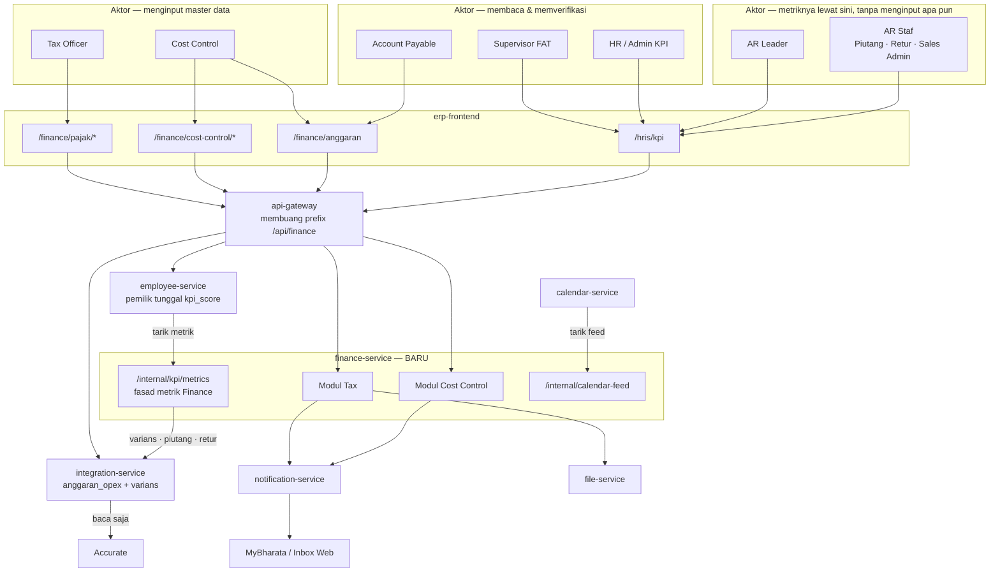
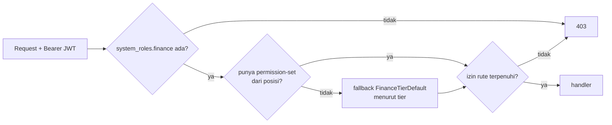
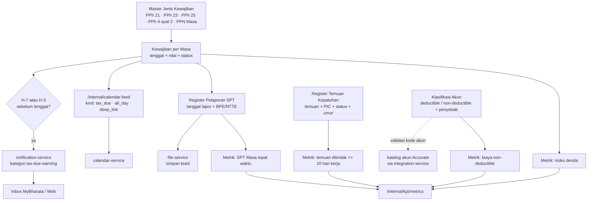
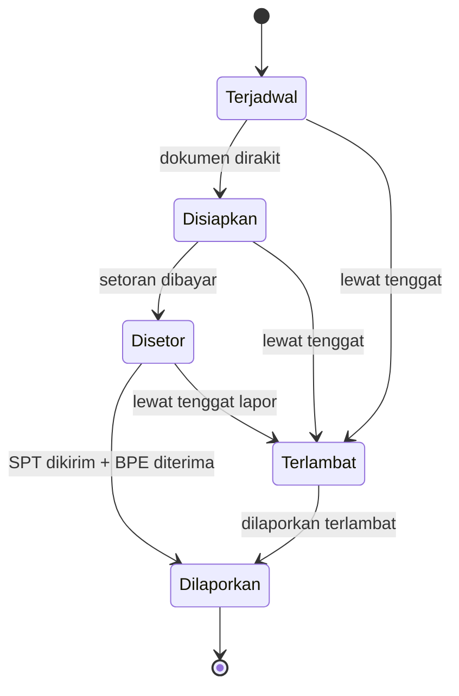
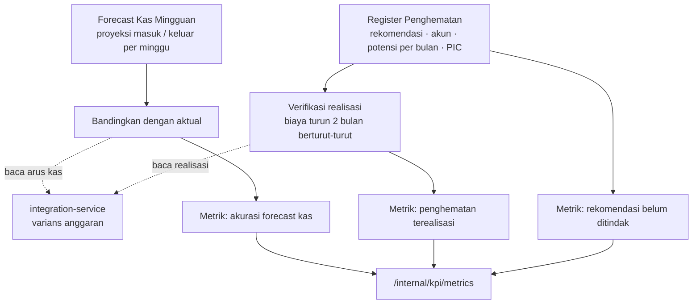
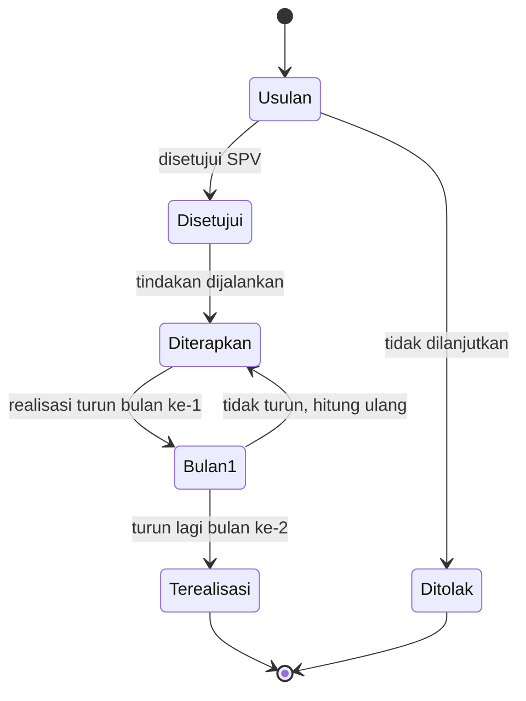
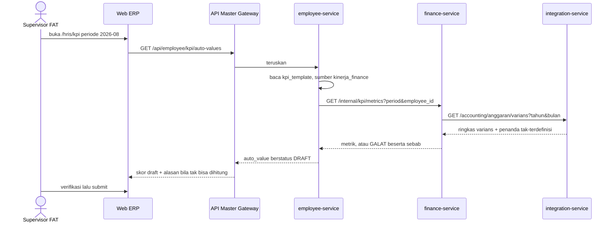

**Status**: 🟡 **Konsep / Rancangan** — belum ada satu baris kode pun. Dokumen requirements untuk `finance-service` baru: modul input Tax, Cost Control, dan jembatan Master OPEX ke KPI otomatis.

## Deskripsi

*Rancangan service baru yang menampung **master data yang hari ini tidak punya rumah di ERP mana pun** — kewajiban pajak, pelaporan SPT, temuan kepatuhan, register penghematan, dan forecast kas. Tujuannya bukan menambah dashboard, melainkan **memasok angka yang membuat KPI divisi FAT bisa terisi sendiri**. Master anggaran OPEX yang sudah ada di [[Microservices - Integration Service]] **tidak dimigrasi**; service ini membacanya lewat HTTP.*

- **Stack**: Go + Fiber + MongoDB (pola `calendar-service`: flat `package main`)
- **Path di repo**: `bip-erp/services/finance/` — **TBD, belum dibuat**
- **Status**: 🟡 Konsep — menunggu persetujuan rencana & file Excel RAPB
- **Konsep induk**: [[Finance - Big Pictures]] · **Konsumen tampilan**: [[Finance - Dashboard per Posisi (FAT)]]

## Latar Belakang

Audit KPI Finance (dibaca langsung dari `employee_db` produksi, 2026-08-10) menemukan: **0 dari 66 metrik Finance terisi otomatis**, sementara se-perusahaan hanya 3 yang otomatis dan ketiganya milik Tech Development. Mesin skornya sendiri sudah hidup sejak 1 Agustus 2026 — lihat [[HRIS - Otomasi Skor KPI]].

Tiga penyebab yang bisa ditutup service ini, beserta bobot KPI yang dibukanya:

| Penyebab | Metrik yang terhenti | Bobot | Posisi terdampak |
|---|---|---:|---|
| **Anggaran tidak tersimpan di ERP mana pun** | Varians OPEX ≤ ±5%; Rasio EBITDA; Cashflow terpantau; Varians OPEX (Tax) | **0,85** | Cost Control, SPV FAT, Account Payable, Tax Officer |
| **Tidak ada tracker pajak / audit** | SPT Masa tepat waktu; laporan pajak diperiksa; audit internal; audit internal (Senior Acc) | **0,40** | Tax Officer, Senior Accounting |
| **Tidak ada modul forecast kas** | Forecast cashflow ≥95%; Return on Operation | **0,25** | Cost Control, SPV FAT |

Bobot yang sama juga menahan 3 metrik General Affair (0,55) yang bergantung pada master anggaran yang sama — lihat [[HRIS - Matriks KPI per Departemen]].

Bukti bahwa datanya **ada tetapi di luar sistem**: tiga rekap bulanan yang disusun manual oleh Cost Control (`Juli_Realisasi OPEX`, `Juli_Penurunan OPEX Cost Driver`, `Juli_Cashflow`) berisi persis ketiga metrik itu — termasuk **Budget Juli Rp 6.684.636.073** yang tidak pernah masuk ERP maupun Accurate.

## Ruang Lingkup / Cakupan

**Masuk lingkup**

| Modul | Isi | Membuka |
|---|---|---|
| **Tax** | Master jenis kewajiban · kewajiban per masa · register pelaporan SPT · register temuan kepatuhan · klasifikasi akun deductible | bobot 0,40 |
| **Cost Control** | Register penghematan · forecast kas mingguan | bobot 0,25 |
| **Jembatan KPI** | `GET /internal/kpi/metrics` + satu sumber baru `kinerja_finance` di employee-service | mengaktifkan semuanya |
| **Jalur entri OPEX** | Template unduh, salin periode, resolusi nama akun — **di integration-service** | bobot 0,85 |

### Lingkup jembatan KPI — keputusan: fasad seluruh departemen Finance

`GET /internal/kpi/metrics` melayani **seluruh metrik departemen Finance**, bukan hanya metrik dari master milik service ini. Termasuk AR (piutang, retur) dan AP, yang datanya tetap milik [[Microservices - Integration Service]] — finance-service hanya **meneruskan**, tidak menghitung ulang.

Alasannya: satu konektor keluar dari employee-service, bukan dua. Pemicu ekstraksi `kpi-collector` di [[ADR - 0032 Kepemilikan kpi_score dan Batas Pengumpul Metrik]] sudah terlampaui di angka lima, jadi menambah dua sekaligus memperburuknya tanpa imbalan.

**Tiga metrik sengaja DI LUAR fasad ini** — sumbernya bukan ranah Finance dan sudah punya jalurnya sendiri:

| Metrik | Sumbernya | Kenapa di luar |
|---|---|---|
| Ide inovasi (Kaizen) | `kaizen_ide_diajukan` / `kaizen_ide_diterapkan` di employee-service | Sudah terdaftar; lintas 10 departemen |
| Pertemuan 1-on-1 | belum ada modul di ERP mana pun | Lintas departemen, ranah HRIS |
| Monitoring Team | `skor_tim` di employee-service | Murni agregasi `kpi_score` terhadap `work_data`, tak menyentuh Finance |

### Tiga lapis rumus, dan yang mana boleh di sini

| Lapis | Contoh | Tempatnya |
|---|---|---|
| 1. Agregasi mentah | nilai piutang per bucket umur, saldo akun beban | Service pemilik datanya (integration) — **jangan ditulis ulang** |
| 2. Rumus metrik | `bucket >60 hari ÷ total AR × 100` | **employee-service**, di katalog metrik sumber — mengikuti preseden `kinerja_toko`, supaya mengganti rumus satu baris KPI cukup ubah konfigurasi tanpa deploy |
| 3. Rumus skor | metrik vs target → 0..100, reduksi, cap | `shared-library` — **mutlak**, tak boleh disentuh sumber mana pun |

Kontrak `SumberCuplikan` menyatakannya harfiah: *"Sumber tidak menghitung nilai dan tidak mengenal target."* finance-service memasok **komponen** (`piutang_lewat_60`, `total_ar`, `retur_lewat_14`, `varians_opex`, …); pembagian dan penilaiannya di luar sini.

### Metrik AR bersifat departemen, dan itu diterima

Endpoint AR (`/orders/piutang/summary`, `/accounting/receivables`) tidak punya dimensi karyawan, sehingga AR Leader dan ketiga AR Staf menerima **angka yang sama**. Ini **bukan cacat**: seluruh toko dikelola bersama oleh tim AR Sales, jadi tidak ada pembagian per orang yang bisa diukur. Pemetaan karyawan→toko seperti `icc_account_mappings` di [[Sales - ICC Account Manager Mapping]] **tidak diperlukan di sini**.

Konsekuensi yang diterima sadar: metrik AR menilai **kinerja tim**, bukan membedakan individu. Pembeda antar-orang harus datang dari metrik lain di templatnya.

**Di luar lingkup, beserta alasannya**

- **Migrasi `anggaran_opex` ke service ini** — hidupnya dari katalog akun & realisasi Accurate yang klien-nya, rate limiter-nya, dan penanganan outage-nya semua tinggal di integration-service. Memindahkannya berarti membangun konsumen Accurate kedua yang rebutan jatah limiter.
- **Halaman kalender pajak sendiri** — dilarang; wajib jadi feed [[Microservices - Calendar Service]]. Tiap kalender tambahan membawa salinan aturan visibilitasnya sendiri, dan salinan itulah yang menyimpang diam-diam.
- **Modul Kaizen / ide inovasi** — sudah ada sejak 6 Agustus 2026 di [[Microservices - Form Builder Service]], dan sumber KPI-nya (`kaizen_ide_diajukan`, `kaizen_ide_diterapkan`) sudah terdaftar di employee-service. Tinggal dikonfigurasi, bukan dibangun.
- **Log 1-on-1** — menahan ~10 baris metrik Finance, tetapi lintas-departemen dan lebih dekat ke ranah HRIS.
- **Rekonsiliasi pajak per nomor faktur** — mustahil hari ini: penjualan digunggung dan `taxNumber` kosong pada 22 dari 22 sampel probe Accurate.

## Peta Aktor & Service

**Aturan yang mengunci bentuk ini**: [[ADR - 0032 Kepemilikan kpi_score dan Batas Pengumpul Metrik]] — `employee_db` pemilik tunggal `kpi_score`, tidak ada service lain yang menulis ke sana. finance-service hanya **menyediakan angka**; employee-service yang menariknya. Konsisten pula dengan [[ADR - 0002 Database-per-Service]].

## Persona / Pengguna

| Persona | Peran & Divisi | Akses / RBAC | Device |
|---|---|---|---|
| Tax Officer | Staf, divisi FAT, 1 orang, melapor ke Supervisor FAT | `system_roles.finance: staff` + izin pajak (usulan) | Web ERP |
| Cost Control | Staf, divisi FAT, 1 orang | `finance: staff` + izin cost control & anggaran (usulan) | Web ERP |
| Account Payable | Staf, divisi FAT | `finance: staff` — baca varians | Web ERP |
| AR Leader · AR Staf | Staf & leader divisi FAT, 4 template | `finance: staff` — **tidak membuka layar finance-service sama sekali**; metriknya lewat fasad KPI | Web ERP (`/hris/kpi`) |
| Supervisor FAT | Supervisor divisi FAT | `finance: supervisor` — menyetujui & memverifikasi skor KPI | Web ERP |
| HR / Admin KPI | HRIS | mengonfigurasi sumber otomatis di `kpi_template` | Web ERP |
| Seluruh karyawan | — | penerima notifikasi tenggat (hanya yang berhak) | MyBharata |

- **Tujuan**: berhenti menyusun rekap KPI bulanan dengan tangan; tenggat pajak tidak lagi bergantung pada ingatan seseorang.
- **Pain point**: 55% bobot KPI Cost Control saat ini dihitung sendiri oleh yang dinilai, di spreadsheet, tanpa jejak audit. Tenggat pajak tidak punya pengingat sistem sama sekali.
- **Aksi utama**: mencatat kewajiban & pelaporan pajak, mencatat temuan dan penghematan, mengisi forecast kas — lalu semuanya terbaca sendiri sebagai angka KPI.

## RBAC

Model tiga sumbu berlaku apa adanya ([[ADR - 0030 RBAC Tiga Sumbu dengan Hak Menempel di Posisi]]): hak menempel di **posisi** lewat permission-set, bukan ditempel per akun.

### Katalog izin hari ini

Seluruhnya di `bip-erp/shared-library/common/catalog_finance.go` — `finance.ar.view`, `finance.ar.export`, `finance.ap.view`, `finance.profit.view`, `finance.payout.view`, `finance.kastoko.view`, `finance.accounting.view`.

> ⚠️ **Ketujuh-tujuhnya izin BACA. Modul finance belum punya satu pun izin TULIS.** Akibatnya layar tulis `/finance/anggaran` hari ini dijaga `finance.accounting.view` — izin *melihat laporan keuangan* menjaga tombol *hapus baris anggaran*. Ini harus dibetulkan bersamaan, bukan diwariskan ke modul baru.

### Izin yang diusulkan (belum ada)

| Izin | Untuk | Diberikan ke |
|---|---|---|
| `finance.pajak.view` | melihat kalender kewajiban, SPT, temuan | Finance staff, SPV, Direktur |
| `finance.pajak.kelola` | mencatat & mengubah kewajiban, SPT, temuan, klasifikasi deductible | Tax Officer, SPV FAT |
| `finance.costcontrol.view` | melihat register penghematan & forecast | Finance staff, SPV |
| `finance.costcontrol.kelola` | mencatat & mengubah penghematan, forecast | Cost Control, SPV FAT |
| `finance.anggaran.kelola` | menulis & menghapus baris anggaran OPEX | Cost Control, SPV FAT |

Penambahan izin dilakukan di `catalog_finance.go` (satu sumber: dipakai seed employee-service, service penegak, dan gerbang halaman FE) plus mendaftarkan titik penegakannya.

### Persetujuan

Belum ada alur persetujuan yang direncanakan untuk modul ini — lihat TBD. Inventaris alur yang sudah ada: [[REF - Alur Persetujuan]].

> ⚠️ **`/internal/` bukan batas keamanan** ([[ADR - 0031 Prefix internal Bukan Batas Keamanan]]). Gateway tetap meneruskannya dari internet, jadi `/internal/kpi/metrics` dan `/internal/calendar-feed` **wajib menggerbangi dirinya sendiri**.

## Alur — Modul Tax

### Mesin status — kewajiban per masa

> Urutan **setor lalu lapor** benar untuk PPh 21/23 (setor tgl 10, lapor tgl 20). Jenis lain bisa berbeda urutan dan tenggatnya — **TBD**, wajib dikonfirmasi Tax Officer sebelum mesin status ini dikunci di kode.

## Alur — Modul Cost Control

### Mesin status — penghematan

> Status `Terealisasi` hanya boleh dicapai lewat **dua bulan penurunan berturut-turut yang terbaca dari realisasi**, bukan diketik manual. Kalau bisa diketik, metriknya mengukur klaim, bukan penghematan.

## Alur — Master OPEX menuju KPI

**Nilai otomatis berstatus DRAFT, bukan final** (ADR-0032 butir 5). Supervisor tetap memverifikasi sebelum periode ditutup.

> ⚠️ **Metrik yang datanya belum ada wajib mengembalikan GALAT, bukan nol.** Nol di sini berarti seseorang dinilai nol karena datanya belum masuk. Prinsip ini sudah tertulis di [[HRIS - Alur KPI Otomatis]] dan dikunci di sumber `kinerja_toko` yang ada.

## Cara Master Data Terisi

Bagian ini menjawab pertanyaan yang menentukan berhasil-tidaknya seluruh rancangan. Master anggaran OPEX sudah membuktikan bahwa **modul selesai tidak berarti data terisi**: ia hidup di produksi sejak 1 Agustus 2026 dengan nol baris. Mengulangi pola itu tiga kali lagi adalah kegagalan yang paling mungkin terjadi pada rancangan ini.

### Tiga prinsip

1. **Ikuti bentuk yang sudah mereka buat.** Cost Control sudah menyusun rekap OPEX, cost driver, dan cashflow **tiap bulan**. Bila unggahan ERP menerima bentuk itu apa adanya, ongkos tambahannya nyaris nol. Bila menuntut bentuk lain, kita menambah pekerjaan pada orang yang pekerjaannya justru hendak dikurangi.
2. **Sistem yang membuat baris, manusia yang melengkapi.** Untuk data berjadwal, jangan minta orang membuat baris. Baris dibangkitkan dari master jadwal; yang diketik hanya yang memang belum diketahui sistem.
3. **Seed dulu, baru minta rutin.** Modul yang dibuka pertama kali dalam keadaan kosong akan ditinggalkan. Modul yang sudah memuat enam bulan riwayat mengundang kelanjutan.

### Per master

| Master | Sumber awal (seed) | Jalur rutin | Pemicu pengisian |
|---|---|---|---|
| Anggaran OPEX | Backfill Feb–Jul 2026 dari rekap yang sudah ada | RAPB tahunan sekali + revisi | Kartu varians menampilkan cacah akun belum dianggarkan |
| Kewajiban pajak | Master jenis kewajiban, 5–6 baris, sekali | Baris per masa **dibangkitkan sistem** | Notifikasi H-7/H-3 berpintu langsung ke barisnya |
| Register penghematan | 3 rekomendasi Juli yang sudah tertulis di rekap cost driver | 3 rekomendasi per bulan | KPI-nya sendiri sudah mewajibkan 3 per bulan |
| Klasifikasi deductible | Sekali, ~55 akun beban dari katalog Accurate | Hanya saat ada akun baru | Antrean akun baru tanpa klasifikasi |
| Forecast kas | ⚠️ rekap ada tapi **bulanan**, KPI minta **mingguan** | belum pernah dikerjakan | — |

### Anggaran OPEX — impor, bukan pengetikan

Angkanya **sudah ada**: RAPB Juli Rp 6.684.636.073 tersebar di ~55 akun. Yang menghalangi bukan kemauan, melainkan bentuk:

- **Unggahan harus menerima NAMA akun**, bukan hanya kode. Rekapnya memakai nama, dan nama-nama itu **persis nama akun Accurate** — resolusinya mekanis lewat `GET /accounting/anggaran/katalog` yang sudah ada. Nama ganda atau tak dikenal masuk ke laporan `baris_ditolak` yang mekanismenya sudah jalan.
- **Template unduh terisi katalog akun & departemen**, supaya format wajibnya tidak perlu ditebak dari kode parser.
- **Salin dari periode sebelumnya** dan **isi setahun sekaligus** (12 kolom bulan). Tanpa ini, satu tahun berarti ribuan baris diketik ulang.
- **Backfill Feb–Jul 2026** dari enam rekap yang sudah ada. Begitu masuk, kartu varians, bagan varians per pos, tren OPEX enam periode, dan Ringkasan Divisi **hidup seketika tanpa satu baris frontend baru**.

> ⚠️ Backfill hanya bisa lengkap untuk baris berbudget > 0. **17 baris berbudget 0 tidak dapat dipastikan** tanpa Excel sumbernya: ia bisa berarti anggota kelompok anggaran, atau memang tidak dianggarkan. Perbedaannya menentukan angka varians totalnya — lihat TBD #1.

### Kewajiban pajak — dibangkitkan, bukan dibuat

Tax Officer **tidak membuat baris**. Master jenis kewajiban diisi sekali (PPh 21, PPh 23, PPh 25, PPh 4 ayat 2, PPN Masa) beserta pola tenggatnya; baris per masa dibangkitkan sistem. Yang diketik hanya empat kolom: nilai, tanggal setor, tanggal lapor, nomor BPE.

**Notifikasi H-7/H-3 sekaligus menjadi pintu masuk pengisian** — tiap pengingat membawa `deep_link` ke baris yang harus dilengkapi. Pengingat yang hanya memberi tahu tanpa membuka pintunya akan diabaikan.

### Register penghematan — memindahkan, bukan menambah

KPI Cost Control **sudah mewajibkan minimal 3 rekomendasi efisiensi per bulan**, dan rekomendasi itu memang sudah ditulis — tiga di antaranya ada di rekap cost driver Juli. Jadi ini bukan pekerjaan baru, hanya pindah tempat: dari narasi PDF ke baris yang bisa dilacak status realisasinya.

### Forecast kas — satu-satunya yang meminta pekerjaan baru

Rekap yang ada **bulanan dan hanya 6 akun**; metriknya menuntut **mingguan**. Ini satu-satunya master yang meminta sesuatu yang belum pernah dikerjakan, pada peran berisi satu orang. Dua jalan:

| | (a) Terima bulanan | (b) Tuntut mingguan |
|---|---|---|
| Ongkos bagi Cost Control | nyaris nol | pekerjaan baru tiap minggu |
| Perubahan | definisi metrik KPI diubah | tidak ada |
| Risiko | metrik kurang tajam | **tidak pernah diisi** |

Rekomendasi: mulai dari **(a)**. Metrik yang terisi bulanan lebih berguna daripada metrik mingguan yang tak pernah diisi.

### Mekanisme yang berlaku untuk semuanya

1. **Panel kelengkapan** — "N dari M sudah diisi" per periode, dengan tautan ke yang belum. Polanya sudah dipakai untuk beban operasional insentif ([[ADR - 0033 Beban Operasional Insentif dari Proyek Accurate]]). Backend anggaran **sudah mengirim** cacahnya (`baris_anggaran_belum_diisi`, `baris_realisasi_belum_disinkron`, `baris_departemen_tak_dikenal`); tinggal ditampilkan.
2. **KPI sebagai gaya dorong.** Begitu metrik membaca master, master yang kosong tampil sebagai lubang di layar supervisor — tekanan yang tak pernah dimiliki dashboard. **Syarat mutlak: tampil sebagai "tak bisa dihitung", BUKAN sebagai skor nol.** Skor nol menghukum orang atas data yang belum masuk, dan itu membuat orang menghindari modulnya, bukan mengisinya.
3. **Tak ada kolom yang bisa diisi dua kali.** Nilai yang dapat diturunkan sistem — varians, persentase, akumulasi penurunan — tidak pernah menjadi kolom isian. Rekap Juli sudah memperlihatkan akibatnya: `Beban Software` tercatat Rp 13.368.764 di satu berkas dan Rp 61.848.060 di berkas lain, bulan dan akun yang sama.

### Urutan penyalaan

1. **Seed anggaran Feb–Jul** dari rekap → empat layar hidup seketika, tanpa frontend baru
2. **Master jenis kewajiban pajak** → kalender dan notifikasi mulai berjalan
3. **Register penghematan** → pindahkan 3 rekomendasi Juli
4. **Klasifikasi deductible** → sekali jalan
5. **Forecast kas** → terakhir, setelah bentuknya disepakati

## Konsumen Data

- [[Finance - Dashboard per Posisi (FAT)]] — kartu & bagan yang hari ini berstatus "menunggu penyambungan": forecast kas, penghematan terealisasi, biaya non-deductible, kalender kewajiban pajak
- [[Microservices - Employee Service]] — sumber KPI `kinerja_finance` untuk mengisi `kpi_score`
- [[Microservices - Calendar Service]] — feed `tax_due`
- [[APP - Web ERP]] — halaman input di kategori sidebar FAT

## Mode Kegagalan yang Sudah Diketahui

Semua bentuk di bawah **sudah pernah terjadi** di repo ini; masing-masing wajib ditutup di rencana implementasi, bukan di follow-up.

| Bentuk | Cara ia muncul di sini | Penutupnya |
|---|---|---|
| Hijau di test, 404 di jalur nyata | Rute akar didaftarkan `app.Get("/finance")` padahal gateway sudah membuang prefiksnya | Test yang mereproduksi pemotongan prefix |
| 502 tanpa petunjuk | `c.JSON()` dipakai sebagai nilai galat lalu memanik | Pola `(*T, bool)`; minimal satu test Fiber jalur galat per handler |
| 502 tanpa petunjuk | `mongodb.GetCollection` memanik saat DB nil | Penjaga `mongodb.DB == nil` eksplisit |
| Terlihat oleh yang tak berhak | Feed kalender menyaring pakai RBAC modul asalnya — persis cacat feed `leave`/`contract_end` | Keputusan visibilitas eksplisit + test yang menguncinya |
| Senyap total | Kategori inbox baru ditolak 400 karena notification-service belum di-rebuild | Naikkan finance + notification **bersama**, lalu picu satu notifikasi sungguhan |
| Senyap total | `FINANCE_MODULE_URL` masuk map `ValidateInternalURL` → panic saat kosong → seluruh kalender padam | Daftarkan lewat `providerRegistry`; URL kosong dilewati |
| Data hilang tanpa pesan | `PATCH` yang sebenarnya menimpa penuh | Struct patch seluruhnya pointer; validasi hasil gabungan |
| Ada tapi tak bisa dinyalakan | Lapisan pengikatan request tak punya field fiturnya | Tiap fitur dijalankan sekali lewat gateway sebelum diklaim selesai |
| Nol yang menyamar sebagai data | Metrik KPI balas 0 alih-alih "tak bisa dihitung" | Galat bersebab, dikunci test |

## Kendala

- **Menyentuh `shared-library`** (konstanta env, katalog izin, kategori inbox) memicu **redeploy seluruh service** sekali — `deploy.yml` memperlakukan perubahan shared sebagai perubahan semua service.
- **Pemicu ADR-0032 untuk mengekstrak `kpi-collector` sudah terlampaui.** ADR itu menetapkan ekstraksi saat konektor keluar employee-service mencapai **tiga**; hari ini sudah **lima** (`kinerja_toko`, `kinerja_tiket`, `uptime_sistem`, `kaizen` ×2, `akurasi_aset`). Rencana ini menambah yang keenam. Penyimpangan disengaja dan perlu keputusan terpisah.
- **Grain RAPB belum diketahui** — lihat TBD. Menahan jalur entri OPEX, tidak menahan Tax maupun Cost Control.
- **Konfigurasi matriks KPI bukan pekerjaan service ini.** Membangun modul tidak menyalakan KPI; yang menyalakan adalah pengisian `kpi_template` menurut [[RUN - Menambah Metrik KPI Otomatis]]. Tanpa pemilik langkah itu, hasilnya berulang seperti master anggaran hari ini: modulnya jadi, datanya kosong.

## Belum Diputuskan (TBD)

1. **Grain RAPB — per akun atau per kelompok akun?** Bukti aritmetika dari rekap Juli menunjukkan satu baris budget menutupi beberapa akun (budget Rp 41 juta "Lain-lain Marketing" dibandingkan terhadap gabungan 10 akun senilai Rp 72,7 juta). Bila benar per kelompok, dibutuhkan master `kelompok_anggaran` — dan masternya milik Finance, bukan turunan Accurate. **Menunggu file Excel RAPB.** Keputusan ini layak jadi ADR karena menentukan bentuk model data.
2. **Siapa yang boleh melihat kalender kewajiban pajak?** Agenda perusahaan atau pekerjaan Tax Officer saja. Usulan: Finance + Tax + setingkat Direktur, bukan seluruh karyawan.
3. **Batas lingkup register penghematan** terhadap `ProcurementSaving` yang sudah ada di employee-service (`/procurement/savings`). Usulan: *procurement = penghematan harga beli/vendor; finance = penghematan biaya operasional berjalan*. Tanpa batas tertulis, dua angka "total penghematan" akan beredar.
4. **Urutan setor dan lapor per jenis pajak** — mesin status di atas mengasumsikan pola PPh 21/23.
5. **Perlukah alur persetujuan** untuk penghematan berstatus `Terealisasi` dan untuk revisi anggaran? Belum ada di [[REF - Alur Persetujuan]].
6. **Granularitas forecast kas — bulanan atau mingguan?** Rekap yang ada bulanan; metrik KPI menuntut mingguan. Menuntut mingguan berarti pekerjaan baru bagi peran berisi satu orang, dengan risiko tidak pernah diisi. Usulan: terima bulanan dan sesuaikan definisi metriknya.
7. **Kapan `kpi-collector` diekstrak.** Opsi B menahan penambahan di satu konektor, tetapi pemicu ADR-0032 tetap terlampaui. Keputusan terpisah, tidak memblokir rancangan ini.
8. **i18n**: `features/finance/` di erp-frontend hari ini **nol** berkas memakai `useTranslation`, sementara [[ADR - 0010 Internasionalisasi (i18n) Dua Bahasa]] mewajibkan teks user-facing baru lewat `react-i18next`. Halaman baru akan jadi pulau i18n di modul yang tidak — perlu diputuskan menyeragamkan atau menerima ketimpangan itu.

## Dokumen Terkait

- [[Finance - Big Pictures]] — peta domain Finance System
- [[Finance - Dashboard per Posisi (FAT)]] — konsumen tampilan; kartu yang dihidupkan rancangan ini
- [[Microservices - Integration Service]] — pemilik `anggaran_opex` & varians; tidak dimigrasi
- [[Microservices - Employee Service]] — pemilik `kpi_score`; tempat sumber `kinerja_finance` didaftarkan
- [[Microservices - Calendar Service]] · [[Microservices - Notification Service]] · [[Microservices - File Service]]
- [[CORE - API Master Gateway]] — pemotongan prefix `/api/<module>`
- [[ADR - 0032 Kepemilikan kpi_score dan Batas Pengumpul Metrik]] · [[ADR - 0031 Prefix internal Bukan Batas Keamanan]] · [[ADR - 0030 RBAC Tiga Sumbu dengan Hak Menempel di Posisi]] · [[ADR - 0002 Database-per-Service]] · [[ADR - 0001 Akuntansi via Accurate]]
- [[ADR - 0033 Beban Operasional Insentif dari Proyek Accurate]] — bagan akun beban 6xxx & jebakan parameter Accurate
- [[HRIS - Otomasi Skor KPI]] · [[HRIS - Matriks KPI per Departemen]] · [[HRIS - Alur KPI Otomatis]] · [[RUN - Menambah Metrik KPI Otomatis]]
- [[REF - Alur Persetujuan]] · [[External - Accurate]] · [[RUN - Deploy Microservices bip-erp]]
