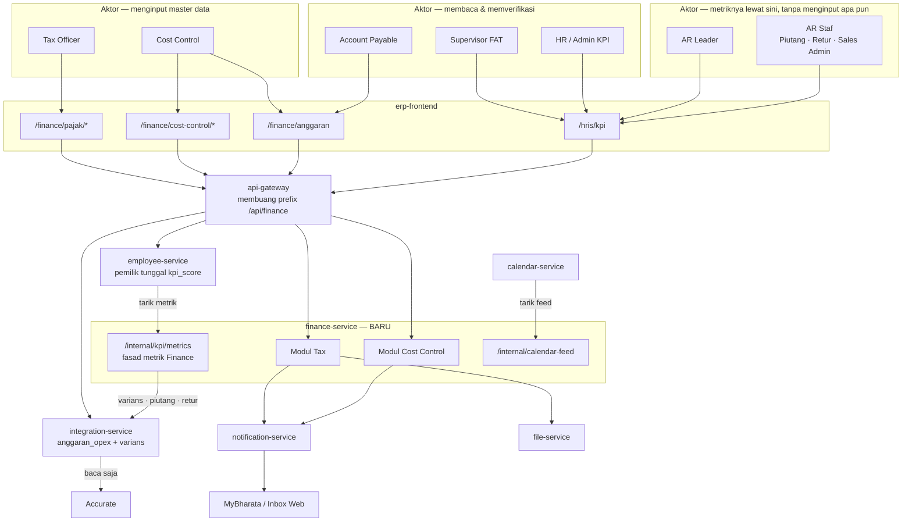
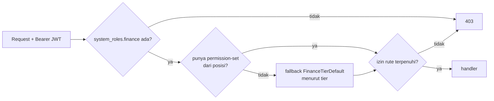
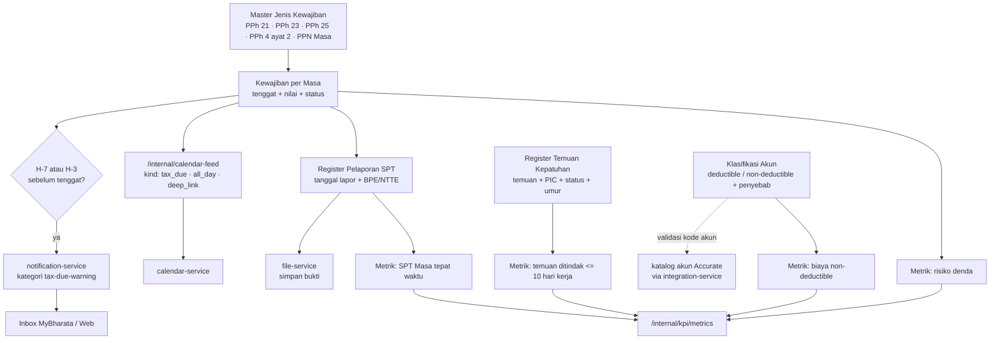
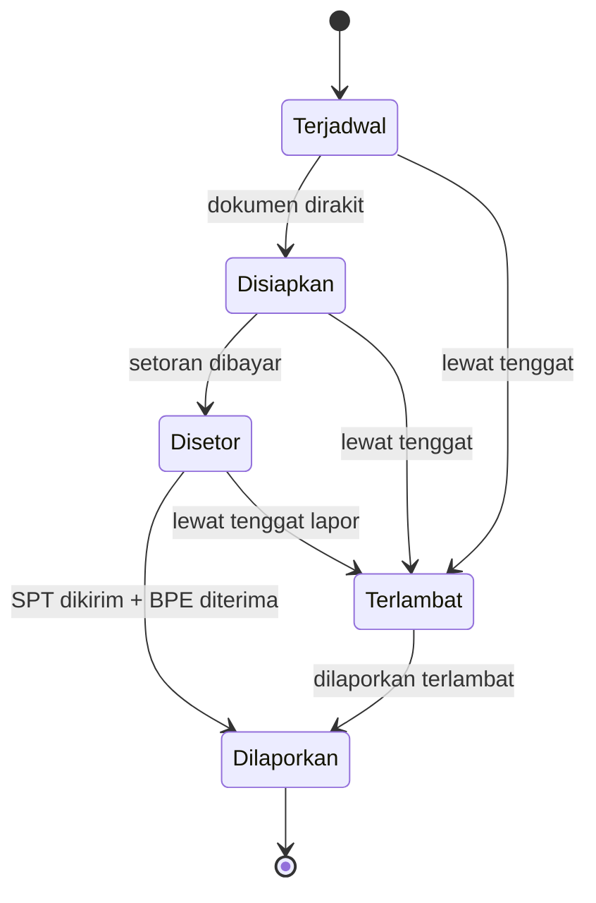
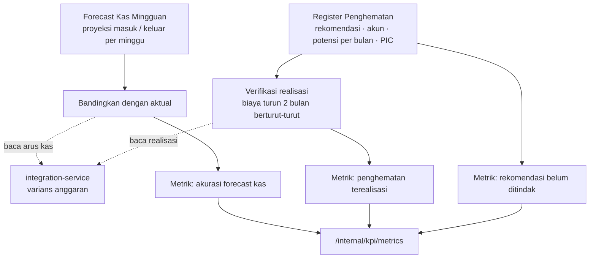
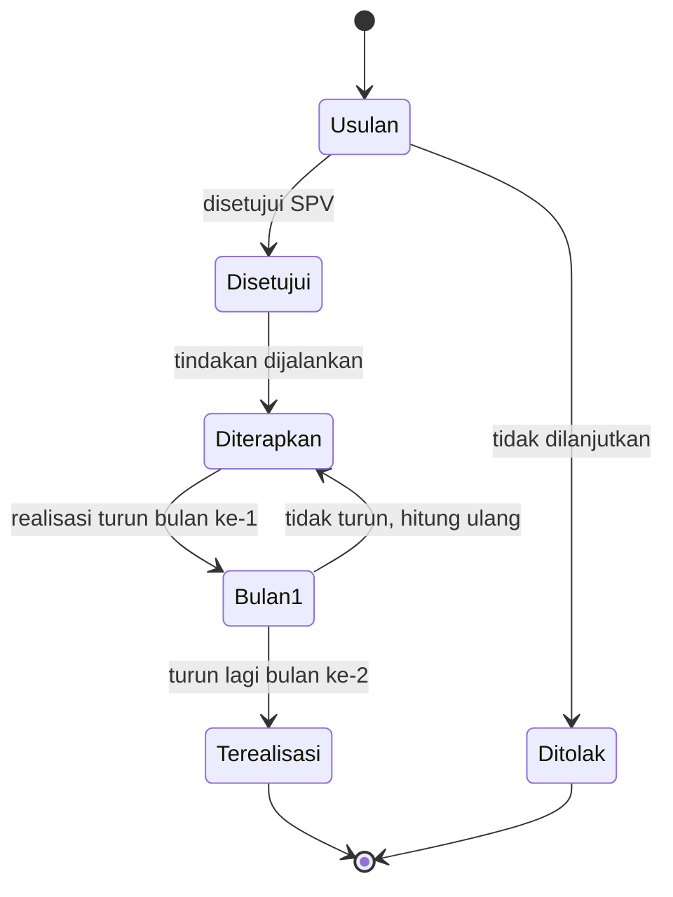
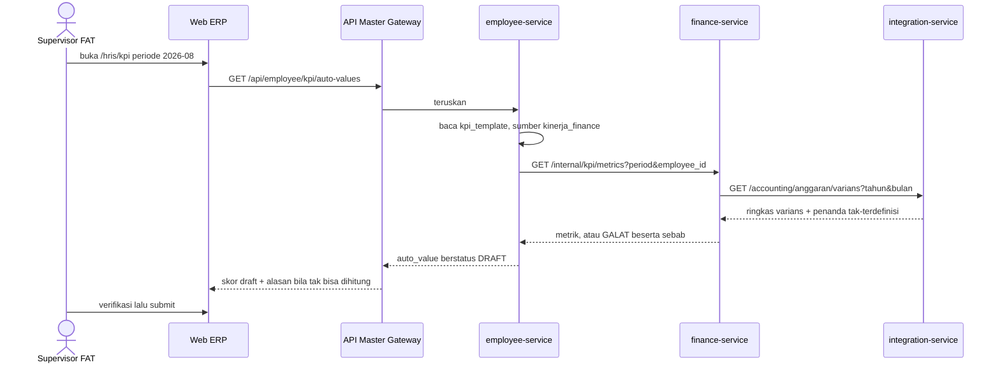

**Status**: 🟡 **Konsep / Rancangan** — belum ada satu baris kode pun. Dokumen requirements untuk `finance-service` baru: modul input Tax, Cost Control, dan jembatan Master OPEX ke KPI otomatis.

## Deskripsi

*Rancangan service baru yang menampung **master data yang hari ini tidak punya rumah di ERP mana pun** — kewajiban pajak, pelaporan SPT, temuan kepatuhan, rekomendasi efisiensi, dan forecast kas. Tujuannya bukan menambah dashboard, melainkan **memasok angka yang membuat KPI divisi FAT bisa terisi sendiri**. Master anggaran OPEX yang sudah ada di [[Microservices - Integration Service]] **tidak dimigrasi**; service ini membacanya lewat HTTP.*

- **Stack**: Go + Fiber + MongoDB (pola `calendar-service`: flat `package main`)
- **Path di repo**: `bip-erp/services/finance/` — **TBD, belum dibuat**
- **Status**: 🟡 Konsep — RAPB sudah dibaca dan grain-nya terjawab; kini menunggu **sepuluh keputusan Finance** (lihat bab tersendiri di bawah)
- **Konsep induk**: [[Finance - Big Pictures]] · **Konsumen tampilan**: [[Finance - Dashboard per Posisi (FAT)]]

## Latar Belakang

Audit KPI Finance (dibaca langsung dari `employee_db` produksi, 2026-08-10) menemukan: **0 dari 66 metrik Finance terisi otomatis**, sementara se-perusahaan hanya 3 yang otomatis dan ketiganya milik Tech Development. Mesin skornya sendiri sudah hidup sejak 1 Agustus 2026 — lihat [[HRIS - Otomasi Skor KPI]].

Tiga penyebab yang bisa ditutup service ini, beserta bobot KPI yang dibukanya:

| Penyebab | Metrik yang terhenti | Bobot | Posisi terdampak |
|---|---|---:|---|
| **Anggaran tidak tersimpan di ERP mana pun** | Varians OPEX ≤ ±5%; Rasio EBITDA; Cashflow terpantau; Varians OPEX (Tax) | **0,85** | Cost Control, SPV FAT, Account Payable, Tax Officer |
| **Tidak ada tracker pajak / audit** | SPT Masa tepat waktu; laporan pajak diperiksa; audit internal; audit internal (Senior Acc) | **0,40** | Tax Officer, Senior Accounting |
| **Tidak ada modul forecast kas** | Forecast cashflow ≥95%; Return on Operation | **0,25** | Cost Control, SPV FAT |

Bobot yang sama juga menahan 3 metrik General Affair (0,55) yang bergantung pada master anggaran yang sama — lihat [[HRIS - Matriks KPI per Departemen]].

Bukti bahwa datanya **ada tetapi di luar sistem**: tiga rekap bulanan yang disusun manual oleh Cost Control (`Juli_Realisasi OPEX`, `Juli_Penurunan OPEX Cost Driver`, `Juli_Cashflow`) berisi persis ketiga metrik itu — termasuk **Budget Juli Rp 6.684.636.073** yang tidak pernah masuk ERP maupun Accurate.

## Ruang Lingkup / Cakupan

**Masuk lingkup**

| Modul | Isi | Membuka |
|---|---|---|
| **Tax** | Master jenis kewajiban · kewajiban per masa · register pelaporan SPT · register temuan kepatuhan · klasifikasi akun deductible | bobot 0,40 |
| **Cost Control** | Register penghematan · forecast kas mingguan | bobot 0,25 |
| **Jembatan KPI** | `GET /internal/kpi/metrics` + satu sumber baru `kinerja_finance` di employee-service | mengaktifkan semuanya |
| **Jalur entri OPEX** | Template unduh, salin periode, resolusi nama akun — **di integration-service** | bobot 0,85 |

### Lingkup jembatan KPI — keputusan: fasad seluruh departemen Finance

`GET /internal/kpi/metrics` melayani **seluruh metrik departemen Finance**, bukan hanya metrik dari master milik service ini. Termasuk AR (piutang, retur) dan AP, yang datanya tetap milik [[Microservices - Integration Service]] — finance-service hanya **meneruskan**, tidak menghitung ulang.

Alasannya: satu konektor keluar dari employee-service, bukan dua.

> ⚠️ **Alasan itu melemah sejak 2026-08-11.** [[ADR - 0032 Kepemilikan kpi_score dan Batas Pengumpul Metrik]] kini mencatat bahwa ongkos yang dikhawatirkannya **tidak muncul** — tiap konektor hanya satu berkas `kpi_sumber_*.go` yang tak menyentuh berkas milik siapa pun — dan bahwa **apakah angka tiga masih pemicu yang bermakna sudah jadi TBD di ADR itu sendiri**. Bila pemicunya dicabut, opsi A (AR punya konektor sendiri langsung ke integration-service) jadi lebih bersih secara arsitektur, karena finance-service tak lagi menjadi perantara bagi data yang tidak dimilikinya maupun dihitungnya. Keputusan opsi B **ditinjau ulang** saat pemicu itu diputuskan.

**Tiga metrik sengaja DI LUAR fasad ini** — sumbernya bukan ranah Finance dan sudah punya jalurnya sendiri:

| Metrik | Sumbernya | Kenapa di luar |
|---|---|---|
| Ide inovasi (Kaizen) | `kaizen_ide_diajukan` / `kaizen_ide_diterapkan` di employee-service | Sudah terdaftar; lintas 10 departemen |
| Pertemuan 1-on-1 | belum ada modul di ERP mana pun | Lintas departemen, ranah HRIS |
| Monitoring Team | `skor_tim` di employee-service | Murni agregasi `kpi_score` terhadap `work_data`, tak menyentuh Finance |

### Tiga lapis rumus, dan yang mana boleh di sini

| Lapis | Contoh | Tempatnya |
|---|---|---|
| 1. Agregasi mentah | nilai piutang per bucket umur, saldo akun beban | Service pemilik datanya (integration) — **jangan ditulis ulang** |
| 2. Rumus metrik | `bucket >60 hari ÷ total AR × 100` | **employee-service**, di katalog metrik sumber — mengikuti preseden `kinerja_toko`, supaya mengganti rumus satu baris KPI cukup ubah konfigurasi tanpa deploy |
| 3. Rumus skor | metrik vs target → 0..100, reduksi, cap | `shared-library` — **mutlak**, tak boleh disentuh sumber mana pun |

Kontrak `SumberCuplikan` menyatakannya harfiah: *"Sumber tidak menghitung nilai dan tidak mengenal target."* finance-service memasok **komponen** (`piutang_lewat_60`, `total_ar`, `retur_lewat_14`, `varians_opex`, …); pembagian dan penilaiannya di luar sini.

### Metrik AR bersifat departemen, dan itu diterima

Endpoint AR (`/orders/piutang/summary`, `/accounting/receivables`) tidak punya dimensi karyawan, sehingga AR Leader dan ketiga AR Staf menerima **angka yang sama**. Ini **bukan cacat**: seluruh toko dikelola bersama oleh tim AR Sales, jadi tidak ada pembagian per orang yang bisa diukur. Pemetaan karyawan→toko seperti `icc_account_mappings` di [[Sales - ICC Account Manager Mapping]] **tidak diperlukan di sini**.

Konsekuensi yang diterima sadar: metrik AR menilai **kinerja tim**, bukan membedakan individu. Pembeda antar-orang harus datang dari metrik lain di templatnya. Bila kelak perlu dibedakan per orang, `TargetBerlaku` sudah mendukung `target_per_karyawan` — cukup lewat target, tanpa menyentuh metriknya.

Kesiapan teknis rumpun AR beserta endpoint dan celahnya ada di bab **Rumpun AR** di bawah.

**Di luar lingkup, beserta alasannya**

- **Migrasi `anggaran_opex` ke service ini** — hidupnya dari katalog akun & realisasi Accurate yang klien-nya, rate limiter-nya, dan penanganan outage-nya semua tinggal di integration-service. Memindahkannya berarti membangun konsumen Accurate kedua yang rebutan jatah limiter.
- **Halaman kalender pajak sendiri** — dilarang; wajib jadi feed [[Microservices - Calendar Service]]. Tiap kalender tambahan membawa salinan aturan visibilitasnya sendiri, dan salinan itulah yang menyimpang diam-diam.
- **Modul Kaizen / ide inovasi** — sudah ada sejak 6 Agustus 2026 di [[Microservices - Form Builder Service]], dan sumber KPI-nya (`kaizen_ide_diajukan`, `kaizen_ide_diterapkan`) sudah terdaftar di employee-service. Tinggal dikonfigurasi, bukan dibangun.
- **Log 1-on-1** — menahan ~10 baris metrik Finance, tetapi lintas-departemen dan lebih dekat ke ranah HRIS.
- **Rekonsiliasi pajak per nomor faktur** — mustahil hari ini: penjualan digunggung dan `taxNumber` kosong pada 22 dari 22 sampel probe Accurate.

### Apa yang Finance sendiri minta — kolom `SISTEM ERP`

Tiap baris di workbook KPI FAT punya kolom **`SISTEM ERP`** berisi fitur yang diharapkan pemilik metriknya. Kolom itu **tidak ada di `kpi_template`**, jadi selama ini pernyataan Finance tentang ekspektasi fiturnya hanya hidup di Excel dan tak terbaca siapa pun di luar berkas itu.

| Sheet | Metrik | Fitur yang diminta |
|---|---|---|
| Tax Officer | **7 dari 9** | `FITUR UP DOKUMEN` — SPT Masa: `(UPPROV SPV)` |
| Tax Officer | ide inovasi · 1-on-1 | `FITUR IDE KAIZEN` · `FITUR KALENDER` |
| Cost Control | varians OPEX | `DONE (DIMENU AR)` |
| Cost Control | 3 metrik | `PENAMBAHAN FITUR LAPORAN ANGGARAN VS REALISASI` (satu: `BREAKDOWN MINGGUAN`) |
| Cost Control | kas iklan | `DONE (MENU BEBAN IKLAN)` |
| SPV FAT | 3 metrik | `PENAMBAHAN FITUR LAPORAN ANGGARAN VS REALISASI` |
| SPV FAT | KPI tim | `DONE` |

Dua hal yang dikonfirmasinya, dan satu yang dibantahnya:

- ✅ **Master OPEX dan Cost Control memang yang diminta** — *"laporan anggaran vs realisasi"* persis modul itu.
- ✅ **Kaizen dan Kalender di luar lingkup**, sesuai keputusan yang sudah diambil.
- ⚠️ **Untuk Tax, Finance meminta unggah dokumen, bukan input berstruktur.** Rancangan ini **sengaja menyimpang**: dokumen yang diunggah hanya membuat KPI dapat **diaudit**, sedangkan tanggal berstruktur membuatnya dapat **dihitung mesin** — dan tujuan yang ditetapkan adalah KPI otomatis. Penyimpangan ini mengubah instrumen penilaian, jadi **wajib disetujui SPV FAT** (keputusan Finance #5), bukan diputuskan IT.

## Peta Aktor & Service



**Aturan yang mengunci bentuk ini**: [[ADR - 0032 Kepemilikan kpi_score dan Batas Pengumpul Metrik]] — `employee_db` pemilik tunggal `kpi_score`, tidak ada service lain yang menulis ke sana. finance-service hanya **menyediakan angka**; employee-service yang menariknya. Konsisten pula dengan [[ADR - 0002 Database-per-Service]].

## Persona / Pengguna

| Persona | Peran & Divisi | Akses / RBAC | Device |
|---|---|---|---|
| Tax Officer | Staf, divisi FAT, 1 orang, melapor ke Supervisor FAT | `system_roles.finance: staff` + izin pajak (usulan) | Web ERP |
| Cost Control | Staf, divisi FAT, 1 orang | `finance: staff` + izin cost control & anggaran (usulan) | Web ERP |
| Account Payable | Staf, divisi FAT | `finance: staff` — baca varians | Web ERP |
| AR Leader · AR Staf | Staf & leader divisi FAT, 4 template | `finance: staff` — **tidak membuka layar finance-service sama sekali**; metriknya lewat fasad KPI | Web ERP (`/hris/kpi`) |
| Supervisor FAT | Supervisor divisi FAT | `finance: supervisor` — menyetujui & memverifikasi skor KPI | Web ERP |
| HR / Admin KPI | HRIS | mengonfigurasi sumber otomatis di `kpi_template` | Web ERP |
| Seluruh karyawan | — | penerima notifikasi tenggat (hanya yang berhak) | MyBharata |

- **Tujuan**: berhenti menyusun rekap KPI bulanan dengan tangan; tenggat pajak tidak lagi bergantung pada ingatan seseorang.
- **Pain point**: 55% bobot KPI Cost Control saat ini dihitung sendiri oleh yang dinilai, di spreadsheet, tanpa jejak audit. Tenggat pajak tidak punya pengingat sistem sama sekali.
- **Aksi utama**: mencatat kewajiban & pelaporan pajak, mencatat temuan dan penghematan, mengisi forecast kas — lalu semuanya terbaca sendiri sebagai angka KPI.

## RBAC

Model tiga sumbu berlaku apa adanya ([[ADR - 0030 RBAC Tiga Sumbu dengan Hak Menempel di Posisi]]): hak menempel di **posisi** lewat permission-set, bukan ditempel per akun.



### Katalog izin hari ini

Seluruhnya di `bip-erp/shared-library/common/catalog_finance.go` — `finance.ar.view`, `finance.ar.export`, `finance.ap.view`, `finance.profit.view`, `finance.payout.view`, `finance.kastoko.view`, `finance.accounting.view`.

> ⚠️ **Ketujuh-tujuhnya izin BACA. Modul finance belum punya satu pun izin TULIS.** Akibatnya layar tulis `/finance/anggaran` hari ini dijaga `finance.accounting.view` — izin *melihat laporan keuangan* menjaga tombol *hapus baris anggaran*. Ini harus dibetulkan bersamaan, bukan diwariskan ke modul baru.

### Izin yang diusulkan (belum ada)

| Izin | Untuk | Diberikan ke |
|---|---|---|
| `finance.pajak.view` | melihat kalender kewajiban, SPT, temuan | Finance staff, SPV, Direktur |
| `finance.pajak.kelola` | mencatat & mengubah kewajiban, SPT, temuan, klasifikasi deductible | Tax Officer, SPV FAT |
| `finance.costcontrol.view` | melihat register penghematan & forecast | Finance staff, SPV |
| `finance.costcontrol.kelola` | mencatat & mengubah penghematan, forecast | Cost Control, SPV FAT |
| `finance.anggaran.kelola` | menulis & menghapus baris anggaran OPEX | Cost Control, SPV FAT |

Penambahan izin dilakukan di `catalog_finance.go` (satu sumber: dipakai seed employee-service, service penegak, dan gerbang halaman FE) plus mendaftarkan titik penegakannya.

### Persetujuan

Belum ada alur persetujuan yang direncanakan untuk modul ini — lihat TBD. Inventaris alur yang sudah ada: [[REF - Alur Persetujuan]].

> ⚠️ **`/internal/` bukan batas keamanan** ([[ADR - 0031 Prefix internal Bukan Batas Keamanan]]). Gateway tetap meneruskannya dari internet, jadi `/internal/kpi/metrics` dan `/internal/calendar-feed` **wajib menggerbangi dirinya sendiri**.

## Alur — Modul Tax



### Mesin status — kewajiban per masa



> Urutan **setor lalu lapor** benar untuk PPh 21/23 (setor tgl 10, lapor tgl 20). Jenis lain bisa berbeda urutan dan tenggatnya — **TBD**, wajib dikonfirmasi Tax Officer sebelum mesin status ini dikunci di kode.

## Alur — Modul Cost Control



### Mesin status — penghematan



> Status `Terealisasi` hanya boleh dicapai lewat **dua bulan penurunan berturut-turut yang terbaca dari realisasi**, bukan diketik manual. Kalau bisa diketik, metriknya mengukur klaim, bukan penghematan.

## Alur — Master OPEX menuju KPI



**Nilai otomatis berstatus DRAFT, bukan final** (ADR-0032 butir 5). Supervisor tetap memverifikasi sebelum periode ditutup.

> ⚠️ **Metrik yang datanya belum ada wajib mengembalikan GALAT, bukan nol.** Nol di sini berarti seseorang dinilai nol karena datanya belum masuk. Prinsip ini sudah tertulis di [[HRIS - Alur KPI Otomatis]] dan dikunci di sumber `kinerja_toko` yang ada.

## Rumpun AR — jalur tercepat menuju metrik pertama yang menyala

AR tidak menginput apa pun ke service ini; metriknya lewat fasad KPI (opsi B). Tetapi ia **satu-satunya rumpun yang tidak menunggu satu pun keputusan Finance**, sehingga layak dikerjakan lebih dulu bila tujuannya membuktikan rantai otomasi bekerja.

### Pemetaan metrik ke endpoint

| Metrik | Bobot | Endpoint | Siap? |
|---|---:|---|---|
| AR Leader — piutang aging >60 hari <5% | 0,30 | `GET /transactions/orders/piutang/tren` | ✅ **siap** |
| AR Staf Piutang — penagihan >60 hari <5% | 0,20 | sama | ✅ **siap** |
| AR Leader — pengawasan AR aging ≤14 hari | 0,30 | — | ⚠️ `Lebih14` belum dibawa |
| AR Staf Piutang — penagihan >14 hari <5% | 0,20 | — | ⚠️ idem |
| AR Leader — Monitoring Team | 0,20 | `skor_tim` (employee-service) | 🔴 `supervisor_id` kosong |
| AR Staf — Pencatatan Piutang / Retur | 0,90 | — | 🔴 vonisnya patut dikoreksi, lihat bawah |

Metrik >60 hari tinggal `lebih60 ÷ total_terbuka × 100`.

### Kenapa `/tren`, bukan `/summary`

`GET /orders/piutang/summary` menghitung umur relatif terhadap **hari ini** (`piutangCutoffs(now)`), jadi tak dapat menilai bulan yang sudah lewat. `GET /orders/piutang/tren?bulan=N` mengembalikan posisi per **akhir bulan** hingga 12 bulan ke belakang — itulah bentuk yang dibutuhkan KPI periodik.

**Bulan berjalan sengaja tidak ikut** di tren; posisinya belum final. Konsekuensinya wajar: KPI baru dapat dinilai setelah bulannya berakhir.

### Dua hal yang wajib diketahui sebelum menyambungnya

⚠️ **`Lebih14` belum ada di posisi historis.** `PiutangPosisiRow` hanya membawa `TotalTerbuka` dan `Lebih60`, padahal cutoff 14 hari **sudah dihitung** di `piutangCutoffs`. Menambahkannya pekerjaan kecil di pipeline yang sudah ada, murni IT — dan ia membuka 0,50 bobot lagi.

⚠️ **Deret historisnya rekonstruksi, bukan snapshot.** Handler-nya menuliskannya sendiri: *"order yang batal atau retur dikeluarkan per tanggal kejadiannya, bukan snapshot yang tersimpan bulan itu."* Artinya skor Agustus yang dihitung September bisa berbeda bila dihitung ulang Oktober. `auto_value` yang tersimpan saat submit ([[ADR - 0032 Kepemilikan kpi_score dan Batas Pengumpul Metrik]] butir 3) sudah membekukannya — **jangan pernah menghitung ulang skor periode yang sudah tertutup**.

### 🔴 Dua vonis matriks yang patut dikoreksi — bobot gabungan 0,90

`Pencatatan Piutang` (AR Staf 0,40) dan `Pencatatan Retur` (AR Retur 0,50) divonis 🟢 *"bisa otomatis dari Accurate live proxy"* di [[HRIS - Matriks KPI per Departemen]]. Tetapi targetnya berbunyi *"input data selesai **maks tanggal 3 bulan berikutnya**"* — yang diukur **ketepatan waktu input manusia**, bukan angka piutang. Saldo di Accurate tidak menyimpan kapan seseorang mengetiknya.

Kelas kekeliruan yang sama dengan metrik temuan pajak: sumber datanya ada, tetapi bukan sumber untuk hal yang diukur. Wajib diperiksa ke pemilik metrik sebelum dijanjikan otomatis.

### Nol perubahan frontend — dan itu fakta terpenting bagi yang mengerjakannya

Jalur AR **tidak menuntut satu baris frontend pun**. Seluruh UI otomasi KPI sudah terbangun di `erp-frontend`: halaman `/hris/kpi/otomasi`, `auto-overview-view`, `konfigurasi-otomatis-field`, `use-sumber-katalog`, `use-pratinjau-otomatis`, `target-massal-modal`, dan `score-form` yang menampilkan `auto_value` — seluruhnya beserta test.

Dropdown pilihan sumber **mengisi dirinya sendiri** dari `GET /kpi/sumber-katalog`. Jadi begitu `kinerja_finance` didaftarkan lewat `DaftarkanSumberBermetrik`, sumber itu muncul di layar konfigurasi beserta daftar metriknya, tanpa menyentuh frontend. Skornya tampil di halaman yang sudah ada (`/hris/kpi` dan `/finance/kpi` yang terkunci ke departemen Finance).

Pekerjaan AR karena itu **seluruhnya backend**: satu handler `/internal/kpi/metrics` di finance-service, satu berkas `kpi_sumber_finance.go` di employee-service, dan satu field `Lebih14` di `PiutangPosisiRow`.

> ⚠️ **Yang mengonfigurasi metriknya adalah HR, bukan Finance.** `kpi.view` tinggal di katalog modul `kpi` dan dikunci uji sebagai hak tier `hris:*`, sedangkan entri menu Otomasi KPI berada di kategori HRIS. SPV FAT kemungkinan besar tidak melihat menu itu sama sekali. Ini bukan cacat yang perlu diperbaiki untuk AR, tetapi **pemilik langkah konfigurasi wajib disepakati** — tanpa itu, hasil kerja berhenti di "terdaftar tetapi tak pernah dinyalakan", nasib yang sama dengan master anggaran.

> Menampilkan skor KPI di dashboard posisi AR adalah **keputusan tersendiri**, dan presedennya justru sebaliknya: papan skor KPI per posisi sudah pernah **dihapus** dari halaman posisi pada 2026-08-01 karena KPI punya modulnya sendiri, dan menyalin papannya ke tiap tab hanya mengulang bobot dan target tanpa satu pun angka aktual ([[APP - Web ERP]]).

### Penghalang di luar data

Keduanya sudah tercatat di audit KPI dan **bukan pekerjaan dev**: template duplikat `AR STAFF PIUTANG` (empat template berbeda sama-sama berposisi `AR Staff`; menyalakan otomasi sebelum dibereskan membuat hasilnya menempel di rubrik yang salah), dan `supervisor_id` kosong untuk seluruh 19 karyawan Finance.

## Cara Master Data Terisi

Bagian ini menjawab pertanyaan yang menentukan berhasil-tidaknya seluruh rancangan. Master anggaran OPEX sudah membuktikan bahwa **modul selesai tidak berarti data terisi**: ia hidup di produksi sejak 1 Agustus 2026 dengan nol baris. Mengulangi pola itu tiga kali lagi adalah kegagalan yang paling mungkin terjadi pada rancangan ini.

### Tiga prinsip

1. **Ikuti bentuk yang sudah mereka buat.** Cost Control sudah menyusun rekap OPEX, cost driver, dan cashflow **tiap bulan**. Bila unggahan ERP menerima bentuk itu apa adanya, ongkos tambahannya nyaris nol. Bila menuntut bentuk lain, kita menambah pekerjaan pada orang yang pekerjaannya justru hendak dikurangi.
2. **Sistem yang membuat baris, manusia yang melengkapi.** Untuk data berjadwal, jangan minta orang membuat baris. Baris dibangkitkan dari master jadwal; yang diketik hanya yang memang belum diketahui sistem.
3. **Seed dulu, baru minta rutin.** Modul yang dibuka pertama kali dalam keadaan kosong akan ditinggalkan. Modul yang sudah memuat enam bulan riwayat mengundang kelanjutan.

### Per master

| Master | Sumber awal (seed) | Jalur rutin | Pemicu pengisian |
|---|---|---|---|
| Anggaran OPEX | **RAPB 2026 Rev 2** — Juli s.d. Desember, ~222 baris | RAPB tahunan sekali + revisi | Kartu varians menampilkan cacah akun belum dianggarkan |
| Kewajiban pajak | Master jenis kewajiban, 5–6 baris, sekali | Baris per masa **dibangkitkan sistem** | Notifikasi H-7/H-3 berpintu langsung ke barisnya |
| Register penghematan | 3 rekomendasi Juli yang sudah tertulis di rekap cost driver | 3 rekomendasi per bulan | KPI-nya sendiri sudah mewajibkan 3 per bulan |
| Klasifikasi deductible | Sekali, ~55 akun beban dari katalog Accurate | Hanya saat ada akun baru | Antrean akun baru tanpa klasifikasi |
| Forecast kas | ⚠️ rekap ada tapi **bulanan**, KPI minta **mingguan** | belum pernah dikerjakan | — |

### Anggaran OPEX — impor, bukan pengetikan

Angkanya **sudah ada dan sudah diperiksa**. Sumbernya `RAPB 2026 Rev 2_Juli s.d Des`, sheet `RAPB Juli - Des 2026`:

| | |
|---|---|
| Baris akun (bagian operasional, kolom C) | 46 |
| Punya keenam bulan penuh | 35 |
| Punya minimal satu nilai | 37 |
| Namanya cocok bagan akun Accurate | **37 dari 46** |
| Perkiraan baris anggaran | 37 × 6 ≈ **222** |
| Cakupan periode | **Juli–Desember 2026** |

Yang menghalangi bukan kemauan maupun kelengkapan, melainkan bentuk:

- **Unggahan harus menerima NAMA akun.** RAPB **tidak memuat kode akun sama sekali** — hanya nama, dan nama-nama itu nama akun Accurate. Resolusinya mekanis lewat `GET /accounting/anggaran/katalog` yang sudah ada; nama ganda atau tak dikenal masuk ke laporan `baris_ditolak` yang mekanismenya sudah jalan.
- **Parser harus membaca layout bulan-per-kolom.** RAPB berbentuk **lebar** (enam kolom bulan), parser sekarang menuntut bentuk **panjang** (satu baris per akun × bulan). Ini membuktikan fitur "isi setahun sekaligus" bukan kenyamanan — **itu bentuk asli sumbernya**. Menuntut Finance merombaknya jadi 222 baris tiap revisi hanya memindahkan pekerjaan.
- **Baris induk WAJIB dibuang.** Kolom B adalah induk dan nilainya sudah memuat anaknya; ikut terunggah berarti total anggaran berlipat. Di file tak ada penanda induk selain posisi kolom B versus C. Aturannya sudah ada presedennya di entity (`JumlahRealisasiDaun` membuang `isParent`), tetapi jalur unggah anggaran belum menerapkannya.
- **Template unduh terisi katalog akun**, supaya format wajibnya tidak perlu ditebak dari kode parser.
- **Tidak ada dimensi departemen** di RAPB — sheet `BREAKDOWN` ternyata soal target brand & HPP produk, bukan pecahan OPEX per departemen. Semua baris masuk sebagai `departemen=""` (seluruh perusahaan). Model mendukungnya eksplisit, dan KPI Cost Control memang diukur se-perusahaan; KPI General Affair yang butuh per-departemen tetap tak terlayani.

> ⚠️ **Feb–Juni tidak ada di berkas ini** (namanya "Rev 2_Juli s.d Des"). Yang bisa langsung hidup: **Juli–Desember, termasuk Agustus** — bulan berjalan. Backfill tren enam bulan ke belakang, yang dipakai bagan Penurunan OPEX, menuntut revisi RAPB sebelumnya.

> ⚠️ Pembanding "cocok bagan akun Accurate" di atas adalah rekap realisasi Juli, **bukan katalog Accurate penuh**. Tiga baris berisi yang tak cocok (`Beban Iuran & Sumbangan`, `Beban Entertainment Adum`, `Beban Bank`) mungkin tetap ada di Accurate dengan realisasi nol pada Juli. Validasi sebenarnya terjadi saat unggah.

> 🔴 **Halaman masternya sendiri sedang rusak.** `GET /accounting/anggaran` membalas 200 dengan `"anggaran": null` untuk periode kosong; penjaga bentuk di FE menolaknya, sehingga layar menampilkan "Gagal memuat master anggaran" untuk **setiap** pengunjung. Diperbaiki di PR terbuka `fix/anggaran-daftar-array-kosong` (bip-erp + erp-frontend), **belum merge**. Selama itu, mengunggah RAPB tak akan terlihat hasilnya.

### Kewajiban pajak — dibangkitkan, bukan dibuat

Tax Officer **tidak membuat baris**. Master jenis kewajiban diisi sekali (PPh 21, PPh 23, PPh 25, PPh 4 ayat 2, PPN Masa) beserta pola tenggatnya; baris per masa dibangkitkan sistem. Yang diketik hanya empat kolom: nilai, tanggal setor, tanggal lapor, nomor BPE.

**Notifikasi H-7/H-3 sekaligus menjadi pintu masuk pengisian** — tiap pengingat membawa `deep_link` ke baris yang harus dilengkapi. Pengingat yang hanya memberi tahu tanpa membuka pintunya akan diabaikan.

### Rekomendasi efisiensi — menempel pada laporan varians, bukan register tersendiri

Rancangan awal mengusulkan modul "register penghematan". **Itu dicabut**: workbook KPI FAT tak menyebut penghematan sama sekali. Yang diminta Cost Control adalah *"laporan realisasi anggaran **dengan rekomendasi efisiensi**"* — rekomendasinya menempel pada laporan varians yang sudah dibangun, bukan modul berdiri sendiri.

Konsekuensi baiknya dua: tak ada tandingan bagi `ProcurementSaving` di employee-service, dan pekerjaannya menyusut jadi satu tab pada layar yang memang sudah ada.

KPI Cost Control **sudah mewajibkan minimal 3 rekomendasi efisiensi per bulan**, dan rekomendasi itu memang sudah ditulis — tiga di antaranya ada di rekap cost driver Juli. Jadi ini bukan pekerjaan baru, hanya pindah tempat: dari narasi PDF ke baris yang dapat dilacak.

### Forecast kas — satu-satunya yang meminta pekerjaan baru

Rekap yang ada **bulanan dan hanya 6 akun**; metriknya menuntut **mingguan**. Ini satu-satunya master yang meminta sesuatu yang belum pernah dikerjakan, pada peran berisi satu orang. Dua jalan:

| | (a) Terima bulanan | (b) Tuntut mingguan |
|---|---|---|
| Ongkos bagi Cost Control | nyaris nol | pekerjaan baru tiap minggu |
| Perubahan | definisi metrik KPI diubah | tidak ada |
| Risiko | metrik kurang tajam | **tidak pernah diisi** |

Rekomendasi: mulai dari **(a)**. Metrik yang terisi bulanan lebih berguna daripada metrik mingguan yang tak pernah diisi.

### Mekanisme yang berlaku untuk semuanya

1. **Panel kelengkapan** — "N dari M sudah diisi" per periode, dengan tautan ke yang belum. Polanya sudah dipakai untuk beban operasional insentif ([[ADR - 0033 Beban Operasional Insentif dari Proyek Accurate]]). Backend anggaran **sudah mengirim** cacahnya (`baris_anggaran_belum_diisi`, `baris_realisasi_belum_disinkron`, `baris_departemen_tak_dikenal`); tinggal ditampilkan.
2. **KPI sebagai gaya dorong.** Begitu metrik membaca master, master yang kosong tampil sebagai lubang di layar supervisor — tekanan yang tak pernah dimiliki dashboard. **Syarat mutlak: tampil sebagai "tak bisa dihitung", BUKAN sebagai skor nol.** Skor nol menghukum orang atas data yang belum masuk, dan itu membuat orang menghindari modulnya, bukan mengisinya.
3. **Tak ada kolom yang bisa diisi dua kali.** Nilai yang dapat diturunkan sistem — varians, persentase, akumulasi penurunan — tidak pernah menjadi kolom isian. Rekap Juli sudah memperlihatkan akibatnya: `Beban Software` tercatat Rp 13.368.764 di satu berkas dan Rp 61.848.060 di berkas lain, bulan dan akun yang sama.

### Urutan penyalaan

1. **Seed anggaran Feb–Jul** dari rekap → empat layar hidup seketika, tanpa frontend baru
2. **Master jenis kewajiban pajak** → kalender dan notifikasi mulai berjalan
3. **Register penghematan** → pindahkan 3 rekomendasi Juli
4. **Klasifikasi deductible** → sekali jalan
5. **Forecast kas** → terakhir, setelah bentuknya disepakati

## Rancangan Frontend

> ⚠️ **Bab ini hanya berlaku untuk OPEX, Cost Control, dan Pajak.** Rumpun **AR tidak menuntut frontend sama sekali** — seluruh UI otomasi KPI sudah terbangun dan dropdown sumbernya mengisi diri dari katalog backend. Jangan membaca tiga halaman di bawah seolah AR termasuk di dalamnya; alasannya di bab **Rumpun AR**.

### Jalur entri ditentukan volume × frekuensi, bukan selera

Unggah Excel bukan aturan menyeluruh — ia salah satu dari dua jalur yang **sudah hidup berdampingan** di `/finance/anggaran` (unggah untuk borongan, form satu baris untuk koreksi).

| Master | Volume sekali isi | Frekuensi | Jalur utama |
|---|---|---|---|
| Anggaran OPEX | ~222 baris | setahun sekali + revisi | **Unggah Excel** — satu-satunya yang datanya memang lahir sebagai spreadsheet |
| Breakdown mingguan forecast | 4–5 minggu × pos | tiap bulan | **Grid sunting inline**, diseed dari RAPB bulanan |
| Rekomendasi efisiensi | 3 baris | tiap bulan | **Form** |
| Register SPT | ~5 baris | tiap bulan | **Form**, atas baris yang dibangkitkan sistem |
| Register temuan | 0–beberapa | insidental | **Form** |
| Klasifikasi deductible | ~55 akun | sekali, lalu insidental | **Sunting massal inline** dari katalog Accurate |

Memaksakan unggah Excel untuk tiga rekomendasi per bulan justru menambah langkah. Unggah hanya menang saat datanya sudah berbentuk tabel dan berjumlah ratusan.

### Menu & rute

Mengikuti pola entri datar per sub-modul di `financeMenus` (`components/layout/sidebar-menus.tsx`):

```
FAT — Finance, Accounting & Tax
├── Anggaran OPEX     /finance/anggaran        ← sudah ada, diperluas
├── Cost Control      /finance/cost-control    ← BARU
└── Pajak             /finance/pajak           ← BARU
```

Dua entri baru saja; isi tiap modul dipecah jadi **tab di dalam halaman** memakai `CustomTabs`, bukan cabang menu — sidebar utama sudah memuat 131 menu.

| Halaman | Tab |
|---|---|
| `/finance/cost-control` | Anggaran vs Realisasi · Forecast Mingguan · Rekomendasi Efisiensi |
| `/finance/pajak` | SPT Masa · Temuan · Klasifikasi Akun |

### Bentuk halaman

Wajib pola **satu kartu**: `Banner bare` di dalam prop `toolbar` milik `MainTable`, seluruh keadaan di `useTableState`. Jangan merakit tabel, filter, atau paginasi sendiri. Prosedur dan gerbang verifikasinya ada di skill `migrasi-tabel-hris`. Aksi tulis berfield sedikit lewat `ActionForm` yang sudah ada.

⚠️ **`/finance/anggaran` hari ini melanggar pola itu** — ia merakit baris filter, tabel, dan tombol paginasinya sendiri, tidak memakai `MainTable`. Memperluasnya tanpa migrasi memperdalam ketimpangan.

Tiga jebakan yang sudah terbukti menggigit di pola ini: `FilterTable` hanya mengenal `select` dan `date` (ambang numerik jadi preset atau kontrol di slot `actions`); format tanggal/uang jangan di lapisan fetch; uji tab Radix pakai `fireEvent.mouseDown`, bukan `click`.

## Konsumen Data

- [[Finance - Dashboard per Posisi (FAT)]] — kartu & bagan yang hari ini berstatus "menunggu penyambungan": forecast kas, penghematan terealisasi, biaya non-deductible, kalender kewajiban pajak
- [[Microservices - Employee Service]] — sumber KPI `kinerja_finance` untuk mengisi `kpi_score`
- [[Microservices - Calendar Service]] — feed `tax_due`
- [[APP - Web ERP]] — halaman input di kategori sidebar FAT

## Mode Kegagalan yang Sudah Diketahui

Semua bentuk di bawah **sudah pernah terjadi** di repo ini; masing-masing wajib ditutup di rencana implementasi, bukan di follow-up.

| Bentuk | Cara ia muncul di sini | Penutupnya |
|---|---|---|
| Hijau di test, 404 di jalur nyata | Rute akar didaftarkan `app.Get("/finance")` padahal gateway sudah membuang prefiksnya | Test yang mereproduksi pemotongan prefix |
| 502 tanpa petunjuk | `c.JSON()` dipakai sebagai nilai galat lalu memanik | Pola `(*T, bool)`; minimal satu test Fiber jalur galat per handler |
| 502 tanpa petunjuk | `mongodb.GetCollection` memanik saat DB nil | Penjaga `mongodb.DB == nil` eksplisit |
| Terlihat oleh yang tak berhak | Feed kalender menyaring pakai RBAC modul asalnya — persis cacat feed `leave`/`contract_end` | Keputusan visibilitas eksplisit + test yang menguncinya |
| Senyap total | Kategori inbox baru ditolak 400 karena notification-service belum di-rebuild | Naikkan finance + notification **bersama**, lalu picu satu notifikasi sungguhan |
| Senyap total | `FINANCE_MODULE_URL` masuk map `ValidateInternalURL` → panic saat kosong → seluruh kalender padam | Daftarkan lewat `providerRegistry`; URL kosong dilewati |
| Data hilang tanpa pesan | `PATCH` yang sebenarnya menimpa penuh | Struct patch seluruhnya pointer; validasi hasil gabungan |
| Ada tapi tak bisa dinyalakan | Lapisan pengikatan request tak punya field fiturnya | Tiap fitur dijalankan sekali lewat gateway sebelum diklaim selesai |
| Nol yang menyamar sebagai data | Metrik KPI balas 0 alih-alih "tak bisa dihitung" | Galat bersebab, dikunci test |

## Kendala

- **Menyentuh `shared-library`** (konstanta env, katalog izin, kategori inbox) memicu **redeploy seluruh service** sekali — `deploy.yml` memperlakukan perubahan shared sebagai perubahan semua service.
- **Pemicu ADR-0032 untuk mengekstrak `kpi-collector` sudah terlampaui.** ADR menetapkan ekstraksi saat konektor keluar employee-service mencapai **tiga**; per pembaruan ADR 2026-08-11 sudah **empat** yang terdaftar di `main` (`uptime_sistem`, `kaizen`, `kinerja_toko`, `kinerja_tiket`), menjadi **enam** begitu `akurasi_aset_ga` masuk karena ia menarik dari dua modul. Rencana ini menambah satu lagi. Penyimpangan disengaja; ADR itu sendiri kini mempertanyakan apakah pemicunya masih bermakna.
- **Grain RAPB belum diketahui** — lihat TBD. Menahan jalur entri OPEX, tidak menahan Tax maupun Cost Control.
- **Konfigurasi matriks KPI bukan pekerjaan service ini.** Membangun modul tidak menyalakan KPI; yang menyalakan adalah pengisian `kpi_template` menurut [[RUN - Menambah Metrik KPI Otomatis]]. Tanpa pemilik langkah itu, hasilnya berulang seperti master anggaran hari ini: modulnya jadi, datanya kosong.

## Sudah Terjawab

Dicatat supaya tidak ditanyakan lagi, dan supaya tak ada yang mulai merancang sesuatu yang ternyata tak dibutuhkan.

| Pertanyaan | Jawaban | Bukti |
|---|---|---|
| **Grain RAPB — per akun atau per kelompok?** | **Per akun**, untuk bagian operasional | RAPB Rev 2 kolom C = akun, kolom I–N = Juli–Desember. Baris induk (kolom B) = jumlah anaknya, tepat sampai rupiah: `Beban Non Operasional` Juli 115.660.720 = jumlah 7 anak; `Beban Pajak` 6.824.783 = 6.417.983 + 406.800 |
| **Perlu master `kelompok_anggaran`?** | **Tidak.** `KunciAnggaran` yang ada sudah cukup | konsekuensi langsung dari baris di atas |
| **Batas register penghematan vs `ProcurementSaving`?** | **Gugur** — register penghematan tak pernah diminta | kata "penghematan"/"saving" nol hit di seluruh workbook KPI FAT. Yang diminta: *"laporan realisasi anggaran dengan rekomendasi efisiensi"* |
| **Granularitas forecast kas** | Buktinya berbalik ke **mingguan** | `BREAKDOWN MINGGUAN` tertulis eksplisit di dua sheet (Cost Control #4, SPV P1) — meski rekap yang benar-benar dibuat selama ini bulanan. Ketegangan itu jadi keputusan Finance #7 di bawah |

⚠️ **Berlaku hanya untuk bagian operasional.** Bagian beban penjualan RAPB (baris 10–25) grain-nya lebih kasar — `Beban Iklan + Pajak Iklan` adalah **satu** baris anggaran yang menutupi **dua** akun Accurate. Itu jadi keputusan Finance #3.

## Keputusan yang Ditunggu dari Tim Finance

Dikelompokkan menurut apa yang berhenti bila tak dijawab. **Tak satu pun dapat diputuskan IT.**

### Menghentikan Master OPEX (bobot KPI 0,70)

| # | Keputusan | Pemilik | Bila tak dijawab |
|---|---|---|---|
| 1 | **Akun mana saja yang masuk "OPEX"** untuk metrik varians. Tiga dokumen memberi tiga total Juli: rekap "TOTAL OPEX" Rp 6.684.636.073 · RAPB "Total Anggaran Beban" Rp 1.067.439.526 · RAPB "Total Beban Penjualan" Rp 12.881.653.989 — **tak satu pun cocok** | Cost Control + SPV FAT | Angkanya tetap keluar, rapi, dan salah. Tak ada yang akan curiga |
| 2 | **Revisi mana yang berlaku untuk Juli.** Juli sudah tutup dengan rekap memakai anggaran lama (Iklan Rp 4,93 M); Rev 2 merevisinya (Iklan + Pajak Iklan Rp 3,58 M) | SPV FAT | Memuat Rev 2 menyatakan ulang bulan yang sudah tutup |
| 3 | **`Beban Iklan + Pajak Iklan` dipecah atau tetap satu baris** | Cost Control | Baris itu tak dapat diunggah, atau dipaksa ke satu akun dan variansnya menipu |
| 4 | **Akun bernilai kosong: "dianggarkan nol" atau "belum dianggarkan"?** Enam baris kosong di keenam bulan | Cost Control | Pengunggah menebak, dan tebakannya mengubah total varians |

### Menghentikan modul Tax (bobot 0,45)

| # | Keputusan | Pemilik | Bila tak dijawab |
|---|---|---|---|
| 5 | **Setuju input berstruktur menggantikan unggah dokumen sebagai dasar penilaian?** Kolom `SISTEM ERP` di Excel KPI meminta `FITUR UP DOKUMEN` untuk **7 dari 9** metrik Tax | SPV FAT + Tax Officer | Kita membangun yang tak diminta, atau membangun yang diminta tapi KPI-nya tetap manual |
| 6 | **Pola tenggat per jenis pajak** — jatuh tempo setor, jatuh tempo lapor, dan urutannya, untuk PPh 21/23/25, PPh 4 ayat 2, PPN Masa | Tax Officer | Mesin status dan perhitungan "tepat waktu" tak punya dasar |

### Menghentikan modul Cost Control (bobot 0,25+)

| # | Keputusan | Pemilik | Bila tak dijawab |
|---|---|---|---|
| 7 | **Forecast kas mingguan atau bulanan** | Cost Control + SPV FAT | Menuntut pekerjaan mingguan baru pada peran berisi satu orang — kandidat terkuat "fitur jadi, data kosong" |
| 8 | **Definisi "selisih" dan batas waktu** untuk Pengelolaan Kas Iklan (bobot 0,20) | Cost Control | Metrik tetap 🟡 tak terhitung |
| 9 | **Rumus "Penurunan OPEX 3–5% dalam 6 bulan".** Rekap memakai rata-rata sederhana 6 persentase MoM termasuk Februari yang pembandingnya tak ada di tabel (−6,65%); penurunan sebenarnya Feb→Jul −50,1% | Cost Control + SPV FAT | ERP menghitung berbeda dari spreadsheet, lalu Finance menyimpulkan ERP-nya salah |

### Klarifikasi — tidak menghentikan

| # | Pertanyaan | Pemilik |
|---|---|---|
| 10a | Excel menandai varians OPEX `DONE (DIMENU AR)` — layar mana yang dimaksud? Varians ada di `/finance/anggaran`, bukan AR, dan masternya kosong | Cost Control |
| 10b | Sumber "Revenue 240M" SPV tercatat data iklan TikTok, padahal deskripsinya soal piutang AR | SPV FAT |
| 10c | Ada RAPB Feb–Juni (revisi sebelumnya)? Hanya dibutuhkan untuk backfill tren 6 bulan ke belakang | Cost Control |
| 10d | Anggaran per departemen direncanakan? RAPB tak punya dimensi itu; KPI General Affair membutuhkannya | SPV FAT |
| 10e | Siapa yang boleh melihat kalender kewajiban pajak — agenda perusahaan atau pekerjaan Tax Officer saja? Usulan: Finance + Tax + setingkat Direktur | SPV FAT |
| 10f | Perlukah alur persetujuan untuk revisi anggaran? Belum ada di [[REF - Alur Persetujuan]] | SPV FAT |

## Belum Diputuskan (TBD) — ranah IT

1. **Kapan `kpi-collector` diekstrak.** Opsi B menahan penambahan di satu konektor, tetapi pemicu ADR-0032 tetap terlampaui — dan ADR itu sendiri kini mempertanyakan apakah pemicunya masih bermakna. Tidak memblokir rancangan ini.
2. **i18n**: `features/finance/` di erp-frontend hari ini **nol** berkas memakai `useTranslation`, sementara [[ADR - 0010 Internasionalisasi (i18n) Dua Bahasa]] mewajibkan teks user-facing baru lewat `react-i18next`. Halaman baru akan jadi pulau i18n di modul yang tidak.
3. **Migrasi `/finance/anggaran` ke pola tabel HRIS** — layar itu merakit filter, tabel, dan paginasinya sendiri, tidak memakai `MainTable`. Memperluasnya tanpa migrasi memperdalam ketimpangan.

## Dokumen Terkait

- [[Finance - Big Pictures]] — peta domain Finance System
- [[Finance - Dashboard per Posisi (FAT)]] — konsumen tampilan; kartu yang dihidupkan rancangan ini
- [[Microservices - Integration Service]] — pemilik `anggaran_opex` & varians; tidak dimigrasi
- [[Microservices - Employee Service]] — pemilik `kpi_score`; tempat sumber `kinerja_finance` didaftarkan
- [[Microservices - Calendar Service]] · [[Microservices - Notification Service]] · [[Microservices - File Service]]
- [[CORE - API Master Gateway]] — pemotongan prefix `/api/<module>`
- [[ADR - 0032 Kepemilikan kpi_score dan Batas Pengumpul Metrik]] · [[ADR - 0031 Prefix internal Bukan Batas Keamanan]] · [[ADR - 0030 RBAC Tiga Sumbu dengan Hak Menempel di Posisi]] · [[ADR - 0002 Database-per-Service]] · [[ADR - 0001 Akuntansi via Accurate]]
- [[ADR - 0033 Beban Operasional Insentif dari Proyek Accurate]] — bagan akun beban 6xxx & jebakan parameter Accurate
- [[HRIS - Otomasi Skor KPI]] · [[HRIS - Matriks KPI per Departemen]] · [[HRIS - Alur KPI Otomatis]] · [[RUN - Menambah Metrik KPI Otomatis]]
- [[REF - Alur Persetujuan]] · [[External - Accurate]] · [[RUN - Deploy Microservices bip-erp]]
