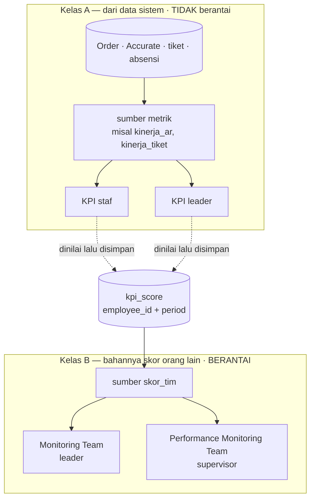
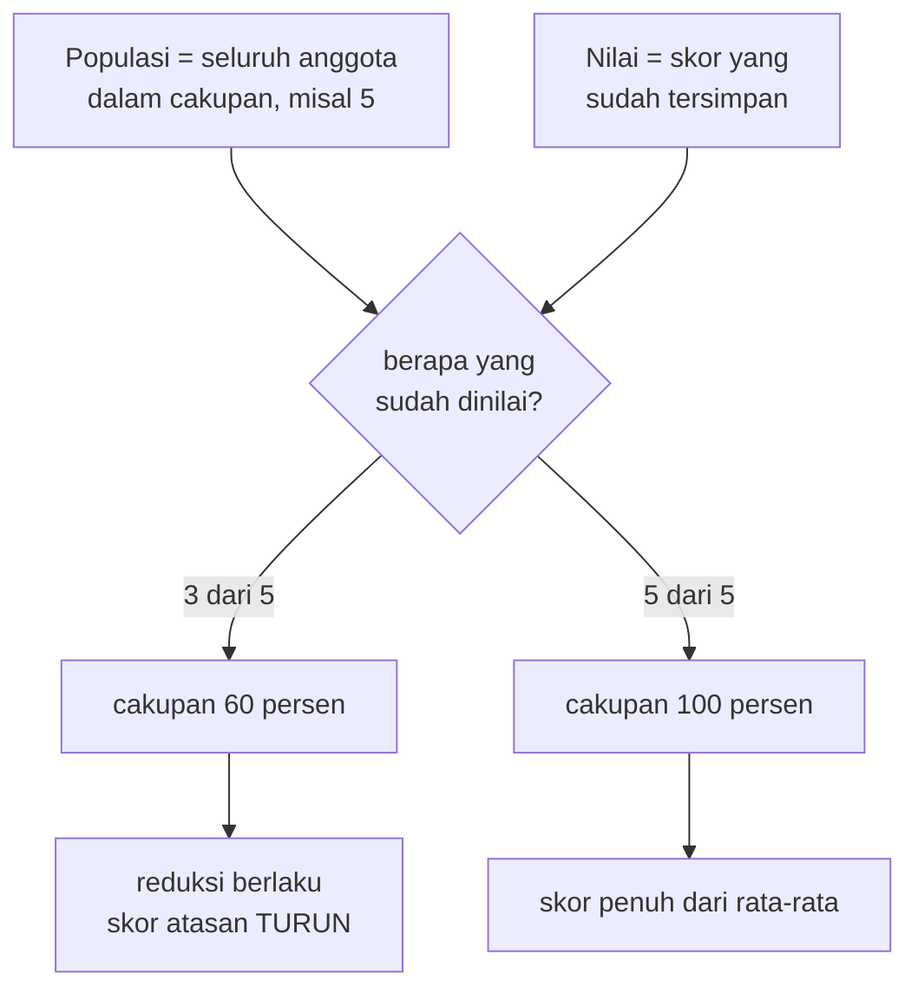
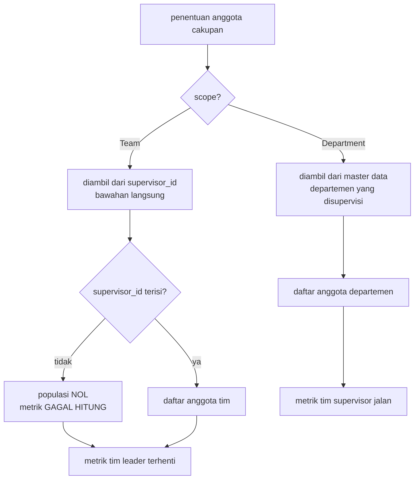

## Deskripsi

*Penjelasan otomasi skor KPI dalam bentuk diagram. Ada **tiga**: gambaran besar untuk pembaca non-teknis, alur rinci untuk dev, dan satu khusus divisi marketing yang menggambarkan alurnya beserta keadaan terukurnya. Ketiganya tersimpan di `Additional documents/Excalidraw/`; halaman ini catatan penunjuknya, sekaligus supaya diagramnya terjangkau pencarian vault (folder `Additional documents/` tidak diindeks).*

- **Bentuk**: tiga diagram Excalidraw
- **Status**: ⚠️ Gambarnya masih selaras. Teks penyerta **dua diagram lintas-departemen** diperbarui 11 Agustus 2026; diagram **marketing** diukur ulang ke produksi **26 Agustus 2026**. Rangkaian dan prinsipnya tidak berubah; yang berubah keadaan nyatanya. Lihat catatan di bawah tabel.

| Versi | Untuk siapa | Menjawab apa |
|---|---|---|
| [[HRIS - Alur KPI Otomatis.excalidraw]] | SPV, Leader, HR, direksi | Kenapa skornya belum terisi sendiri padahal matriknya sudah lengkap |
| [[HRIS - Alur KPI Otomatis Rinci.excalidraw]] | Dev departemen | Sembilan langkah yang benar-benar dijalankan employee-service, beserta katalog rumus, arah target, dan jalur kegagalan |
| [[HRIS - Alur KPI Otomatis Marketing.excalidraw]] | SPV & Leader Beauty Hacks/Kyura, dev marketing | Lima tahap yang benar-benar jalan untuk marketing, dan **di tahap mana** yang belum jalan itu tersendat |

### Versi gambaran besar

![[HRIS - Alur KPI Otomatis.excalidraw]]

### Versi rinci

![[HRIS - Alur KPI Otomatis Rinci.excalidraw]]

### Versi marketing (Beauty Hacks · Kyura)

![[HRIS - Alur KPI Otomatis Marketing.excalidraw]]

Dua diagram di atas menjelaskan mesinnya secara umum. Yang ini menjawab pertanyaan yang berbeda: **untuk marketing, tahap mana yang sudah jalan dan tahap mana yang menahan**, karena penyebab sebuah metrik kosong hampir tidak pernah ada di tahap tempat kekosongan itu terlihat.

Perlu diketahui sebelum membacanya:

- **"Marketing" bukan nama departemen di sistem ini.** Yang ada `Beauty Hacks` dan `Kyura`; identitas tim tunggalnya diputuskan di [[ADR - 0045 Identitas Tim Tunggal dan Peta Kepemilikan Marketing]]. Kode pun menuliskan daftarnya eksplisit (`departemenMarketingTarget` di `services/employee/kpi_target_marketing.go`).
- **Seluruh angkanya diukur langsung ke produksi 26 Agustus 2026**, bukan disalin dari dokumen lain: cakupan dari `GET /kpi/auto-scores`, katalog dari `GET /kpi/sumber-katalog`, dan alasan kegagalan dari `auto_basis` di `GET /kpi/auto-values`. Angka di [[HRIS - Matriks KPI per Departemen]] masih potret 1 Agustus 2026 dan sudah bergeser jauh sejak itu.
- **Alur target berjenjang** (Finance → SPV → Direktur, lewat `/kpi/target-marketing`) sengaja digambar terpisah dengan garis putus-putus: rutenya ada di biner produksi dan halaman `/finance/target-marketing` sudah ter-build, tetapi koleksi `kpi_target_marketing` masih kosong dan antrean persetujuan Direktur belum ter-deploy. Ia belum jadi bagian alur yang berjalan.

Dua hal yang paling sering disalahpahami dan karena itu diberi kotak sendiri di diagram: **skor otomatis bukan skor final** (ia hanya usulan atas metrik yang berhasil dihitung, dan yang menyimpan tetap penilai), dan **kegagalan sebuah metrik biasanya berpangkal di tahap 2**: orang yang belum terpetakan ke toko atau ke struktur tim insentif akan mendapat kolom kosong di tahap 5, jauh dari sebabnya.

## Rangkaiannya, dalam lima langkah

1. Tim bekerja seperti biasa (Kyura, IT, HR, Gudang).
2. Pekerjaannya tercatat lewat aplikasi (absensi, tiket, monitoring, TikTok).
3. Catatannya tersimpan di database.
4. Sistem menghitung skor tiap orang, dibandingkan dengan **matrik KPI per posisi**.
5. Skor KPI terisi sendiri; atasan tinggal memeriksa, bukan menebak.

Mesin langkah 4 sudah jalan di produksi sejak 1 Agustus 2026.

⚠️ **Kalimat lama "0 dari 70 matrik diisi pengaturannya" sudah TIDAK berlaku.** Sejak **6 Agustus 2026** tiga metrik Tech Development benar-benar terisi otomatis di produksi, dan penilai sudah melihat usulannya di modal Score KPI. Yang masih benar: sisanya, **308 dari 311 metrik**, belum diisi pengaturannya.

Alat yang membuat pengisian itu jadi pekerjaan HR alih-alih pekerjaan dev — katalog sumber, pratinjau sebaran sebelum simpan, dan target berbeda per karyawan — **sudah merged tetapi belum di-deploy**. Angka mutakhir beserta gap yang tersisa dipelihara di [[HRIS - Otomasi Skor KPI]], bukan di halaman ini.

## Tiga syarat yang sering terlupa

Rangkaian di atas terlihat mulus, tetapi tiap langkah punya syarat yang selama ini justru jadi penghambat sebenarnya. Ketiganya **bukan pekerjaan kode**.

| Syarat | Buktinya di sistem sekarang |
|---|---|
| Aplikasinya sungguh dipakai dan diisi lengkap | Tenggat tiket tidak pernah diisi, jadi kecepatan penyelesaian tidak bisa dihitung sama sekali (**0 dari 293 tiket**) |
| Sistem tahu data itu milik siapa | **86.845 video** tersimpan, tapi baru **10 dari 41 ICC** tercatat memegang toko. Datanya ada, pemiliknya yang belum |
| Matriknya mungkin diukur | Satu metrik meminta 70% video berjenis VSA, padahal dari **104.269 video hanya ada 73**. Semua orang akan dapat nol, selamanya |

## Metrik yang bahannya skor orang lain

Lima langkah di atas menggambarkan garis lurus dari pekerjaan ke skor. **Satu jenis metrik tidak mengikuti garis itu**: metrik tim, yang bahannya justru skor anggota. Ia menjelaskan pertanyaan yang paling sering muncul dari atasan — *"kenapa skor tim saya rendah padahal anak buah saya bagus?"*

### Dua kelas metrik

Kelas A terisi sendiri dan urutannya bebas. Hanya panah putus-putus itu yang berantai — dan ia mengikat **di akhir periode**, bukan saat konfigurasi dipasang. Metrik tim tetap boleh dikonfigurasi lebih dulu; ia hanya melaporkan cakupan rendah sampai anggotanya dinilai.

Satu koreksi istilah yang sering keliru: yang mengisi skor staf **bukan stafnya sendiri**, melainkan **penilai** yang menyimpannya. Staf tidak menginput KPI-nya.

### Kenapa tidak bisa dicurangi — mekanisme cakupan

`skor_tim` melaporkan dua hal terpisah: **Nilai** (skor anggota yang sudah tersimpan) dan **Populasi** (seluruh anggota dalam cakupan).

Atasan karena itu **tidak dapat memperoleh nilai penuh dari tiga orang yang kebetulan bagus** — sistem tahu dua lagi belum dinilai, dan ketidaklengkapan itu menurunkan skornya. Inilah kegunaan `Populasi` yang dibedakan dari jumlah pengukuran.

### Cakupan tim menuntut atasan tercatat, cakupan departemen tidak

⚠️ **Ini penghambat nyata, bukan hipotetis.** Seluruh **19 karyawan Finance** tidak punya `supervisor_id` terisi, sehingga metrik `Monitoring Team` milik AR Leader mustahil dihitung dengan cakupan tim — populasinya nol. Cakupan **departemen** tidak terpengaruh, jadi `Performance Monitoring Team` milik Supervisor FAT tetap dapat berjalan.

Mengisinya adalah **pekerjaan data HR**, sekali jalan, dan ia membuka beberapa metrik sekaligus.

## Prinsip yang mengikat mesinnya

Kalau salah satu syarat belum terpenuhi, sistem **tidak mengarang angka**. Metrik itu ditandai "belum bisa dihitung" beserta alasannya, dan penilaiannya kembali manual seperti sekarang.

Alasannya sederhana: angka karangan lebih berbahaya daripada kolom kosong, karena tidak ada yang curiga padanya. Kolom kosong terlihat dan ditanya; angka yang tampak wajar tetapi salah akan dipakai menilai orang tanpa seorang pun memeriksanya.

## Dokumen Terkait

- [[HRIS - Otomasi Skor KPI]] (analisis kelayakan, peta sumber data, rencana bertahap)
- [[HRIS - Matriks KPI per Departemen]] (isi lengkap 311 metrik produksi per departemen)
- [[RUN - Menambah Metrik KPI Otomatis]] (cara dev menambah metrik otomatis)
- [[HRIS - Key Performance Index]] (mekanisme scoring dan RBAC)
