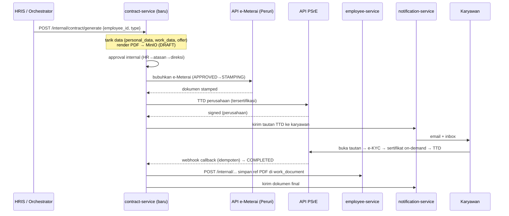

## Deskripsi

*Digitalisasi kontrak kerja karyawan (PKWT/PKWTT) secara menyeluruh: pembuatan dokumen dari template berbasis data HRIS, alur persetujuan internal, penandatanganan elektronik **tersertifikasi**, dan pembubuhan **e-Meterai** resmi — tanpa kertas. Melengkapi monitoring masa kontrak yang sudah ada di [[HRIS - Personalia]] (yang saat ini hanya memantau, belum menandatangani). Desain integrasi: sebagian besar dibangun sendiri (kendali penuh), hanya dua fungsi bersertifikasi — TTE tersertifikasi (PSrE) dan e-Meterai (Peruri) — yang diintegrasikan lewat API penyedia berlisensi.*

- **Status**: 🟡 **Konsep / Direncanakan** — belum ada di kode.
- **Ruang lingkup implementasi**: usulan **service baru `contract-service`** (belum ada) + konektor eksternal **PSrE** & **e-Meterai**.
- **Kondisi terkini (grounded)**: satu-satunya "contract" di kode = **view monitoring** `GET /contract` di [[Microservices - Employee Service]] (`services/employee/main.go`) yang menghitung `contract_status` (*ongoing/ending/expired*) dari `work_data.employment_type` + `work_data.contract_ending`. FE type `Contract` (`erp-frontend`) sudah punya slot opsional `file_object?`. **Tidak ada** e-signing / tanda tangan digital / e-Meterai di seluruh `bip-erp`.

## Latar Belakang & Landasan Hukum

Penerbitan kontrak kerja masih berbasis kertas: cetak (kerap ~10 lembar), tempel materai fisik, tanda tangan basah dua pihak, serah-terima fisik saat onboarding, arsip di berkas kepegawaian. Dampak: onboarding lambat (kontrak sering menyusul setelah karyawan bekerja), berkas mudah hilang, dan masa berlaku PKWT sulit dipantau otomatis (risiko kewajiban uang kompensasi & kepatuhan PP 35/2021).

Tiga lapis regulasi membentuk desain:
- **Ketenagakerjaan** — UU 13/2003 jo. UU 6/2023 (Cipta Kerja) + PP 35/2021. PKWT wajib tertulis & Bahasa Indonesia → cocok untuk template baku. Bentuk elektronik tidak mengurangi keabsahan.
- **Tanda tangan elektronik** — UU ITE (UU 11/2008 jo. UU 1/2024) + PP 71/2019. Gunakan **TTE tersertifikasi** (identitas terverifikasi, sertifikat dari **PSrE** berlisensi Komdigi) untuk kedua pihak. **Tantangan khas kontrak kerja**: penandatangan perusahaan biasanya sudah bersertifikat, tetapi **karyawan sebagai individu umumnya belum** → butuh penerbitan sertifikat *on-demand* via **e-KYC** (NIK/Dukcapil + liveness) saat tanda tangan.
- **Bea meterai / e-Meterai** — UU 10/2020 + PP 86/2021. e-Meterai **hanya sah bila diterbitkan Perum Peruri** (via distributor resmi) — perusahaan **tidak boleh** menerbitkan sendiri. Perjanjian kerja adalah objek bea meterai (tarif Rp10.000), **tetapi materai bukan syarat sah** perjanjian; ia berfungsi agar dokumen langsung menjadi alat bukti. → **e-Meterai diterapkan per kebijakan/jenis kontrak**, bukan wajib otomatis semua dokumen.

**Konsekuensi arsitektur**: dua fungsi tersertifikasi (TTE + e-Meterai) tidak dapat dibangun sendiri secara legal dan **wajib** lewat penyedia berlisensi; sisanya (template, approval, arsip, audit, integrasi ERP) dibangun internal.

## Arsitektur Usulan

**Usulan: service baru `contract-service`** (pola sama seperti [[Microservices - HRD Document Service]] — Go + Fiber + MongoDB, DB sendiri, di belakang [[CORE - API Master Gateway]] map `/api/contract/*`). Alasan tidak menempel ke employee-service: alur signing bersifat **asinkron & human-in-the-loop** (karyawan tanda tangan lewat tautan; provider callback via webhook) sehingga butuh *state machine* + penerima webhook sendiri.

Komponen — reuse (grounded) vs baru:

| Kebutuhan | Komponen | Status |
|---|---|---|
| Pemicu saat hire | [[CORE - HRIS Orchestrator]] (`orchestrator/hris`, :7000) | reuse |
| Sumber term karyawan baru | [[Microservices - Recruitment Service]] `Offer` (`models_offer.go`) | reuse |
| Data pihak karyawan + write-back | [[Microservices - Employee Service]] `personal_data` · `work_data` · `work_document` | reuse |
| Arsip PDF final | [[Microservices - File Service]] / MinIO (prefix baru `contract/`) | reuse + config baru |
| Kirim tautan TTD & dokumen | [[Microservices - Notification Service]] `POST /email/send` (Resend) + inbox | reuse |
| Template + state machine + audit + konektor PSrE/e-Meterai | **`contract-service`** | **baru** |
| TTE tersertifikasi & e-Meterai | **API PSrE + API e-Meterai (Peruri)** | **eksternal (berlisensi)** |

**Tidak dipakai untuk arsip PDF**: [[Microservices - HRD Document Service]] menyimpan konten sebagai **Markdown (`body_md`), bukan file PDF binary** → tidak cocok apa adanya untuk artefak ber-meterai. Yang diadopsi hanya *pola* acknowledgement + versioning-nya sebagai acuan konsep.

## Pemicu (Triggers)

### `new_hire` — karyawan baru (kontrak PKWT / PKWT-Evaluasi)

Rantai hire yang **sudah ada** (grounded — [[CORE - HRIS Orchestrator]], [[Microservices - Recruitment Service]]):

```
Kandidat "Hired"
  → HRIS "Tambah Karyawan (dari kandidat)"  [prefill data kandidat]
  → POST /api/hris/employees/multi           (HRIS Orchestrator)
      → executeTransaction: validasi → upload dok MinIO →
        employee-service POST /internal/transaction/create-employee → WA notif (goroutine, best-effort)
  → recruitment PUT /candidates/:id/link-employee   (set employee_id, progress → "Onboarding")
  → employee-service POST /onboarding/register        (aktivasi akun + temp password)
```

**Titik sisip yang direkomendasikan**: setelah `executeTransaction` **commit sukses**, orchestrator memanggil (best-effort, meniru pola goroutine WA notif):

```
POST /internal/contract/generate   (→ contract-service)
{ "employee_id": "...", "candidate_id": "...", "type": "new_hire" }
```

- Orchestrator dipilih karena satu-satunya titik yang memegang **kedua konteks** (employee baru + offer kandidat).
- Generate kontrak **bukan** bagian transaksi atomik create-employee (proses human-loop panjang) → dipanggil setelah commit; kegagalannya tidak membatalkan hire.
- Karyawan baru masuk sebagai `employment_type = "PKWT (Evaluasi)"` → kontrak pertama = kontrak masa percobaan.

**Rantai lanjutan (grounded)**: hasil Performance Review masa evaluasi (`Lulus / Diperpanjang / Tidak Lulus` — lihat [[HRIS - Recruitment]]) menjadi pemicu kontrak berikutnya: *Lulus* → generate PKWT/PKWTT (`type: renewal`/`conversion`); *Diperpanjang* → `type: addendum`.

### `renewal` / `addendum` — perpanjangan & amandemen

Sumber sinyal (grounded): `GET /contract` menghitung `contract_status` *ending/expired* dari `work_data.contract_ending`. Sudah selaras dengan monitoring PKWT di [[HRIS - Personalia]] ("notifikasi 1 bulan sebelum masa kontrak habis").

Opsi pemicu:
1. **Aksi HR manual** dari halaman monitoring → gateway → `POST /internal/contract/generate {type:"renewal"|"addendum", employee_id, ...}`. **Rekomendasi utama** (tanpa infra baru).
2. **Pengingat terjadwal** → **TBD**: `bip-erp` **belum punya scheduler/cron/event bus** (Redis hanya cache/queue). Bila diinginkan otomatis: job harian di `contract-service` yang mem-*poll* kontrak *ending* lalu notifikasi HR via [[Microservices - Notification Service]].

## Pemetaan Field Template ← Sumber Data

Template diisi otomatis saat `generate` (tarik data), bukan diketik ulang:

| Blok | Field template | Sumber (grounded) | Catatan |
|---|---|---|---|
| **Pihak perusahaan** | nama badan usaha, alamat, penandatangan berwenang | **TBD — belum ada company/legal-entity master di `bip-erp`** | perlu master/config baru |
| **Pihak karyawan** | nama, NIK, tempat & tgl lahir, alamat | employee `personal_data`: `full_name`, `nik_number`, `date_of_birth`, `home_address` | |
| **Jabatan & unit** | jabatan, departemen, tgl mulai, jenis PK | employee `work_data`: `position`, `department`, `join_date`, `employment_type` | enum: PKWTT / PKWT / PKWT (Evaluasi) / Magang |
| **Term komersial (`new_hire`)** | gaji pokok, tunjangan, tgl mulai, masa percobaan | recruitment `Offer`: `gaji_pokok`, `tunjangan`, `tanggal_mulai`, `masa_percobaan` | offer = sumber otoritatif saat hire |
| **Term komersial (`renewal`)** | gaji terkini | [[Microservices - Payroll Service]] `employee_salary` (Fase 1) | ⚠️ **employee master TIDAK menyimpan gaji** (grounded) — tetapkan sumber otoritatif |
| **Periode kontrak** | tgl mulai, tgl berakhir | `work_data.join_date` / `contract_ending`, atau input HR | |
| **Nomor & tanggal kontrak** | nomor dokumen | generator `contract-service` | baru |

> Catatan struktur (grounded): tidak ada `supervisor_id` di struct `work_data`; relasi atasan diturunkan dari `is_supervisor=true` + `department` yang sama — relevan bila approver perlu ditentukan otomatis. Lihat [[HRIS - Organization Structure]].

## Alur PSrE + e-Meterai

### State machine (`contract-service`)

```
DRAFT ──▶ PENDING_APPROVAL ──▶ APPROVED ──▶ STAMPING (e-Meterai)
                                                   │
                                                   ▼
COMPLETED ◀── SIGNING_EMPLOYEE ◀── SIGNING_COMPANY
   (+ e-KYC & terbit sertifikat on-demand utk karyawan)

jalur samping: DECLINED · EXPIRED · CANCELLED  (dari state mana pun sebelum COMPLETED)
```

**Urutan meterai → tanda tangan** (bukan sebaliknya): e-Meterai dibubuhkan lebih dulu agar TTE tersertifikasi **mengunci dokumen yang sudah ber-meterai** (integritas kriptografis mencakup materai). Sebagian provider menggabungkan stamp+sign dalam satu panggilan (*bundled*) → urutan final mengikuti kemampuan provider terpilih (**TBD**).

### Urutan panggilan

1. **generate** — render PDF dari template + data (lihat pemetaan) → simpan draft ke MinIO `contract/<contractID>/` via [[Microservices - File Service]].
2. **approval internal** — HR → atasan (`is_supervisor`) → direksi, di `contract-service`. RBAC: **role sistem baru** (mis. `contract`) mengikuti konvensi `system_roles` key = **modul** (bukan departemen).
3. **e-Meterai** (`APPROVED`) — `contract-service` → **API e-Meterai** (Peruri via distributor/PSrE) bubuhkan materai di koordinat → dokumen *stamped*.
4. **TTD perusahaan** — → **API PSrE** buka sesi TTD penandatangan berwenang (sertifikat perusahaan sudah ada) → tersertifikasi.
5. **TTD karyawan** — kirim **tautan tanda tangan** via [[Microservices - Notification Service]] `POST /email/send` (+ inbox). Karyawan buka → **e-KYC** → penerbitan sertifikat *on-demand* → TTD tersertifikasi. *(asinkron, human-in-the-loop)*
6. **webhook callback** — PSrE memanggil balik tiap tahap selesai → `contract-service` update state. **Routing**: manfaatkan pola gateway `/ext/webhook/:service` (dipakai [[Microservices - Integration Service]] untuk callback eksternal) → arahkan ke `contract-service`; validasi signature. **Wajib idempoten** (callback bisa berulang).
7. **finalize** (`COMPLETED`) — tarik PDF final ber-TTE + meterai → simpan MinIO → jalankan write-back.

### Konektor & konfigurasi (baru)

- `contract-service` memiliki **client PSrE + client e-Meterai** sendiri (meniru cara [[Microservices - Notification Service]] memiliki client Resend). Gagal panggilan eksternal → retry + state `FAILED`, tidak menyentuh data master.
- **Env baru**: `CONTRACT_MODULE_URL`, `PSRE_API_URL`/`PSRE_API_KEY`, `EMETERAI_API_URL`/`EMETERAI_API_KEY`, `MINIO_CONTRACT_KEY` (+ `_READ_KEY`).
- Panggilan `/internal/...` antar-service tetap lewat `routes.InternalRequest` (header `GatewayID` = `INTERNAL_GATEWAY_KEY` + forward identitas) — grounded. Lihat [[ADR - 0002 Database-per-Service]].



## Status yang Ditulis Balik (write-back)

| Target | Yang ditulis | Endpoint |
|---|---|---|
| `contract-service` (baru) | record kontrak otoritatif: `state`, jejak audit tiap event, object PDF final, id transaksi PSrE/meterai | owner data |
| [[Microservices - Employee Service]] | referensi PDF final ke `work_document` (`common.Document`: `DocumentType="employment_contract"`, `FilePath`/`FileURL` MinIO, `Version`); update `contract_ending`/`employment_type` bila renewal mengubah masa/tipe | `POST /internal/...` (**baru** di employee-service) |
| Monitoring `GET /contract` | `contract_status` **+ file final** — FE type `Contract.file_object?` sudah tersedia | existing, diperkaya |
| [[Microservices - Recruitment Service]] | (opsional) tandai kandidat "kontrak terbit/tertandatangani"; kandidat sudah punya `employee_id` + `progress="Onboarding"` | existing |
| [[Microservices - Notification Service]] | notifikasi tiap milestone (tautan TTD, dokumen final, pengingat) | `POST /email/send` + inbox |

## Belum Diputuskan (TBD)

- **Company/legal-entity master** — data & penandatangan pihak perusahaan belum ada di `bip-erp`.
- **Sumber gaji otoritatif** saat generate: recruitment `offer.gaji_pokok` (new hire) vs payroll `employee_salary` (renewal).
- **Scheduler pengingat perpanjangan** — tidak ada infra cron/event; pilih pola (poll harian vs manual HR).
- **Provider PSrE/e-Meterai** — Tilaka / Privy / Mekari; termasuk apakah e-Meterai lewat provider yang sama & urutan *bundled* vs terpisah.
- **Owner arsip PDF** — konfirmasi `contract-service` + MinIO prefix `contract/` sebagai penyimpan artefak final (HRD Document tak simpan binary).
- **RBAC role baru** (`contract`?) untuk approver — mengikuti `system_roles` key=modul.
- **Jenis kontrak wajib e-Meterai** — pemetaan agar penggunaan tepat sasaran.
- **ADR**: keputusan "service baru `contract-service` + integrasi lapisan tersertifikasi via API berlisensi" layak dipromosikan menjadi ADR baru di **Decisions** (pola [[ADR - 0013 HRD Documents]]).

## Dependensi & Integrasi

- [[CORE - HRIS Orchestrator]] — pemicu `new_hire` (setelah create-employee commit).
- [[Microservices - Recruitment Service]] — sumber term offer + status kandidat/onboarding.
- [[Microservices - Employee Service]] — data `personal_data`/`work_data`, write-back `work_document`, monitoring `GET /contract`.
- [[Microservices - Payroll Service]] — sumber gaji untuk renewal.
- [[Microservices - File Service]] — arsip PDF (MinIO prefix `contract/`).
- [[Microservices - Notification Service]] — tautan TTD & dokumen final (Resend + inbox).
- [[Microservices - Integration Service]] — pola gateway `/ext/webhook/:service` untuk callback PSrE.
- [[CORE - API Master Gateway]] — routing `/api/contract/*` + auth SSO. [[ADR - 0002 Database-per-Service]] — DB terpisah.

## Dokumen Terkait

- [[HRIS - Personalia]] (administrasi kontrak/PKWT & monitoring — induk) · [[HRIS - Recruitment]] (alur hire → onboarding/masa evaluasi) · [[HRIS - Compensation & Benefits]] (term komersial)
- [[Microservices - HRD Document Service]] (pola versioning/ack — acuan konsep, bukan arsip PDF)
- [[HRIS - Big Pictures]]
