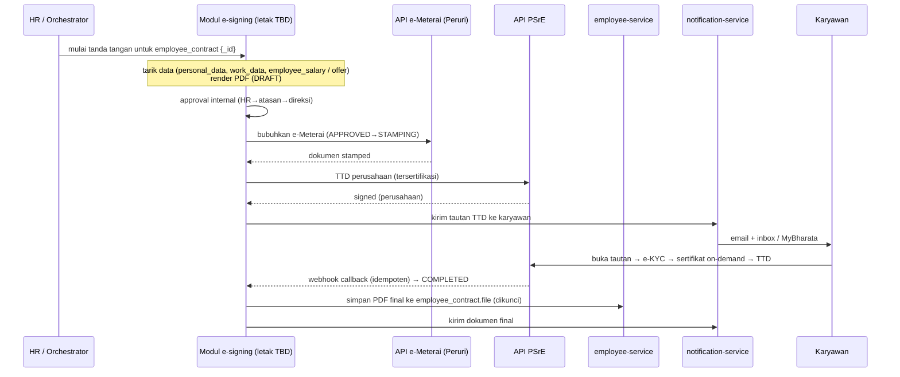

## Deskripsi

*Digitalisasi kontrak kerja karyawan (PKWT/PKWTT) secara menyeluruh: dokumen dibuat dari template berbasis data HRIS, disetujui internal, ditandatangani secara elektronik **tersertifikasi**, dan dibubuhi **e-Meterai** resmi, tanpa kertas. Dibangun di atas modul riwayat kontrak yang **sudah live** di [[Microservices - Employee Service]] (koleksi `employee_contract`), yang hari ini hanya menyimpan PDF yang ditandatangani di luar sistem. Prinsip integrasinya ([[ADR - 0019 Kontrak Kerja Elektronik via Service Internal + Lapisan Tersertifikasi]]): sebagian besar dibangun sendiri, hanya dua fungsi bersertifikasi (TTE tersertifikasi lewat PSrE dan e-Meterai lewat Peruri) yang diintegrasikan lewat API penyedia berlisensi.*

- **Status**: 🟡 **Konsep / Direncanakan** untuk e-signing dan e-Meterai, belum ada di kode. Pondasinya (riwayat kontrak + lampiran PDF) sudah ✅ live di employee-service, diverifikasi ke `bip-erp` `origin/main` `915ca2f8` pada 2026-09-11; rinciannya di §Pondasi yang Sudah Ada.
- **Ruang lingkup implementasi**: template, alur tanda tangan, arsip final, dan konektor eksternal **PSrE** + **e-Meterai**. Letak kodenya (**service baru `contract-service`** sesuai usulan ADR 0019, atau memperluas modul kontrak employee-service) **belum diputuskan**; lihat §Belum Diputuskan.
- **Endpoint yang sudah ada**: [[API - Employee Service]] §Kontrak Kerja. Layar HR: [[APP - Web ERP]] `/hris/contract`.

## Persona / Pengguna

| Persona | Peran & Divisi | Akses/RBAC | Device |
|---|---|---|---|
| Staf HR (Personalia) | menyiapkan, memperpanjang, dan mengoreksi kontrak; mengunggah PDF bertanda tangan | `gateHris` + `RequireHRISStaff` (baca `PermHrisView`, tulis `PermHrisWork`) | Web ERP, `/hris/contract` |
| Karyawan (Pihak Kedua) | pihak yang menandatangani | **belum punya akses** ke kontraknya sendiri; hanya melihat tanggal berakhir kontraknya di kalender pribadi | [[APP - MyBharata]] |
| Penandatangan perusahaan (Pihak Pertama; direktur di template PKWT) | menandatangani seluruh PKWT atas nama perusahaan | belum dimodelkan di sistem | TBD |

- **Tujuan**: kontrak terbit dan ditandatangani tanpa cetak, meterai tempel, dan tanda tangan basah; arsipnya tidak tercecer; karyawan memegang salinannya.
- **Pain point (grounded)**: dokumen kontrak disiapkan dan ditandatangani di luar sistem, lalu PDF-nya diunggah HR secara manual; isinya tidak terisi otomatis dari data karyawan; karyawan tidak punya jalur membuka kontraknya sendiri.
- **Aksi utama**: buat kontrak / perpanjangan → kirim untuk ditandatangani → arsipkan versi final.

## Pondasi yang Sudah Ada (grounded)

Diverifikasi ke `bip-erp` `origin/main` `915ca2f8`, `erp-frontend` `origin/main` `47e1dd8b`, dan `mybharata-app` `origin/main`, 2026-09-11.

| Sudah ada | Di kode | Peran untuk e-signing |
|---|---|---|
| Koleksi `employee_contract` sebagai sumber kebenaran; perpanjangan = dokumen **baru**, dokumen lama tak ditimpa | `EmployeeContract` (`shared-library/models/employee/models.go`), `services/employee/contract.go` | satu dokumen kontrak = satu objek yang ditandatangani |
| Validasi server: jenis `PKWTT`/`PKWT`/`PKWT (Evaluasi)`/`Magang`; PKWTT tanpa tanggal berakhir, jenis lain wajib; kontrak tumpang tindih ditolak | `validateContract` (`contract.go`) | |
| Salinan `work_data.employment_type` + `contract_ending` ditulis **hanya** oleh modul kontrak (`segarkanSalinan`); pintu tulis `work_data` lain membuang kedua field itu | `contract.go`, `partial_update.go`; lihat [[REF - Kepemilikan Data]] | konektor e-signing tidak boleh menulis `work_data` langsung |
| Kontrak pertama lahir otomatis di transaksi create-employee | `kontrakPertama` (`contract.go`), dipanggil `func.go` | record yang bisa diacu pemicu `new_hire` |
| Migrasi saat boot: karyawan lama dibuatkan satu kontrak `migrated: true` dengan `start_date` = `join_date` (hanya perkiraan) | `contract_migrate.go` | |
| Nomor kontrak otomatis `NNN/<type>/<company_id>/<bulan romawi>/<tahun>` | `nomorKontrak` (`contract.go`) | ⚠️ lihat celah 1 |
| Lampiran PDF per kontrak (PDF saja, maks 4 MB), object key `employee/<employee_id>/contract/<contract_id>/<hex>.pdf` lewat [[Microservices - File Service]] | `contract_file.go`, field `EmployeeContract.File` | slot arsip PDF final |
| Status dihitung saat baca: `ongoing` / `ending` (berakhir dalam 2 bulan) / `expired`, plus kartu ringkasan | `contract.go`, `contract_summary.go` | sinyal perpanjangan |
| Feed kalender `contract_end`, hanya kontrak **milik pemanggil sendiri** | `calendar_feed.go` → [[Microservices - Calendar Service]] | |
| Cron (`robfig/cron`) sudah berjalan di employee-service untuk resign, mutasi, KPI, dan lain-lain | `services/employee/cron.go` | tempat job pengingat bila dibutuhkan |
| Layar HR: daftar, kartu ringkasan, dan panel riwayat (perpanjang, perbaiki, unggah/ganti/buka lampiran) | `erp-frontend` `app/(main)/hris/contract/page.tsx`, `features/hris/contract/` | |
| Preseden pembuatan PDF di server: slip gaji dengan `go-pdf/fpdf` | `services/payroll/payslip_pdf.go` | |
| MyBharata sudah memuat `webview_flutter` dan `syncfusion_flutter_pdfviewer` | `mybharata-app/pubspec.yaml` | jalur baca dan tanda tangan karyawan di aplikasi |

> Koreksi atas versi sebelumnya dok ini: `Contract.file_object` di tipe FE daftar kontrak adalah **foto karyawan** untuk avatar (`EmployeeIdentityCell`), bukan slot berkas kontrak. Berkas kontrak ada di `EmployeeContract.File`.

### Celah pondasi yang harus ditutup sebelum e-signing

1. **Nomor kontrak tidak unik.** Urutan `NNN` dihitung **per karyawan** (jumlah kontrak karyawan itu ditambah satu, sehingga kontrak pertama dan hasil migrasi selalu `001`), dan tidak ada index unik pada `number`. Dua karyawan berjenis kontrak sama yang mulai di bulan yang sama mendapat nomor identik. Formatnya juga belum dikonfirmasi HR (komentar di `nomorKontrak`) dan berbeda dari kop template PKWT HR (`…/HRD/PKWT/…/…`).
2. **Lampiran bisa diganti kapan saja.** Kontrol unggah selalu tampil di panel riwayat, dan objek lama dihapus dari MinIO saat diganti. Untuk PDF yang sudah ditandatangani, penggantian harus dikunci atau minimal teraudit.
3. **Karyawan tidak punya jalur ke kontraknya sendiri.** Seluruh rute kontrak bergerbang `RequireHRISStaff`. Feed kalender `contract_end` menampilkan kontrak milik pemanggil dengan `deep_link` `/hris/contract?employee_id=<id>`, padahal halaman itu khusus staf HRIS dan tidak membaca parameter `employee_id`.
4. **Belum ada notifikasi otomatis kontrak mendekati habis.** Tidak ditemukan di employee-service maupun notification-service (git grep `origin/main`, 2026-09-11). Yang ada hanya status `ending` di layar dan feed kalender pribadi.
5. **Validasi hanya mengecek tumpang tindih**, belum batas total durasi PKWT.

## Latar Belakang & Landasan Hukum

Kontrak kerja masih disiapkan dan ditandatangani di luar sistem: cetak, meterai tempel, tanda tangan basah dua pihak, serah-terima fisik saat onboarding, lalu (sejak modul riwayat kontrak ada) PDF-nya diunggah HR ke kontrak yang bersangkutan. Dampaknya: onboarding lambat (kontrak sering menyusul setelah karyawan bekerja), berkas mudah hilang, dan kepatuhan PKWT sulit dipantau (risiko kewajiban uang kompensasi dan kepatuhan PP 35/2021).

Tiga lapis regulasi membentuk desain:
- **Ketenagakerjaan**: UU 13/2003 jo. UU 6/2023 (Cipta Kerja) + PP 35/2021. PKWT wajib tertulis dan berbahasa Indonesia, cocok untuk template baku. Bentuk elektronik tidak mengurangi keabsahan.
- **Tanda tangan elektronik**: UU ITE (UU 11/2008 jo. UU 1/2024) + PP 71/2019. Gunakan **TTE tersertifikasi** (identitas terverifikasi, sertifikat dari **PSrE** berlisensi Komdigi) untuk kedua pihak. **Tantangan khas kontrak kerja**: penandatangan perusahaan biasanya sudah bersertifikat, tetapi **karyawan sebagai individu umumnya belum**, sehingga butuh penerbitan sertifikat *on-demand* lewat **e-KYC** (NIK/Dukcapil + liveness) saat tanda tangan. Gambar tanda tangan yang ditempel ke PDF bukan TTE tersertifikasi.
- **Bea meterai / e-Meterai**: UU 10/2020 + PP 86/2021. e-Meterai **hanya sah bila diterbitkan Perum Peruri** (lewat distributor resmi); perusahaan **tidak boleh** menerbitkan sendiri. Perjanjian kerja adalah objek bea meterai (tarif Rp10.000), **tetapi meterai bukan syarat sah** perjanjian; fungsinya agar dokumen langsung menjadi alat bukti. Karena itu e-Meterai **diterapkan per kebijakan/jenis kontrak**, bukan otomatis untuk semua dokumen.

**Konsekuensi arsitektur**: dua fungsi tersertifikasi (TTE + e-Meterai) tidak dapat dibangun sendiri secara legal dan **wajib** lewat penyedia berlisensi; sisanya (template, approval, arsip, audit, integrasi ERP) dibangun internal.

### Template PKWT yang berlaku

Sumber: dokumen template PKWT dari HR, diterima 2026-09-11 (berkasnya tidak disimpan di vault). Strukturnya:

| Bagian | Isi yang perlu diisi per kontrak |
|---|---|
| Kop + nomor | nomor berformat `…/HRD/PKWT/…/…` |
| Pihak Pertama | nama, jabatan (direktur), instansi, alamat perusahaan |
| Pihak Kedua | nama lengkap, NIK, tempat & tanggal lahir, alamat, telepon/HP, email |
| Pembuka | hari, tanggal, bulan, tahun perjanjian |
| Pasal 1 Ketentuan Umum | teks tetap |
| Pasal 2 Penunjukan | jabatan, lokasi kerja, durasi (bulan), tanggal mulai dan berakhir. Memuat kewajiban perusahaan menilai kinerja paling lambat 7 hari kerja sebelum kontrak berakhir |
| Pasal 3 Hak & Kewajiban | gaji mengikuti SK Direksi dengan rincian di Lampiran 1; jaminan sosial |
| Pasal 4 Sanksi | teks tetap |
| Pasal 5 Waktu Kerja | jam kerja, saat ini ditulis tetap di template |
| Pasal 6-7 | teks tetap; Pasal 7 menyatakan perjanjian dibuat bermeterai 10.000 |
| Tanda tangan | Pihak Pertama dan Pihak Kedua |
| Lampiran 1 Estimasi Gaji | jabatan, gaji pokok, kehadiran, tunjangan jabatan, uang makan (tunjangan tidak tetap), total terima |

## Arsitektur Usulan

Usulan ADR 0019 (2026-07-18): **service baru `contract-service`** (pola sama seperti [[Microservices - HRD Document Service]]: Go + Fiber + MongoDB, DB sendiri, di belakang [[CORE - API Master Gateway]] map `/api/contract/*`). Alasannya waktu itu: alur signing bersifat **asinkron dan human-in-the-loop** (karyawan tanda tangan lewat tautan, provider memanggil balik lewat webhook) sehingga butuh *state machine* + penerima webhook sendiri.

⛔ **Kendala yang muncul sesudah usulan itu**: record kontrak sudah hidup di `employee_contract`, dan [[REF - Kepemilikan Data]] menetapkannya sebagai pemilik. Bila `contract-service` dibangun, ia **tidak boleh** menyimpan record kontrak otoritatif kedua. State tanda tangan yang disimpan terpisah dari kontraknya membuat pertanyaan "kontrak ini sudah ditandatangani?" bisa punya dua jawaban di dua database.

Komponen, reuse (grounded) vs baru:

| Kebutuhan | Komponen | Status |
|---|---|---|
| Record kontrak + salinan `work_data` | employee `employee_contract` (pemilik) | **reuse, sudah live** |
| Pemicu saat hire | kontrak pertama sudah dibentuk di transaksi create-employee (`kontrakPertama`); [[CORE - HRIS Orchestrator]] tetap satu-satunya titik yang memegang konteks offer kandidat | reuse |
| Sumber term karyawan baru | [[Microservices - Recruitment Service]] `Offer` (`gaji_evaluasi`, `gaji_kontrak`, `tanggal_mulai`, `masa_evaluasi`) | reuse |
| Data pihak karyawan | employee `personal_data` · `work_data` | reuse |
| Arsip PDF final | `employee_contract.file` via [[Microservices - File Service]] (key `employee/<employee_id>/contract/<contract_id>/`) | reuse; slot sudah ada, perlu dikunci |
| Kirim tautan TTD & dokumen | [[Microservices - Notification Service]] (email Resend + inbox); jalur aplikasi [[APP - MyBharata]] | reuse; kategori inbox baru berarti pengirim dan notification-service naik bersama |
| Template + alur tanda tangan + audit + konektor PSrE/e-Meterai | letak **TBD** (`contract-service` baru atau modul kontrak employee-service) | **baru** |
| TTE tersertifikasi & e-Meterai | **API PSrE + API e-Meterai (Peruri)** | **eksternal (berlisensi)** |

**Tidak dipakai untuk arsip PDF**: [[Microservices - HRD Document Service]] menyimpan konten sebagai **Markdown (`body_md`), bukan file PDF binary**, jadi tidak cocok apa adanya untuk artefak bermeterai. Yang diadopsi hanya *pola* acknowledgement + versioning-nya sebagai acuan konsep.

## Pemicu (Triggers)

### `new_hire`: karyawan baru

Rantai hire yang **sudah ada** (grounded, [[CORE - HRIS Orchestrator]], [[Microservices - Recruitment Service]]):

```
Kandidat "Hired"
  → HRIS "Tambah Karyawan (dari kandidat)"  [prefill data kandidat]
  → POST /api/hris/employees/multi           (HRIS Orchestrator)
      → executeTransaction: validasi → upload dok MinIO →
        employee-service POST /internal/transaction/create-employee
          (di dalamnya: kontrakPertama membentuk employee_contract pertama,
           lalu work_data.employment_type/contract_ending diturunkan darinya)
        → WA notif (goroutine, best-effort)
  → recruitment PUT /candidates/:id/link-employee   (set employee_id, progress → "Onboarding")
  → employee-service POST /onboarding/register        (aktivasi akun + temp password)
```

- Karena record kontrak pertama sudah lahir di dalam transaksi create-employee, pemicu e-signing `new_hire` punya record yang bisa diacu; ia tidak perlu membuat record kontrak sendiri.
- Usulan ADR 0019 menaruh pemanggilan setelah `executeTransaction` **commit sukses** di orkestrator (best-effort, meniru pola goroutine WA notif), karena orkestrator satu-satunya yang memegang **kedua konteks** (employee baru + offer kandidat). Proses tanda tangan yang panjang tetap **bukan** bagian transaksi atomik create-employee; kegagalannya tidak membatalkan hire.
- Jenis kontrak pertama mengikuti `work_data.employment_type` dari form Tambah Karyawan (mis. `PKWT (Evaluasi)` atau `PKWT`).

**Rantai lanjutan (grounded)**: hasil Performance Review masa evaluasi (`Lulus / Diperpanjang / Tidak Lulus`, lihat [[HRIS - Recruitment]]) menjadi pemicu kontrak berikutnya.

### `renewal` / `addendum`: perpanjangan & amandemen

- **Sumber sinyal (grounded)**: status `ending` (kontrak berakhir dalam **2 bulan**) di `GET /contract`, `GET /contract/summary`, dan riwayat `GET /contract/:employee_id`.
- **Aksi HR manual sudah ada**: tombol perpanjang di panel riwayat → `POST /contract` membuat dokumen kontrak baru. Pemicu e-signing untuk perpanjangan cukup menempel di aksi ini.
- **Pengingat terjadwal**: infrastruktur cron sudah ada di employee-service (`cron.go`), tetapi **pengingat kontraknya belum ada** (lihat celah 4). Catatan "notifikasi 1 bulan sebelum masa kontrak habis" di [[HRIS - Personalia]] belum punya padanan di kode.

## Pemetaan Field Template ← Sumber Data

Diisi otomatis saat dokumen dibuat, bukan diketik ulang. Dicek per isian template PKWT HR (§Template PKWT yang berlaku), 2026-09-11:

| Bagian | Isian | Sumber (grounded) | Status |
|---|---|---|---|
| Kop | nomor kontrak | `nomorKontrak` (employee-service) | ⚠️ format dan keunikan, lihat celah 1 |
| Pihak Pertama | nama, jabatan, alamat penandatangan | **tidak ada**. Master tenant `Company` hanya `key`/`name`/`code` (`shared-library/models/employee/master_company.go`); `Company` payroll hanya `name`/`npwp`/`city`/`hrd_signer`/rekening (`services/payroll/models_company.go`) | ❌ perlu master penandatangan |
| Pihak Kedua | nama, NIK, tanggal lahir, alamat, email, HP | `personal_data`: `full_name`, `nik_number`, `date_of_birth`, `home_address`, `email_address`, `phone_number` | ✅ |
| Pihak Kedua | tempat lahir | **tidak ada** field-nya di `PersonalData` | ❌ |
| Pasal 2 | jabatan | `work_data.position` | ✅ |
| Pasal 2 | lokasi kerja | template menulis alamat kantor secara tetap; sumber per karyawan belum dipetakan | ⚠️ TBD |
| Pasal 2 | durasi, tanggal mulai dan berakhir | `employee_contract.start_date` / `end_date` | ✅ |
| Pasal 5 | jam kerja | template menulis jam tetap; karyawan shift/roster punya jadwal sendiri di attendance | ⚠️ TBD |
| Lampiran 1 | gaji pokok | [[Microservices - Payroll Service]] `employee_salary.basic_salary` | ✅ |
| Lampiran 1 | kehadiran, tunjangan jabatan, uang makan | `employee_salary.component_values` | ⚠️ pemetaan komponen ke kolom belum ada |
| Lampiran 1 (karyawan baru) | gaji | recruitment `Offer.gaji_evaluasi` / `gaji_kontrak`: satu angka, tanpa rincian komponen | ⚠️ |
| Pembuka | hari dan tanggal perjanjian | saat penandatanganan | baru |

> Catatan struktur (grounded): approver otomatis bisa diturunkan dari `work_data.supervisor_id` (atasan langsung, ditetapkan lewat `/supervisor-assignment`) atau dari `is_supervisor=true` + `department` yang sama. Lihat [[HRIS - Organization Structure]].

## Alur PSrE + e-Meterai

### State machine (usulan)

```
DRAFT ──▶ PENDING_APPROVAL ──▶ APPROVED ──▶ STAMPING (e-Meterai)
                                                   │
                                                   ▼
COMPLETED ◀── SIGNING_EMPLOYEE ◀── SIGNING_COMPANY
   (+ e-KYC & terbit sertifikat on-demand utk karyawan)

jalur samping: DECLINED · EXPIRED · CANCELLED  (dari state mana pun sebelum COMPLETED)
```

**Urutan meterai lalu tanda tangan** (bukan sebaliknya): e-Meterai dibubuhkan lebih dulu agar TTE tersertifikasi **mengunci dokumen yang sudah bermeterai** (integritas kriptografis mencakup meterai). Sebagian provider menggabungkan stamp dan sign dalam satu panggilan (*bundled*), jadi urutan final mengikuti kemampuan provider terpilih (**TBD**).

### Urutan panggilan

1. **generate**: render PDF dari template + data (lihat pemetaan). Preseden render PDF di server: slip gaji payroll (`go-pdf/fpdf`). Draft disimpan ke MinIO via [[Microservices - File Service]].
2. **approval internal**: HR → atasan → direksi. RBAC mengikuti konvensi `system_roles` key = **modul** (bukan departemen); modul kontrak hari ini memakai gerbang HRIS (`PermHrisView`/`PermHrisWork`).
3. **e-Meterai** (`APPROVED`): → **API e-Meterai** (Peruri lewat distributor/PSrE) membubuhkan meterai di koordinat → dokumen *stamped*.
4. **TTD perusahaan**: → **API PSrE** membuka sesi TTD penandatangan berwenang → tersertifikasi. Seluruh PKWT ditandatangani satu penandatangan, jadi **tanda tangan massal** menentukan apakah alurnya praktis.
5. **TTD karyawan**: kirim **tautan tanda tangan** via [[Microservices - Notification Service]] (email + inbox) dan/atau MyBharata (webview). Karyawan membuka → **e-KYC** → penerbitan sertifikat *on-demand* → TTD tersertifikasi. *(asinkron, human-in-the-loop)*
6. **webhook callback**: PSrE memanggil balik tiap tahap selesai → state diperbarui. **Routing**: pola gateway `/ext/webhook/:service` (dipakai [[Microservices - Integration Service]] untuk callback eksternal); validasi signature. **Wajib idempoten** (callback bisa berulang).
7. **finalize** (`COMPLETED`): tarik PDF final ber-TTE + meterai → simpan ke `employee_contract.file` dan **kunci** lampirannya (celah 2).

### Konektor & konfigurasi (usulan)

- Pemilik client PSrE + client e-Meterai meniru cara [[Microservices - Notification Service]] memiliki client Resend. Gagal panggilan eksternal → retry + state `FAILED`, tidak menyentuh data master.
- **Env baru (usulan)**: `PSRE_API_URL`/`PSRE_API_KEY`, `EMETERAI_API_URL`/`EMETERAI_API_KEY` (+ `CONTRACT_MODULE_URL` bila service terpisah). Lampiran kontrak hari ini memakai kunci MinIO employee (`MinIOEmployeeKey` untuk tulis, `MinIOReadEmployeeKey` untuk baca), bukan kunci `contract` tersendiri.
- Panggilan `/internal/...` antar-service tetap lewat `routes.InternalRequest` (header `GatewayID` = `INTERNAL_GATEWAY_KEY` + forward identitas). Lihat [[ADR - 0002 Database-per-Service]].



## Status yang Ditulis Balik (write-back)

| Target | Yang ditulis | Catatan |
|---|---|---|
| `employee_contract` (pemilik) | PDF final di `file`; state tanda tangan, id transaksi PSrE, dan nomor seri e-Meterai (letak **TBD**, jangan di record kontrak kedua) | employee-service |
| Salinan `work_data` (`employment_type`, `contract_ending`) | tidak ditulis konektor. Modul kontrak menyegarkannya sendiri lewat `segarkanSalinan` saat kontrak dibuat/dikoreksi | pintu tulis lain membuang kedua field itu |
| Monitoring `GET /contract` | `contract_status` dari salinan `work_data` | existing |
| [[Microservices - Recruitment Service]] | (opsional) tandai kandidat "kontrak tertandatangani"; kandidat sudah punya `employee_id` + `progress="Onboarding"` | existing |
| [[Microservices - Notification Service]] | notifikasi tiap milestone (tautan TTD, dokumen final, pengingat) | email + inbox |

## Belum Diputuskan (TBD)

- **Letak modul e-signing dan state tanda tangan**: `contract-service` baru (usulan ADR 0019) atau memperluas modul kontrak employee-service. Kendalanya sudah pasti: `employee_contract` pemilik record kontrak ([[REF - Kepemilikan Data]]).
- **Master penandatangan perusahaan (Pihak Pertama)**: nama, jabatan, dan alamat belum ada di master `Company` mana pun; perlu diputuskan apakah menempel di master tenant atau entitas tersendiri.
- **Field tempat lahir** di `personal_data`: belum ada.
- **Format dan keunikan nomor kontrak**: format HR (`…/HRD/PKWT/…/…`) vs kode sekarang, dan urutan per perusahaan/periode alih-alih per karyawan (celah 1).
- **Sumber gaji otoritatif** untuk Lampiran 1: `employee_salary` (`basic_salary` + `component_values`) vs `Offer` (`gaji_evaluasi`/`gaji_kontrak`) untuk karyawan baru; serta pemetaan komponen payroll ke kolom kehadiran, tunjangan jabatan, dan uang makan.
- **Lokasi kerja dan jam kerja** di template: tetap umum, atau diisi dari data per karyawan (jadwal di attendance).
- **Penguncian lampiran** yang sudah ditandatangani dan **akses karyawan** ke kontraknya sendiri (celah 2 dan 3).
- **Pengingat perpanjangan**: cron sudah ada; isi, penerima, dan jadwalnya belum.
- **Provider PSrE/e-Meterai**: kandidat Tilaka / Privy / Mekari. Kriteria: e-KYC on-demand, tanda tangan massal untuk penandatangan perusahaan, e-Meterai lewat API yang sama (*bundled* atau terpisah), harga per TTD dan per meterai, webhook, opsi kedaulatan data (UU PDP), SLA.
- **Jenis kontrak wajib e-Meterai** (termasuk `Magang` atau tidak) dan jumlah meterai per kontrak.
- **Kewajiban PKWT di luar penandatanganan** yang belum dipetakan ke sistem dan **belum diverifikasi ke HR/legal**: pencatatan PKWT ke kementerian ketenagakerjaan, batas total durasi PKWT, dan uang kompensasi saat PKWT berakhir (PP 35/2021). Peraturan Perusahaan yang diturunkan di `mybharata-app/docs/development/BUSINESS_LOGIC_IMPLEMENTATION.md` tidak memuat aturan PKWT.
- **Kontrak bisnis** di service yang sama (`/legal/contracts`, `/procurement/contracts`): apakah kelak memakai lapisan TTE yang sama belum dibahas; bukan bagian lingkup ini.
- **Ratifikasi [[ADR - 0019 Kontrak Kerja Elektronik via Service Internal + Lapisan Tersertifikasi]]**: masih Proposed; §1, §3, dan §5 perlu diputuskan ulang (lihat Revisi 2026-09-11 di ADR itu).

## Dependensi & Integrasi

- [[Microservices - Employee Service]]: pemilik `employee_contract`, `personal_data`, `work_data`; rute kontrak di [[API - Employee Service]] §Kontrak Kerja.
- [[CORE - HRIS Orchestrator]]: rantai hire (create-employee) dan konteks offer.
- [[Microservices - Recruitment Service]]: term offer + status kandidat/onboarding.
- [[Microservices - Payroll Service]]: `employee_salary` untuk Lampiran 1.
- [[Microservices - File Service]]: penyimpanan lampiran/arsip PDF di MinIO.
- [[Microservices - Notification Service]]: tautan TTD dan dokumen final (Resend + inbox).
- [[Microservices - Calendar Service]]: feed `contract_end` (kontrak milik pemanggil).
- [[Microservices - Integration Service]]: pola gateway `/ext/webhook/:service` untuk callback PSrE.
- [[CORE - API Master Gateway]]: routing + auth SSO. [[ADR - 0002 Database-per-Service]]: DB per service.
- [[APP - Web ERP]] (`/hris/contract`) dan [[APP - MyBharata]] (jalur karyawan).

## Dokumen Terkait

- [[HRIS - Personalia]] (administrasi kontrak/PKWT, induk) · [[HRIS - Recruitment]] (alur hire → onboarding/masa evaluasi) · [[HRIS - Compensation & Benefits]] (term komersial)
- [[ADR - 0019 Kontrak Kerja Elektronik via Service Internal + Lapisan Tersertifikasi]] · [[REF - Kepemilikan Data]]
- [[Microservices - HRD Document Service]] (pola versioning/ack; acuan konsep, bukan arsip PDF)
- [[HRIS - Big Pictures]]
