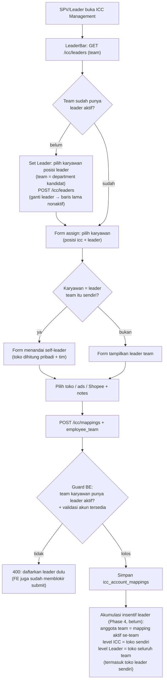
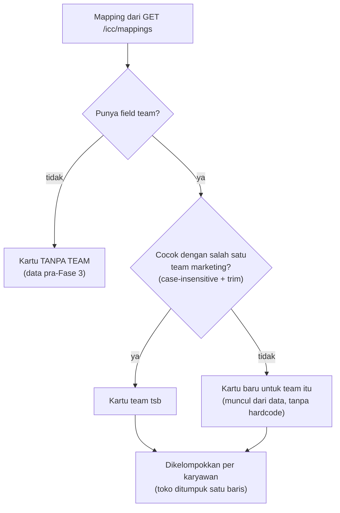

## Deskripsi

*Rancangan mapping antara **karyawan ICC (Internal Content Creator)** dengan akun TikTok yang mereka kelola: TikTok Shop (toko) dan TikTok Ads (advertiser). Dokumen ini adalah **rancangan implementasi masa depan** — posisi karyawan saat ini tetap ICC; perubahan jabatan ke Account Manager (AM) akan dilakukan terpisah di kemudian hari.*

- **Stack:** Go + Fiber v2 + MongoDB (backend) · Next.js (frontend)
- **Path target:** `bip-erp/services/integration/` (koleksi & endpoint baru)
- **Status**: ⚠️ Implemented (ada catatan) — Phase 1–3 selesai; Phase 4 belum
- **Dokumen terkait:** [[Sales - ICC Affiliate Mapping]] · [[Microservices - Integration Service]] · [[Microservices - Insentive Service]]

---

## Latar Belakang

Program ICC saat ini berfokus pada peran kreator/affiliate: karyawan membuat konten TikTok dan mempromosikan produk toko Bharata, lalu mendapat komisi.

Rencana ke depan: setiap karyawan ICC akan menjadi **Account Manager (AM)** yang bertanggung jawab penuh atas:
1. **TikTok Shop account** — mengelola toko (produk, order, ulasan)
2. **TikTok Ads account** — mengelola kampanye iklan (GMV Max, budget, ROAS)

Saat ini ada **16 akun TikTok Shop** yang aktif. Mapping ICC ↔ shop+ads perlu dibuat lebih dahulu agar sistem ERP bisa mengaitkan data performa per-toko/per-iklan ke karyawan yang bertanggung jawab.

### Kondisi Saat Ini

```
ICC Employee → [creator_username]   (affiliate/kreator, sudah ada)
ICC Employee → ?                    (shop + ads account, belum ada)
```

### Target Kondisi (setelah implementasi dokumen ini)

```
ICC Employee → {
  tiktok_creator_usernames[],    ← sudah ada (Sales - ICC Affiliate Mapping)
  tiktok_shop_ids[],             ← BARU: 0 atau lebih toko yang dikelola
  tiktok_advertiser_ids[],       ← BARU: 0 atau lebih akun ads yang dikelola
}
```

> Kardinalitas: **1 karyawan → N toko, N akun ads**. Setiap toko dan setiap advertiser tetap hanya dimiliki satu karyawan aktif (many-to-one dari sisi toko/advertiser). Shop dan advertiser bersifat opsional — karyawan dapat di-assign hanya shop saja, hanya advertiser saja, atau keduanya.

---

## Entitas yang Terlibat

### Sudah Ada di Sistem

| Entitas | Collection | Service | Keterangan |
|---|---|---|---|
| TikTok Shop | `tt_shop_authorized_shops` | Integration | 16 toko aktif, berisi `id`, `name`, `cipher` |
| TikTok Ads Advertiser | `tt_business_advertisers` | Integration | Akun iklan per-toko, berisi `advertiser_id`, `advertiser_name` |
| ICC Affiliate Username | Konstanta FE | Frontend | Lihat [[Sales - ICC Affiliate Mapping]] |
| Employee Mapping (ADV) | `employee_performance_mappings` | Insentive | Mapping karyawan ADV Leader → advertiser_id + store_id |
| ICC Account Mapping | `icc_account_mappings` | Integration | ✅ Phase 1–3: Mapping ICC employee → shop_id + advertiser_id + team |

---

## Model Data: `icc_account_mappings`

```json
{
  "_id": "UUID",
  "employee_id":      "BIP-0123",
  "employee_name":    "Aan Budiyanto",
  "tiktok_shop_id":   "7123456789012345678",
  "tiktok_shop_name": "YouGlow.id",
  "tiktok_advertiser_id":   "7234567890123456",
  "tiktok_advertiser_name": "YouGlow Ads",
  "team":       "beautyhacks",
  "is_active":  true,
  "notes":      "Mulai handle per 2026-08-01",
  "created_by": "ADMIN_001",
  "updated_by": "ADMIN_001",
  "created_at": "2026-07-04T00:00:00Z",
  "updated_at": "2026-07-04T00:00:00Z"
}
```

**Field `team`** — diisi otomatis dari header `BIP-Department` si pemanggil endpoint `POST /icc/mappings`. Nilainya sama dengan department SPV/Leader yang melakukan assign (mis. `"beautyhacks"`, `"kyura"`). Tidak perlu dipilih manual.

**Constraints:**
- `tiktok_shop_id` opsional; jika diisi, harus ada di `tt_shop_authorized_shops`
- `tiktok_advertiser_id` opsional; jika diisi, harus ada di `tt_business_advertisers`
- Minimal salah satu (`tiktok_shop_id` atau `tiktok_advertiser_id`) wajib diisi
- **1 karyawan boleh handle >1 toko dan >1 ads** — tidak ada unique index pada `employee_id`
- Satu shop hanya boleh di-assign ke satu karyawan aktif — unique index `(tiktok_shop_id != "", is_active=true)`
- Satu advertiser hanya boleh di-assign ke satu karyawan aktif — unique index `(tiktok_advertiser_id != "", is_active=true)`
- Partial filter index menyertakan `$gt: ""` agar baris tanpa shop/advertiser (string kosong) tidak dikenai unique constraint

---

## Flow Lengkap

### Flow 1: SPV/Leader Membuat Mapping

```
SPV Marketing (misal BeautyHacks)
  → POST /icc/mappings
    header: BIP-Department: beautyhacks   ← auto-fill team
    body: {
      employee_id, employee_name,
      tiktok_shop_id,       ← opsional
      tiktok_advertiser_id, ← opsional (minimal salah satu diisi)
      notes
    }
      → Validasi: minimal shop atau advertiser terisi
      → Validasi: jika shop_id diisi, cek ada di tt_shop_authorized_shops
      → Validasi: jika advertiser_id diisi, cek ada di tt_business_advertisers
      → Validasi: shop belum di-assign ke karyawan lain (is_active=true)?
      → Validasi: advertiser belum di-assign ke karyawan lain?
      → Enrich: ambil nama dari masing-masing collection bila ID diisi
      → Simpan: icc_account_mappings (team = "beautyhacks")
      → Response: 201 Created + data mapping
```

**Dropdown employee otomatis terfilter per departemen**: form dialog di frontend membaca `department` dari cookie auth SPV → kirim ke endpoint employee list (`?position=icc&department=beautyhacks`). SPV BeautyHacks hanya melihat karyawan ICC dari BeautyHacks.

### Flow 2: ICC Dashboard — Staff ICC Lihat Performa Sendiri

```
Staff ICC login (position=icc atau systemRoles.insentive=icc)
  → Halaman /icc/my-accounts (sidebar: "ICC Dashboard")
  → GET /icc/mappings/me   ← tanpa RequireMarketingLeader; filter by BIP-Employee-ID header
    → Returns: array mapping milik staff ini (bisa >1 jika handle banyak toko)

  Jika >1 mapping → tampil selector pilih mapping aktif

  Tab "Performa Toko" (hanya tampil jika mapping punya tiktok_shop_id):
  → GET /integration/transactions/orders/summary?shop_id=...&time_from=...&time_to=...
  → GET /integration/transactions/orders/dashboard/summary?shop_id=...
    → Returns: total pesanan, revenue, cancel, return + status real-time

  Tab "Performa Iklan" (hanya tampil jika mapping punya tiktok_advertiser_id):
  → GET /integration/tiktok/business/report/gmv_max/performance/summary
      ?advertiser_id=...&store_id=...&start_date=...&end_date=...
    → Returns: cost, gross_revenue, ROI, orders, CTR, CVR, CPA
```

### Flow 3: Team Performance — SPV/Leader Lihat Performa Tim

```
SPV/Leader login (department = "beautyhacks" atau "kyura")
  → Halaman /icc/team (sidebar: "Team Performance")
  → GET /icc/mappings?team=beautyhacks   ← filter by department
    → Returns: semua mapping tim BeautyHacks

  Frontend kelompokkan per employee_id → tampil list staff accordion
  Klik nama staff → expand detail:
    - Selector mapping (jika karyawan handle >1 toko)
    - Tab Performa Toko + Performa Iklan (kondisional, sama dengan ICC Dashboard)
```

### Flow 4: Laporan Akuntabilitas AM (🟡 Belum)

```
Insentive Service (cron harian)
  → GET /icc/mappings?is_active=true     (endpoint sudah ada)
  → Untuk setiap mapping:
      → Fetch GMV Ads dari Integration Service (advertiser_id)
      → Fetch GMV Order dari Integration Service (store_id)
      → Hitung KPI AM
  → Upsert incentive_results (DRAFT)
```

### Flow 5: Rotasi/Pergantian AM

```
SPV/Leader
  → PATCH /icc/mappings/:id { is_active: false, notes: "Rotasi per 2026-09-01" }
    → Deaktivasi mapping lama
  → POST /icc/mappings { employee_id: BIP-XXXX, tiktok_shop_id: ..., ... }
    → Buat mapping baru untuk karyawan pengganti (team auto-fill dari header)
```

---

## Otorisasi (RBAC)

Middleware `RequireMarketingLeader` di `shared-library/common/roles.go`:

| Role | System Key | Value | Akses |
|---|---|---|---|
| SPV Marketing Kyura | `kyura` | `supervisor` | Assign + lihat tim sendiri |
| SPV Marketing BeautyHacks | `beauty_hacks` | `supervisor` | Assign + lihat tim sendiri |
| ADV Leader | `insentive` | `adv_leader` | Assign + lihat semua |
| IT Admin (fallback) | `integration` | `supervisor` / `admin` | Lihat semua + assign |
| Staff ICC | `position=icc` atau `systemRoles.insentive=icc` | — | Hanya endpoint `/me` |

> **Isolasi data per tim (Phase 3)**: SPV Kyura hanya melihat mapping dengan `team="kyura"`; SPV BeautyHacks hanya melihat `team="beautyhacks"`. IT Supervisor tetap super-akses (lihat semua). Field `team` diisi otomatis dari `BIP-Department` header saat Create — SPV tidak bisa isi manual.

---

## Endpoint (✅ Phase 1–3 Diimplementasikan)

Semua endpoint berada di **Integration Service** (`bip-erp/services/integration`), prefix `/icc`.

### `GET /icc/mappings`

Daftar mapping ICC aktif. Dilindungi `RequireMarketingLeader`.

**Query params:**
| Param | Type | Keterangan |
|---|---|---|
| `employee_id` | string | Filter per karyawan |
| `tiktok_shop_id` | string | Filter per toko |
| `tiktok_advertiser_id` | string | Filter per akun ads |
| `team` | string | Filter per tim/departemen (mis. `"beautyhacks"`) |
| `is_active` | bool | Default `true` |

---

### `GET /icc/mappings/me`

Mapping milik staff ICC yang sedang login. **Tanpa** `RequireMarketingLeader` — bisa diakses oleh staff ICC.

Filter otomatis berdasarkan `BIP-Employee-ID` header (diset oleh API gateway). Staff tidak bisa melihat data orang lain.

---

### `POST /icc/mappings`

Buat mapping baru. Dilindungi `RequireMarketingLeader`.

**Request body:**
```json
{
  "employee_id":          "BIP-0114",
  "employee_name":        "Aan Budiyanto",
  "tiktok_shop_id":       "7123456789012345678",
  "tiktok_advertiser_id": "7234567890123456",
  "notes":                "Mulai handle per 2026-08-01"
}
```

> `tiktok_shop_id` dan `tiktok_advertiser_id` opsional — minimal salah satu wajib diisi.
> Field `team` **tidak** ada di request body — diisi otomatis dari `BIP-Department` header si pemanggil.

**Response 201:** data mapping yang dibuat.

**Error 400:** jika keduanya kosong, atau shop/advertiser tidak ditemukan di data master.

**Error 409:** jika shop atau advertiser sudah di-assign ke karyawan lain yang aktif.

---

### `PATCH /icc/mappings/:id`

Update mapping (deaktivasi atau ganti catatan). Dilindungi `RequireMarketingLeader`.

**Request body (semua opsional):**
```json
{
  "is_active": false,
  "notes": "Rotasi per 2026-09-01"
}
```

---

### `DELETE /icc/mappings/:id`

Hapus mapping (hanya jika `is_active=false`). Jika masih aktif → 409.

---

### `GET /icc/mappings/available-shops`

Daftar TikTok Shop yang **belum di-assign aktif** ke karyawan manapun (untuk dropdown form assign). Pool shop bersifat global — tidak difilter per tim.

---

### `GET /icc/mappings/available-advertisers`

Daftar TikTok Ads advertiser yang belum di-assign aktif. Pool advertiser bersifat global. Pipeline: `$unwind → $group by advertiser_id` untuk deduplikasi.

---

## Fase Implementasi

| Fase | Scope | Status |
|---|---|---|
| **0** | Dok ini — rancangan + endpoint spec | ✅ Selesai |
| **1** | Backend: koleksi + endpoint CRUD `/icc/mappings` + middleware `RequireMarketingLeader` | ✅ Selesai (2026-07-08) |
| **2** | Frontend: sidebar "MARKETING ICC", halaman ICC Management (CRUD assign), ICC Dashboard (performa toko + iklan per staff) | ✅ Selesai (2026-07-09) |
| **3** | Field `team` (auto-fill dari department), isolasi data per tim, shop/advertiser opsional, halaman Team Performance untuk SPV/Leader, route `/icc/mappings/me` untuk staff ICC | ✅ Selesai (2026-07-09) |
| **4** | Integrasi Insentive Service: hitung KPI AM dari mapping ini | 🟡 Belum |
| **5** | Relasi leader saat assign (lihat [[#Relasi Leader & Akumulasi Insentif]]) | ✅ Selesai (2026-08-01; sudah ter-merge ke `main`) |
| **6** | Tampilan ICC Management dipisah per team (lihat [[#Tampilan ICC Management per Team]]) | ✅ Selesai (2026-08-06; sudah ter-merge ke `main`) |
| **7** | Akun affiliate (username TikTok) ikut dikelola di ICC Management — desain & fasenya di [[Sales - ICC Affiliate Mapping]] | 🟡 Rencana (2026-08-06) |

---

## Relasi Leader & Akumulasi Insentif

*Permintaan dirut (tiket, 2026-08-01): sebelum SPV/leader meng-assign karyawan ICC ke toko, harus jelas karyawan itu di bawah leader siapa — dipakai untuk akumulasi perhitungan insentif leader.*

- **Status**: ⚠️ Implemented (2026-08-01) — backend (Integration Service) + FE sudah ter-merge ke `main`. Konsumsi oleh Insentive Service (Phase 4) belum, jadi akumulasi insentif leader belum berjalan.

**Desain final (leader-first, menyederhanakan draf sebelumnya):**

- **Satu record leader per team** di koleksi **`icc_leaders`** (Integration Service): `team → employee_id + employee_name`, unique partial index `(team, is_active=true)`; pergantian leader = nonaktifkan baris lama + buat baru (riwayat tersimpan). Endpoint `GET/POST /icc/leaders`, `PATCH /icc/leaders/:id/deactivate` (guard `RequireMarketingLeader`).
- **Tanpa daftar anggota manual**: keanggotaan team diturunkan dari `icc_account_mappings.team` — anggota team X = semua mapping aktif ber-`team` X. (Berbeda dari draf awal yang mau memakai `IncentiveOrg.Anggota` — dipilih Integration-lokal mengikuti pelajaran `mappingDariRingkasan` di `services/insentive/func.go`: panggilan antar-service tanpa identitas user kena 403 di route ber-RBAC; Integration adalah pemilik data "siapa mengelola apa".)
- **Guard leader-first di BE**: `POST /icc/mappings` ditolak bila team karyawan belum punya leader aktif. Cek memakai `employee_team` dari body (department karyawan yang di-assign; dikirim FE) dengan fallback header `BIP-Department` — supaya assign lintas department oleh IT tetap tervalidasi ke team karyawan, bukan team pemanggil.
- **FE (ICC Management)**: `LeaderBar` menampilkan leader team + tombol Set Leader (kandidat = karyawan posisi `leader`; team diturunkan dari department kandidat, bukan dipilih manual). Form assign menampilkan warning + submit disabled selama team belum punya leader; dropdown karyawan diperluas posisi `icc` **+ `leader`** (leader boleh pegang toko; form menandai *self-leader*). Leader **tanpa** toko cukup terdaftar di `icc_leaders` — tidak butuh baris mapping, validasi "minimal satu akun" tak berubah.
- **1 leader per department** (kyura / beautyhacks); leader = posisi "leader" (istilah insentif: `adv_leader`). Nilai `team` konsisten karena satu sumber: department HRIS (= cookie `department` FE = header `BIP-Department`).
- **Data lama**: mapping existing tak butuh migrasi (leader tidak disimpan di mapping); SPV cukup Set Leader sekali per team setelah live.
- **Phase 4 (belum)**: Insentive membaca leader dari Integration (pola ringkasan internal seperti `mappingDariRingkasan`) untuk rollup ICC → Leader; `IncentiveOrg` dashboard profit belum disentuh — sampai disatukan, keduanya paralel (leader di dashboard profit tetap diisi manual).

### Flowchart Assign (leader-first)



## Tampilan ICC Management per Team

*Permintaan (2026-08-05): tampilan ICC Management harus terpisah antara department **Kyura** dan **Beauty Hacks**, tidak lagi satu tabel campuran.*

- **Status**: ✅ Implemented (2026-08-06) — sudah ter-merge ke `main`. File: `components/team-card.tsx` (kartu per team), `lib/kelompokkan-mapping.ts` (`kelompokkanMappingPerTeam`, 7 unit test), `app/(main)/icc/management/page.tsx`; `leader-bar.tsx` dihapus karena isinya melebur ke header kartu.

### Masalah pada tampilan sebelumnya

Halaman `/icc/management` merender **satu tabel datar** berisi seluruh mapping. Untuk pemakai IT (yang menerima semua team) baris Kyura dan Beauty Hacks tercampur **tanpa penanda team sama pun** — tidak ada kolom team di tabel. `LeaderBar` sudah dipisah per team sejak Fase 5, tetapi tabelnya belum, sehingga status per team ("team ini belum punya leader → assign terblokir") tidak nyambung dengan baris datanya.

### Bentuk yang dipilih: satu kartu per team

```text
ICC Management

┌─ KYURA ─────────────────────────────────────────────────────┐
│ 👤 Leader: Rido (BIP-0021)     [Ganti Leader] [+ Assign] [▾] │
│ 5 karyawan · 8 akun                                          │
├──────────────────────────────────────────────────────────────┤
│ Karyawan │ TikTok Shop │ Advertiser │ Shopee │ Status │ Aksi │
│ Rido     │ kyura.id    │ —          │ —      │ Aktif  │  ⏻   │
│ Sari     │ kyuracare   │ Kyura Ads  │ —      │ Aktif  │  ⏻   │
└──────────────────────────────────────────────────────────────┘

┌─ BEAUTY HACKS ──────────────────────────────────────────────┐
│ ⚠ Belum ada leader — assign terblokir  [Set Leader] [▾]      │
│ 3 karyawan · 4 akun                                          │
├──────────────────────────────────────────────────────────────┤
│ ... tabel yang sama                                          │
└──────────────────────────────────────────────────────────────┘

┌─ TANPA TEAM (data lama) ────────────────────────────── [▾] ──┐
│ Mapping sebelum Fase 3 — nonaktifkan lalu assign ulang       │
└──────────────────────────────────────────────────────────────┘
```

**Kartu, bukan tab.** Alasannya: status "belum ada leader" harus terlihat **serentak** untuk semua team karena assign terblokir per team — tab menyembunyikan team yang tidak aktif. Selain itu SPV/leader otomatis hanya menerima satu kartu (data mereka sudah difilter `?team=department`), sehingga tidak perlu cabang kode khusus; tab tunggal justru mubazir. Menaruh leader dan anggotanya dalam satu kotak juga membuat relasi leader ↔ anggota terbaca langsung — inti aturan leader-first.

### Aturan pengelompokan

- **Daftar kartu** = `daftarTeamMarketing` yang sudah dipakai `LeaderBar` (distinct department karyawan berposisi ICC + team leader terdaftar). Team **tanpa mapping** tetap muncul supaya leadernya bisa didaftarkan lebih dulu; team **tanpa leader** tetap muncul supaya terlihat sedang terblokir.
- **Pencocokan `team` case-insensitive + trim**, mengikuti pola `cariLeaderTim` — nilai `team` pada mapping berasal dari header `BIP-Department` yang casing-nya bisa berbeda antar-sumber.
- **Kartu "Tanpa team"** hanya dirender bila ada mapping ber-`team` kosong (data pra-Fase 3, lihat risiko di bawah). Tanpa tombol Set Leader; berisi anjuran nonaktifkan lalu assign ulang agar `team`-nya terisi. Tujuannya supaya tak ada data yang lenyap dari layar hanya karena tak punya induk.
- **Urutan**: alfabet, kartu "Tanpa team" selalu terakhir.
- **Kartu collapsible**, default terbuka. Isi kartu tetap tabel yang sekarang — satu baris per karyawan dengan seluruh tokonya ditumpuk (`kelompokkanMappingPerKaryawan`, sudah ada).

### Tombol Assign pindah ke kartu

Tombol **+ Assign** dipindah dari header halaman ke **tiap kartu**, dengan **team terkunci** — pola yang sama dengan `lockedTeam` pada dialog Set Leader (Fase 5). Ini menghilangkan kemungkinan IT salah memilih karyawan lintas team karena target team jadi eksplisit sejak awal. Pada kartu yang belum punya leader, tombol Assign **disabled** dengan penjelasan singkat; backend tetap penjaga sebenarnya lewat guard leader-first.

### Penempatan satu baris mapping



### Dampak teknis

- **Tanpa perubahan backend** — semua data sudah tersedia: `GET /icc/mappings` (IT: semua team; SPV: team sendiri), `GET /icc/leaders`, dan daftar karyawan untuk derivasi team.
- Helper murni baru `kelompokkanMappingPerTeam(mappings, teams)` (mengembalikan team → leader → kelompok karyawan) supaya aturan di atas bisa diuji unit, memakai ulang `kelompokkanMappingPerKaryawan` yang sudah ada.
- `LeaderBar` versi IT melebur ke dalam header kartu; versi SPV tetap satu kartu dengan isi yang sama.

## Dependensi & Risiko

| Item | Detail |
|---|---|
| **Data shop** | `tt_shop_authorized_shops` harus sudah terisi lengkap (16 toko) |
| **Data advertiser** | `tt_business_advertisers` harus sudah terisi (sync dari TikTok BC). Endpoint `available-advertisers` menggunakan aggregate+unwind (`$unwind $advertisers` → `$replaceRoot` → `$group`) |
| **Employee data** | `employee_id` dan `employee_name` diisi dari Employee Service (`/api/employee/list?type=employee&position=icc&department=X`) |
| **Team field pada data lama** | Mapping yang dibuat sebelum Phase 3 tidak memiliki field `team` — query filter `?team=X` tidak akan menemukan data lama. Migrasi data lama perlu dijalankan manual atau via script |
| **Risiko: rotasi** | Jika mapping sering berubah, laporan historis perlu snapshot — perlu `effective_from`/`effective_to` di fase berikutnya |
| **Belum terintegrasi insentif** | Insentive Service belum konsumsi endpoint ini; integrasi dilakukan saat jabatan ICC → AM resmi berubah |

---

## Hubungan dengan Dokumen Lain

```
Sales - ICC Affiliate Mapping     ← mapping kreator username (affiliate)
Sales - ICC Account Manager Mapping  ← dokumen ini: mapping shop + ads (AM)
    ↕
Microservices - Integration Service  ← sumber data shop & advertiser
    ↕
Microservices - Insentive Service    ← konsumen mapping (fase 4)
    ↕
Sales - Incentive                    ← aturan insentif AM (TBD)
```

## Dokumen Terkait

- [[Sales - ICC Affiliate Mapping]] — mapping kreator username TikTok per anggota ICC
- [[ADR - 0009 Affiliate via Search Seller Affiliate Orders API]] — sumber data affiliate
- [[Microservices - Integration Service]] — service target implementasi endpoint baru
- [[Microservices - Insentive Service]] — konsumen data mapping (fase 4, saat jabatan berubah)
- [[Sales - Incentive]] — aturan insentif role ICC & (rencana) AM
