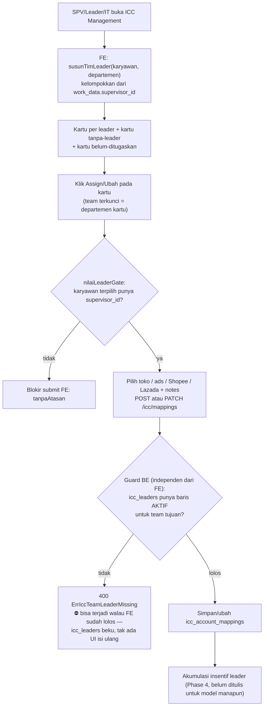

## Deskripsi

*Mapping antara **karyawan pemegang akun** (posisi HRIS: **ICC**, sebagian sudah di-rename **Account Specialist** — lihat catatan posisi di bawah) dengan akun TikTok yang mereka kelola: TikTok Shop (toko) dan TikTok Ads (advertiser), plus Shopee/Lazada. Perubahan jabatan ke Account Manager (AM) yang disebut versi awal dokumen ini belum terjadi; yang sudah terjadi (18 Agt 2026) adalah rename label posisi "ICC" → "Account Specialist" di HRIS untuk 33 dari 40 karyawan — lihat catatan `position_key` di bawah.*

- **Stack:** Go + Fiber v2 + MongoDB (backend) · Next.js (frontend)
- **Path:** `bip-erp/services/integration/` (backend) · `erp-frontend/src/features/integration/icc/` (frontend, halaman `/icc/management`)
- **Status**: ⚠️ Implemented (ada catatan) — Phase 1–3 selesai; Phase 4 belum; lihat gap model leader di [[#Relasi Leader & Akumulasi Insentif]]
- **Dokumen terkait:** [[Sales - ICC Affiliate Mapping]] · [[Microservices - Integration Service]] · [[Microservices - Insentive Service]] · [[ADR - 0045 Identitas Tim Tunggal dan Peta Kepemilikan Marketing]] · [[ADR - 0043 Peran Sistem Diturunkan dari Jabatan]]

> ⚠️ **Pencocokan posisi "ICC" sudah pindah ke `position_key`, bukan lagi label `position`.** Rename posisi 18 Agt 2026 ("ICC" → "Account Specialist") sempat mematahkan seluruh pencocokan string `position === "icc"` di beberapa modul (ICC Management, RBAC menu, Finance Opex, HRIS KPI). Di modul ini sudah diperbaiki: kode HRIS-hierarchy (`hierarki-leader.ts`) mencocokkan `position_key` bila terisi, fallback ke label `position` untuk data transisi. **Kalau menyentuh modul LAIN yang masih cocok ke label posisi, periksa dulu — itu gap terpisah yang belum tentu ikut diperbaiki.**

---

## Latar Belakang

Program ICC saat ini berfokus pada peran kreator/affiliate: karyawan membuat konten TikTok dan mempromosikan produk toko Bharata, lalu mendapat komisi.

Rencana ke depan: setiap karyawan ICC akan menjadi **Account Manager (AM)** yang bertanggung jawab penuh atas:
1. **TikTok Shop account** — mengelola toko (produk, order, ulasan)
2. **TikTok Ads account** — mengelola kampanye iklan (GMV Max, budget, ROAS)

Saat ini ada **16 akun TikTok Shop** yang aktif. Mapping ICC ↔ shop+ads perlu dibuat lebih dahulu agar sistem ERP bisa mengaitkan data performa per-toko/per-iklan ke karyawan yang bertanggung jawab.

### Kondisi Saat Ini

```
ICC Employee → [creator_username]   (affiliate/kreator, sudah ada)
ICC Employee → ?                    (shop + ads account, belum ada)
```

### Target Kondisi (setelah implementasi dokumen ini)

```
ICC Employee → {
  tiktok_creator_usernames[],    ← sudah ada (Sales - ICC Affiliate Mapping)
  tiktok_shop_ids[],             ← BARU: 0 atau lebih toko yang dikelola
  tiktok_advertiser_ids[],       ← BARU: 0 atau lebih akun ads yang dikelola
}
```

> Kardinalitas: **1 karyawan → N toko, N akun ads**. Setiap toko tetap hanya dimiliki satu karyawan aktif (many-to-one dari sisi toko). **Advertiser BERBEDA (sejak 2026-08-26)**: satu akun iklan TikTok Ads lazim dipakai bareng lebih dari satu karyawan — contoh nyata di lapangan, divisi Kyura memakai advertiser yang sama untuk beberapa orang — jadi **satu advertiser boleh dimiliki lebih dari satu karyawan aktif sekaligus**. Yang tetap dijaga unik hanya PASANGANNYA (karyawan + advertiser): karyawan yang sama tak boleh dobel-assign ke advertiser yang sama, tapi karyawan lain bebas memegang advertiser itu juga. Shop dan advertiser bersifat opsional — karyawan dapat di-assign hanya shop saja, hanya advertiser saja, atau keduanya.

---

## Entitas yang Terlibat

### Sudah Ada di Sistem

| Entitas | Collection | Service | Keterangan |
|---|---|---|---|
| TikTok Shop | `tt_shop_authorized_shops` | Integration | 16 toko aktif, berisi `id`, `name`, `cipher` |
| TikTok Ads Advertiser | `tt_business_advertisers` | Integration | Akun iklan per-toko, berisi `advertiser_id`, `advertiser_name` |
| ICC Affiliate Username | Konstanta FE | Frontend | Lihat [[Sales - ICC Affiliate Mapping]] |
| Employee Mapping (ADV) | `employee_performance_mappings` | Insentive | Mapping karyawan ADV Leader → advertiser_id + store_id |
| ICC Account Mapping | `icc_account_mappings` | Integration | ✅ Phase 1–3: Mapping ICC employee → shop_id + advertiser_id + team |

---

## Model Data: `icc_account_mappings`

```json
{
  "_id": "UUID",
  "employee_id":      "BIP-0123",
  "employee_name":    "Aan Budiyanto",
  "tiktok_shop_id":   "7123456789012345678",
  "tiktok_shop_name": "YouGlow.id",
  "tiktok_advertiser_id":   "7234567890123456",
  "tiktok_advertiser_name": "YouGlow Ads",
  "team":       "beautyhacks",
  "is_active":  true,
  "notes":      "Mulai handle per 2026-08-01",
  "created_by": "ADMIN_001",
  "updated_by": "ADMIN_001",
  "created_at": "2026-07-04T00:00:00Z",
  "updated_at": "2026-07-04T00:00:00Z"
}
```

**Field `team`** — diisi otomatis dari **department KARYAWAN yang di-assign** (`employee_team`, dikirim FE), dengan header `BIP-Department` si pemanggil hanya sebagai cadangan. Tidak perlu dipilih manual.

> ⚠️ **Sampai 2026-08-07 nilainya salah diambil dari department PEMANGGIL.** Karena assign dilakukan akun IT, seluruh 12 mapping aktif di produksi tersimpan sebagai `team="Tech Development"` — padahal tak ada staff ICC di sana. Akibatnya kartu team salah dan SPV pemiliknya tak menemukan datanya (daftarnya disaring `?team=`). Akar penyebab sudah ditutup; baris lama dibetulkan lewat tombol **"Pindahkan ke team karyawan"** di kartu ICC Management, yang membandingkan `team` mapping dengan department karyawan di HRIS.

**Constraints:**
- `tiktok_shop_id` opsional; jika diisi, harus ada di `tt_shop_authorized_shops`
- `tiktok_advertiser_id` opsional; jika diisi, harus ada di `tt_business_advertisers`
- Minimal salah satu (`tiktok_shop_id` atau `tiktok_advertiser_id`) wajib diisi
- **1 karyawan boleh handle >1 toko dan >1 ads** — tidak ada unique index pada `employee_id`
- Satu shop hanya boleh di-assign ke satu karyawan aktif — unique index `(tiktok_shop_id != "", is_active=true)`
- **Satu advertiser BOLEH dipegang lebih dari satu karyawan aktif (sejak 2026-08-26)** — unique index `(tiktok_advertiser_id, employee_id, is_active=true)`, bukan unique global seperti shop. Yang dicegah cuma karyawan yang SAMA dobel-assign ke advertiser yang sama (`409 ErrIccAdvertiserAlreadyAssigned`); karyawan LAIN bebas memegang advertiser itu juga. Pola ini sama dengan `unique(employee_id, username)` di `icc_affiliate_accounts` — lihat [[Sales - ICC Affiliate Mapping]].
- Partial filter index menyertakan `$gt: ""` agar baris tanpa shop/advertiser (string kosong) tidak dikenai unique constraint

---

## Flow Lengkap

### Flow 1: SPV/Leader Membuat Mapping

```
SPV Marketing (misal BeautyHacks)
  → POST /icc/mappings
    body: employee_team = department karyawan  ← sumber `team`
    header: BIP-Department: beautyhacks        ← cadangan saja
    body: {
      employee_id, employee_name,
      tiktok_shop_id,       ← opsional
      tiktok_advertiser_id, ← opsional (minimal salah satu diisi)
      notes
    }
      → Validasi: minimal shop atau advertiser terisi
      → Validasi: jika shop_id diisi, cek ada di tt_shop_authorized_shops
      → Validasi: jika advertiser_id diisi, cek ada di tt_business_advertisers
      → Validasi: shop belum di-assign ke karyawan lain (is_active=true)?
      → Validasi: advertiser belum di-assign ke karyawan lain?
      → Enrich: ambil nama dari masing-masing collection bila ID diisi
      → Simpan: icc_account_mappings (team = "beautyhacks")
      → Response: 201 Created + data mapping
```

**Dropdown employee otomatis terfilter per departemen**: form dialog di frontend membaca `department` dari cookie auth SPV → kirim ke endpoint employee list (`?position=icc&department=beautyhacks`). SPV BeautyHacks hanya melihat karyawan ICC dari BeautyHacks.

### Flow 2: ICC Dashboard — Staff ICC Lihat Performa Sendiri

```
Staff ICC login (position=icc atau systemRoles.insentive=icc)
  → Halaman /icc/my-accounts (sidebar: "ICC Dashboard")
  → GET /icc/mappings/me   ← tanpa RequireMarketingLeader; filter by BIP-Employee-ID header
    → Returns: array mapping milik staff ini (bisa >1 jika handle banyak toko)

  Jika >1 mapping → tampil selector pilih mapping aktif

  Tab "Performa Toko" (hanya tampil jika mapping punya tiktok_shop_id):
  → GET /integration/transactions/orders/summary?shop_id=...&time_from=...&time_to=...
  → GET /integration/transactions/orders/dashboard/summary?shop_id=...
    → Returns: total pesanan, revenue, cancel, return + status real-time

  Tab "Performa Iklan" (hanya tampil jika mapping punya tiktok_advertiser_id):
  → GET /integration/tiktok/business/report/gmv_max/performance/summary
      ?advertiser_id=...&store_id=...&start_date=...&end_date=...
    → Returns: cost, gross_revenue, ROI, orders, CTR, CVR, CPA
```

### Flow 3: Team Performance — SPV/Leader Lihat Performa Tim

```
SPV/Leader login (department = "beautyhacks" atau "kyura")
  → Halaman /icc/team (sidebar: "Team Performance")
  → GET /icc/mappings?team=beautyhacks   ← filter by department
    → Returns: semua mapping tim BeautyHacks

  Frontend kelompokkan per employee_id → tampil list staff accordion
  Klik nama staff → expand detail:
    - Selector mapping (jika karyawan handle >1 toko)
    - Tab Performa Toko + Performa Iklan (kondisional, sama dengan ICC Dashboard)
```

### Flow 4: Laporan Akuntabilitas AM (🟡 Belum)

```
Insentive Service (cron harian)
  → GET /icc/mappings?is_active=true     (endpoint sudah ada)
  → Untuk setiap mapping:
      → Fetch GMV Ads dari Integration Service (advertiser_id)
      → Fetch GMV Order dari Integration Service (store_id)
      → Hitung KPI AM
  → Upsert incentive_results (DRAFT)
```

### Flow 5: Rotasi/Pergantian AM

```
SPV/Leader
  → PATCH /icc/mappings/:id { is_active: false, notes: "Rotasi per 2026-09-01" }
    → Deaktivasi mapping lama
  → POST /icc/mappings { employee_id: BIP-XXXX, tiktok_shop_id: ..., ... }
    → Buat mapping baru untuk karyawan pengganti (team auto-fill dari header)
```

---

## Otorisasi (RBAC)

Middleware `RequireMarketingLeader` di `shared-library/common/roles.go`:

| Role | System Key | Value | Akses |
|---|---|---|---|
| SPV Marketing Kyura | `kyura` | `supervisor` | Assign + lihat tim sendiri |
| SPV Marketing BeautyHacks | `beauty_hacks` | `supervisor` | Assign + lihat tim sendiri |
| ADV Leader | `insentive` | `adv_leader` | Assign + lihat semua |
| IT Admin (fallback) | `integration` | `supervisor` / `admin` | Lihat semua + assign |
| Staff ICC | `position=icc` atau `systemRoles.insentive=icc` | — | Hanya endpoint `/me` |

> **Isolasi data per tim (Phase 3)**: SPV Kyura hanya melihat mapping dengan `team="kyura"`; SPV BeautyHacks hanya melihat `team="beautyhacks"`. IT Supervisor tetap super-akses (lihat semua). Field `team` diisi otomatis dari department karyawan saat Create — SPV tidak bisa isi manual.

---

## Endpoint (✅ Phase 1–3 Diimplementasikan)

Semua endpoint berada di **Integration Service** (`bip-erp/services/integration`), prefix `/icc`.

### `GET /icc/mappings`

Daftar mapping ICC aktif. Dilindungi `RequireMarketingLeader`.

**Query params:**
| Param | Type | Keterangan |
|---|---|---|
| `employee_id` | string | Filter per karyawan |
| `tiktok_shop_id` | string | Filter per toko |
| `tiktok_advertiser_id` | string | Filter per akun ads |
| `team` | string | Filter per tim/departemen (mis. `"beautyhacks"`) |
| `is_active` | bool | Default `true` |

---

### `GET /icc/mappings/me`

Mapping milik staff ICC yang sedang login. **Tanpa** `RequireMarketingLeader` — bisa diakses oleh staff ICC.

Filter otomatis berdasarkan `BIP-Employee-ID` header (diset oleh API gateway). Staff tidak bisa melihat data orang lain.

---

### `POST /icc/mappings`

Buat mapping baru. Dilindungi `RequireMarketingLeader`.

**Request body:**
```json
{
  "employee_id":          "BIP-0114",
  "employee_name":        "Aan Budiyanto",
  "tiktok_shop_id":       "7123456789012345678",
  "tiktok_advertiser_id": "7234567890123456",
  "notes":                "Mulai handle per 2026-08-01"
}
```

> `tiktok_shop_id` dan `tiktok_advertiser_id` opsional — minimal salah satu wajib diisi.
> Field `team` **tidak** dipilih manual — diturunkan dari `employee_team` (department karyawan), fallback header `BIP-Department`. `PATCH /icc/mappings/:id` menerima `team` khusus untuk membetulkan baris lama.

**Response 201:** data mapping yang dibuat.

**Error 400:** jika keduanya kosong, atau shop/advertiser tidak ditemukan di data master.

**Error 409:** jika shop sudah di-assign ke karyawan lain yang aktif, ATAU advertiser sudah
di-assign ke KARYAWAN YANG SAMA (advertiser boleh dipegang banyak karyawan sekaligus, lihat
kardinalitas di atas — yang ditolak cuma dobel-assign untuk satu karyawan yang sama).

---

### `PATCH /icc/mappings/:id`

Update mapping. Dilindungi `RequireMarketingLeader` + `tolakLintasDepartemen` (dicek dua sisi bila `team` berubah: team lama **dan** team tujuan — lihat [[#Otorisasi (RBAC)]]).

> **Sejak fitur edit toko & pemegang (✅ ter-merge ke `main`)**: PATCH bukan cuma deaktivasi/ganti catatan lagi — bisa mengganti toko/advertiser per channel, pemegang (`employee_id`), dan tim (`team`) pada mapping yang **sudah ada**, tanpa perlu deaktivasi lalu assign ulang dari nol.

**Request body (semua opsional — pointer semantics: field tak disebut = tak disentuh):**
```json
{
  "is_active":            false,
  "notes":                 "Rotasi per 2026-09-01",
  "team":                  "beautyhacks",
  "employee_id":           "BIP-0200",
  "employee_name":         "Karyawan Pengganti",
  "tiktok_shop_id":        "7123456789012345678",
  "tiktok_advertiser_id":  "7234567890123456",
  "shopee_shop_id":        "SP1",
  "lazada_shop_id":        "LZ1"
}
```

**Aturan re-validasi (per field yang berubah, bukan seluruh payload):**
- **Ganti `*_shop_id`/`*_advertiser_id`** → diverifikasi ulang ke sumber otoritatif masing-masing channel (sama seperti Create); `*_name` diisi ulang otomatis dari hasil lookup itu (FE tidak mengirim nama, hanya ID). ID kosong (`""`) = lepas channel itu dari mapping, namanya ikut dikosongkan.
- **Ganti `employee_id` dan/atau `team`** → guard leader-first dicek ulang ke **team tujuan** (`leaderRepo.GetActiveByTeam`), bukan team lama. Team tujuan tanpa leader aktif di `icc_leaders` → `400` (`ErrIccTeamLeaderMissing`), sama seperti Create.
- **Ganti `notes`/`is_active` saja** → tidak memicu re-cek shop/advertiser/leader sama sekali.
- Toko/Shopee/Lazada yang sudah dipegang mapping lain yang aktif → `409` (`*AlreadyAssigned`
  per channel). **Advertiser terkecuali**: 409 hanya bila KARYAWAN YANG SAMA sudah punya
  baris aktif untuk advertiser itu juga — pindah ke advertiser yang dipegang karyawan LAIN
  diperbolehkan (sharing disengaja, lihat kardinalitas di atas).

**FE mengirim diff, bukan payload penuh**: dialog assign yang sama dipakai untuk mode edit, tapi hanya field yang benar-benar berubah dari nilai asal mapping yang disertakan di body — menghindari re-trigger validasi leader-gate saat yang diedit cuma toko/catatan.

---

### `DELETE /icc/mappings/:id`

Hapus mapping (hanya jika `is_active=false`). Jika masih aktif → 409.

---

### `GET /icc/mappings/available-shops`

Daftar TikTok Shop yang **belum di-assign aktif** ke karyawan manapun (untuk dropdown form assign). Pool shop bersifat global — tidak difilter per tim.

---

### `GET /icc/mappings/available-advertisers`

Daftar **SEMUA** TikTok Ads advertiser — **bukan** "yang belum di-assign" lagi (sejak
2026-08-26). Beda dari `available-shops`, endpoint ini sengaja **tidak** menyaring
advertiser yang sudah punya mapping aktif, karena advertiser boleh dipegang lebih dari satu
karyawan (lihat kardinalitas di atas); menyaringnya akan membuat advertiser hilang dari
dropdown begitu satu orang memegangnya — persis bug yang diperbaiki. Pool advertiser
bersifat global. Pipeline: `$unwind → $group by advertiser_id` untuk deduplikasi.

---

## Fase Implementasi

| Fase | Scope | Status |
|---|---|---|
| **0** | Dok ini — rancangan + endpoint spec | ✅ Selesai |
| **1** | Backend: koleksi + endpoint CRUD `/icc/mappings` + middleware `RequireMarketingLeader` | ✅ Selesai (2026-07-08) |
| **2** | Frontend: sidebar "MARKETING ICC", halaman ICC Management (CRUD assign), ICC Dashboard (performa toko + iklan per staff) | ✅ Selesai (2026-07-09) |
| **3** | Field `team` (auto-fill dari department), isolasi data per tim, shop/advertiser opsional, halaman Team Performance untuk SPV/Leader, route `/icc/mappings/me` untuk staff ICC | ✅ Selesai (2026-07-09) |
| **4** | Integrasi Insentive Service: hitung KPI AM dari mapping ini | 🟡 Belum |
| **5** | Relasi leader saat assign, model `icc_leaders` (lihat [[#Relasi Leader & Akumulasi Insentif]]) | ⚠️ Backend masih jadi guard aktif; FE-nya sudah digantikan Fase 8 |
| **6** | Tampilan ICC Management dipisah per team (kartu per team, satu leader per kartu) | ⛔ Superseded oleh Fase 8 |
| **7** | Akun affiliate (username TikTok) ikut dikelola di ICC Management — desain & fasenya di [[Sales - ICC Affiliate Mapping]] | ✅ Selesai |
| **8** | Kartu per LEADER (bukan per team) diturunkan dari `work_data.supervisor_id`; kartu "Langsung di bawah SPV" + "Belum ditugaskan"; hapus Set Leader manual (lihat [[#Tampilan ICC Management — kartu per leader (menggantikan kartu per team)]]) | ✅ Selesai — sudah ter-merge ke `main` |
| **9** | Edit mapping yang sudah ada: ganti toko/advertiser per channel, pemegang, dan tim tanpa deaktivasi+assign ulang (lihat `PATCH /icc/mappings/:id` di atas) | ✅ Selesai — Backend (`feat/icc-mapping-edit`) + Frontend (`feat/icc-mapping-edit-ui`) sudah ter-merge ke `main` |
| **10** | Advertiser TikTok Ads boleh dipegang >1 karyawan aktif: index diganti dari unique global jadi unique per-pasangan `(tiktok_advertiser_id, employee_id)`, `available-advertisers` tak lagi menyaring yang sudah assigned. Toko/Shopee/Lazada TETAP 1:1 (tidak diubah) | ✅ Selesai (2026-08-26), branch `feat/icc-advertiser-shared` |

---

## Relasi Leader & Akumulasi Insentif

*Permintaan dirut (tiket, 2026-08-01): sebelum SPV/leader meng-assign karyawan ICC ke toko, harus jelas karyawan itu di bawah leader siapa — dipakai untuk akumulasi perhitungan insentif leader.*

- **Status**: ⚠️ Implemented, tapi **backend dan frontend kini memakai DUA MODEL LEADER BERBEDA** yang tidak saling sinkron — lihat ⛔ di bawah. Konsumsi oleh Insentive Service (Phase 4) masih belum, jadi akumulasi insentif leader belum berjalan sama sekali.

### Model asal (2026-08-01, backend — MASIH JADI GUARD AKTIF)

- **Satu record leader per team** di koleksi **`icc_leaders`** (Integration Service): `team → employee_id + employee_name`, **unique partial index `(team, is_active=true)`** — satu team hanya boleh punya SATU baris aktif; pergantian leader = nonaktifkan baris lama + buat baru. Endpoint `GET/POST /icc/leaders`, `PATCH /icc/leaders/:id/deactivate` (guard `RequireMarketingLeader`) **masih ada di kode** (`icc_leader_handler.go`, terdaftar di `services/integration/main.go`).
- **Guard leader-first di BE tidak berubah**: `POST` **dan** `PATCH /icc/mappings/:id` (bila `employee_id`/`team` ikut berubah) ditolak `400` (`ErrIccTeamLeaderMissing`) bila team tujuan belum punya baris aktif di `icc_leaders` (`icc_mapping_usecase.go`, `leaderRepo.GetActiveByTeam`).

### Model pengganti (2026-08, frontend — yang dilihat & dipakai user sekarang)

- **`icc_leaders` tidak lagi dibaca FE sama sekali.** Fitur "kartu-per-leader-icc" (merged ke `main`) **menghapus** `LeaderBar`, tombol **Set Leader**, `set-leader-dialog.tsx`, `use-set-leader.ts`, dan `use-fetch-leaders.ts`. Tidak ada satu pun jalur UI lagi untuk mengisi atau mengganti baris `icc_leaders` — koleksi itu **beku** sejak migrasi ini, isinya sisa dari sebelum rewrite.
- **Leader kini diturunkan dari HRIS**, bukan dipilih manual: `hierarki-leader.ts` (`susunTimLeader`) mengelompokkan karyawan ber-`position`/`position_key` **ICC** menurut atasan langsungnya (`work_data.supervisor_id`) — leader = siapa pun yang punya bawahan langsung berposisi ICC, bukan orang yang menyandang label jabatan "leader". Aturan ini sengaja mengikuti kenyataan organisasi, bukan label jabatan, supaya SPV yang kebetulan langsung membawahi satu staf ICC tetap dapat kartu.
- **Departemen tetap unit pengelompokan tertinggi** di layar (`kartu-leader.ts`, `blokDepartemen`); di dalamnya bisa ada **lebih dari satu kartu leader** — kasus nyata: Beauty Hacks kini punya dua leader paralel (Ade Jaenul Farhi, Satrio), masing-masing dapat kartunya sendiri. Dua kartu tambahan yang tak berbasis leader: **"Langsung di bawah SPV"** (`tanpa-leader` — karyawan ICC tanpa atasan berposisi leader di atasnya) dan **"Belum ditugaskan"** (akun affiliate tanpa pemegang).
- **Gerbang assign di FE** (`leader-gate.ts`, `nilaiLeaderGate`) memblokir submit bila karyawan yang dipilih **tidak punya `supervisor_id`** sama sekali di HRIS (`kodePesan: "tanpaAtasan"`). Ini **BUKAN pengganti** guard backend — komentar di file itu eksplisit: gate ini menggantikan UX lama, backend tetap penjaga sebenarnya.

### ⛔ Gap nyata: dua model bisa saling bertentangan

**Backend dan frontend memvalidasi hal yang berbeda, dan tak ada yang menjaga keduanya tetap sinkron:**

- FE menilai "team boleh di-assign" dari HRIS (karyawan itu punya atasan); BE menilai dari **baris aktif di `icc_leaders`** untuk team itu — dua sumber yang independen sejak FE berhenti membaca/menulis `icc_leaders`.
- **`icc_leaders` unique index per-team secara struktural tidak bisa merepresentasikan Beauty Hacks** yang kini punya dua leader (Ade + Satrio) — hanya satu baris yang boleh aktif. Guard BE tidak peduli baris itu milik leader yang MANA (cuma cek "ada baris aktif untuk team ini"), jadi assign untuk anggota Ade maupun Satrio tetap lolos selama team-nya punya *satu* baris aktif apa pun — tapi begitu baris itu dinonaktifkan/basi (mis. data lama sebelum rewrite dan tak ada yang tahu harus menjaganya), **seluruh assign untuk team itu gagal 400 di backend, padahal FE terlihat sudah mengizinkan** (kartu leader tampil, karyawan punya atasan lengkap).
- **Tak terverifikasi**: apakah baris `icc_leaders` untuk `kyura` dan `beautyhacks` saat ini masih aktif di produksi. Sebelum menyalahkan kode manapun bila assign tiba-tiba 400 di produksi untuk team yang kartunya tampil normal di FE, **cek dulu isi `icc_leaders` untuk team itu** — kelas gejala yang sama dengan "biner basi": layar terlihat benar, backend menolak untuk alasan yang FE tidak tampilkan.
- **Belum diputuskan**: apakah `icc_leaders`/guard-nya akan dihapus menyusul (menyamakan BE dengan model HRIS), atau backend akan ditulis ulang membaca hierarki HRIS langsung. TBD — tandai sebagai keputusan terbuka, bukan diasumsikan salah satunya.

### Fase 4 (Insentive Service) — tetap belum

- Insentive membaca leader dari Integration untuk rollup ICC → Leader; `IncentiveOrg` dashboard profit belum disentuh — sampai disatukan, keduanya paralel (leader di dashboard profit tetap diisi manual). Konsumsi ini **belum ditulis untuk model manapun** (baik `icc_leaders` lama maupun hierarki HRIS baru) — masih 🟡.

### Flowchart Assign — model SAAT INI (FE hierarki HRIS, BE tetap `icc_leaders`)



> Flowchart versi lama (Set Leader manual, `icc_leaders` diisi dari FE) dihapus dari dokumen ini karena jalur itu **tidak ada lagi di UI** — lihat [[#⛔ Gap nyata: dua model bisa saling bertentangan]] untuk kenapa backend-nya tetap dijelaskan terpisah.

## Tampilan ICC Management — kartu per leader (menggantikan kartu per team)

*Permintaan (2026-08-05): tampilan ICC Management harus terpisah antara department **Kyura** dan **Beauty Hacks**, tidak lagi satu tabel campuran. Diselesaikan dulu (2026-08-06) sebagai kartu per TEAM; direvisi lagi (Fase A, sesi ini) jadi kartu per LEADER di dalam tiap departemen begitu hierarki HRIS-nya lengkap dan Beauty Hacks ternyata punya dua leader paralel.*

- **Status**: ✅ Implemented — sudah ter-merge ke `main` ("kartu-per-leader-icc"). File: `components/team-card.tsx` (rewrite total — kini kartu per leader, dulu kartu per team), `components/leader-card-khusus.tsx` (baru — kartu "Langsung di bawah SPV" + "Belum ditugaskan"), `lib/hierarki-leader.ts` (`susunTimLeader`), `lib/kartu-leader.ts` (`blokDepartemen`, menggantikan `kelompokkanMappingPerTeam`), `lib/leader-gate.ts` (`nilaiLeaderGate`), `app/(main)/icc/management/page.tsx`. **Dihapus**: `set-leader-dialog.tsx`, `use-set-leader.ts`, `use-fetch-leaders.ts` — lihat [[#Relasi Leader & Akumulasi Insentif]] untuk konsekuensinya ke backend.

### Kenapa direvisi lagi

Kartu-per-team (Fase 6) menaruh SATU leader per kartu team, sesuai model `icc_leaders` (unique per team) saat itu. Begitu hierarki `work_data.supervisor_id` terisi penuh (sensus 2026-08-06), ketahuan Beauty Hacks punya **dua** orang yang masing-masing punya bawahan ICC langsung (Ade, Satrio) — sesuatu yang model lama secara struktural tak bisa tampilkan (satu leader per team). Kartu-per-team juga mewajibkan "Set Leader" manual sebelum assign bisa jalan, padahal HRIS sudah tahu siapa atasan siapa — jadi ganda-input.

### Bentuk saat ini: kartu per leader di dalam tiap departemen

```text
ICC Management (departemen = Kyura, Beauty Hacks, ...)

┌─ Kyura — Ridho (BIP-00xx) ──────────────────────── [+ Assign] [▾] ─┐
│ 11 anggota · N toko                                                │
├──────────────────────────────────────────────────────────────────┤
│ Karyawan │ TikTok Shop │ Advertiser │ Shopee │ Lazada │ Aksi      │
│ ...      │ ...         │ ...        │ ...    │ ...    │ ✎  ⏻     │
└────────────────────────────────────────────────────────────────────┘

┌─ Beauty Hacks — Ade Jaenul Farhi ────────────────  [+ Assign] [▾] ─┐
│ 12 anggota                                                          │
└──────────────────────────────────────────────────────────────────┘

┌─ Beauty Hacks — Satrio ──────────────────────────  [+ Assign] [▾] ─┐
│ 11 anggota                                                          │
└──────────────────────────────────────────────────────────────────┘

┌─ ⚠ Langsung di bawah SPV (Beauty Hacks) ─────────────────── [▾] ──┐
│ Karyawan ICC tanpa atasan berposisi leader di atasnya —            │
│ TANPA tombol Assign (lihat leader-card-khusus.tsx)                 │
└──────────────────────────────────────────────────────────────────┘

┌─ ⚠ Belum ditugaskan ──────────────────────────────────────── [▾] ─┐
│ Akun affiliate tanpa pemegang                                      │
└──────────────────────────────────────────────────────────────────┘
```

Ikon **✎ (Ubah)** di tiap baris membuka dialog assign yang sama dalam mode edit — lihat kemampuan edit mapping di bagian `PATCH /icc/mappings/:id` di atas.

### Aturan pengelompokan (`hierarki-leader.ts` + `kartu-leader.ts`)

- **Departemen** tetap unit teratas (sesuai Fase 6): distinct department karyawan berposisi ICC.
- **Di dalam satu departemen**, `susunTimLeader` mengelompokkan karyawan ICC menurut **atasan langsungnya** (`supervisor_id`) — leader = siapa pun dengan ≥1 bawahan langsung berposisi ICC, BUKAN orang berlabel jabatan "leader". Bisa nol, satu, atau **lebih dari satu** kartu leader per departemen.
- **Kartu "Langsung di bawah SPV"** (`tanpa-leader`, `leader-card-khusus.tsx`) — karyawan ICC di departemen itu yang atasannya BUKAN sesama pemegang bawahan ICC (mis. langsung di bawah SPV departemen). Sengaja **tanpa tombol Assign** — ini daftar kerja hasil struktur organisasi, bukan tim yang bisa ditambah anggotanya dari kartu ini; tapi mengedit mapping yang **sudah ada** di kartu ini tetap diperbolehkan lewat ikon Ubah.
- **Kartu "Belum ditugaskan"** — akun affiliate (dari [[Sales - ICC Affiliate Mapping]]) yang belum punya pemegang sama sekali. Juga tanpa tombol Assign.
- **Pencocokan posisi ICC** pakai `position_key` bila terisi, fallback ke label `position` — lihat catatan rename di bagian atas dokumen.
- **Urutan**: nama leader, abjad, deterministik.
- **Kartu collapsible**, default terbuka. Isi kartu = tabel per-karyawan dengan seluruh tokonya ditumpuk (`kelompokkanMappingPerKaryawan`, tak berubah dari Fase 6).

### Tombol Assign tetap terkunci per konteks

Tombol **+ Assign** ada di kartu leader (team terkunci = departemen kartu, karyawan yang boleh dipilih dibatasi ke bawahan leader itu bila relevan). Guard-nya kini `nilaiLeaderGate` (FE) — lihat independensinya dari guard backend di [[#⛔ Gap nyata: dua model bisa saling bertentangan]].

### Dampak teknis

- **Tanpa perubahan backend** untuk rewrite kartu ini sendiri — semua data sudah tersedia lewat `GET /employee/list?with_supervisor=true` + `GET /icc/mappings`. (Perubahan backend baru datang belakangan dari fitur *edit mapping*, lihat PATCH di atas — bukan bagian dari rewrite kartu ini.)
- `GET /icc/leaders` tidak lagi dipanggil dari FE sama sekali (lihat gap di atas).

## Dependensi & Risiko

| Item | Detail |
|---|---|
| **Data shop** | `tt_shop_authorized_shops` harus sudah terisi lengkap (16 toko) |
| **Data advertiser** | `tt_business_advertisers` harus sudah terisi (sync dari TikTok BC). Endpoint `available-advertisers` menggunakan aggregate+unwind (`$unwind $advertisers` → `$replaceRoot` → `$group`) |
| **Employee data** | `employee_id` dan `employee_name` diisi dari Employee Service (`/api/employee/list?type=employee&position=icc&department=X`) |
| **Team field pada data lama** | Mapping yang dibuat sebelum Phase 3 tidak memiliki field `team` — query filter `?team=X` tidak akan menemukan data lama. Migrasi data lama perlu dijalankan manual atau via script |
| **Risiko: rotasi** | Jika mapping sering berubah, laporan historis perlu snapshot — perlu `effective_from`/`effective_to` di fase berikutnya |
| **Belum terintegrasi insentif** | Insentive Service belum konsumsi endpoint ini; integrasi dilakukan saat jabatan ICC → AM resmi berubah |
| 🟡 **TBD: atribusi insentif advertiser bersama** | Sejak Fase 10, satu advertiser boleh dipegang >1 karyawan aktif. Saat Fase 4 (Laporan Akuntabilitas AM) dibangun, GMV Ads dari advertiser yang dipegang bersama itu dihitung ke siapa — dibagi rata, salah satu ditandai pemilik utama, atau penuh ke semua? **Harus diputuskan sebelum Fase 4**, tapi tidak menghalangi Fase 10 karena Fase 4 belum dibangun. Sejajar dengan TBD "Atribusi order akun bersama" di [[Sales - ICC Affiliate Mapping]]. |
| ⛔ **`icc_leaders` beku, guard BE independen dari FE** | FE berhenti membaca/menulis `icc_leaders` sejak kartu-per-leader (Fase 8), tapi `POST`/`PATCH /icc/mappings` masih menggerbanginya. Team tanpa baris aktif di `icc_leaders` akan gagal 400 walau kartunya tampil normal di FE. Lihat [[#⛔ Gap nyata: dua model bisa saling bertentangan]] — **belum diverifikasi** isi `icc_leaders` untuk `kyura`/`beautyhacks` di produksi saat ini |
| **Rename posisi ICC → Account Specialist** | 18 Agt 2026, 33/40 karyawan. Modul ini sudah dipindah ke `position_key`; modul LAIN (RBAC menu, Finance Opex, HRIS KPI) belum tentu ikut — periksa sebelum menyentuhnya |

---

## Hubungan dengan Dokumen Lain

```
Sales - ICC Affiliate Mapping     ← mapping kreator username (affiliate)
Sales - ICC Account Manager Mapping  ← dokumen ini: mapping shop + ads (AM)
    ↕
Microservices - Integration Service  ← sumber data shop & advertiser
    ↕
Microservices - Insentive Service    ← konsumen mapping (fase 4)
    ↕
Sales - Incentive                    ← aturan insentif AM (TBD)
```

## Dokumen Terkait

- [[Sales - ICC Affiliate Mapping]] — mapping kreator username TikTok per anggota ICC
- [[ADR - 0009 Affiliate via Search Seller Affiliate Orders API]] — sumber data affiliate
- [[Microservices - Integration Service]] — service target implementasi endpoint baru
- [[Microservices - Insentive Service]] — konsumen data mapping (fase 4, saat jabatan berubah)
- [[Sales - Incentive]] — aturan insentif role ICC & (rencana) AM
