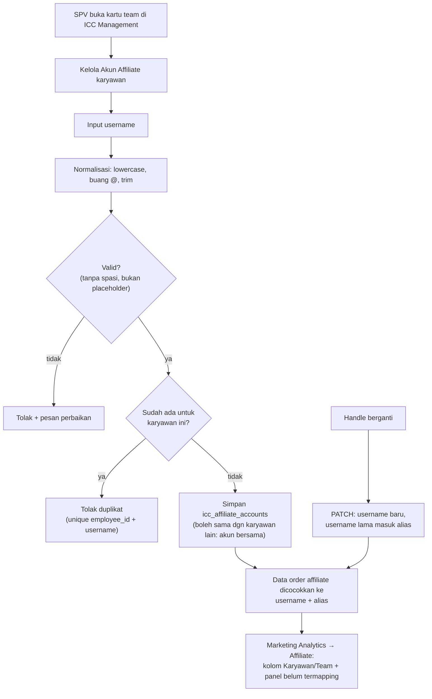

## Deskripsi

*Pengelolaan daftar akun TikTok affiliate milik **ICC (Internal Content Creator)** — karyawan internal Bharata yang menjalankan akun affiliate TikTok sebagai bagian dari program insentif perusahaan — dan integrasi data tersebut dengan sistem kepegawaian (Employee Service).*

- **Stack:** Next.js (frontend) · Go + Fiber v2 + MongoDB (backend)
- **Path frontend:** `frontend/src/features/marketing-insight/affiliate/`
- **Path backend (target):** `bip-erp/services/integration/` · `bip-erp/services/employee/` (TBD)
- **Status**: ✅ Implemented (2026-08-07) — daftar akun internal kini hidup di DB (`icc_affiliate_accounts`), dikelola SPV lewat **ICC Management** dan tampil sebagai kolom **Pemegang** di **Marketing Analytics → Affiliate**. Konstanta hardcoded sudah dihapus. Lihat [[#Keputusan Desain 2026-08-06 — Dikelola lewat ICC Management]] dan [[#Rencana Implementasi (Revisi 2026-08-06)]].
- **Belum**: data produksi belum diimpor (alat siap, lihat Fase C), Kyura belum ada berkasnya, serta antrean kandidat akun internal & pengisian `last_seen_at` belum dibuat.

---

## Latar Belakang

Program ICC (Internal Content Creator) adalah insentif bagi karyawan Bharata yang membuat dan mengelola akun TikTok affiliate untuk mempromosikan produk toko. Setiap anggota ICC bisa memiliki 1–2 akun TikTok affiliate.

Data performa affiliate (GMV, komisi, order) sudah ter-capture otomatis dari TikTok API via `affiliate_orders` collection di Integration Service (lihat [[ADR - 0009 Affiliate via Search Seller Affiliate Orders API]]). Namun sistem belum bisa membedakan mana order dari kreator **internal (ICC)** vs kreator **eksternal (publik)** — keduanya muncul hanya sebagai `creator_username`.

---

## Implementasi Lama (Hardcoded — sudah dicabut 2026-08-07)

> 🗄️ **Arsip.** `internal-creators.ts` sudah dihapus dan tab ICC di `/marketing-insight/affiliate` dicabut. Bagian ini dipertahankan sebagai jejak: ia menerangkan mengapa penggantinya dirancang seperti sekarang. Keadaan yang berlaku ada di [[#Keputusan Desain 2026-08-06 — Dikelola lewat ICC Management]].

### Lokasi

`frontend/src/features/marketing-insight/affiliate/constants/internal-creators.ts`

### Mekanisme

Daftar username TikTok setiap anggota ICC di-hardcode sebagai konstanta TypeScript:

```ts
export const ICC_MEMBER_ACCOUNTS: Record<string, string[]> = {
  JULIAN:   ["i_skin"],
  FAJAR:    ["akubeauty.id", "akubeautyid"],
  // ... 33 anggota, 41 username total
};

export const INTERNAL_CREATOR_USERNAMES: Set<string> = new Set(
  Object.values(ICC_MEMBER_ACCOUNTS).flat().map(u => u.toLowerCase()),
);

export function isInternalCreator(username: string): boolean {
  return INTERNAL_CREATOR_USERNAMES.has(username.toLowerCase());
}
```

### Penggunaan

Tab **ICC** di halaman Affiliate Performance (`/marketing-insight/affiliate`) memfilter data `SummaryByCreator` menggunakan `isInternalCreator()`:

```
creatorsQuery (API: GET /affiliate/summary/creators)
  → creators[]
    → filter isInternalCreator(username)   ← dari konstanta hardcoded
      → iccCreators[]                      → render tabel tab ICC
```

Kolom tambahan **Nama ICC** menampilkan nama karyawan via `getIccMemberName(username)`.

### Masalah Pendekatan Ini

| Masalah | Dampak |
|---|---|
| Tambah/keluar anggota ICC → harus edit kode + deploy ulang | Effort dev untuk perubahan non-teknis |
| Nama karyawan hardcoded (bukan dari DB karyawan) | Rentan tidak sinkron jika ada perubahan nama/jabatan |
| Tidak ada validasi apakah username masih aktif | Username bisa berubah tanpa sistem mengetahui |
| Tidak bisa dikelola oleh HR/ADV Leader tanpa akses kode | Ketergantungan ke developer |
| Tidak ada audit trail perubahan daftar | Tidak bisa tahu siapa/kapan username ditambah/dihapus |

---

## Rancangan Integrasi dengan Employee Service

### Tujuan

Menggantikan konstanta hardcoded dengan data yang bersumber dari **Employee Service** (HRIS), sehingga daftar ICC dan username TikTok-nya dikelola oleh HR/ADV Leader via ERP, tanpa perlu intervensi developer.

### Pilihan Arsitektur

#### Opsi A — Field `tiktok_usernames` di Employee Service (Direkomendasikan)

Tambahkan field profil sosial media ke data karyawan di Employee Service. Integration Service mengambil daftar ICC via API Employee Service saat query.

```
Employee Service (HRIS)
  └── employee_profiles collection
        └── tiktok_usernames: string[]   ← field baru
        └── is_icc: bool                 ← flag ICC aktif

Integration Service
  └── GET /affiliate/summary/creators?icc_only=true
        └── query Employee Service untuk daftar username ICC
        └── filter creator rows by username match
```

**Kelebihan:** Single source of truth di HRIS; HR bisa kelola langsung via ERP.
**Kekurangan:** Integration Service harus HTTP call ke Employee Service per request (bisa di-cache).

---

#### Opsi B — Koleksi `icc_creators` di Integration Service

Integration Service punya koleksi sendiri yang di-sync dari Employee Service secara periodik.

```
Employee Service  →  (sync cron / webhook)  →  icc_creators (MongoDB, Integration Service)
                                                   └── employee_id: string
                                                   └── employee_name: string
                                                   └── tiktok_usernames: string[]
                                                   └── active: bool
                                                   └── updated_at: time
```

**Kelebihan:** Tidak ada runtime dependency ke Employee Service; query tetap cepat.
**Kekurangan:** Data bisa stale (lag antara perubahan di HRIS dan sync); lebih kompleks.

---

#### Opsi C — Frontend fetch dari API (tanpa backend baru)

Integration Service expose endpoint baru yang membaca mapping dari Employee Service atau config DB, Frontend memanggil endpoint ini menggantikan konstanta.

```
GET /affiliate/icc-creators
  → [{employee_name, tiktok_usernames[]}]
```

**Kelebihan:** Perubahan paling minimal di backend.
**Kekurangan:** Endpoint baru di Integration Service tetap perlu dibuat; Employee Service tetap harus punya data username.

---

### Rekomendasi

**Opsi A** dengan caching di Integration Service:

1. **Employee Service** — tambah field `tiktok_usernames []string` dan `is_icc bool` ke entitas employee. HR/ADV Leader update via form di ERP.
2. **Integration Service** — cache daftar ICC username (TTL 1 jam) dari Employee Service. Gunakan cache untuk filter `SummaryByCreator` dan `ListOrders`.
3. **Frontend** — hapus `internal-creators.ts` setelah backend siap. API sudah return `is_internal: bool` per row.

Alasan memilih Opsi A: konsisten dengan pola yang sudah ada di [[Microservices - Insentive Service]] dimana mapping employee → performance juga bersumber dari Employee Service.

> **Superseded (2026-08-06)** — rekomendasi Opsi A **tidak jadi dipakai**. Penggantinya varian Opsi B yang dikelola langsung lewat ICC Management, bukan disinkronkan dari HRIS; alasannya di [[#Keputusan Desain 2026-08-06 — Dikelola lewat ICC Management]]. Bagian "Rencana Implementasi (Bertahap)" di bawah ikut usang dan dipertahankan sebagai jejak pertimbangan.

---

## Rencana Implementasi (Bertahap)

> ⚠️ **Usang** — digantikan [[#Rencana Implementasi (Revisi 2026-08-06)]]. Khususnya syarat "unik per sistem" di Fase 1 **salah** dan tidak boleh dipakai: data nyata membuktikan satu username bisa dipegang lebih dari satu karyawan (lihat Dependensi & Risiko: akun bersama).

### Fase 1 — Employee Service: Tambah Data TikTok ICC (Backend)

**File:** `bip-erp/services/employee/` (path eksak TBD — perlu cek struktur repo)

- Tambah field `tiktok_usernames []string` dan `is_icc bool` ke entitas karyawan
- Tambah endpoint `GET /employees/icc-creators` yang mengembalikan `[{employee_id, name, tiktok_usernames}]` (hanya karyawan `is_icc=true`)
- Tambah validasi: username TikTok harus lowercase, tanpa `@`, unik per sistem
- Seed data awal dari daftar ICC yang ada (33 anggota, 41 username)
- **Test:** unit test entitas + integration test endpoint

### Fase 2 — Integration Service: Cache & Filter ICC (Backend)

**File:** `bip-erp/services/integration/internal/`

- Tambah `icc_cache.go` — in-memory cache daftar ICC username dengan TTL 1 jam, refresh dari Employee Service via HTTP
- Update `affiliate_repo.go` — `SummaryByCreator` dan `ListOrders` terima filter `ICCOnly bool`; join dengan cache username
- Update `affiliate_handler.go` — expose `?icc_only=true` query param
- Update entity `AffiliateCreatorSummary` — tambah field `IsInternal bool` dan `EmployeeName string`
- **Test:** unit test cache TTL + mock Employee Service response

### Fase 3 — Frontend: Konsumsi Data dari API (Frontend)

**File:** `frontend/src/features/marketing-insight/affiliate/`

- Update `use-fetch-affiliate.ts` — tambah fetch `GET /affiliate/icc-creators` untuk tab ICC
- Update `page.tsx` — tab ICC menggunakan data dari API (bukan filter klien)
- Hapus `constants/internal-creators.ts` setelah Fase 2 live
- **Test:** pastikan tab ICC masih render benar setelah konstanta dihapus

### Fase 4 — UI Manajemen ICC di ERP (Frontend + Backend) — TBD

- Form di halaman HR/Employee untuk ADV Leader mengelola `tiktok_usernames` per karyawan
- Audit log perubahan username
- Validasi duplikasi username antar karyawan

---

## Keputusan Desain 2026-08-06 — Dikelola lewat ICC Management

*Permintaan: username akun affiliate bisa diinput di ICC Management, lalu dipakai memetakan data affiliate di [[APP - Web ERP]] menu Marketing Analytics → Affiliate. Sumber data awal: `z-file-hasil/DATA NAMA AKUN TIKTOK ICC BEAUTYHACKS.xlsx` tab **AKUN TIKTOK ICC** — 36 staff, 49 username (Beauty Hacks saja; Kyura belum ada).*

- **Status**: ⚠️ Sebagian terimplementasi (2026-08-07) — **Fase A–C selesai**: koleksi `icc_affiliate_accounts` + endpoint, sub-tab Akun Affiliate di ICC Management, dan alat impor `cmd/iccaffiliateimport`. **Fase D ditahan sampai E**; datanya belum diimpor ke produksi. Rinciannya di [[#Rencana Implementasi (Revisi 2026-08-06)]].

### Mengapa bukan Opsi A (Employee Service)

Pemilik data ini **SPV/leader marketing, bukan HR**. ICC Management sudah memiliki persis perangkat yang dibutuhkan: RBAC `RequireMarketingLeader`, aturan leader-first, dan kartu per team (Fase 5–6 di [[Sales - ICC Account Manager Mapping]]). Menaruh input di HRIS berarti membangun UI dan izin baru untuk data yang bukan miliknya, lalu menambah panggilan HTTP + cache TTL lintas service untuk data yang jarang berubah. Opsi B dipilih, tetapi **tanpa sinkronisasi dari HRIS** — diisi langsung oleh yang memilikinya.

### Koleksi terpisah, bukan field di `icc_account_mappings`

Kardinalitasnya berbeda: satu karyawan bisa punya **banyak baris mapping** (satu per toko/advertiser/Shopee). Kalau username ditempelkan ke baris mapping, tidak jelas baris mana yang memegangnya dan nilainya terduplikasi setiap kali karyawan itu memegang toko baru. **Akun affiliate melekat pada KARYAWAN, bukan pada toko.**

Koleksi baru `icc_affiliate_accounts` (Integration Service) — **daftar akun internal**, bukan daftar penugasan:

```json
{
  "_id": "UUID",
  "team":          "Beauty Hacks",
  "username":      "glowinajah",
  "alias":         ["glowinajah_lama"],
  "employee_id":   "BIP-0114",
  "employee_name": "Aan Budiyanto",
  "is_active":     true,
  "last_seen_at":  "2026-08-01T00:00:00Z",
  "notes":         "",
  "created_by": "…", "updated_by": "…", "created_at": "…", "updated_at": "…"
}
```

**`employee_id` OPSIONAL — kosong berarti *belum ditugaskan*, BUKAN eksternal.** Ini keputusan paling penting di sini: yang dicampur selama ini adalah dua fakta berbeda —

| Fakta | Sifat | Disimpan di |
|---|---|---|
| **Kepemilikan** — akun ini milik perusahaan | organisasi, jarang berubah | baris ini (`team` wajib) |
| **Penugasan** — dipegang staf siapa | operasional, boleh kosong, sering bergilir | `employee_id` (opsional) |

Klasifikasi internal **tidak boleh bergantung** pada ada-tidaknya pemegang. Akibatnya: akun tanpa pemegang tetap tergolong internal di laporan, tetapi **tidak menghasilkan insentif individu** karena tak ada orang yang dituju — perilaku yang justru benar.

> **Jangan** memakai karyawan placeholder ("BELUM DITUGASKAN") sebagai penambal. Itu mencemari master karyawan, muncul di dropdown dan laporan KPI, lalu menciptakan "orang" palsu yang harus dibersihkan belakangan.

**Constraint**: `team` wajib; unique `(employee_id, username)` untuk baris aktif — **BUKAN** unique username global. Satu username boleh dipegang lebih dari satu karyawan; ini fakta di data, bukan kelonggaran (lihat Dependensi & Risiko: akun bersama).

### Untuk TOKO tidak perlu mekanisme serupa

Toko yang **belum dipegang** staf ICC sudah otomatis internal karena kepemilikannya tercatat berlapis di tempat lain: `tt_shop_authorized_shops` (toko terautorisasi = milik kita) dan `department_shops` (toko milik departemen mana — di kodenya ditegaskan ini *kepemilikan*, berbeda dari `/marketing/teams` yang *kontrol akses*). `icc_account_mappings` hanya tahu soal **penugasan**. Kesalahan yang harus dihindari: memakai mapping ICC sebagai penentu "ini toko kita atau bukan".

### Field advertiser TIDAK diganti

Permintaan awal berbunyi "input TikTok Advertiser diganti username affiliate". **Tidak dilakukan** — `tiktok_advertiser_id` masih menyuplai tab **Performa Iklan** (GMV Max) di ICC Dashboard & Team Performance; menghapusnya akan mematikan tab itu bagi ADV/leader yang memakainya. Yang dilakukan: **menambah** jenis akun baru. Advertiser tetap opsional dan boleh kosong — memang kosong untuk mayoritas staff ICC.

### Normalisasi & validasi username

Simpan **lowercase, tanpa `@`, ter-trim**; tolak yang mengandung spasi dan placeholder. Ini bukan kerapian belaka — data sumbernya kotor: prefix `@` tidak konsisten (`i_skin` vs `@akubeauty.id`), spasi di depan (`" @efcare"`), username berspasi (`"@zestique beauty"` — bukan handle valid), placeholder `-` dan `@` kosong, satu sel berisi objek hyperlink, serta 3 orang tanpa username (SATRIO, TAMA, VIRGIE).

### Rename = edit di tempat + alias

Username TikTok bisa berganti kapan saja tanpa notifikasi, jadi **harus bisa diedit** — dan saat ini mapping ICC belum bisa diedit sama sekali (`PATCH /icc/mappings/:id` hanya menerima `is_active` & `notes`).

Bedakan dua kejadian yang mudah tercampur:

| Kejadian | Perlakuan | Alasan |
|---|---|---|
| **Handle berubah** (orang sama, akun sama) | **Edit di tempat**; username lama masuk `alias`, tidak dihapus | Order affiliate historis tetap tercatat dengan username lama. Kalau ditimpa, seluruh riwayat kreator itu mendadak terbaca "tidak termapping"/eksternal dan angka periode lampau ikut berubah |
| **Akun berpindah pemegang** | Nonaktifkan baris lama, buat baris baru | Sama seperti rotasi toko: riwayat insentif harus tetap menempel ke orang lama |

Pencocokan order dilakukan terhadap **gabungan `username` + `alias`**.

### `last_seen_at` — deteksi handle basi

Diisi dari data order affiliate: kapan terakhir username itu muncul. Username yang berubah tanpa dilaporkan akan terlihat sendiri (tiba-tiba nol order berminggu-minggu), alih-alih menunggu ada yang komplain angkanya turun.

### Dampak ke tampilan ICC Management

Kartu team (Fase 6 di [[Sales - ICC Account Manager Mapping]]) mendapat **sub-tab**: **Toko & Iklan** (isi sekarang) dan **Akun Affiliate** (daftar akun internal team itu). Sub-tab ditaruh **di dalam kartu**, bukan di tingkat halaman, supaya pemisahan per team tetap terjaga.

Daftar akun menampilkan **semua akun internal team**, termasuk yang **belum ditugaskan** — justru itu antrean kerja SPV, bukan data yang boleh menguap. Baris karyawan di tab Toko & Iklan saat ini diturunkan hanya dari mapping toko (`kelompokkanMappingPerTeam`); karyawan yang cuma punya akun affiliate tanpa toko tidak akan muncul, sehingga sumber barisnya harus menjadi **gabungan mapping toko ∪ akun affiliate**.

Saat assign karyawan, field akun affiliate memakai dropdown dari daftar ini — mengikuti pola `available-shops`/`available-advertisers` yang sudah ada, **dengan satu perbedaan wajib**: akun bersama boleh dipegang lebih dari satu orang, jadi akun yang sudah dipegang **tidak boleh** dikeluarkan dari dropdown seperti perlakuan pada toko.

### Endpoint (usulan)

Semua di Integration Service, guard `RequireMarketingLeader`, `team` dari header `BIP-Department` seperti mapping:

| Endpoint | Keterangan |
|---|---|
| `GET /icc/affiliate-accounts` | filter `team`, `employee_id`, `is_active`, `belum_ditugaskan` |
| `POST /icc/affiliate-accounts` | tambah akun (normalisasi + validasi di usecase); `employee_id` boleh kosong |
| `PATCH /icc/affiliate-accounts/:id` | ubah username (lama → `alias`), tetapkan/lepas `employee_id`, `is_active`, `notes` |
| `DELETE /icc/affiliate-accounts/:id` | hanya bila sudah nonaktif (pola sama dengan mapping) |

### Alur input & pencocokan



### Integrasi ke Marketing Analytics → Affiliate

Halaman itu sekarang menampilkan `creator` (username) + `collaboration_type` (internal/eksternal dari collaboration id), **tanpa identitas karyawan**. Dua hal ini **sumbu berbeda dan tidak saling menggantikan**: `collaboration_type` adalah sifat **order**-nya (datang dari TikTok), sedangkan kepemilikan adalah **siapa karyawan** di balik username (datang dari mapping kita).

> **JANGAN menimpa kolom golongan yang sudah ada.** Semantiknya dibangun dari dokumentasi resmi TikTok (`affiliate.go`: target collaboration = kreator yang KITA undang; open collaboration = kreator yang datang sendiri) berikut aturan "target menang atas open". Kepemilikan akun harus jadi **dimensi baru** (kolom "Kepemilikan": karyawan X / luar / belum terdaftar) yang berdampingan dengan "Golongan", bukan menggantikannya.

Justru karena keduanya independen, **persilangannya** yang bernilai:

| | Order target collab (internal) | Order open collab (eksternal) |
|---|---|---|
| **Username ada di daftar internal** | sehat | ⚠️ akun kita belum didaftarkan target collab di toko itu — persis yang dikejar sheet `DONE` per toko di file Excel |
| **Belum ada di daftar** | ⚠️ kandidat akun internal yang belum terdaftar | wajar (kreator publik) |

**Kandidat akun internal diturunkan dari data, bukan dari laporan manual.** Akun baru yang dibuat staf tanpa sepengetahuan tim IT tidak akan pernah tertangkap kalau menunggu dilaporkan. Sel kiri-bawah tabel di atas memberi deteksinya gratis: kreator yang ordernya **target collaboration** berarti diundang oleh toko kita sendiri — bila username-nya belum ada di daftar, itu kandidat akun internal. Tampilkan sebagai antrean dengan aksi "tandai internal" (sekali klik masuk daftar).

**Cara mengalirkan datanya**: Marketing Analytics **membaca `integration_db` langsung secara baca-saja** — pola yang sudah berjalan di service itu untuk `icc_account_mappings` (kolom penanggung jawab toko), dijaga test `TestTidakAdaPenulisanKeIntegrationDB`. Jadi cukup tambahkan `icc_affiliate_accounts` ke daftar koleksi yang dibaca; **tidak perlu** endpoint HTTP baru. (Catatan: larangan memanggil route ber-RBAC antar-service — pelajaran `mappingDariRingkasan` di `services/insentive/func.go` yang selalu kena 403 — tetap berlaku untuk Insentive Service, bukan untuk jalur baca-DB ini.)

### Belum Diputuskan (TBD)

- **Atribusi order akun bersama** — `@efcare` dipakai FIRA & IPUL, `@auraliaa__` dipakai BELIA & FADLY. Saat insentif dihitung, order dari akun itu masuk ke siapa: dibagi rata, salah satu ditandai pemilik utama, atau dihitung penuh ke keduanya? **Harus diputuskan sebelum fase insentif**, tetapi tidak menghalangi pengumpulan datanya.
- **Akun internal tanpa pemegang** — nilainya ikut akumulasi insentif **leader/tim** (karena milik team) atau tidak dihitung sama sekali? Condong ke "masuk laporan tim, tidak masuk insentif individu", tetapi ini keputusan bisnis.
- **Data Kyura** — belum ada file setara Beauty Hacks.

### Rencana Implementasi (Revisi 2026-08-06)

| Fase | Scope | Status |
|---|---|---|
| **A** | Integration: koleksi `icc_affiliate_accounts` (`employee_id` opsional) + endpoint + normalisasi/validasi + unit test | ✅ Selesai (2026-08-07; branch `feat/icc-affiliate-accounts`) |
| **B** | FE ICC Management: sub-tab **Akun Affiliate** di kartu team (termasuk akun belum ditugaskan), dialog kelola (tambah/rename→alias/tetapkan pemegang/nonaktifkan) | ✅ Selesai (2026-08-07) |
| **C** | Alat impor `cmd/iccaffiliateimport` (dry-run bawaan, `-apply` untuk menulis) — lihat [[#Aturan impor dari Excel]]. **Belum dijalankan ke produksi**; Kyura belum ada berkasnya | ✅ Alat siap (2026-08-07) |
| **D** | Pensiunkan `internal-creators.ts` — sumber pindah ke DB | ✅ Selesai (2026-08-07) |
| **E** | Marketing Analytics → Affiliate: kolom **Pemegang** (sumbu baru, bukan pengganti Golongan) lewat baca-langsung `integration_db` | ✅ Selesai (2026-08-07). Sisa: antrean kandidat akun internal & pengisian `last_seen_at` — 🟡 belum |

**Fase B — penyimpangan yang disengaja**: baris karyawan di tab *Toko & Iklan* **tidak** digabung dengan akun affiliate seperti rancangan awal. Dengan adanya sub-tab, karyawan yang hanya punya akun affiliate sudah terlihat sebagai pemegang akun di tab sebelahnya; menggabungkannya hanya menambah baris yang seluruh kolom tokonya kosong.

**Fase D — yang dicabut hanya tab ICC, bukan halamannya**: `internal-creators.ts` sudah dihapus setelah penggantinya (kolom Pemegang, Fase E) ada. Halaman lama `/marketing-insight/affiliate` **tetap hidup** karena masih memuat validasi komisi, riwayat sync, dan view Shopee yang belum ada di penggantinya, dan rutenya sengaja dipertahankan agar tautan lama tidak putus. Tab ICC-nya diganti satu paragraf yang menunjuk ke kolom Pemegang.

**Fase E — tiga keadaan yang dibedakan** di kolom Pemegang, karena tindakannya berbeda: ada nama pemegang · **belum ditugaskan** (akun perusahaan, pekerjaan SPV di ICC Management) · **belum terdaftar** (di luar daftar — sengaja bukan disebut "luar", sebab daftar bisa belum lengkap). Alias ikut dicocokkan supaya order lampau tak mendadak terbaca belum terdaftar saat handle berganti; username aktif menang atas alias milik akun lain. Kepemilikan bersifat **pelengkap**: bila daftar akun gagal dibaca, halaman tetap tampil dengan angka yang benar dan kolomnya kosong.

**Catatan operasional**: kolom Pemegang baru berisi setelah Fase C dijalankan ke produksi dan SPV menetapkan pemegangnya.

### Aturan impor dari Excel

Ditetapkan setelah verifikasi berkas versi 2026-08-06 (`z-file-hasil/DATA NAMA AKUN TIKTOK ICC BEAUTYHACKS.xlsx`, tab **AKUN TIKTOK ICC**; tidak ada sel merge — kolom nama benar-benar kosong pada baris tertentu):

1. **Sel NAMA kosong = akun tidak dipakai siapa pun** (dikonfirmasi pemilik data). Impor sebagai akun internal dengan `employee_id` **kosong** — bukan dilewati, bukan ditempelkan ke nama baris di atasnya. Terhitung **14 username** dalam keadaan ini (baris 5, 6, 7, 8, 14, 17, 22, 23, 26, 31).
2. **Username sama muncul dua kali, satu bernama satu kosong → yang bernama menang**, baris kosongnya dibuang. Bukan dijadikan dua baris. Kasus nyata: `efcare` ada di baris 16 (FIRA) dan baris 17 (tanpa nama).
3. **Normalisasi**: lowercase, buang `@`, trim.
4. **Lewati** placeholder dan sel rusak: `-`, `@` sendirian, sel yang berisi objek hyperlink (baris YOGI), serta baris tanpa username sama sekali.
5. **Tahan dan konfirmasi manual** username yang mengandung spasi — `zestique beauty` bukan handle valid; versi terverifikasi sebelumnya `zestique_beauty`.

## Dependensi & Risiko

| Item | Detail |
|---|---|
| **Risiko: username berubah** | Kreator bisa ganti username TikTok kapan saja; tidak ada notifikasi otomatis dari API TikTok. Ditangani lewat edit + `alias` + `last_seen_at` |
| **Akun bersama — tidak diharapkan, tetap ditoleransi** | Kebijakan per 2026-08-06: satu akun dipegang satu orang; berkas sumber sudah dirapikan (`auraliaa__` dan `gumince` tidak lagi dobel). Model data **tetap** permisif (unik per pasangan karyawan–username, bukan unik global) karena kasusnya masih muncul di data (`efcare`) dan constraint global akan membuat impor gagal diam-diam. Yang benar: **peringatkan** saat satu akun hendak diberikan ke orang kedua, jangan tolak tanpa penjelasan |
| **Risiko: akun tidak aktif** | Kreator yang resign tidak otomatis off dari daftar ICC |
| **Dependency runtime** | Fase 2 menambah HTTP call ke Employee Service; pastikan timeout + fallback (jika Employee Service down, fallback ke cache lama) |

### Catatan Data Saat Ini

**Berkas 2026-08-06** (terverifikasi langsung; menggantikan hitungan 2026-07-04 di bawah):

- **36 baris nama**, **45 username unik** (46 pasangan nama–username, selisihnya `efcare` yang muncul dua kali)
- **14 username tanpa pemegang** — sel nama kosong, artinya akun tidak dipakai siapa pun (baris 5, 6, 7, 8, 14, 17, 22, 23, 26, 31). Ini bukan kerusakan data: dikonfirmasi pemilik data, dan justru alasan `employee_id` dibuat opsional
- **5 orang tanpa username**: SATRIO, FUAD (`@` kosong), TAMA, VIRGIE, FAJAR
- `auraliaa__` dan `gumince` **tidak lagi dobel**; `efcare` masih (baris 16 FIRA + baris 17 tanpa nama) → diselesaikan aturan impor no. 2
- `zestique beauty` masih mengandung spasi; sel YOGI berisi objek hyperlink, bukan teks
- Tab per toko (`BH.STORE`, `BH.ID`, `BH.CO`, `BHS`) = **checklist pendaftaran akun ke tiap toko** (kolom `DONE`), bukan daftar pemegang toko. **Jangan diimpor** sebagai struktur data — status itu bisa diturunkan dari order (lihat tabel persilangan di [[#Integrasi ke Marketing Analytics → Affiliate]])

<details><summary>Hitungan lama 2026-07-04 (33 anggota) — arsip</summary>

- **41 username** aktif (beberapa anggota punya 2 akun)
- **SATRIO** — username TikTok belum diketahui (TBD)
- **HANIF** — username diverifikasi `zestique_beauty` (bukan `zestique beauty`)
- **BELIA & FADLY** — berbagi akun `auraliaa__`
- **FIRA & IPUL** — berbagi akun `efcare`
- **GUMILANG & FUAD** — berbagi akun `gumince`

</details>

---

## Dokumen Terkait

- [[ADR - 0009 Affiliate via Search Seller Affiliate Orders API]] — sumber data affiliate TikTok
- [[Microservices - Insentive Service]] — engine insentif ICC (pay-per-video, scoring)
- [[Sales - Incentive]] — kriteria & aturan insentif ICC
- [[Microservices - Integration Service]] — service yang menyimpan `affiliate_orders`
- [[Microservices - Employee Service]] — dipertimbangkan sebagai sumber (Opsi A), tidak jadi dipakai
- [[Microservices - Marketing Analytics Service]] — konsumen daftar akun internal; sudah membaca `integration_db` baca-saja untuk penanggung jawab toko
- [[Sales - ICC Account Manager Mapping]] — mapping toko/iklan & kartu per team tempat sub-tab Akun Affiliate akan ditaruh
- [[APP - Web ERP]] — frontend ERP (halaman ICC Management & Marketing Analytics → Affiliate)
