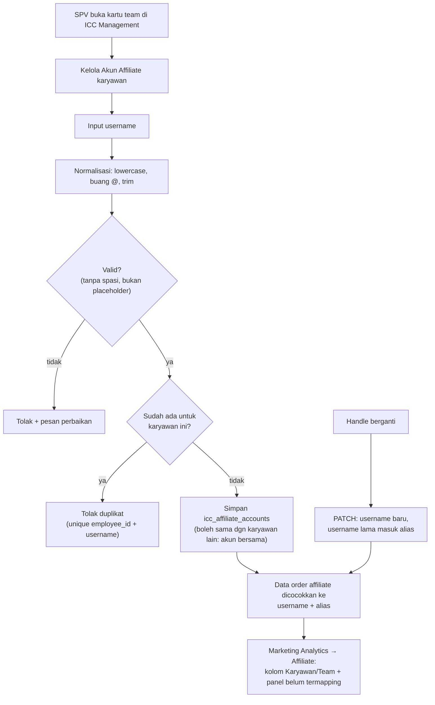

## Deskripsi

*Pengelolaan daftar akun TikTok affiliate milik **ICC (Internal Content Creator)** — karyawan internal Bharata yang menjalankan akun affiliate TikTok sebagai bagian dari program insentif perusahaan — dan integrasi data tersebut dengan sistem kepegawaian (Employee Service).*

- **Stack:** Next.js (frontend) · Go + Fiber v2 + MongoDB (backend)
- **Path frontend:** `frontend/src/features/marketing-insight/affiliate/`
- **Path backend (target):** `bip-erp/services/integration/` · `bip-erp/services/employee/` (TBD)
- **Status**: ⚠️ Implemented parsial — mapping berjalan tapi hardcoded di frontend; **rancangan penggantinya sudah diputuskan**, lihat [[#Keputusan Desain 2026-08-06 — Dikelola lewat ICC Management]] (🟡 belum dikerjakan)

---

## Latar Belakang

Program ICC (Internal Content Creator) adalah insentif bagi karyawan Bharata yang membuat dan mengelola akun TikTok affiliate untuk mempromosikan produk toko. Setiap anggota ICC bisa memiliki 1–2 akun TikTok affiliate.

Data performa affiliate (GMV, komisi, order) sudah ter-capture otomatis dari TikTok API via `affiliate_orders` collection di Integration Service (lihat [[ADR - 0009 Affiliate via Search Seller Affiliate Orders API]]). Namun sistem belum bisa membedakan mana order dari kreator **internal (ICC)** vs kreator **eksternal (publik)** — keduanya muncul hanya sebagai `creator_username`.

---

## Implementasi Saat Ini (Hardcoded — ⚠️)

### Lokasi

`frontend/src/features/marketing-insight/affiliate/constants/internal-creators.ts`

### Mekanisme

Daftar username TikTok setiap anggota ICC di-hardcode sebagai konstanta TypeScript:

```ts
export const ICC_MEMBER_ACCOUNTS: Record<string, string[]> = {
  JULIAN:   ["i_skin"],
  FAJAR:    ["akubeauty.id", "akubeautyid"],
  // ... 33 anggota, 41 username total
};

export const INTERNAL_CREATOR_USERNAMES: Set<string> = new Set(
  Object.values(ICC_MEMBER_ACCOUNTS).flat().map(u => u.toLowerCase()),
);

export function isInternalCreator(username: string): boolean {
  return INTERNAL_CREATOR_USERNAMES.has(username.toLowerCase());
}
```

### Penggunaan

Tab **ICC** di halaman Affiliate Performance (`/marketing-insight/affiliate`) memfilter data `SummaryByCreator` menggunakan `isInternalCreator()`:

```
creatorsQuery (API: GET /affiliate/summary/creators)
  → creators[]
    → filter isInternalCreator(username)   ← dari konstanta hardcoded
      → iccCreators[]                      → render tabel tab ICC
```

Kolom tambahan **Nama ICC** menampilkan nama karyawan via `getIccMemberName(username)`.

### Masalah Pendekatan Ini

| Masalah | Dampak |
|---|---|
| Tambah/keluar anggota ICC → harus edit kode + deploy ulang | Effort dev untuk perubahan non-teknis |
| Nama karyawan hardcoded (bukan dari DB karyawan) | Rentan tidak sinkron jika ada perubahan nama/jabatan |
| Tidak ada validasi apakah username masih aktif | Username bisa berubah tanpa sistem mengetahui |
| Tidak bisa dikelola oleh HR/ADV Leader tanpa akses kode | Ketergantungan ke developer |
| Tidak ada audit trail perubahan daftar | Tidak bisa tahu siapa/kapan username ditambah/dihapus |

---

## Rancangan Integrasi dengan Employee Service

### Tujuan

Menggantikan konstanta hardcoded dengan data yang bersumber dari **Employee Service** (HRIS), sehingga daftar ICC dan username TikTok-nya dikelola oleh HR/ADV Leader via ERP, tanpa perlu intervensi developer.

### Pilihan Arsitektur

#### Opsi A — Field `tiktok_usernames` di Employee Service (Direkomendasikan)

Tambahkan field profil sosial media ke data karyawan di Employee Service. Integration Service mengambil daftar ICC via API Employee Service saat query.

```
Employee Service (HRIS)
  └── employee_profiles collection
        └── tiktok_usernames: string[]   ← field baru
        └── is_icc: bool                 ← flag ICC aktif

Integration Service
  └── GET /affiliate/summary/creators?icc_only=true
        └── query Employee Service untuk daftar username ICC
        └── filter creator rows by username match
```

**Kelebihan:** Single source of truth di HRIS; HR bisa kelola langsung via ERP.
**Kekurangan:** Integration Service harus HTTP call ke Employee Service per request (bisa di-cache).

---

#### Opsi B — Koleksi `icc_creators` di Integration Service

Integration Service punya koleksi sendiri yang di-sync dari Employee Service secara periodik.

```
Employee Service  →  (sync cron / webhook)  →  icc_creators (MongoDB, Integration Service)
                                                   └── employee_id: string
                                                   └── employee_name: string
                                                   └── tiktok_usernames: string[]
                                                   └── active: bool
                                                   └── updated_at: time
```

**Kelebihan:** Tidak ada runtime dependency ke Employee Service; query tetap cepat.
**Kekurangan:** Data bisa stale (lag antara perubahan di HRIS dan sync); lebih kompleks.

---

#### Opsi C — Frontend fetch dari API (tanpa backend baru)

Integration Service expose endpoint baru yang membaca mapping dari Employee Service atau config DB, Frontend memanggil endpoint ini menggantikan konstanta.

```
GET /affiliate/icc-creators
  → [{employee_name, tiktok_usernames[]}]
```

**Kelebihan:** Perubahan paling minimal di backend.
**Kekurangan:** Endpoint baru di Integration Service tetap perlu dibuat; Employee Service tetap harus punya data username.

---

### Rekomendasi

**Opsi A** dengan caching di Integration Service:

1. **Employee Service** — tambah field `tiktok_usernames []string` dan `is_icc bool` ke entitas employee. HR/ADV Leader update via form di ERP.
2. **Integration Service** — cache daftar ICC username (TTL 1 jam) dari Employee Service. Gunakan cache untuk filter `SummaryByCreator` dan `ListOrders`.
3. **Frontend** — hapus `internal-creators.ts` setelah backend siap. API sudah return `is_internal: bool` per row.

Alasan memilih Opsi A: konsisten dengan pola yang sudah ada di [[Microservices - Insentive Service]] dimana mapping employee → performance juga bersumber dari Employee Service.

> **Superseded (2026-08-06)** — rekomendasi Opsi A **tidak jadi dipakai**. Penggantinya varian Opsi B yang dikelola langsung lewat ICC Management, bukan disinkronkan dari HRIS; alasannya di [[#Keputusan Desain 2026-08-06 — Dikelola lewat ICC Management]]. Bagian "Rencana Implementasi (Bertahap)" di bawah ikut usang dan dipertahankan sebagai jejak pertimbangan.

---

## Rencana Implementasi (Bertahap)

> ⚠️ **Usang** — digantikan [[#Rencana Implementasi (Revisi 2026-08-06)]]. Khususnya syarat "unik per sistem" di Fase 1 **salah** dan tidak boleh dipakai: data nyata membuktikan satu username bisa dipegang lebih dari satu karyawan (lihat Dependensi & Risiko: akun bersama).

### Fase 1 — Employee Service: Tambah Data TikTok ICC (Backend)

**File:** `bip-erp/services/employee/` (path eksak TBD — perlu cek struktur repo)

- Tambah field `tiktok_usernames []string` dan `is_icc bool` ke entitas karyawan
- Tambah endpoint `GET /employees/icc-creators` yang mengembalikan `[{employee_id, name, tiktok_usernames}]` (hanya karyawan `is_icc=true`)
- Tambah validasi: username TikTok harus lowercase, tanpa `@`, unik per sistem
- Seed data awal dari daftar ICC yang ada (33 anggota, 41 username)
- **Test:** unit test entitas + integration test endpoint

### Fase 2 — Integration Service: Cache & Filter ICC (Backend)

**File:** `bip-erp/services/integration/internal/`

- Tambah `icc_cache.go` — in-memory cache daftar ICC username dengan TTL 1 jam, refresh dari Employee Service via HTTP
- Update `affiliate_repo.go` — `SummaryByCreator` dan `ListOrders` terima filter `ICCOnly bool`; join dengan cache username
- Update `affiliate_handler.go` — expose `?icc_only=true` query param
- Update entity `AffiliateCreatorSummary` — tambah field `IsInternal bool` dan `EmployeeName string`
- **Test:** unit test cache TTL + mock Employee Service response

### Fase 3 — Frontend: Konsumsi Data dari API (Frontend)

**File:** `frontend/src/features/marketing-insight/affiliate/`

- Update `use-fetch-affiliate.ts` — tambah fetch `GET /affiliate/icc-creators` untuk tab ICC
- Update `page.tsx` — tab ICC menggunakan data dari API (bukan filter klien)
- Hapus `constants/internal-creators.ts` setelah Fase 2 live
- **Test:** pastikan tab ICC masih render benar setelah konstanta dihapus

### Fase 4 — UI Manajemen ICC di ERP (Frontend + Backend) — TBD

- Form di halaman HR/Employee untuk ADV Leader mengelola `tiktok_usernames` per karyawan
- Audit log perubahan username
- Validasi duplikasi username antar karyawan

---

## Keputusan Desain 2026-08-06 — Dikelola lewat ICC Management

*Permintaan: username akun affiliate bisa diinput di ICC Management, lalu dipakai memetakan data affiliate di [[APP - Web ERP]] menu Marketing Analytics → Affiliate. Sumber data awal: `z-file-hasil/DATA NAMA AKUN TIKTOK ICC BEAUTYHACKS.xlsx` tab **AKUN TIKTOK ICC** — 36 staff, 49 username (Beauty Hacks saja; Kyura belum ada).*

- **Status**: 🟡 Rencana — desain disetujui, belum ada di kode.

### Mengapa bukan Opsi A (Employee Service)

Pemilik data ini **SPV/leader marketing, bukan HR**. ICC Management sudah memiliki persis perangkat yang dibutuhkan: RBAC `RequireMarketingLeader`, aturan leader-first, dan kartu per team (Fase 5–6 di [[Sales - ICC Account Manager Mapping]]). Menaruh input di HRIS berarti membangun UI dan izin baru untuk data yang bukan miliknya, lalu menambah panggilan HTTP + cache TTL lintas service untuk data yang jarang berubah. Opsi B dipilih, tetapi **tanpa sinkronisasi dari HRIS** — diisi langsung oleh yang memilikinya.

### Koleksi terpisah, bukan field di `icc_account_mappings`

Kardinalitasnya berbeda: satu karyawan bisa punya **banyak baris mapping** (satu per toko/advertiser/Shopee). Kalau username ditempelkan ke baris mapping, tidak jelas baris mana yang memegangnya dan nilainya terduplikasi setiap kali karyawan itu memegang toko baru. **Akun affiliate melekat pada KARYAWAN, bukan pada toko.**

Koleksi baru `icc_affiliate_accounts` (Integration Service):

```json
{
  "_id": "UUID",
  "employee_id":   "BIP-0114",
  "employee_name": "Aan Budiyanto",
  "team":          "Beauty Hacks",
  "username":      "glowinajah",
  "alias":         ["glowinajah_lama"],
  "is_active":     true,
  "last_seen_at":  "2026-08-01T00:00:00Z",
  "notes":         "",
  "created_by": "…", "updated_by": "…", "created_at": "…", "updated_at": "…"
}
```

**Constraint**: unique `(employee_id, username)` untuk baris aktif — **BUKAN** unique username global. Satu username boleh dipegang lebih dari satu karyawan; ini fakta di data, bukan kelonggaran (lihat Dependensi & Risiko: akun bersama).

### Field advertiser TIDAK diganti

Permintaan awal berbunyi "input TikTok Advertiser diganti username affiliate". **Tidak dilakukan** — `tiktok_advertiser_id` masih menyuplai tab **Performa Iklan** (GMV Max) di ICC Dashboard & Team Performance; menghapusnya akan mematikan tab itu bagi ADV/leader yang memakainya. Yang dilakukan: **menambah** jenis akun baru. Advertiser tetap opsional dan boleh kosong — memang kosong untuk mayoritas staff ICC.

### Normalisasi & validasi username

Simpan **lowercase, tanpa `@`, ter-trim**; tolak yang mengandung spasi dan placeholder. Ini bukan kerapian belaka — data sumbernya kotor: prefix `@` tidak konsisten (`i_skin` vs `@akubeauty.id`), spasi di depan (`" @efcare"`), username berspasi (`"@zestique beauty"` — bukan handle valid), placeholder `-` dan `@` kosong, satu sel berisi objek hyperlink, serta 3 orang tanpa username (SATRIO, TAMA, VIRGIE).

### Rename = edit di tempat + alias

Username TikTok bisa berganti kapan saja tanpa notifikasi, jadi **harus bisa diedit** — dan saat ini mapping ICC belum bisa diedit sama sekali (`PATCH /icc/mappings/:id` hanya menerima `is_active` & `notes`).

Bedakan dua kejadian yang mudah tercampur:

| Kejadian | Perlakuan | Alasan |
|---|---|---|
| **Handle berubah** (orang sama, akun sama) | **Edit di tempat**; username lama masuk `alias`, tidak dihapus | Order affiliate historis tetap tercatat dengan username lama. Kalau ditimpa, seluruh riwayat kreator itu mendadak terbaca "tidak termapping"/eksternal dan angka periode lampau ikut berubah |
| **Akun berpindah pemegang** | Nonaktifkan baris lama, buat baris baru | Sama seperti rotasi toko: riwayat insentif harus tetap menempel ke orang lama |

Pencocokan order dilakukan terhadap **gabungan `username` + `alias`**.

### `last_seen_at` — deteksi handle basi

Diisi dari data order affiliate: kapan terakhir username itu muncul. Username yang berubah tanpa dilaporkan akan terlihat sendiri (tiba-tiba nol order berminggu-minggu), alih-alih menunggu ada yang komplain angkanya turun.

### Dampak ke tampilan ICC Management

Baris karyawan di kartu team saat ini diturunkan **hanya** dari mapping toko (`kelompokkanMappingPerTeam`). Karyawan yang cuma punya akun affiliate — tanpa toko — tidak akan muncul. Karena itu sumber baris harus menjadi **gabungan**: mapping toko ∪ akun affiliate. Tabel kartu mendapat kolom **Akun Affiliate**, dan tiap baris karyawan punya aksi kelola akun (tambah / rename→alias / nonaktifkan).

### Endpoint (usulan)

Semua di Integration Service, guard `RequireMarketingLeader`, `team` dari header `BIP-Department` seperti mapping:

| Endpoint | Keterangan |
|---|---|
| `GET /icc/affiliate-accounts` | filter `team`, `employee_id`, `is_active` |
| `POST /icc/affiliate-accounts` | tambah akun (normalisasi + validasi di usecase) |
| `PATCH /icc/affiliate-accounts/:id` | ubah username (lama → `alias`), `is_active`, `notes` |
| `DELETE /icc/affiliate-accounts/:id` | hanya bila sudah nonaktif (pola sama dengan mapping) |

### Alur input & pencocokan



### Integrasi ke Marketing Analytics → Affiliate

Halaman itu sekarang menampilkan `creator` (username) + `collaboration_type` (internal/eksternal dari collaboration id), **tanpa identitas karyawan**. Dua hal ini **sumbu berbeda dan tidak saling menggantikan**: `collaboration_type` adalah sifat **order**-nya (datang dari TikTok), sedangkan kepemilikan adalah **siapa karyawan** di balik username (datang dari mapping kita).

Justru karena independen, menggabungkannya memunculkan dua ketidakcocokan yang hari ini tak terlihat:

1. order tergolong **internal** tetapi username-nya **belum terdaftar** → mapping masih kurang;
2. kreator kita ber-order **open collaboration** → kolaborasinya belum disetel benar.

**Cara mengalirkan datanya**: Integration menyertakan pemilik langsung di ringkasan internalnya — mengikuti pelajaran `mappingDariRingkasan` di `services/insentive/func.go`, di mana panggilan antar-service ke route ber-RBAC selalu kena 403 karena hanya membawa kunci gateway tanpa identitas pengguna. Jangan ulangi pola itu.

### Belum Diputuskan (TBD)

- **Atribusi order akun bersama** — `@efcare` dipakai FIRA & IPUL, `@auraliaa__` dipakai BELIA & FADLY. Saat insentif dihitung, order dari akun itu masuk ke siapa: dibagi rata, salah satu ditandai pemilik utama, atau dihitung penuh ke keduanya? **Harus diputuskan sebelum fase insentif**, tetapi tidak menghalangi pengumpulan datanya.
- **Data Kyura** — belum ada file setara Beauty Hacks.

### Rencana Implementasi (Revisi 2026-08-06)

| Fase | Scope | Status |
|---|---|---|
| **A** | Integration: koleksi `icc_affiliate_accounts` + endpoint + normalisasi/validasi + unit test | 🟡 Belum |
| **B** | FE ICC Management: kolom Akun Affiliate di kartu team, dialog kelola (tambah/rename→alias/nonaktifkan), baris karyawan = mapping ∪ akun affiliate | 🟡 Belum |
| **C** | Import awal dari Excel Beauty Hacks (script sekali jalan, setelah dibersihkan); Kyura menyusul | 🟡 Belum |
| **D** | Pensiunkan `internal-creators.ts` — sumber pindah ke DB (halaman lamanya sudah tanpa menu) | 🟡 Belum |
| **E** | Marketing Analytics → Affiliate: kolom Karyawan/Team, panel "belum termapping", pengisian `last_seen_at` | 🟡 Belum |

## Dependensi & Risiko

| Item | Detail |
|---|---|
| **Prereq** | [[Microservices - Employee Service]] harus sudah bisa menerima field `tiktok_usernames` |
| **Risiko: username berubah** | Kreator bisa ganti username TikTok kapan saja; tidak ada notifikasi otomatis dari API TikTok |
| **Akun bersama (by design)** | Satu username bisa dimiliki >1 karyawan ICC (mis. `auraliaa__`, `efcare`, `gumince`); model data harus many-to-many (username → [employee_id]) — bukan unique constraint per username |
| **Risiko: akun tidak aktif** | Kreator yang resign tidak otomatis off dari daftar ICC |
| **Dependency runtime** | Fase 2 menambah HTTP call ke Employee Service; pastikan timeout + fallback (jika Employee Service down, fallback ke cache lama) |

### Catatan Data Saat Ini

Dari daftar ICC 2026-07-04 (33 anggota):
- **41 username** aktif (beberapa anggota punya 2 akun)
- **SATRIO** — username TikTok belum diketahui (TBD)
- **HANIF** — username diverifikasi `zestique_beauty` (bukan `zestique beauty`)
- **BELIA & FADLY** — berbagi akun `auraliaa__` (dikelola bersama — by design)
- **FIRA & IPUL** — berbagi akun `efcare` (dikelola bersama — by design)
- **GUMILANG & FUAD** — berbagi akun `gumince` (dikelola bersama — by design)

---

## Dokumen Terkait

- [[ADR - 0009 Affiliate via Search Seller Affiliate Orders API]] — sumber data affiliate TikTok
- [[Microservices - Insentive Service]] — engine insentif ICC (pay-per-video, scoring)
- [[Sales - Incentive]] — kriteria & aturan insentif ICC
- [[Microservices - Integration Service]] — service yang menyimpan `affiliate_orders`
- [[Microservices - Employee Service]] — target integrasi data karyawan
- [[APP - Web ERP]] — frontend ERP (tab ICC di Affiliate Performance)
